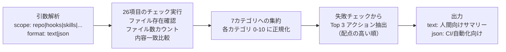
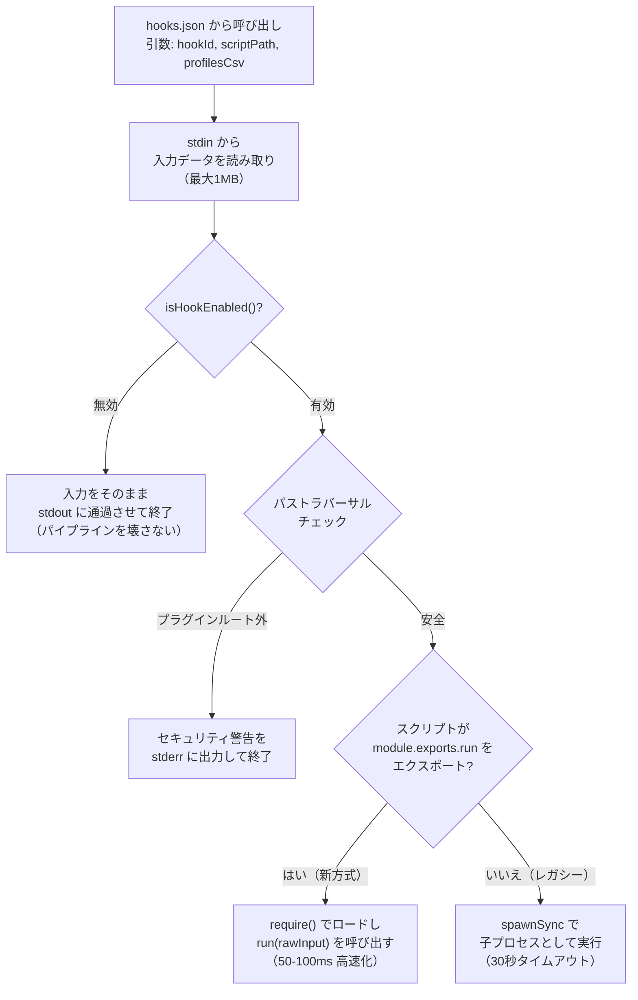
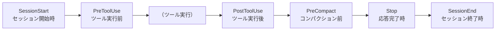
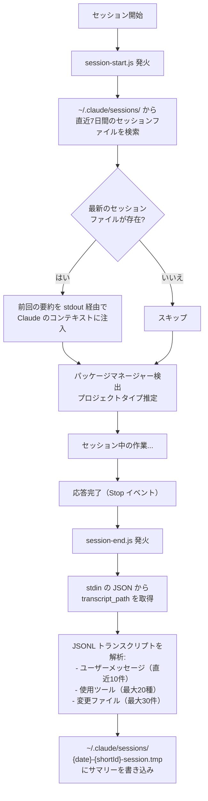
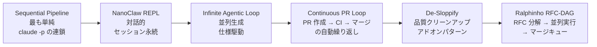

# Agent Harness Performance System: アーキテクチャ詳細調査

**調査日:** 2026-03-20
**対象バージョン:** everything-claude-code v1.8.0
**調査者:** Claude Opus 4.6
**関連ドキュメント:** [INVESTIGATION.md](./INVESTIGATION.md)

---

## 目次

1. [エグゼクティブサマリー](#1-エグゼクティブサマリー)
2. [Harness Audit Engine: 設定品質の定量評価](#2-harness-audit-engine-設定品質の定量評価)
3. [Hook Runtime Controls: 実行制御のアーキテクチャ](#3-hook-runtime-controls-実行制御のアーキテクチャ)
4. [Hook イベントの全体構成](#4-hook-イベントの全体構成)
5. [セッション永続化の仕組み](#5-セッション永続化の仕組み)
6. [NanoClaw v2: セッション永続 REPL](#6-nanoclaw-v2-セッション永続-repl)
7. [自律ループのパターンと安全機構](#7-自律ループのパターンと安全機構)
8. [Cross-Harness Parity: 4ハーネス互換アーキテクチャ](#8-cross-harness-parity-4ハーネス互換アーキテクチャ)
9. [エージェント: harness-optimizer と loop-operator](#9-エージェント-harness-optimizer-と-loop-operator)
10. [Agent Harness Construction: 設計原則](#10-agent-harness-construction-設計原則)
11. [現在の状態と課題](#11-現在の状態と課題)
12. [付録: 主要ファイル一覧](#12-付録-主要ファイル一覧)

---

## 1. エグゼクティブサマリー

v1.8.0 の「Harness Performance System」は、AI エージェントの動作環境（ハーネス）自体の品質を計測・改善・監視するためのメタシステムである。

通常、AI エージェントの品質改善はプロンプトやモデルの改善に注目するが、ECC のアプローチは異なる。エージェントが動作する**環境の設定**——Hook の有無、品質ゲートの厚み、セッション永続化の有無、セキュリティガードレール——が完了率（completion rate）に直接影響するという前提に立ち、その環境設定自体を定量的にスコアリングし、改善サイクルを回す仕組みを提供する。

このシステムは3つの水準で機能する:

- **計測:** `/harness-audit` による26項目の決定的監査
- **制御:** 環境変数による Hook プロファイル切替と、自律ループの安全機構
- **最適化:** harness-optimizer エージェントによる設定改善の自動提案

---

## 2. Harness Audit Engine: 設定品質の定量評価

### 2.1 なぜ設定を監査するのか

ECC は20以上の Hook スクリプト、27のエージェント、100以上のスキル、50以上のコマンドから構成される。この規模のシステムでは、開発・メンテナンスの過程で「あるファイルが削除されたまま戻っていない」「テストが追加されていない」「クロスプラットフォーム同期が取れていない」といった**設定ドリフト**が不可避的に発生する。

Harness Audit Engine は、このドリフトを人間の主観ではなく、26項目の明示的なファイル存在チェックと閾値チェックで検出する。

### 2.2 スクリプトの動作

監査は `scripts/harness-audit.js`（513行）で実装されている。このスクリプトは以下の流れで動作する:



**決定性の保証:** このスクリプトは意図的にヒューリスティクス（「このファイルはだいたい正しそう」といった曖昧な判定）を排除している。各チェックは「ファイル X が存在するか？」「ディレクトリ Y に Z 個以上のファイルがあるか？」「ファイル A とファイル B の内容が一致するか？」という明確な真偽値を返す。ルブリックバージョン `2026-03-16` が付与されており、同じコミットに対して常に同じスコアが再現される。

### 2.3 7カテゴリと26チェックの全解説

各カテゴリの目的と、そこに含まれるチェック項目を解説する。

#### カテゴリ 1: Tool Coverage（ツール網羅度）— 最大10点

このカテゴリは「ECC のコアコンポーネントが揃っているか」を検査する。ハーネスの機能は Hook、エージェント、スキル、コマンドの4種で構成されるため、それぞれに最低限のファイル数が存在することを確認する。

| チェック ID | 配点 | 内容 | パス条件 |
|------------|------|------|---------|
| `tool-hooks-config` | 2 | Hook 設定ファイルの存在 | `hooks/hooks.json` が存在 |
| `tool-hooks-impl-count` | 2 | Hook 実装スクリプトの充足度 | `scripts/hooks/` に `.js` ファイルが8個以上 |
| `tool-agent-count` | 2 | エージェント定義の充足度 | `agents/` に `.md` ファイルが10個以上 |
| `tool-skill-count` | 2 | スキル定義の充足度 | `skills/` に `SKILL.md` が20個以上 |
| `tool-command-parity` | 2 | コマンドのクロスハーネス同期 | `commands/harness-audit.md` と `.opencode/commands/harness-audit.md` の内容が完全一致 |

最後の `tool-command-parity` は特に重要である。Claude Code 用のコマンド定義と OpenCode 用のコマンド定義が乖離していないかを検証することで、クロスハーネスの同期漏れを検出する。

#### カテゴリ 2: Context Efficiency（コンテキスト効率）— 最大10点

Claude Code の200kトークンのコンテキストウィンドウは有限リソースである。このカテゴリは、そのリソースを効率的に使うための仕組みが整備されているかを検査する。

| チェック ID | 配点 | 内容 | パス条件 |
|------------|------|------|---------|
| `context-strategic-compact` | 3 | 戦略的コンパクションガイドの存在 | `skills/strategic-compact/SKILL.md` が存在 |
| `context-suggest-compact-hook` | 3 | 自動コンパクション提案 Hook の存在 | `scripts/hooks/suggest-compact.js` が存在 |
| `context-model-route` | 2 | モデルルーティングコマンドの存在 | `commands/model-route.md` が存在 |
| `context-token-doc` | 2 | トークン最適化ドキュメントの存在 | `docs/token-optimization.md` が存在 |

「戦略的コンパクション」とは、コンテキストが自動的に95%に達したときに圧縮するのではなく、タスクの論理的な区切り（調査完了後、マイルストーン完了後など）で意図的に `/compact` を実行する手法である。これにより、圧縮時に失われる情報を最小限に抑えられる。

#### カテゴリ 3: Quality Gates（品質ゲート）— 最大10点

コードの品質を継続的に保つための仕組み（テストランナー、CI バリデーション、Hook テスト）が存在するかを検査する。

| チェック ID | 配点 | 内容 | パス条件 |
|------------|------|------|---------|
| `quality-test-runner` | 3 | テストランナーの存在 | `tests/run-all.js` が存在 |
| `quality-ci-validations` | 3 | CI チェーンの設定 | `package.json` の `test` スクリプトに `validate-commands.js` と `tests/run-all.js` の両方が含まれる |
| `quality-hook-tests` | 2 | Hook テストの存在 | `tests/hooks/hooks.test.js` が存在 |
| `quality-doctor-script` | 2 | インストールドリフト検出 | `scripts/doctor.js` が存在 |

`quality-ci-validations` は単にテストが動くだけでなく、テスト実行前にコマンド定義のバリデーション（`validate-commands.js`）が走ることを要求している。これにより、不正なコマンド定義がテストをすり抜けることを防ぐ。

`quality-doctor-script` は、プラグインのインストール後にファイルの欠損や設定の不整合がないかを検査する「ヘルスチェック」スクリプトの存在を確認する。

#### カテゴリ 4: Memory Persistence（メモリ永続化）— 最大10点

セッション間で学習内容や状態を引き継ぐための仕組みが存在するかを検査する。

| チェック ID | 配点 | 内容 | パス条件 |
|------------|------|------|---------|
| `memory-hooks-dir` | 4 | メモリ永続化 Hook ディレクトリの存在 | `hooks/memory-persistence/` が存在 |
| `memory-session-hooks` | 4 | セッション開始/終了 Hook の存在 | `scripts/hooks/session-start.js` と `scripts/hooks/session-end.js` の両方が存在 |
| `memory-learning-skill` | 2 | 継続学習スキルの存在 | `skills/continuous-learning-v2/SKILL.md` が存在 |

セッション永続化は ECC の中核機能の一つであり、配点も他カテゴリに比べて高い（session-hooks 単体で4点）。

#### カテゴリ 5: Eval Coverage（評価カバレッジ）— 最大10点

エージェントの出力品質を評価（eval）する仕組みが存在するかを検査する。

| チェック ID | 配点 | 内容 | パス条件 |
|------------|------|------|---------|
| `eval-skill` | 4 | Eval ハーネススキルの存在 | `skills/eval-harness/SKILL.md` が存在 |
| `eval-commands` | 4 | 評価関連コマンド群の存在 | `commands/eval.md`、`commands/verify.md`、`commands/checkpoint.md` の3つすべてが存在 |
| `eval-tests-presence` | 2 | テストファイルの充足度 | `tests/` に `.test.js` ファイルが10個以上 |

Eval-Driven Development（EDD）は、機能実装前に「何をもって成功とするか」の評価基準を定義し、その基準に対してエージェントの出力を自動検証するアプローチである。このカテゴリは、EDD を実践するためのインフラが整っているかを確認する。

#### カテゴリ 6: Security Guardrails（セキュリティガードレール）— 最大10点

セキュリティに関する自動チェックとレビュー体制が存在するかを検査する。

| チェック ID | 配点 | 内容 | パス条件 |
|------------|------|------|---------|
| `security-review-skill` | 3 | セキュリティレビュースキルの存在 | `skills/security-review/SKILL.md` が存在 |
| `security-agent` | 3 | セキュリティレビューエージェントの存在 | `agents/security-reviewer.md` が存在 |
| `security-prompt-hook` | 2 | プロンプト/ツールのプリフライトガード | `hooks.json` に `beforeSubmitPrompt` または `PreToolUse` への言及が含まれる |
| `security-scan-command` | 2 | セキュリティスキャンコマンドの存在 | `commands/security-scan.md` が存在 |

#### カテゴリ 7: Cost Efficiency（コスト効率）— 最大10点

トークンとコストを意識した運用のための仕組みが存在するかを検査する。

| チェック ID | 配点 | 内容 | パス条件 |
|------------|------|------|---------|
| `cost-skill` | 4 | コスト意識型パイプラインスキルの存在 | `skills/cost-aware-llm-pipeline/SKILL.md` が存在 |
| `cost-doc` | 3 | コスト最適化ドキュメントの存在 | `docs/token-optimization.md` が存在 |
| `cost-model-route-command` | 3 | モデルルーティングコマンドの存在 | `commands/model-route.md` が存在 |

### 2.4 スコアの正規化と出力

各カテゴリのスコアは、カテゴリ内のチェック配点の合計に対する獲得点数の割合を 0-10 に正規化して算出される。計算式は:

```
normalized = round((earned / max) * 10)
```

例えば Tool Coverage の最大配点が10点で8点獲得した場合、正規化スコアは `round((8/10)*10) = 8` となる。

テキスト出力例:
```
Harness Audit (repo): 66/70

- Tool Coverage: 10/10 (10/10 pts)
- Context Efficiency: 9/10 (9/10 pts)
- Quality Gates: 10/10 (10/10 pts)
- Memory Persistence: 10/10 (10/10 pts)
- Eval Coverage: 8/10 (8/10 pts)
- Security Guardrails: 10/10 (10/10 pts)
- Cost Efficiency: 7/10 (7/10 pts)

Checks: 26 total, 2 failing

Top 3 Actions:
1) [Cost Efficiency] Create docs/token-optimization.md with target settings and tradeoffs. (docs/token-optimization.md)
2) [Eval Coverage] Increase automated test coverage across scripts/hooks/lib. (tests/)
3) [Context Efficiency] Add docs/token-optimization.md with concrete context-cost controls. (docs/token-optimization.md)
```

JSON 出力は CI/CD パイプラインで利用することを想定しており、`deterministic: true` と `rubric_version: "2026-03-16"` フィールドにより、再現性が明示されている。

---

## 3. Hook Runtime Controls: 実行制御のアーキテクチャ

### 3.1 なぜ動的制御が必要か

ECC は20以上の Hook をデフォルトで登録している。すべてを常に実行すると、以下の問題が生じる:

- **パフォーマンス:** 各ツール呼び出しのたびに複数の Hook が発火し、レスポンスが遅くなる
- **誤検知:** 開発初期のラフな作業中に TypeScript 型チェックや console.log 警告が過剰に発火する
- **環境差異:** CI 環境ではセッション永続化が不要、ローカルではセキュリティスキャンが不要など

これらを hooks.json の編集なしに制御するため、2つの環境変数が導入された。

### 3.2 hook-flags.js: 判定ロジックの実装

`scripts/lib/hook-flags.js`（74行）が判定ロジックの中核である。主要な関数の動作を解説する。

**`getHookProfile()`** — 現在の実行プロファイルを取得する:

```javascript
function getHookProfile() {
  const raw = String(process.env.ECC_HOOK_PROFILE || 'standard').trim().toLowerCase();
  return VALID_PROFILES.has(raw) ? raw : 'standard';
}
```

環境変数 `ECC_HOOK_PROFILE` を読み取り、`minimal` / `standard` / `strict` のいずれかに正規化する。未設定または無効な値の場合は `standard` にフォールバックする。

**`isHookEnabled(hookId, options)`** — 特定の Hook を実行すべきかを判定する:

```javascript
function isHookEnabled(hookId, options = {}) {
  const id = normalizeId(hookId);
  if (!id) return true;                          // ID 未指定なら有効（安全側に倒す）

  const disabled = getDisabledHookIds();
  if (disabled.has(id)) return false;             // 明示的無効化が最優先

  const profile = getHookProfile();
  const allowedProfiles = parseProfiles(options.profiles);
  return allowedProfiles.includes(profile);       // プロファイルの照合
}
```

判定の優先順位は明確に定義されている:

1. **`ECC_DISABLED_HOOKS` による明示的無効化が最優先。** Hook ID がリストに含まれていれば、プロファイルに関係なく無効化される。
2. **プロファイル照合。** 現在のプロファイル（例: `standard`）が、その Hook に許可されたプロファイル一覧（例: `["standard", "strict"]`）に含まれているかを確認する。

**`parseProfiles(rawProfiles)`** — Hook ごとに定義されたプロファイル許可リストを解析する:

各 Hook は hooks.json の中で、`run-with-flags.js` の第3引数としてプロファイル CSV を受け取る。例えば `"strict"` と指定された Hook は strict プロファイルでのみ実行される。`"standard,strict"` なら standard と strict の両方で実行される。`"minimal,standard,strict"` なら全プロファイルで実行される。

### 3.3 run-with-flags.js: ゲートキーパーの実装

`scripts/hooks/run-with-flags.js`（121行）は、すべての Hook 実行の入り口として機能するゲートキーパーである。hooks.json から呼び出され、以下のステップで動作する:



注目すべき設計判断がいくつかある:

**パイプライン透過性:** Hook が無効の場合、stdin に流れてきたデータをそのまま stdout に書き出して終了する。これにより、Hook の有効/無効が変わっても Claude Code のパイプライン処理に影響しない。

**2つの実行モード:** 新しい方式（`module.exports.run` をエクスポートするスクリプト）は `require()` でインプロセス実行され、Node.js プロセスの起動コスト（約50-100ms）を節約できる。レガシー方式（モジュールスコープで副作用を持つスクリプト）は子プロセスとして起動され、互換性を保つ。

**パストラバーサル防止:** `scriptPath.startsWith(resolvedRoot + path.sep)` により、プラグインルート外のスクリプト実行を拒否する。悪意のある Hook 定義がシステムの任意のスクリプトを実行することを防ぐセキュリティ対策である。

### 3.4 プロファイルの実用的な使い分け

| プロファイル | 用途 | 実行される Hook の例 |
|-------------|------|-------------------|
| `minimal` | CI/CD、高速化が必要な場面 | session-start, session-end, evaluate-session, cost-tracker のみ |
| `standard` | 日常的な開発作業（デフォルト） | 上記 + フォーマッター、型チェック、console.log 警告、品質ゲート、観測 |
| `strict` | リリース前、セキュリティ重視 | 上記 + tmux 提案、git push 前レビュー、セキュリティスキャン |

---

## 4. Hook イベントの全体構成

ECC の hooks.json は、Claude Code の6つのライフサイクルフェーズに対して20以上の Hook エントリを定義している。各フェーズがどのタイミングで発火し、何を行うかを整理する。

### 4.1 ライフサイクルフェーズ



### 4.2 各フェーズの Hook 一覧

#### SessionStart（1エントリ）

セッション開始時に一度だけ発火する。前回セッションの要約をコンテキストに注入し、パッケージマネージャーを検出し、プロジェクトタイプ（言語・フレームワーク）を推定する。

| Hook | 説明 | プロファイル |
|------|------|------------|
| `session:start` → `session-start.js` | 前回セッション要約の読み込み、パッケージマネージャー検出、プロジェクトタイプ推定 | minimal, standard, strict |

#### PreToolUse（7エントリ）

Claude Code が任意のツール（Bash, Edit, Write 等）を実行する直前に発火する。ツールの種類に応じて異なる Hook が発火する。

| Hook | 対象ツール | 説明 | プロファイル |
|------|-----------|------|------------|
| `auto-tmux-dev.js` | Bash | 開発サーバーを tmux セッションで自動起動 | （フラグ制御なし） |
| `pre:bash:tmux-reminder` | Bash | 長時間コマンドに tmux の使用を提案 | strict |
| `pre:bash:git-push-reminder` | Bash | git push 前にレビューを促す | strict |
| `pre:write:doc-file-warning` | Write | 非標準ドキュメントファイルの作成を警告 | standard, strict |
| `pre:edit-write:suggest-compact` | Edit, Write | コンテキスト圧迫時にコンパクションを提案 | standard, strict |
| `pre:observe` | 全ツール（`*`） | Continuous Learning v2 用の観測データ記録 | standard, strict |
| `pre:insaits-security` | Bash, Write, Edit, MultiEdit | AI セキュリティモニター（オプション、要 `pip install insa-its`） | standard, strict |

#### PostToolUse（7エントリ）

ツール実行完了後に発火する。実行結果の分析や品質チェックを行う。

| Hook | 対象ツール | 説明 | プロファイル | async |
|------|-----------|------|------------|-------|
| `post:bash:pr-created` | Bash | PR 作成時に URL をログし、レビューコマンドを案内 | standard, strict | no |
| `post:bash:build-complete` | Bash | ビルド完了時の非同期分析（バックグラウンド） | standard, strict | yes (30s) |
| `post:quality-gate` | Edit, Write, MultiEdit | ファイル編集後の品質ゲートチェック | standard, strict | yes (30s) |
| `post:edit:format` | Edit | JS/TS ファイルの自動フォーマット（Biome / Prettier を自動検出） | standard, strict | no |
| `post:edit:typecheck` | Edit | .ts/.tsx 編集後の TypeScript 型チェック | standard, strict | no |
| `post:edit:console-warn` | Edit | console.log 文の検出と警告 | standard, strict | no |
| `post:observe` | 全ツール（`*`） | Continuous Learning v2 用の結果記録 | standard, strict | yes (10s) |

`async: true` の Hook はバックグラウンドで実行され、Claude Code の応答をブロックしない。タイムアウトを超えた場合は自動的に中断される。

#### PreCompact（1エントリ）

コンテキストのコンパクション（圧縮）が行われる直前に発火する。現在の状態を保存し、コンパクション後にコンテキストが失われても復元できるようにする。

| Hook | 説明 | プロファイル |
|------|------|------------|
| `pre:compact` → `pre-compact.js` | コンパクション前の状態保存 | standard, strict |

#### Stop（4エントリ）

Claude Code が応答を完了した後に発火する。セッション状態の永続化、パターン抽出、コスト追跡を行う。

| Hook | 説明 | プロファイル | async |
|------|------|------------|-------|
| `stop:check-console-log` | 変更ファイル中の console.log を最終チェック | standard, strict | no |
| `stop:session-end` | セッション状態をファイルに永続化 | minimal, standard, strict | yes (10s) |
| `stop:evaluate-session` | セッションから再利用可能パターンを抽出 | minimal, standard, strict | yes (10s) |
| `stop:cost-tracker` | トークン・コストメトリクスの記録 | minimal, standard, strict | yes (10s) |

`session-end`、`evaluate-session`、`cost-tracker` は全プロファイル（minimal 含む）で実行される。これらはセッション間の継続性に不可欠であり、パフォーマンス影響も最小限（非同期、10秒タイムアウト）であるため、常に有効にする設計判断がなされている。

#### SessionEnd（1エントリ）

セッション終了時に一度だけ発火する。ライフサイクルの終了マーカーを記録する。

| Hook | 説明 | プロファイル |
|------|------|------------|
| `session:end:marker` → `session-end-marker.js` | ライフサイクル終了マーカーの記録 | minimal, standard, strict |

---

## 5. セッション永続化の仕組み

### 5.1 問題の背景

Claude Code のセッションは、通常、終了するとコンテキストが失われる。次回のセッションでは「前回何をやっていたか」を知らない状態から始まる。これは長期的なプロジェクト作業で大きな非効率を生む。

### 5.2 永続化の流れ

ECC はセッションの開始と終了にフックを掛けて、コンテキストを自動的に保存・復元する。



### 5.3 セッションファイルの構造

`session-end.js` が生成するセッションファイルは以下の構造を持つ:

```markdown
# Session: 2026-03-20
**Date:** 2026-03-20
**Started:** 11:12
**Last Updated:** 15:02
**Project:** everything-claude-code
**Branch:** main
**Worktree:** /Users/user/oss/everything-claude-code

---

<!-- ECC:SUMMARY:START -->
## Session Summary

### Tasks
- Implement harness audit scoring system
- Fix hook reliability issues

### Files Modified
- scripts/harness-audit.js
- scripts/lib/hook-flags.js

### Tools Used
Bash, Read, Edit, Write

### Stats
- Total user messages: 12
<!-- ECC:SUMMARY:END -->

### Notes for Next Session
-

### Context to Load
```
[relevant files]
```
```

**べき等性の設計:** `SUMMARY_START_MARKER` / `SUMMARY_END_MARKER` で囲まれたサマリーブロックは、Stop イベントが複数回発火しても（Claude が複数回応答を返しても）、前回のブロックを上書きする形で更新される。これにより、同一セッション内で重複したサマリーが蓄積されることを防いでいる。

---

## 6. NanoClaw v2: セッション永続 REPL

### 6.1 動作原理

NanoClaw は `claude -p`（非対話モード）のラッパーとして動作する。仕組みは単純だが効果的である:

1. ユーザーの入力を受け取る
2. `~/.claude/claw/{session}.md` から過去の会話履歴を読み込む
3. 履歴 + 現在の入力 + スキルコンテキストを結合したプロンプトを構築する
4. `claude -p` で送信し、応答を得る
5. ユーザー入力と応答の両方を履歴ファイルに追記する
6. 次の入力を待つ

### 6.2 プロンプトの構築

`buildPrompt()` 関数は3つのセクションを結合する:

```
=== SYSTEM CONTEXT ===
（/load で読み込んだスキルの内容）

=== CONVERSATION HISTORY ===
（過去の会話ターン全体）

=== USER MESSAGE ===
（今回のユーザー入力）
```

`claude -p` は1回ごとにコンテキストがリセットされるため、毎回の呼び出しで全履歴を送信する必要がある。コンテキストウィンドウの肥大化を防ぐため、`/compact` コマンドで古いターンを切り捨てる機能が用意されている。

### 6.3 セッション管理の内部実装

セッションデータは Markdown ファイルとして保存される。各ターンは以下の形式で追記される:

```markdown
### [2026-03-20T14:30:00.000Z] User
OAuth2 のログインフローを実装して

---

### [2026-03-20T14:30:45.000Z] Assistant
OAuth2 のログインフローを実装します。まず...

---
```

`parseTurns()` は正規表現 `/### \[([^\]]+)\] ([^\n]+)\n([\s\S]*?)\n---\n/g` でこの構造を解析し、タイムスタンプ・ロール・内容の配列に変換する。

**セッション分岐（`/branch`）** は、現在のセッションファイルを別名でコピーする。例えば認証機能の実装中に「OAuth2 方式と JWT 方式を両方試したい」場合、`/branch try-jwt` で現時点の会話を分岐させ、別々のアプローチを平行して探索できる。

### 6.4 スキルのホットロード

`/load <skill-name>` コマンドは、ECC の `skills/{name}/SKILL.md` ファイルをランタイムで読み込み、以降のプロンプトの `SYSTEM CONTEXT` セクションに追加する。これにより、セッション途中で「TDD ワークフロー」や「セキュリティレビュー」のガイダンスを動的に有効化できる。

環境変数 `CLAW_SKILLS=tdd-workflow,security-review` で起動時に自動読み込みすることもできる。

---

## 7. 自律ループのパターンと安全機構

### 7.1 自律ループとは何か

自律ループとは、Claude Code を人間の介入なしに繰り返し実行し、タスクを段階的に完了させる手法である。`claude -p` を bash スクリプトでループさせる単純なものから、RFC（設計書）を分解して複数エージェントが並列実行する高度なものまで、複数のパターンがある。

### 7.2 6つのパターン

ECC は複雑度の段階に応じた6つのループパターンを定義している:



#### Sequential Pipeline（最単純）

`claude -p` を `set -e` の bash スクリプトで連鎖させる。各ステップはフレッシュなコンテキストで実行され、前ステップのファイルシステム上の変更だけが引き継がれる。

用途: 日次の開発ルーチン（実装→クリーンアップ→検証→コミット）。

#### Continuous PR Loop

shell スクリプトが Claude Code を繰り返し実行し、各イテレーションで「ブランチ作成→実装→PR 作成→CI 待機→CI 失敗時の自動修正→マージ」のサイクルを回す。停止条件として `--max-runs`、`--max-cost`、`--max-duration`、完了シグナルが用意されている。

イテレーション間のコンテキスト橋渡しには `SHARED_TASK_NOTES.md` を使用する。Claude は各イテレーション開始時にこのファイルを読み、終了時に更新する。

#### RFC-Driven DAG（Ralphinho — 最も高度）

設計書（RFC/PRD）を AI が作業単位（Work Unit）に分解し、依存関係に基づく DAG（有向非巡回グラフ）を構築する。依存関係のない作業単位は並列実行され、各作業単位は独立した worktree で実行される。完了した作業単位はマージキューに入り、リベース→テスト→ランディングの順で統合される。マージ失敗した場合はコンフリクト情報を付加して再キューに入る。

最大の特徴は、各パイプラインステージ（research → plan → implement → test → review）が**異なるエージェントプロセスの異なるコンテキストウィンドウ**で実行されることである。レビュアーは実装者ではないため、自己レビューのバイアスが排除される。

### 7.3 安全機構

自律ループの危険性（無限実行、コスト爆発、同じ失敗の繰り返し）に対して、以下の安全機構が定義されている:

**`/loop-start` の開始前チェック:**
- テストが通ること
- `ECC_HOOK_PROFILE` がグローバルに無効化されていないこと
- 明示的な停止条件が設定されていること

**`/loop-status` の監視項目:**
- 現在のフェーズと最終チェックポイント
- コスト/時間の偏差（予算からの乖離）
- 推奨される介入（continue / pause / stop）

**loop-operator エージェントのエスカレーション条件:**
- 連続2チェックポイントで進捗なし
- 同一スタックトレースの障害が繰り返し
- コスト偏差が予算枠を逸脱
- マージコンフリクトがキュー進行を阻害

**continuous-agent-loop スキルの障害回復手順:**
1. ループを凍結（freeze）
2. `/harness-audit` を実行して設定状態を確認
3. スコープを障害ユニットに縮小
4. 明示的な受け入れ基準を付けてリプレイ

---

## 8. Cross-Harness Parity: 4ハーネス互換アーキテクチャ

### 8.1 背景

ECC は当初 Claude Code 専用だったが、v1.7.0 で Codex、v1.3.0 で OpenCode への対応を開始し、v1.8.0 でこれらの互換性を整備した。4つのハーネスはそれぞれ異なる設定形式と Hook 体系を持つため、すべてに対して同じ品質のサポートを提供するには、差異を吸収するアーキテクチャが必要である。

### 8.2 共通基盤: AGENTS.md

すべてのハーネスが共通して読み込むファイルが、リポジトリルートの `AGENTS.md` である。Claude Code、Cursor、Codex、OpenCode のいずれも、プロジェクト直下の `AGENTS.md` を自動検出してシステムプロンプトに取り込む。

このファイルをハーネス横断の共通ガイダンス（セキュリティポリシー、コーディング規約、コミット手順など）の配布先として活用し、ハーネスごとの差分は各ハーネス固有のディレクトリ（`.cursor/`, `.codex/`, `.opencode/`）で補完する。

### 8.3 Cursor: DRY adapter パターン

Cursor は Claude Code よりも多くの Hook イベント（14種類 vs 6種類）を持つ。`.cursor/hooks/` 配下に各イベント用のスクリプトが存在するが、これらは薄いラッパーであり、実際のロジックは `adapter.js` を経由して `scripts/hooks/` 内の共有スクリプトに委譲される。

adapter.js の核心は `transformToClaude()` 関数で、Cursor の stdin JSON を Claude Code 形式に変換する:

```javascript
function transformToClaude(cursorInput, overrides = {}) {
  return {
    tool_input: {
      command: cursorInput.command || cursorInput.args?.command || '',
      file_path: cursorInput.path || cursorInput.file || cursorInput.args?.filePath || '',
    },
    tool_output: {
      output: cursorInput.output || cursorInput.result || '',
    },
    transcript_path: cursorInput.transcript_path || cursorInput.transcriptPath || '',
    _cursor: { /* Cursor 固有のメタデータを保持 */ },
  };
}
```

これにより:
- Hook のビジネスロジック（何をチェックするか、何を修正するか）は `scripts/hooks/` に一箇所で管理
- Cursor 固有の差異は adapter レイヤーで吸収
- Hook プロファイル制御（`ECC_HOOK_PROFILE`, `ECC_DISABLED_HOOKS`）も adapter 内で同じロジックを再実装しているため、全ハーネスで統一的に動作

### 8.4 Codex: 命令ベースの補完

Codex は Hook 実行をサポートしていないため、ECC は以下のアプローチで代替する:

1. **`AGENTS.md` + `.codex/AGENTS.md`** でガイダンスを命令文として提供
2. **`.codex/config.toml`** でサンドボックスモード（`workspace-write` / `read-only`）と承認ポリシー（`on-request` / `never`）を設定
3. **`.codex/agents/`** 配下に3つのロール（explorer, reviewer, docs_researcher）を TOML 形式で定義
4. **プロファイル** として `strict`（読み取り専用サンドボックス）と `yolo`（全自動承認）を提供

### 8.5 OpenCode: プラグインシステム

OpenCode は Claude Code よりも豊富なプラグインイベント（20種類以上）を持つ。`.opencode/plugins/ecc-hooks.ts` が Claude Code の Hook を OpenCode のプラグインイベントに変換する。

OpenCode 固有の強みとして、`file.edited`、`file.watcher.updated`、`lsp.client.diagnostics` など、Claude Code にはないイベントを活用できる。

### 8.6 Parity の検証

クロスハーネスの同期を検証する仕組みとして、harness-audit の `tool-command-parity` チェックがある。これは `commands/harness-audit.md`（Claude Code 用）と `.opencode/commands/harness-audit.md`（OpenCode 用）の**内容の完全一致**を要求する。一方が更新され他方が更新されていない場合、監査スコアが減点される。

現時点では harness-audit コマンドのみが parity チェックの対象だが、将来的に他のコマンドにも拡張される可能性がある。

---

## 9. エージェント: harness-optimizer と loop-operator

### 9.1 harness-optimizer

**目的:** ハーネスの設定（Hook、評価、ルーティング、コンテキスト管理、安全機構）を改善して、エージェントの完了品質を向上させる。「プロダクトコードを書き換える」のではなく「エージェントの動作環境を改善する」ことに特化した、メタレベルの最適化エージェントである。

**ワークフロー:**
1. `/harness-audit` でベースラインスコアを取得
2. スコアの低い上位3カテゴリを特定
3. 最小限かつ可逆な設定変更を提案
4. 変更を適用し、バリデーションを実行
5. ビフォー/アフターの差分を報告

**制約:**
- 小さな変更で測定可能な効果を優先する
- クロスプラットフォーム互換性を壊さない（Claude Code、Cursor、OpenCode、Codex のすべてで動作すること）
- 壊れやすいシェルクォーティングを導入しない

### 9.2 loop-operator

**目的:** 自律エージェントループを安全に運用する。ループの開始、進捗追跡、障害検出、スコープ縮小、検証後の再開を行う。

**ワークフロー:**
1. 明示的なパターンとモードでループを開始
2. チェックポイントで進捗を追跡
3. ストールとリトライストームを検出
4. 障害が繰り返される場合はスコープを縮小して一時停止
5. 検証パス後にのみ再開

**運用前チェック:**
- 品質ゲートがアクティブであること
- Eval ベースラインが存在すること
- ロールバックパスが存在すること
- ブランチ/worktree での隔離が設定されていること

---

## 10. Agent Harness Construction: 設計原則

`skills/agent-harness-construction/SKILL.md` は、エージェントハーネス全体の設計原則をまとめたスキルである。ECC 自体の設計思想の根幹をなす知見であり、v1.8.0 の「ハーネスパフォーマンスシステム」の理論的基盤となっている。

### 4つの品質制約

エージェントの出力品質は、以下の4つの制約によって決まる:

1. **Action Space Quality（行動空間の品質）:** エージェントが呼び出せるツールの設計。明確な名前、狭いスキーマ、決定的な出力形状。高リスク操作にはマイクロツール、一般的な操作にはミディアムツール。

2. **Observation Quality（観測の品質）:** ツールの応答形式。すべてのツール応答に `status`、`summary`、`next_actions`、`artifacts` を含めることで、エージェントが次に何をすべきかを判断しやすくなる。

3. **Recovery Quality（回復の品質）:** エラー時に何をすべきかの情報。根本原因のヒント、安全なリトライ指示、明示的な停止条件をすべてのエラーパスに含める。

4. **Context Budget Quality（コンテキスト予算の品質）:** 200k トークンの有限リソースをどう配分するか。システムプロンプトは最小限に、大きなガイダンスはスキルとしてオンデマンドで読み込み、フェーズの区切りでコンパクションを行う。

### ベンチマーク指標

ハーネスの品質は以下の指標で計測する:
- **completion rate:** タスクの完了率
- **retries per task:** タスクあたりのリトライ回数
- **pass@1 / pass@3:** 1回目/3回目で成功する確率
- **cost per successful task:** 成功タスクあたりのコスト

---

## 11. 現在の状態と課題

### 11.1 完成度の評価

| 機能 | 完成度 | 詳細 |
|------|--------|------|
| Harness Audit Engine | **高** | スクリプト、コマンド定義、テストすべて実装済み。26チェックが決定的に動作 |
| Hook Runtime Controls | **高** | hook-flags.js + run-with-flags.js が安定動作。3プロファイル + 無効化リスト |
| セッション永続化 | **高** | session-start.js / session-end.js がべき等に動作。マーカーベースのサマリー更新 |
| NanoClaw v2 | **高** | 469行のスクリプト、12 REPL コマンド、テスト済み |
| Cross-Harness Adapter | **中** | Cursor adapter は動作。OpenCode プラグインも実装済み。ただし parity チェックは harness-audit コマンドのみ |
| Loop Commands | **低** | コマンド定義（Markdown）のみ存在。`loop-start.md` / `loop-status.md` に対応する実行スクリプトはなく、命令ベースで動作 |
| Model Route | **低** | コマンド定義のみ。ヒューリスティックはドキュメント上の記述に留まり、自動判定スクリプトは存在しない |

### 11.2 特筆すべき課題

**Loop コマンドのスクリプト不在:** `/loop-start` と `/loop-status` はコマンド定義（`.md`）は存在するが、harness-audit のような実行スクリプト（`.js`）が存在しない。現状はコマンド定義を LLM がプロンプトとして読み込み、指示に従って動作する「命令ベース」の実装である。これは、LLM の解釈に依存するため、決定的な動作が保証されない。

**Cross-Harness Parity チェックの限定性:** 現在の parity チェックは harness-audit コマンドの内容一致のみを検証している。他のコマンド（plan, tdd, code-review 等）や agent 定義の同期は監査対象外であり、手動でのメンテナンスに依存している。

**Model Route のヒューリスティック未実装:** `/model-route` は「haiku = 決定的タスク、sonnet = デフォルト、opus = 深い推論」というガイドラインを提供するが、タスク記述を自動分析して推薦を行うロジックはスクリプト化されていない。

---

## 12. 付録: 主要ファイル一覧

### コマンド定義

| ファイル | 行数 | 内容 |
|---------|------|------|
| `commands/harness-audit.md` | 72 | Harness Audit コマンド定義 |
| `commands/loop-start.md` | 33 | ループ開始コマンド定義 |
| `commands/loop-status.md` | 25 | ループ状態監視コマンド定義 |
| `commands/quality-gate.md` | 30 | 品質ゲートコマンド定義 |
| `commands/model-route.md` | 27 | モデルルーティングコマンド定義 |

### スクリプト

| ファイル | 行数 | 内容 |
|---------|------|------|
| `scripts/harness-audit.js` | 513 | Harness Audit Engine 本体 |
| `scripts/claw.js` | 469 | NanoClaw v2 REPL |
| `scripts/lib/hook-flags.js` | 74 | Hook 有効/無効判定ロジック |
| `scripts/hooks/run-with-flags.js` | 121 | Hook 実行ゲートキーパー |
| `scripts/hooks/session-start.js` | 98 | セッション開始 Hook |
| `scripts/hooks/session-end.js` | 300 | セッション終了 Hook |

### エージェント定義

| ファイル | 内容 |
|---------|------|
| `agents/harness-optimizer.md` | ハーネス設定の最適化エージェント |
| `agents/loop-operator.md` | 自律ループの安全運用エージェント |

### スキル

| ファイル | 内容 |
|---------|------|
| `skills/autonomous-loops/SKILL.md` | 6つのループパターンの解説とリファレンス実装 |
| `skills/continuous-agent-loop/SKILL.md` | v1.8.0 のカノニカルループスキル（上記の後継） |
| `skills/agent-harness-construction/SKILL.md` | ハーネス設計の4原則 |
| `skills/nanoclaw-repl/SKILL.md` | NanoClaw v2 の使用ガイド |
| `skills/eval-harness/SKILL.md` | Eval-Driven Development フレームワーク |

### クロスハーネス設定

| ファイル | 内容 |
|---------|------|
| `hooks/hooks.json` | Claude Code 全 Hook 定義（6フェーズ、20+エントリ） |
| `.cursor/hooks/adapter.js` | Cursor → Claude Code の Hook 変換アダプター |
| `.cursor/hooks.json` | Cursor 用 Hook 定義（14イベント） |
| `.codex/config.toml` | Codex 参照設定（サンドボックス、MCP、マルチエージェント） |
| `.codex/AGENTS.md` | Codex 固有ガイダンス |
| `.opencode/opencode.json` | OpenCode 全設定（12 agent、31 command） |

### テスト

| ファイル | 内容 |
|---------|------|
| `tests/scripts/harness-audit.test.js` | Harness Audit の決定性・有界性・スコープフィルタリングのテスト |
