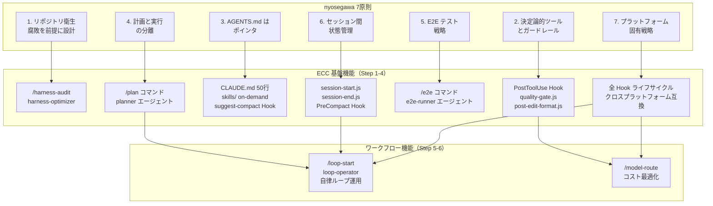
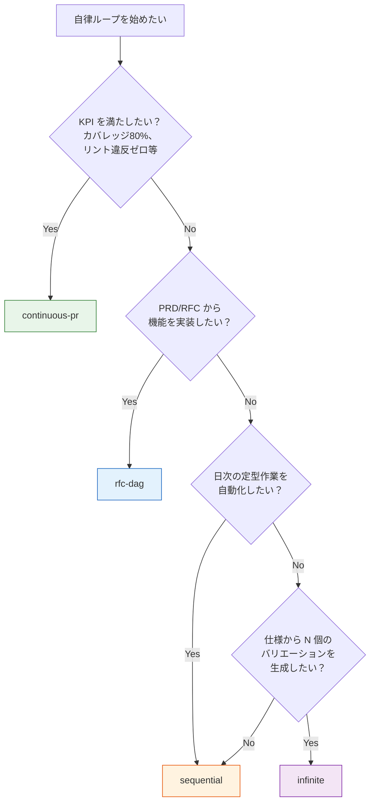
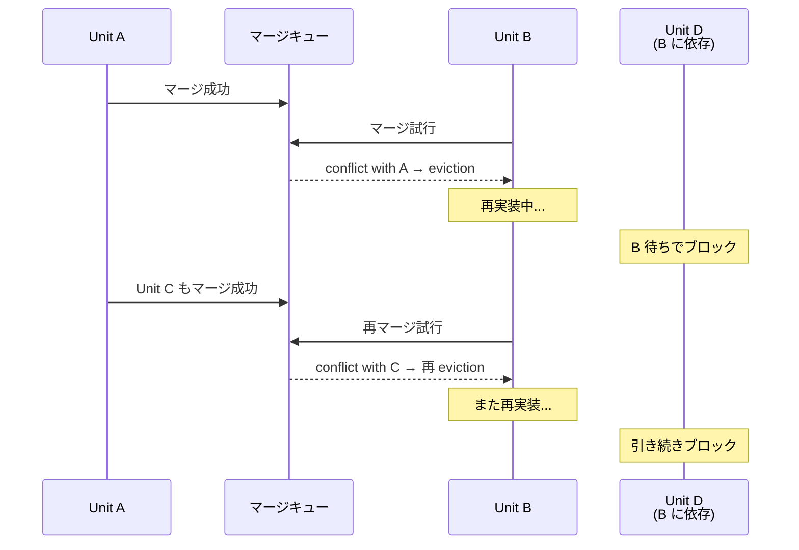

# ECC によるハーネスエンジニアリング

社内勉強会資料 — 2026-03-20

---

## 1. ハーネスエンジニアリングとは

Coding Agent の出力品質を決めるのは、モデルの性能だけではありません。Mitchell Hashimoto は自身のエージェント活用の旅路を綴ったブログ記事の中で、「エージェントがミスをするたびに、二度と同じミスをしないよう環境を改善する」という原則を提唱しました（mitchellh.com, 2026-02-05）。AGENTS.md に書かれた各行は実際に発生したエージェントの誤動作に対する修正であり、スクリーンショット取得やフィルタ付きテスト実行といったツールがエージェントに自己検証の手段を与えます。この環境整備への反復的な投資が時間と共に複利的に蓄積し、エージェントの信頼性を着実に引き上げていきます。Hashimoto はこの営みを「ハーネスエンジニアリング」と呼びました。

この概念の正しさを裏付ける数字があります。Morph 社の分析によれば、同一ベンチマーク（SWE-bench）においてモデルを交換した場合のスコア変動はわずか1ポイントだったのに対し、ハーネス（エージェントの動作環境）を改善した場合は22ポイントもの変動が観測されました（nyosegawa.com, 2026-03-09）。つまり、どのモデルを使うかよりも、モデルをどのような環境で動かすかの方が、出力品質に対して一桁以上大きなインパクトを持ちます。

OpenAI の Codex チームはこの考えを大規模に実証しました。3名から始まり7名に成長したエンジニアチームが5ヶ月間で約100万行のプロダクションコードを生成し、手動でタイプされたコードはゼロでした（openai.com, 2026）。人間はコードを書く代わりに、アーキテクチャの強制ルール、カスタムリンターのエラーメッセージによる修正指示、AGENTS.md の反復更新、ガベージコレクション用のバックグラウンドエージェントといった「ハーネス」の設計に注力しました。その結果、平均3.5 PR/エンジニア/日、累計約1,500 PR という生産性を達成し、チーム拡大に伴う限界収穫逓減も見られませんでした。

nyosegawa（逆瀬川）は2026年3月の記事で、これらの知見を体系化し7つの原則として整理しています（nyosegawa.com, 2026-03-09）。リポジトリ衛生（腐敗を前提に設計する）、決定論的ツールとアーキテクチャガードレールによる品質強制、AGENTS.md はポインタとして設計する（ルールを直接書くのではなくスキルや ADR、リンター設定への参照だけを置き、50行以下に収める）、計画と実行の分離、E2E テスト戦略、セッション間の状態管理、プラットフォーム固有のハーネス戦略（Codex のクラウドサンドボックス型と Claude Code のローカル Hook 型では設計が異なるため、各プラットフォームの特性を活かす）の7つです。このうち最も重要な構造的洞察は「フィードバック速度の階層」です。PostToolUse Hook によるミリ秒単位のフォーマット自動適用が最速で、プリコミットフック（秒）、CI パイプライン（分）、人間によるコードレビュー（時間〜日）と続きます。ハーネスエンジニアリングの目標は、できる限り多くのチェックをより速い層に移動させることです。

要するに、エンジニアの責務は「正しいコードを書くこと」から「エージェントが正しいコードを確実に書ける環境を設計すること」へと移行しつつあります。ハーネスエンジニアリングとは、この責務の転換を実践するための体系的なアプローチです。

---

## 2. ハーネスエンジニアリングの全体像

nyosegawa の7原則と、ECC がそれぞれに対応する機能を以下のマッピング図に示します。



図の上段と中段は Step 1〜4 で段階的に導入する基盤です。下段の `/loop-start` と `/model-route` は特定の1原則に対応するものではなく、計画と実行の分離（原則4）、セッション間状態管理（原則6）、プラットフォーム固有戦略（原則7）といった複数の基盤を横断的に組み合わせたワークフロー機能であり、Step 5・Step 6 で導入します。

---

## 3. ワークフロー: 自分のリポジトリにハーネスを導入する

ここからが本題です。以下の6ステップを順に実行することで、リポジトリにハーネスを段階的に構築できます。各ステップで必要になった時点で ECC の機能を紹介します。

---

### Step 1: 現状を計測する — `/harness-audit`

ハーネスを改善する前に、まず現状を把握する必要があります。自分のリポジトリで `/harness-audit` を実行すると、ベースラインスコアが得られます。

```bash
node scripts/harness-audit.js repo --format text
```

このスクリプトは7カテゴリ・26項目で最大70点のスコアを算出します。

| カテゴリ | 評価対象 | 配点 |
|---------|---------|------|
| Tool Coverage | Hook 設定、エージェント数、スキル数、コマンド整合性 | 10 |
| Context Efficiency | 戦略的コンパクション、suggest-compact Hook、model-route | 10 |
| Quality Gates | テストランナー、CI バリデーション、Hook テスト、doctor スクリプト | 10 |
| Memory Persistence | メモリ Hook ディレクトリ、セッション開始/終了スクリプト、学習スキル | 10 |
| Eval Coverage | 評価ハーネススキル、eval/verify/checkpoint コマンド、テストファイル数 | 10 |
| Security Guardrails | セキュリティレビュースキル/エージェント、PreToolUse ガード、セキュリティスキャン | 10 |
| Cost Efficiency | コスト意識スキル、トークン最適化ドキュメント、model-route コマンド | 10 |

スコアリングの重要な特性として、このエンジンは決定論的に動作します。同一コミットに対しては常に同一スコアが返るため、改善の前後比較が正確にできます。スコアの各項目はファイルやルールの存在チェックに基づいており、LLM による主観的な判断は一切含まれません。

出力例（novasell-magna リポジトリでの実行結果）:

```text
Harness Audit (repo): 43/70
- Tool Coverage: 7/10 — PostToolUse Hook 2件（ruff, sqlfluff）、プラグイン5種（context7, pyright-lsp, security-guidance, pr-review-toolkit, feature-dev）。PreToolUse/Notification Hook 未設定
- Context Efficiency: 8/10 — 階層化 CLAUDE.md（root → etl → dbt）、13件のルールファイルが条件付き参照テーブルで整理。ルール間の重複最小限
- Quality Gates: 7/10 — CI: NX lint/test/type-check。Claude Code Actions: 自動レビュー（Critical/Warning/Suggestion 分類）+ スキルレビュー + @claude インタラクティブ。dbt テストが CI に含まれない
- Memory Persistence: 5/10 — MEMORY.md 存在、4件のメモリエントリ。プロジェクト知識やユーザープロファイルの蓄積が不十分
- Eval Coverage: 3/10 — dbt_project_evaluator によるベストプラクティス検証のみ。コード品質 eval、pass@k テスト、スキル eval 未整備
- Security Guardrails: 7/10 — .env gitignore 済、security-guidance プラグイン全層有効、secrets.toml/.p8 排除。専用シークレットスキャニング（gitleaks 等）なし
- Cost Efficiency: 6/10 — CI concurrency group でキャンセル制御、classify-changes による条件分岐。コスト追跡 Hook、トークン予算管理なし

Top 3 Actions:
1) [Eval Coverage] .claude/evals/ に主要スキル（review-pr, staging 等）の pass@k eval を定義
2) [Security Guardrails] .pre-commit-config.yaml に gitleaks を追加、PostToolUse に secrets チェック Hook を追加
3) [Memory Persistence] プロジェクトメモリ（アーキテクチャ判断、チーム構成）とユーザーメモリを体系的に蓄積
```

まずスコアが低いカテゴリを特定し、Top 3 Actions から改善の優先順位を決めましょう。

---

### Step 2: フィードバックループを構築する — Hook システム

ハーネスの最も重要なパーツは「エージェントが間違えた瞬間にフィードバックが返る仕組み」です。nyosegawa はフィードバック速度を4層に分類し、より速い層への移行を推奨しています。

| 速度 | 層 | タイミング | 例 |
|------|---|---------|---|
| 最速（ms） | PostToolUse Hook | ファイル編集直後に自動実行 | Biome format, Oxlint |
| 速い（s） | プリコミットフック | コミット直前にキャッチ | Lefthook → Oxlint + tsc |
| 遅い（min） | CI/CD パイプライン | マージ前にキャッチ | ESLint カスタムルール + テストスイート |
| 最遅（h〜日） | 人間のコードレビュー | マージ後にキャッチ | 手動レビュー |

PostToolUse Hook は最速の層に位置し、エージェントがファイルを編集するたびにリンターやフォーマッターを自動実行します。エラーが検出された場合、JSON 形式で `hookSpecificOutput.additionalContext` としてエージェントのコンテキストに注入されます。エージェントはこのフィードバックを受けて次のアクションで自己修正します。人間が介入する必要はありません。

以下は nyosegawa 記事で紹介されている PostToolUse Hook の実装例です（nyosegawa.com, 2026-03-09）。

**設定 (settings.json):**

```json
{
  "hooks": {
    "PostToolUse": [
      {
        "matcher": "Write|Edit|MultiEdit",
        "hooks": [
          {
            "type": "command",
            "command": "bash .claude/hooks/post-ts-lint.sh"
          }
        ]
      }
    ]
  }
}
```

**Hook スクリプト (post-ts-lint.sh):**

```bash
#!/usr/bin/env bash
set -euo pipefail

input="$(cat)"
file="$(jq -r '.tool_input.file_path // .tool_input.path // empty' <<< "$input")"

case "$file" in
  *.ts|*.tsx|*.js|*.jsx) ;;
  *) exit 0 ;;
esac

# まず自動修正を試みる
npx biome format --write "$file" >/dev/null 2>&1 || true
npx oxlint --fix "$file" >/dev/null 2>&1 || true

# 残った違反だけをエージェントに返す
diag="$(npx oxlint "$file" 2>&1 | head -20)"

if [ -n "$diag" ]; then
  jq -Rn --arg msg "$diag" '{
    hookSpecificOutput: {
      hookEventName: "PostToolUse",
      additionalContext: $msg
    }
  }'
fi
```

ここでのポイントは2つあります。まず自動修正可能なものは先に修正し（`biome format --write`, `oxlint --fix`）、エージェントに返すのは残った違反のみにすることです。次に、フィードバックは必ず `hookSpecificOutput.additionalContext` を含む JSON として返す必要があります。プレーンテキストの stdout ではコンテキストに注入されません。

nyosegawa はリンター選択において Rust ベースの高速ツールを強く推奨しています。Oxlint は ESLint の50〜100倍、Biome は ESLint+Prettier の10〜25倍、Ruff は Flake8 の10〜100倍の速度であり、ミリ秒単位の応答が求められる PostToolUse Hook には不可欠です。

#### ECC が提供する Hook テンプレート

ECC はすぐに使える Hook 実装を提供しています。`hooks/hooks.json` に定義された主要な PostToolUse Hook は以下の通りです。

| Hook スクリプト | matcher | 機能 |
|---------------|---------|------|
| `post-edit-format.js` | Edit | JS/TS ファイル編集後に Biome または Prettier で自動フォーマット |
| `post-edit-typecheck.js` | Edit | .ts/.tsx 編集後に TypeScript 型チェック実行 |
| `post-edit-console-warn.js` | Edit | `console.log` の残存を警告 |
| `quality-gate.js` | Edit\|Write\|MultiEdit | 品質ゲートチェック（非同期、30秒タイムアウト） |

これらの Hook はすべて `run-with-flags.js` ラッパーを経由して実行されます。このラッパーは Hook プロファイル（`ECC_HOOK_PROFILE`）と個別無効化（`ECC_DISABLED_HOOKS`）による実行制御を提供します。`ECC_HOOK_PROFILE` はシェルの環境変数であり、Claude Code を起動する前にユーザーが設定します。

```bash
# 方法1: export してからセッション開始
export ECC_HOOK_PROFILE=strict
claude

# 方法2: 起動時に一時的に設定
ECC_HOOK_PROFILE=strict claude
```

`run-with-flags.js` は起動時に `process.env.ECC_HOOK_PROFILE` を読み取り（デフォルト: `standard`）、各 Hook 定義の第3引数（例: `"standard,strict"`）と照合します。現在のプロファイルが Hook の許可リストに含まれていれば実行し、含まれていなければスキップします。

#### Hook プロファイルによる強度調整

環境変数 `ECC_HOOK_PROFILE` で Hook の実行強度を3段階に制御できます。

| プロファイル | 対象 Hook | 用途 |
|-----------|---------|------|
| `minimal` | セッション開始/終了、コスト追跡のみ | 軽量な開発、デバッグ時 |
| `standard`（デフォルト） | minimal + フォーマット、型チェック、品質ゲート、学習 | 通常の開発作業 |
| `strict` | standard + セキュリティチェック、git push 確認、ドキュメント警告 | 本番コード、セキュリティ重視 |

各 Hook の `hooks.json` 定義には `run-with-flags.js` の第3引数としてプロファイル指定が含まれています。例えば `"standard,strict"` と指定された Hook は standard と strict プロファイルでのみ実行され、minimal では無視されます。個別の Hook を無効化したい場合は `ECC_DISABLED_HOOKS=post:edit:format,post:edit:typecheck` のようにカンマ区切りで指定します。

---

### Step 3: 品質ゲートを設置する — `/quality-gate` と Stop Hook

フィードバックループがファイル単位の即時修正を担うのに対し、品質ゲートはタスク全体の完了品質を保証します。

#### `/quality-gate` による手動パイプライン実行

```bash
/quality-gate [path|.] [--fix] [--strict]
```

このコマンドは任意のタイミングで品質パイプラインを手動実行します。対象のファイルまたはディレクトリに対して、言語とツールの自動検出、フォーマッターチェック、リント/型チェック、修正事項リストの生成を順に行います。PostToolUse Hook と同じチェックを行いますが、オペレーターが明示的に起動する点が異なります。`--fix` を付ければ自動修正も行い、`--strict` で警告も失敗扱いにできます。

出力例（Python/FastAPI プロジェクトでの実行結果）:

```text
Quality Gate: apps/nebula_flow_api

| チェック           | 結果   | 詳細                  |
|-------------------|--------|----------------------|
| Format (ruff)     | FAIL   | 2ファイル要修正        |
| Lint (ruff check) | PASS   | All checks passed    |
| Type (pyright)    | PASS   | 0 errors, 0 warnings |
| Test (pytest)     | PASS   | 7 passed (0.06s)     |

要修正 (Remediation):
1) src/celery_app.py — フォーマット違反
2) tests/test_integration_account_webhook.py — フォーマット違反

一括修正: cd apps/nebula_flow_api && uv run ruff format src tests
```

言語とツールは `pyproject.toml` / `project.json` から自動検出されます。この例では ruff（format + lint）、pyright（型チェック）、pytest（テスト）が検出され、4段階のパイプラインが実行されました。

#### Stop Hook によるセッション終了前チェック

ECC の `hooks/hooks.json` には Stop イベントに紐づいた Hook が定義されています。エージェントが応答を完了するたびに自動的に実行されます。

| Stop Hook | 機能 |
|-----------|------|
| `check-console-log.js` | 変更ファイル内の `console.log` 残存をチェック |
| `session-end.js` | セッション状態を永続化（非同期） |
| `evaluate-session.js` | 抽出可能なパターンを評価（非同期） |
| `cost-tracker.js` | トークンとコストのメトリクスを追跡（非同期） |

特に `check-console-log.js` は standard/strict プロファイルで有効になり、エージェントがデバッグ用の `console.log` を残したままタスクを完了しようとした場合にフィードバックを返します。nyosegawa はこのような「完了時チェック」を E2E テストやビルド通過の強制と組み合わせて使うことを推奨しています。例えば、アニメーション関連の変更を検出したら Playwright の `@animation` タグ付きテストを Stop Hook で自動実行する、といった構成が可能です。

---

### Step 4: 自動改善サイクルを回す — harness-optimizer エージェント

Step 1〜3 で基本的なハーネスが構築できたら、次はその改善を自動化します。ECC の harness-optimizer エージェントは `/harness-audit` のスコアを入力に、設定改善を自動提案・適用します。

harness-optimizer のワークフロー:

1. `/harness-audit` を実行してベースラインスコアを収集
2. 上位3つのレバレッジ領域を特定（Hook、評価、ルーティング、コンテキスト、セキュリティ）
3. 最小限で可逆的な設定変更を提案
4. 変更を適用してバリデーション実行
5. before/after の差分をレポート

このエージェントは Sonnet モデルで動作し、Read, Grep, Glob, Bash, Edit ツールを使用します。重要な制約として「プロダクトコードの書き換えではなく、ハーネス設定の改善のみで品質を上げる」ことをミッションとしています。

典型的な改善サイクルは以下のようになります。

```text
/harness-audit → 48/70（ベースライン）
  ↓
harness-optimizer が提案:
  - Eval Coverage: eval/verify/checkpoint コマンド追加
  - Memory Persistence: memory-persistence Hook ディレクトリ作成
  - Security Guardrails: PreToolUse ガード追加
  ↓
変更を適用
  ↓
/harness-audit → 62/70（改善後）
  ↓
+14 ポイント改善、残りのリスクをレポート
```

これは Mitchell Hashimoto の原則そのものです。エージェントがミスをするたびにハーネスを強化し、同じミスが二度と起きない環境を構築します。harness-optimizer はこの継続的改善サイクルを自動化するツールです。

実際に novasell-magna リポジトリで `/harness-audit`（43/70）→ Top 3 Actions 適用を行った PR がこちらです: https://github.com/raksul/novasell-magna/pull/1791 — Eval 定義3件、gitleaks pre-commit、PostToolUse secrets チェック Hook を追加しています。

---

### Step 5: 自律ループを安全に運用する — Loop コマンド群

ここまでのステップでフィードバックループ、品質ゲート、自動改善サイクルが整備されました。これらのハーネスが揃って初めて、エージェントの自律的な連続実行が安全にできるようになります。ハーネスなしにエージェントを自律ループで動かすのは、ブレーキのない車でアクセルを踏むようなものです。

#### 5.1 ループパターンの選択

ECC は4つのループパターンを提供しています。「何を達成したいか」によって使い分けます。



**[continuous-pr](https://github.com/ymdvsymd/everything-claude-code/blob/main/skills/continuous-agent-loop/SKILL.md)（KPI 駆動）** は、測定可能な目標に向かって PR を繰り返し出し続けるパターンです。AnandChowdhary の continuous-claude が原型であり、テストカバレッジを0%から80%超まで自律的に引き上げた実績があります（github.com/AnandChowdhary/continuous-claude）。各イテレーションでブランチ作成、Claude Code による実装、PR 作成、CI チェック待ち、自動マージ（または CI 失敗時の自動修正）を行います。停止条件は `--max-runs N`（イテレーション回数）、`--max-cost $X`（金額上限）、`--max-duration 2h`（時間上限）、completion signal（エージェント自身による完了宣言、デフォルト3回連続で停止）の4種類があります。イテレーション間の文脈は `SHARED_TASK_NOTES.md` で引き継ぎます。このファイルは各イテレーションの終わりに Claude が更新し、次のイテレーションの開始時に読み込まれます。ノートは簡潔で実行可能な内容（完了作業のリストではなく、次に何をすべきかのハンドオフ情報）に保つことが重要です。

**[rfc-dag](https://github.com/ymdvsymd/everything-claude-code/blob/main/skills/ralphinho-rfc-pipeline/SKILL.md)（仕様実装）** は、唯一「具体的な仕様の実装」に使えるパターンです。enitrat の Ralphinho が原型で、Geoffrey Huntley の Ralph Wiggum Loop（エージェントを while ループで繰り返し実行する手法）の発展形にあたります（humanlayer.dev/blog/brief-history-of-ralph）。PRD/RFC を入力に、AI が WorkUnit の依存 DAG（有向非巡回グラフ）に分解します。各 WorkUnit は `id`, `deps`（依存関係）, `acceptance`（受け入れ基準）, `tier`（trivial/small/medium/large）を持ちます。依存のないユニットは並列に実装され、各ユニットは complexity tier に応じた深さのパイプライン（research → plan → implement → test → review）を通ります。実装とレビューは別コンテキストで行われるため、author bias（自分のコードを甘く評価する傾向）が排除されます。マージキューでコンフリクトが発生したユニットは evict（追い出し）され、コンフリクトの文脈を付与して次パスで再実装されます。

**[sequential](https://github.com/ymdvsymd/everything-claude-code/blob/main/skills/continuous-agent-loop/SKILL.md)（定型自動化）** は、`claude -p` をシェルスクリプトで連続実行する最もシンプルなパターンです。各ステップは独立したコンテキストウィンドウで動作し、ファイルシステムの状態を通じて前ステップの成果を引き継ぎます。日次のリント修正→テスト→コミットといった定型作業に適しています。`set -e` でエラー時に即座に停止し、`--model` フラグでステップごとにモデルを使い分けることもできます。

```bash
#!/bin/bash
# daily-dev.sh — 日次パイプラインの例
set -e

# Step 1: 機能実装
claude -p "Read the spec in docs/auth-spec.md. Implement OAuth2 login. Write tests first."

# Step 2: クリーンアップ（De-Sloppify パターン）
claude -p "Review all changes. Remove unnecessary type tests and over-defensive checks. Run tests."

# Step 3: 検証
claude -p "Run build, lint, type check, test suite. Fix any failures."

# Step 4: コミット
claude -p "Create a conventional commit for all staged changes."
```

**[infinite](https://github.com/ymdvsymd/everything-claude-code/blob/main/skills/continuous-agent-loop/SKILL.md)（バリエーション生成）** は、仕様書から N 個のバリエーションを並列生成するパターンです。disler の Infinite Agentic Loop が原型です。オーケストレーターが仕様を解析し、既存の出力をスキャンして最大のイテレーション番号を見つけ、各サブエージェントに異なる creative direction と一意のイテレーション番号を割り当てることで重複を防ぎます。コンポーネントやコンテンツの大量生成に適しています。無限モードでは3〜5エージェントのウェーブを、コンテキスト枯渇まで繰り返します。

#### 5.2 `/loop-start` のワークフロー

```bash
/loop-start [pattern] [--mode safe|fast]
```

`/loop-start` はカスタムコマンド（プロンプトテンプレート）です。バッキングスクリプトは存在せず、Claude がテンプレートの指示に従って対話的にセットアップを進めます。テンプレートは以下の5ステップを Claude に指示します。

1. **リポジトリ状態の確認とブランチ戦略の決定** — Claude が git status、未コミットの変更、テスト通過を確認し、ループ用のブランチ戦略（worktree 分離など）を提案します
2. **ループパターンとモデルティア戦略の選択** — 引数で指定されたパターン（sequential, continuous-pr, rfc-dag, infinite）を確認し、各ステージに適切なモデルティア（haiku/sonnet/opus）を提案します
3. **Hook プロファイルの確認と推奨** — Claude が現在の `ECC_HOOK_PROFILE` を確認し、選択されたモード（safe/fast）に応じた推奨プロファイルを提案します。ただし `ECC_HOOK_PROFILE` はシェルの環境変数であるため、変更にはユーザーが Claude Code を再起動する必要があります（Step 2 の解説を参照）
4. **ループ計画とランブックの作成** — `.claude/plans/` に実行計画を保存し、停止条件、リカバリ手順、コスト上限を明文化します
5. **開始・監視コマンドの出力** — 実際にループを開始するコマンドと、`/loop-status` による監視コマンドを表示します

テンプレートは安全チェックとして、以下の3項目を Claude に確認させます。テストが通過していること、`ECC_HOOK_PROFILE` がグローバルに無効化されていないこと、ループに明示的な停止条件が設定されていることです。これらはプログラム的に強制されるものではなく、Claude が従うべきチェックリストです。

出力例（novasell-magna リポジトリでの実行結果）:

```text
### 1. リポジトリ状態

ブランチ: feature/harness-audit-improvements
未コミット変更: なし（.claude/worktrees/ のみ untracked）
最新コミット: feat: ハーネス監査で特定した3領域を改善
PR: #1791 (open)

### 2. 確認事項

ループパターンとタスクを指定してください:

| パターン        | 用途                                               |
|----------------|---------------------------------------------------|
| sequential     | 定型作業の自動化（リント修正→テスト→コミット等）        |
| continuous-pr  | KPI 駆動で PR を繰り返し作成（カバレッジ向上等）       |
| rfc-dag        | PRD/RFC から機能を並列実装                           |
| infinite       | 仕様からバリエーションを大量生成                       |

例:
- /loop-start continuous-pr + 「テストカバレッジを80%まで引き上げる」
- /loop-start sequential + 「全 Python ファイルの型注釈を追加する」

何をどのパターンで実行しますか？
```

このように、`/loop-start` はまずリポジトリの現在状態を報告し、パターン選択をユーザーに確認します。パターンとタスクが指定された後に、Step 3〜5（Hook 確認、計画作成、開始コマンド出力）へ進みます。

ユーザーが `continuous-pr --mode safe` + 「nebula_flow_api のテストカバレッジを 80% まで引き上げる」と指定した場合の出力例:

```text
### Loop Plan: continuous-pr --mode safe

目標: nebula_flow_api のテストカバレッジを 80% まで引き上げる

前提条件:
- pytest-cov が未インストール — イテレーション 0 で追加が必要
- 現在のテスト: 194 passed（lib）+ 7 passed（app）
- カバレッジ率: 不明（測定基盤なし）

ブランチ戦略: main から continuous-pr/coverage-nebula-flow を作成。
  各イテレーションで個別ブランチを切り PR を作成。

モデルティア: Sonnet（実装）/ Opus（カバレッジ分析・テスト設計）

停止条件:
- カバレッジ 80% 達成
- --max-runs 10（最大 10 イテレーション）
- --max-cost $30

イテレーション計画:
1. pytest-cov を dev dependency に追加、ベースラインカバレッジを計測
2. カバレッジが最も低いモジュールを特定し、テストを追加
3. 以降、カバレッジが低い順にモジュールをテストで埋める
4. 各イテレーションで PR 作成 → CI 通過確認

安全チェック:
- テスト全通過: PASS (194 + 7 = 201 passed)
- 未コミット変更: なし
- Hook プロファイル: デフォルト（PostToolUse: ruff_fix + secrets_check）

---
ランブックを作成して開始コマンドを出力しますか？
```

ランブック（`.claude/plans/` に保存される実行計画）を作成して承認すると、ループの開始コマンドと `/loop-status` による監視コマンドが出力されます。実際に novasell-magna リポジトリで作成されたランブックと SHARED_TASK_NOTES.md の PR がこちらです: https://github.com/raksul/novasell-magna/pull/1792

#### 5.3 具体タスクと KPI

##### タスク例

| タスク | パターン | プロンプト例 | 停止条件 |
|-------|---------|-------------|---------|
| テストカバレッジ向上 | continuous-pr | "Add unit tests for all untested functions" | `--max-runs 10` or カバレッジ80%到達 |
| リント違反の一掃 | sequential | "Fix all ESLint errors, run lint after each fix" | スクリプト完了 |
| PRD からの機能実装 | rfc-dag | PRD ファイルを入力に、ユニット分解→並列実装 | 全ユニットの acceptance criteria 通過 |
| フレームワーク移行 | continuous-pr | "Migrate from Express to Hono, one route per iteration" | `--max-cost $50` |
| デプロイ監視 | sequential (cron) | "Check deployment health, create fix PR if errors found" | 5分間隔で継続 |

##### KPI

自律ループの運用では、ループが「動いている」だけでは不十分で、測定可能な KPI で成果を追跡する必要があります。以下は ECC の agent-harness-construction スキルと enterprise-agent-ops スキルで定義されている KPI に、Web 調査の知見を加えたものです。

| KPI | 説明 | 計測方法 |
|-----|------|---------|
| completion rate | タスク完了率 | 成功イテレーション / 全イテレーション |
| pass@1 / pass@3 | 初回/3回以内の成功率 | 品質ゲート通過率 |
| retries per task | タスクあたりのリトライ数 | loop-operator のチェックポイント記録 |
| cost per successful task | 成功タスクあたりのコスト | `/loop-status` のコスト追跡 |
| CI pass rate | CI の通過率 | PR チェック結果 |
| time-to-merge | PR 作成からマージまでの時間 | git log 解析 |
| defect escape rate | レビュー通過後のバグ率 | 本番障害追跡 |

#### 5.4 安全機構と監視

自律ループが暴走しないための仕組みとして、`/loop-status` コマンドと loop-operator エージェントが連携します。

```bash
/loop-status [--watch]
```

`/loop-status` も `/loop-start` と同様にプロンプトテンプレートです。Claude がこのテンプレートの指示に従い、現在のループの状態、進行フェーズ、最後の成功チェックポイント、失敗チェック、推定コスト逸脱、推奨介入（続行/一時停止/停止）をレポートします。`--watch` で定期的な自動更新も可能です。

出力例（novasell-magna リポジトリでのカバレッジ向上ループ完了後）:

```text
Loop Status: COMPLETED ✓

パターン:     continuous-pr --mode safe
目標:         nebula_flow_api カバレッジ 80%
イテレーション: 0/10
フェーズ:     ベースライン計測 → 早期終了

ベースライン:
  lib (nebula_flow_api): 92% (972 stmts, 82 miss)
  app (src):             89% (44 stmts, 5 miss)
  目標:                  80% ← 達成済み

コスト:       ~$0（1 イテレーションのみ）
失敗チェック: なし
停止理由:     completion signal — 目標超過

PR チェーン:
  #1791 ハーネス監査改善        → feature/harness-audit-improvements
  #1792 ランブック追加          → continuous-pr/coverage-nebula-flow-setup
  #1793 pytest-cov + 計測      → continuous-pr/coverage-nebula-flow-0

推奨: 停止（追加イテレーション不要）
```

この例ではベースライン計測の結果、カバレッジが既に目標を超えていたためイテレーション 0 で早期終了しています。ループが複数イテレーションに渡る場合は、各チェックポイントの進捗率、累積コスト、失敗チェックの詳細が追加されます。

loop-operator エージェント（Sonnet モデル）は以下の条件で介入（エスカレーション）します。

| エスカレーション条件 | 意味 |
|-------------------|------|
| 2連続チェックポイントで進捗なし | ループが空転している |
| 同一スタックトレースの繰り返し失敗 | 根本原因が未解決のまま同じ失敗を繰り返している |
| コスト予算からの逸脱 | 想定以上のトークンを消費している |
| マージコンフリクトによるキュー停滞 | rfc-dag パターンでの eviction が連鎖している（下記参照） |

**eviction の連鎖（rfc-dag 固有の問題）**

rfc-dag では、並列実装されたユニットが完了順にマージキューへ投入されます。先にマージされたユニットの変更と競合したユニットはキューから追い出され（eviction）、競合の文脈を付与して再実装されます。この eviction が連鎖すると、キュー全体が停滞します。



並列度が高いほどマージ頻度が上がり eviction 確率も上がるため、連鎖は自己強化的に悪化します。DB の楽観的排他制御で高競合時にトランザクションが連続アボートされる現象と同じ構造です。

loop-operator がこの状態を検出した場合のリカバリ手順は以下の通りです。

1. ループを凍結する
2. `/harness-audit` で環境を再チェックし、ハーネス側に問題がないか確認する
3. スコープを失敗ユニットに縮小する
4. 明示的な受け入れ基準を付与してリプレイする

#### 5.5 実績データ（Web 調査より）

自律ループがもたらす生産性向上の規模感を把握するために、公開されている実績データを紹介します。

Boris Cherny（Claude Code 開発者）は5つの並列 Claude Code インスタンスをターミナルタブで同時実行し、さらに5〜10のWebセッションを併用することで、週100件（1日20〜30件）の PR を作成しています。各セッションは独立した git チェックアウトで動作し、Opus + thinking モードを使用しています。ステアリングの頻度が減るため、並列実行時のスループットが最大化されます（faros.ai, 2026-01-07; Boris Cherny, Threads）。

OpenAI の Codex チームは5ヶ月間で約1,500 PR をマージし、平均 3.5 PR/エンジニア/日を達成しました。チームが3名から7名に拡大してもスループットは低下せず、むしろ増加しました（openai.com, 2026）。

continuous-claude は小規模なイテレーションあたり約$0.04のコストで動作します。大規模プロジェクト（50イテレーション規模）では$50〜100程度になります。開発者の時給を$75と仮定した場合の推定 ROI は4:1です（faros.ai, 2026-01-07）。

ただし、重要な注意点があります。Faros AI の調査によれば、個人の PR スループットは AI ツール導入で+98%増加するものの、組織の DORA メトリクス（デプロイ頻度、リードタイム、変更失敗率、復旧時間）はほぼ変化しません。ボトルネックがコード生成からコードレビューに移動するためで、レビュー時間は+91%増加しました。60%の Claude Code 導入率を持つチームは PR マージ数が47%増えましたが、レビュー時間は35%長くなりました（faros.ai, 2026-01-07）。自律ループでコード生成を加速するなら、レビュープロセスの改善（自動テスト強化、レビュー自動化、PR サイズの最適化）も同時に進める必要があります。

---

### Step 6: コストとモデルを最適化する — `/model-route`

自律ループを運用する上で、すべてのタスクに最も高価なモデルを使う必要はありません。`/model-route` はタスクの複雑度と予算に応じて最適なモデルを推薦します。

```bash
/model-route [task-description] [--budget low|med|high]
```

ルーティングのヒューリスティック:

| モデル | 用途 | コスト | 例 |
|-------|------|-------|---|
| haiku | 決定論的、低リスクの機械的変更 | 最安 | インポート整理、フォーマット修正、単純なリネーム |
| sonnet | 実装とリファクタリングのデフォルト | 中 | 機能実装、テスト作成、バグ修正 |
| opus | 設計判断、深いレビュー、曖昧な要件 | 最高 | アーキテクチャ設計、セキュリティレビュー、仕様策定 |

この使い分けは rfc-dag パターンの各ステージにも適用されます。Ralphinho の原型設計では、ステージごとに異なるモデルを割り当てることで、コストと品質のバランスを最適化する考え方が組み込まれています。例えば、Research は Sonnet、Plan は Opus、Implement は Codex/Sonnet、Code Review は Opus というように、判断の深さが求められるステージにだけ高コストモデルを使います。

`/model-route` は推薦モデル、信頼度、選定理由、最初の試行で失敗した場合のフォールバックモデルを返します。予算が `low` なら haiku をデフォルトに、`high` なら opus を積極的に使います。

---

## 4. 導入ロードマップ

nyosegawa が提唱する MVH（Minimum Viable Harness — 最小実行可能ハーネス）を ECC 機能にマッピングした段階的な導入計画を示します。

| 期間 | やること | 使う ECC 機能 |
|------|---------|--------------|
| Week 1 | ベースライン計測 + PostToolUse Hook 導入 | `/harness-audit` でスコア取得、Hook テンプレート（post-edit-format.js, quality-gate.js）を有効化 |
| Week 2-4 | 品質ゲート + Stop Hook + テスト通過強制 | `/quality-gate` で手動パイプライン、Stop Hook（check-console-log.js）で完了時チェック |
| Month 2 | 自動改善サイクル + 初回 sequential ループ | harness-optimizer で設定改善、`/loop-start sequential` で定型作業の自動化 |
| Month 3+ | continuous-pr / rfc-dag ループ + KPI 追跡 | `/loop-start continuous-pr` で KPI 駆動ループ、`/loop-status` で監視、`/model-route` でコスト最適化 |

Week 1 は最小限の投資で最大の効果を得る段階です。PostToolUse Hook によるリンター自動実行だけでも、エージェントのフォーマット違反やリント違反は即座に解消されます。Week 2-4 で完了時の品質保証を加え、Month 2 で改善サイクルの自動化に進みます。Month 3 以降に自律ループを導入するのは、それまでのステップでハーネスが十分に成熟しているからこそ安全に行えるのです。

---

## 5. まとめ

ハーネスエンジニアリングとは、「エージェントが間違えるたびに環境を改善し、同じミスを二度と起こさない」という反復的な投資を通じて、Coding Agent の出力品質を構造的に引き上げるアプローチです。モデルの交換よりもハーネスの改善の方が一桁以上大きなインパクトを持つという事実が示すように、エンジニアの仕事の重心は「コードを書くこと」から「エージェントが正しくコードを書ける環境を設計すること」へと移動しつつあります。

本資料で示した5つのステップ — 計測（`/harness-audit`）、フィードバックループ（Hook システム）、品質ゲート（`/quality-gate` + Stop Hook）、自動改善（harness-optimizer）、自律運用（Loop コマンド群 + `/model-route`）— は、この環境設計を ECC を使って実践するためのワークフローです。小さく始め、計測し、段階的にハーネスを強化していくことで、エージェントの自律的な稼働がより安全に、より高い品質で実現できるようになります。

---

**出典:**

- nyosegawa.com「Claude Code / Codex ユーザーのための Harness Engineering ベストプラクティス」(2026-03-09)
- mitchellh.com「My AI Adoption Journey」(2026-02-05)
- openai.com「Harness engineering: leveraging Codex in an agent-first world」(2026)
- github.com/AnandChowdhary/continuous-claude
- humanlayer.dev「A Brief History of Ralph」(2026-01-06)
- faros.ai「Measuring Claude Code ROI」(2026-01-07)
