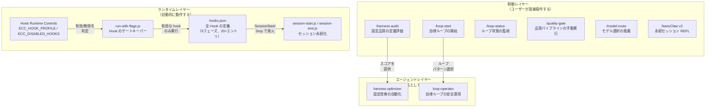

# Agent Harness Performance System 調査レポート

**調査日:** 2026-03-20
**対象バージョン:** everything-claude-code v1.8.0
**調査者:** Claude Opus 4.6
**対象領域:** v1.8.0 で導入された Agent Harness 関連機能全体

---

## 1. v1.8.0 で何が変わったのか

v1.8.0 の最大の変化は、ECC（Everything Claude Code）の自己定義の転換にある。それまで ECC は「Claude Code 向けの設定集（config pack）」として位置づけられていたが、v1.8.0 からは「**AI エージェントハーネスのパフォーマンス最適化システム**」として再定義された。

この転換は名前だけの変更ではない。以下の具体的な機能群によって裏付けられている:

1. **ハーネス設定の品質を定量評価する仕組み**（Harness Audit Engine）
2. **Hook の実行を環境変数で動的に制御する仕組み**（Hook Runtime Controls）
3. **エージェントの自律ループを安全に運用する仕組み**（Loop Commands + Loop Operator）
4. **タスクの複雑度に応じてモデルを選択する仕組み**（Model Routing）
5. **セッションをまたいだ対話を永続化する REPL**（NanoClaw v2）
6. **Claude Code 以外のハーネス（Cursor, Codex, OpenCode）との互換性を担保する仕組み**（Cross-Harness Parity）

以下、各機能の目的と動作を解説する。

---

## 2. システム全体像

v1.8.0 の harness 機能群は、大きく3つのレイヤーに分かれる。

**制御レイヤー**は、ユーザーがスラッシュコマンドや CLI で直接操作するインターフェースである。設定の品質診断、ループの開始・監視、品質チェックの手動実行、モデル推薦といった機能を提供する。

**ランタイムレイヤー**は、Claude Code のツール実行に連動して自動的に動作する仕組みである。環境変数による Hook の動的制御と、セッション情報の永続化がここに含まれる。

**エージェントレイヤー**は、特定の責務を持つサブエージェントである。harness-optimizer は設定改善を、loop-operator はループ安全運用を、それぞれ自律的に行う。

---

## 3. 新規コマンド一覧

v1.8.0 で追加された5つのコマンドの概要を示す。詳細な動作メカニズムは [DEEP-DIVE-HARNESS-ARCHITECTURE.md](./DEEP-DIVE-HARNESS-ARCHITECTURE.md) で解説する。

| コマンド | 目的 | 出力 |
|---------|------|------|
| `/harness-audit` | リポジトリのハーネス設定を7カテゴリ・26項目で定量評価する | 総合スコア（/70）+ 各カテゴリスコア + 改善アクション Top 3 |
| `/loop-start` | 自律エージェントループを安全なデフォルト設定で開始する | ループパターン選択 → 安全チェック → `.claude/plans/` にランブック作成 |
| `/loop-status` | 実行中のループの状態・進捗・障害を検査する | 現在のフェーズ、最終チェックポイント、コスト偏差、推奨介入 |
| `/quality-gate` | 言語検出 → フォーマッター → リンター → 型チェックを手動実行する | 修正リスト。`--fix` で自動修正、`--strict` で警告もエラー扱い |
| `/model-route` | タスクの複雑度とコスト予算に応じて最適モデルを推薦する | 推薦モデル、確信度、理由、フォールバック先 |

### 各コマンドが解決する問題

**`/harness-audit`** は「設定ドリフト」の問題を解決する。ECC のような多数のコンポーネント（hook、skill、agent、command）を持つシステムでは、開発の過程でファイルの追加漏れやテストの不足が生じやすい。このコマンドは、同じコミットに対して常に同じスコアを返す決定的な監査を行い、設定の抜け漏れを早期に検出する。

**`/loop-start`** と **`/loop-status`** は「安全でない自律ループ」の問題を解決する。Claude Code を非対話的に繰り返し実行する自律ループは強力だが、停止条件がない・品質チェックがない・コスト上限がないといった状態で放置すると危険である。これらのコマンドは、ループ開始前に安全チェックを行い、実行中の状態監視と介入判断を支援する。

**`/quality-gate`** は「Hook と同じチェックを任意のタイミングで実行したい」という要求に応える。ECC の Hook は自動的にコード品質チェックを行うが、ユーザーが「今すぐ全体をチェックしたい」場合にはコマンド経由で同じパイプラインを手動実行できる。

**`/model-route`** は「どのモデルを使えばよいか分からない」という判断を支援する。Haiku（低コスト・決定的タスク向け）、Sonnet（汎用）、Opus（高度な推論が必要な場合）の3段階で推薦を行う。

---

## 4. Hook 信頼性フレームワーク

### 4.1 以前の問題

v1.8.0 以前の ECC Hook は、以下の信頼性の問題を抱えていた:

- **SessionStart Hook が `CLAUDE_PLUGIN_ROOT` を解決できない場合がある。** Claude Code がプラグインルートを環境変数で渡さないケースがあり、Hook が起動に失敗していた。
- **インラインの bash ワンライナーが壊れやすい。** JSON 内にエスケープされたシェルコマンドを直接書く方式は、クォーティングの問題や可読性の低下を招いていた。
- **Hook の有効/無効をファイル編集なしに切り替えられない。** 特定の Hook を一時的に無効にするには hooks.json を直接編集する必要があった。

### 4.2 v1.8.0 での解決策

**SessionStart のルートフォールバック:** SessionStart Hook は、`CLAUDE_PLUGIN_ROOT` が未設定の場合、5つの既知パスを順に探索する（`~/.claude/plugins/everything-claude-code`、`~/.claude/plugins/everything-claude-code@everything-claude-code` など）。すべて失敗した場合は `find` コマンドで動的探索を行う。これにより、プラグインのインストール場所に依存しない堅牢な起動が実現された。

**スクリプトベースの Hook 実行:** インラインの bash ワンライナーは、Node.js スクリプト（`run-with-flags.js`）に委譲する方式に置き換えられた。`run-with-flags.js` は以下の処理を行う:

1. Hook ID とプロファイル情報を受け取る
2. `hook-flags.js` の `isHookEnabled()` で実行可否を判定する
3. 有効な場合のみ、対象スクリプトを実行する
4. パストラバーサル（プラグインルート外のスクリプト実行）を防止する

**環境変数による動的制御:** 2つの環境変数で Hook の動作を制御できるようになった:

| 環境変数 | 値 | 効果 |
|---------|-----|------|
| `ECC_HOOK_PROFILE` | `minimal` / `standard`（デフォルト）/ `strict` | Hook ごとに定義された許可プロファイルと照合し、合致しない Hook をスキップする |
| `ECC_DISABLED_HOOKS` | カンマ区切りの Hook ID | 指定された Hook を無条件で無効化する（プロファイルより優先） |

---

## 5. NanoClaw v2

NanoClaw は、ECC に内蔵された**セッション永続型の REPL（対話環境）**である。`claude -p`（非対話モード）を内部的に呼び出しつつ、会話履歴を Markdown ファイルとして保存・復元する。

従来の `claude -p` は1回の呼び出しごとにコンテキストがリセットされるため、前回の会話内容を覚えていない。NanoClaw はこの問題を、会話履歴を `~/.claude/claw/{session}.md` に保存し、毎回のプロンプトに履歴を付加して送信することで解決する。

主な機能:

| 機能 | コマンド | 説明 |
|------|---------|------|
| セッション管理 | `/sessions`, `/clear` | 保存済みセッションの一覧表示、現在セッションの消去 |
| モデル切替 | `/model opus` | 実行中にモデルを変更 |
| スキル読込 | `/load tdd-workflow` | ECC の skill をコンテキストに動的追加 |
| セッション分岐 | `/branch experiment-1` | 現在の会話を別名で複製して分岐 |
| 横断検索 | `/search "認証"` | 全セッションを横断してテキスト検索 |
| コンパクション | `/compact` | 古いターンを破棄し、直近20ターンのみ保持 |
| エクスポート | `/export json` | Markdown / JSON / テキスト形式で書き出し |
| メトリクス | `/metrics` | ターン数、文字数、推定トークン数 |

---

## 6. Cross-Harness Parity（クロスハーネス互換性）

v1.8.0 では、ECC が Claude Code だけでなく Cursor、Codex、OpenCode の4つのハーネスで動作することを目標に、互換性の整備が行われた。

### 4ハーネスの対応状況

| 機能 | Claude Code | Cursor | OpenCode | Codex |
|------|------------|--------|----------|-------|
| Hook 実行 | 6フェーズ、20+エントリ | 14イベント（adapter 経由） | 20+プラグインイベント | なし（命令ベース） |
| Agent 定義 | 27 agent（Markdown） | 共有（AGENTS.md） | 12 agent（JSON） | 3 agent（TOML） |
| コマンド | 57 コマンド | 共有 | 31 コマンド | 命令ベース |
| ルール | 34ルール（common + 言語別） | 34ルール（YAML frontmatter） | 13 instructions | AGENTS.md |
| MCP サーバー | 14 サーバー | 共有（mcp.json） | フルサポート | 6 サーバー（TOML） |
| 設定形式 | settings.json | hooks.json + rules/ | opencode.json | config.toml |

### Adapter パターン（Cursor 向け）

Cursor は Claude Code と異なる Hook イベント体系（14種類のイベント名）を持つ。しかし Hook の実装ロジック自体は共通化したいため、ECC は `.cursor/hooks/adapter.js` というアダプターを用いて、Cursor の入力 JSON を Claude Code 形式に変換し、`scripts/hooks/` 内の既存スクリプトを再利用する。

この「DRY adapter パターン」により、Hook ロジックの重複を排除し、一箇所の修正が全ハーネスに反映される構造を実現している。

### Codex の制限と対策

Codex は2026年3月時点で Hook 実行機能を持たない。そのため、ECC の自動化機能（ファイル編集後の自動フォーマット、セキュリティチェック等）は Codex では動作しない。代わりに、`AGENTS.md` と `.codex/AGENTS.md` で命令文ベースのガイダンスを提供し、サンドボックスモード（`workspace-write` / `read-only`）と承認ポリシー（`on-request` / `never`）でセキュリティを担保している。

---

## 7. テスト状況

v1.8.0 では **997件の内部テストがすべてパス** している。harness-audit 固有のテストは `tests/scripts/harness-audit.test.js` にあり、以下を検証している:

- 同一コミットに対する JSON 出力の決定性（同じ入力→同じ出力）
- スコアの有界性（各カテゴリ 0-10、合計最大 70）
- スコープ（`repo` / `hooks` / `skills` 等）によるチェック対象の適切なフィルタリング
- テキスト出力にサマリーヘッダーが含まれること
- 失敗チェックから Top 3 アクションが正しく抽出されること

---

## 8. 調査所見のまとめ

### 実装状態の総括

| 機能領域 | 実装状態 | ファイル数 | 備考 |
|---------|---------|-----------|------|
| Harness Audit | 完成 | 3（コマンド定義 + スクリプト + テスト） | 26チェック、7カテゴリ |
| Hook Runtime Controls | 完成 | 2（hook-flags.js + run-with-flags.js） | 3プロファイル + 無効化リスト |
| Loop Commands | 定義済み | 2（loop-start.md + loop-status.md） | コマンド定義のみ、実行スクリプトなし |
| Model Route | 定義済み | 1（model-route.md） | ヒューリスティックベース |
| Quality Gate | 定義済み | 1（quality-gate.md） | Hook と同等のパイプライン |
| NanoClaw v2 | 完成 | 2（claw.js + SKILL.md） | 469行、12 REPL コマンド |
| Cross-Harness Parity | 実用段階 | 多数（.cursor/ + .codex/ + .opencode/） | adapter パターンで DRY 化 |
| harness-optimizer | 定義済み | 1（harness-optimizer.md） | /harness-audit を基盤に動作 |
| loop-operator | 定義済み | 1（loop-operator.md） | エスカレーション条件定義済み |

### 注目すべき設計判断

1. **決定的監査:** harness-audit は意図的にヒューリスティクスを排除し、「ファイルが存在するか」「閾値を超えているか」という明示的チェックのみを使う。これにより、同じコミットに対して常に同じスコアが得られる。

2. **プロファイルの階層設計:** `minimal < standard < strict` の3段階で Hook の実行範囲を制御できる。本番デプロイ前の strict チェックと、日常開発の standard、最小限の minimal を切り替えるだけで、Hook の挙動を環境ごとに調整できる。

3. **adapter パターンによる DRY 化:** 各ハーネスの差異を adapter レイヤーで吸収し、ビジネスロジック（Hook スクリプト本体）を一箇所に集約している。これにより、バグ修正や機能追加が全ハーネスに即座に反映される。

4. **自律ループの段階的複雑度:** sequential → continuous-pr → rfc-dag → infinite の4パターンで、タスクの性質に応じた適切な自律度を選択できる。すべてのパターンに共通する安全機構（停止条件、コスト上限、品質ゲート）が定義されている。
