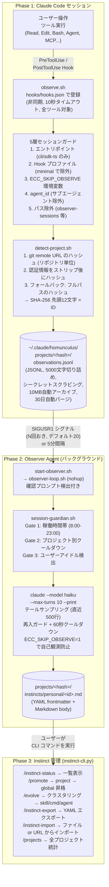
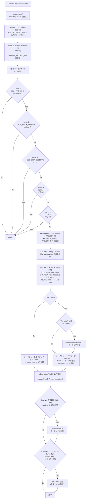
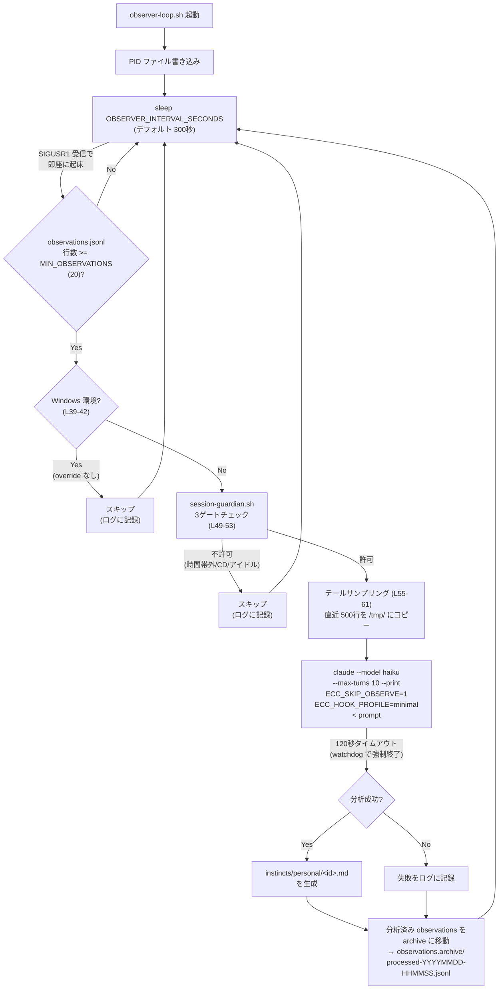
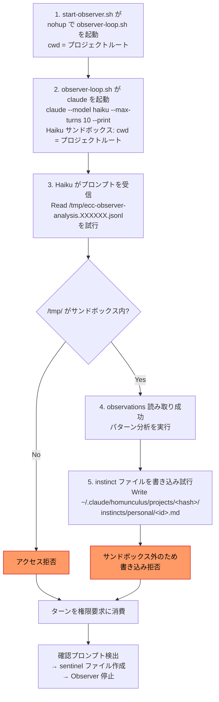

# Continuous Learning v2: Observation → Instinct → Skill パイプライン 詳細調査

**調査日:** 2026-03-20
**対象バージョン:** everything-claude-code（2026-03-20 時点の最新版）
**調査者:** Claude Opus 4.6
**関連ドキュメント:** [INVESTIGATION.md](./INVESTIGATION.md)

---

## 目次

1. [エグゼクティブサマリー](#1-エグゼクティブサマリー)
2. [システム全体像](#2-システム全体像)
3. [Phase 1: Hook による観測](#3-phase-1-hook-による観測)
4. [Phase 2: Observer による分析と Instinct 生成](#4-phase-2-observer-による分析と-instinct-生成)
5. [Phase 3: Instinct の管理・昇格・進化](#5-phase-3-instinct-の管理昇格進化)
6. [実データで見るシステムの動作](#6-実データで見るシステムの動作)
7. [課題と解決策](#7-課題と解決策)
8. [付録: 主要ファイル一覧](#8-付録-主要ファイル一覧)

---

## 1. エグゼクティブサマリー

Continuous Learning v2.1 は、Claude Code のセッション中のツール使用をリアルタイムに記録し、蓄積されたパターンから「instinct」（本能的な行動指針）を自動生成し、最終的に skill / command / agent に昇華させる3段階のパイプラインである。

### 現在の状態（2026-03-20 時点）

| フェーズ | 状態 | 詳細 |
|---------|------|------|
| **Phase 1: 観測** | **稼働中** | 44プロジェクト、24,779件の観測を収集済み。5層セッションガード・シークレットスクラビング・30日自動パージなど防御機構が充実 |
| **Phase 2: 分析** | **一部改善** | Observer にスロットリング（20回おき）・再入ガード・60秒クールダウン・セッションガーディアン（3ゲート）を追加。ただし Haiku のサンドボックス制約が残存し instinct 生成には至っていない |
| **Phase 3: 進化** | **未到達** | Instinct が0件のため進化パスに到達していない |

**根本原因:** `claude --model haiku` で起動された Haiku はプロジェクトのサンドボックス内でしか動作できない。observations.jsonl は `~/.claude/homunculus/` に保存されているためサンドボックス外にある。テールサンプリングにより `/tmp/` へコピーし参照パスをプロンプトに記載する緩和策が実装されたが、`/tmp/` パスもサンドボックス外の可能性がある。また instinct ファイルの書き込み先 (`~/.claude/homunculus/`) も依然としてサンドボックス外にある。

---

## 2. システム全体像

### アーキテクチャ図



### 3つのフェーズの役割分担

| フェーズ | 担当コンポーネント | トリガー | モデル |
|---------|-------------------|---------|--------|
| 観測 | `observe.sh` (hook) | 全ツール実行時（5層ガード通過後） | なし（シェルスクリプト） |
| 分析 | `observer-loop.sh` | 5分間隔 or SIGUSR1（20回おき、クールダウン60秒） | Haiku（コスト効率重視） |
| 管理 | `instinct-cli.py` | ユーザーのCLIコマンド | なし（Python スクリプト） |

**用語:**

- **SIGUSR1** — Unix のユーザー定義シグナル（プロセス間通知の仕組み）。OS が使わない汎用シグナルで、アプリケーションが自由に意味を決められる。本システムでは observe.sh が Observer プロセスに「新しい観測データがある」と通知し、5分の定期ポーリングを待たずに即時分析をトリガーするために使用する（`kill -USR1 <observer_pid>`）。
- **スロットリング（throttling）** — 処理の発火頻度を制限すること。本システムでは observe.sh がツール実行のたびに SIGUSR1 を送信するのではなく、20回に1回だけ送信する（残り19回はスキップ）。これにより Observer の起床頻度を抑え、過剰な分析プロセスの暴走を防止する。

---

## 3. Phase 1: Hook による観測

### 3.1 Hook の登録

`hooks/hooks.json` に PreToolUse と PostToolUse の2つのフックとして登録されている。

**PreToolUse（ツール実行前）— L55-65:**
```json
{
  "matcher": "*",
  "hooks": [{
    "type": "command",
    "command": "bash \"${CLAUDE_PLUGIN_ROOT}/scripts/hooks/run-with-flags-shell.sh\" \"pre:observe\" \"skills/continuous-learning-v2/hooks/observe.sh\" \"standard,strict\"",
    "async": true,
    "timeout": 10
  }],
  "description": "Capture tool use observations for continuous learning"
}
```

**PostToolUse（ツール実行後）— L168-178:**
```json
{
  "matcher": "*",
  "hooks": [{
    "type": "command",
    "command": "bash \"${CLAUDE_PLUGIN_ROOT}/scripts/hooks/run-with-flags-shell.sh\" \"post:observe\" \"skills/continuous-learning-v2/hooks/observe.sh\" \"standard,strict\"",
    "async": true,
    "timeout": 10
  }],
  "description": "Capture tool use results for continuous learning"
}
```

**重要な設計判断:**
- `"matcher": "*"` — 全ツール（Read, Edit, Bash, Grep, Agent, MCP ツール含む）に対して発火
- `"async": true` — 非同期実行でツール実行をブロックしない
- `"timeout": 10` — 10秒タイムアウトでパフォーマンスへの影響を最小化

### 3.2 observe.sh の処理フロー

**ソースファイル:** `skills/continuous-learning-v2/hooks/observe.sh`（413行）



**observe.sh のコア部分（パース処理、L156-205）:**

```python
# observe.sh 内の Python パーサー
hook_phase = os.environ.get("HOOK_PHASE", "post")
event = "tool_start" if hook_phase == "pre" else "tool_complete"

tool_name = data.get("tool_name", data.get("tool", "unknown"))
tool_input = data.get("tool_input", data.get("input", {}))
# tool_response を優先的に参照（新しいフォールバック順序）
tool_output = data.get("tool_response")
if tool_output is None:
    tool_output = data.get("tool_output", data.get("output", ""))

# 大きな入出力は切り詰め
if isinstance(tool_input, dict):
    tool_input_str = json.dumps(tool_input)[:5000]
else:
    tool_input_str = str(tool_input)[:5000]
```

**シークレットスクラビング（L264-269）:**

observation を JSONL に書き込む前に、API キー・トークン・パスワード等の機密情報を正規表現で検出し `[REDACTED]` に置換する。パースエラー時（L217-226）にも同じスクラビングが適用される。

```python
_SECRET_RE = re.compile(
    r"(?i)(api[_-]?key|token|secret|password|authorization|credentials?|auth)"
    r"""(["'\s:=]+)"""
    r"([A-Za-z]+\s+)?"           # Bearer, Basic 等の認証スキーム（任意）
    r"([A-Za-z0-9_\-/.+=]{8,})"
)
```

**SIGUSR1 スロットリング（L371-410）:**

旧バージョンでは observation 記録のたびに SIGUSR1 を送信していたが、ツール呼び出しが毎秒発生する状況で Observer に過剰なシグナルが送られ、並行 Claude プロセスの暴走を引き起こしていた（Issue #521）。現在は N 回おき（デフォルト20、`ECC_OBSERVER_SIGNAL_EVERY_N` で変更可能）にスロットリングされ、PID の重複送信も排除されている。

### 3.3 プロジェクト検出

**ソースファイル:** `skills/continuous-learning-v2/scripts/detect-project.sh`（229行）

プロジェクト検出には「ルートの特定」と「IDの生成」の2段階がある。

**段階1: プロジェクトルートの特定**

| 優先度 | ソース | 用途 |
|-------|-------|------|
| 1 | `CLAUDE_PROJECT_DIR` 環境変数 | hook が stdin から cwd を抽出して設定 |
| 2 | `git rev-parse --show-toplevel` | git リポジトリのルートパスを取得 |
| 3 | "global" フォールバック | git リポジトリ外の場合 |

**段階2: プロジェクトIDの生成**

ルートが特定された後、IDの生成に使うハッシュ入力は以下の優先順位で決まる:

| 優先度 | hash_input | 特性 | 例 |
|:---:|---|---|---|
| 1 | `git remote get-url origin`（認証情報ストリップ後） | **リポジトリ単位** — クローン先パスが異なっても同一IDになる（マシン間でポータブル） | `git@github.com:ymdvsymd/everything-claude-code.git` → `1a84b3e65af6` |
| 2 | プロジェクトルートのフルパス | **フルパス単位** — 同一リポジトリでも別パスなら別IDになる（マシン固有） | `/Users/to.watanabe/oss/everything-claude-code` → 別のハッシュ |

```bash
local hash_input="${remote_url:-$project_root}"
project_id=$(printf '%s' "$hash_input" | python3 -c \
  "import sys,hashlib; print(hashlib.sha256(sys.stdin.buffer.read()).hexdigest()[:12])")
```

**認証情報ストリップ（L96-99）:**

git remote URL に埋め込まれた認証情報（例: `https://ghp_xxxx@github.com/...`）は、ハッシュ計算前に `sed -E 's|://[^@]+@|://|'` で除去される。これにより、トークンの変更でプロジェクトIDが変わることを防ぐ。

**後方互換マイグレーション（L114-123）:**

認証情報ストリップの導入によりハッシュが変わった場合、旧ハッシュのディレクトリが存在すれば新ハッシュへ `mv` して再利用する。これにより既存の観測データや instinct が失われない。

**既知のバグ — worktree で本体と別IDになる:**

`import-ziflow-comment` は `novasell-factory` の git worktree である。git worktree はメインリポジトリと同じ remote を共有するため、本来は同一プロジェクトIDが生成されるべきだが、実際には別ID (`999f45f4630e`) になっている。

原因は `detect-project.sh` L88 の条件分岐:

```bash
if [ "$source_hint" = "git" ] || [ -d "${project_root}/.git" ]; then
    remote_url=$(git -C "$project_root" remote get-url origin 2>/dev/null || true)
fi
```

git worktree では `.git` はディレクトリではなくファイル（メインリポジトリの `.git/worktrees/<name>` へのポインタ）であるため、`-d` チェックが false を返す。さらに observe.sh が stdin の `cwd` から `CLAUDE_PROJECT_DIR` を設定するため `source_hint="env"` となり、両条件とも false になる。結果として `remote_url` が空のままフルパスのハッシュにフォールバックし、本体とは異なるIDが生成される。

**修正案:** 条件チェックを削除し、常に `git -C` を試行する（失敗時は空文字にフォールバックするため安全）:

```bash
remote_url=$(git -C "$project_root" remote get-url origin 2>/dev/null || true)
```

**初回検出時のディレクトリ自動作成:**

```
~/.claude/homunculus/projects/<hash>/
├── instincts/personal/
├── instincts/inherited/
├── observations.archive/
├── evolved/skills/
├── evolved/commands/
└── evolved/agents/
```

**プロジェクトレジストリの更新:**

検出のたびに `~/.claude/homunculus/projects.json` をアトミックに更新する（tmp ファイル書き込み → `os.replace` でリネーム）。

### 3.4 Observation データフォーマット

1行1JSONオブジェクトの JSONL 形式:

```jsonl
{
  "timestamp": "2026-03-07T13:20:59Z",
  "event": "tool_start",
  "tool": "Bash",
  "session": "d6dd437d-1852-4f0b-a38d-3342c9627c38",
  "project_id": "1a84b3e65af6",
  "project_name": "everything-claude-code",
  "input": "{\"command\": \"git checkout origin/main\", \"description\": \"Checkout origin/main (detached HEAD)\"}"
}
```

| フィールド | 型 | tool_start | tool_complete | 説明 |
|-----------|---|:---:|:---:|------|
| `timestamp` | string | o | o | UTC ISO 8601 |
| `event` | string | `"tool_start"` | `"tool_complete"` | イベント種別 |
| `tool` | string | o | o | ツール名 |
| `session` | string | o | o | セッション UUID |
| `project_id` | string | o | o | 12文字ハッシュ |
| `project_name` | string | o | o | ディレクトリ名 |
| `input` | string | o | - | ツール入力（5000文字上限、シークレットスクラビング済み） |
| `output` | string | - | o | ツール出力（5000文字上限、シークレットスクラビング済み） |

---

## 4. Phase 2: Observer による分析と Instinct 生成

### 4.1 Observer の起動

**ソースファイル:** `skills/continuous-learning-v2/agents/start-observer.sh`（241行）

```bash
# 手動起動
bash agents/start-observer.sh              # start
bash agents/start-observer.sh stop         # 停止
bash agents/start-observer.sh status       # 状態確認
bash agents/start-observer.sh --reset      # sentinel ファイルクリア＆再起動
```

**起動前チェック:**
1. `config.json` の `observer.enabled` が `true` であること
2. 同一プロジェクトで既に Observer が起動していないこと（PID ファイルチェック）

**設定値の読み込み:**

```json
// skills/continuous-learning-v2/config.json
{
  "version": "2.1",
  "observer": {
    "enabled": false,
    "run_interval_minutes": 5,
    "min_observations_to_analyze": 20
  }
}
```

**Windows/Git-Bash 検出（L109-114）:**

`uname -s` の出力に `mingw`, `msys`, `cygwin` が含まれる場合、Windows 環境と判定し `CLV2_IS_WINDOWS=true` を設定する。Windows では `claude --print` が非インタラクティブモードでハングする既知の問題（Issue #295）があるため、Observer 側でスキップ可能にしている。

**バックグラウンド起動（L195-208）:**

```bash
nohup env \
  CONFIG_DIR="$CONFIG_DIR" \
  PID_FILE="$PID_FILE" \
  LOG_FILE="$LOG_FILE" \
  OBSERVATIONS_FILE="$OBSERVATIONS_FILE" \
  INSTINCTS_DIR="$INSTINCTS_DIR" \
  PROJECT_DIR="$PROJECT_DIR" \
  PROJECT_NAME="$PROJECT_NAME" \
  PROJECT_ID="$PROJECT_ID" \
  MIN_OBSERVATIONS="$MIN_OBSERVATIONS" \
  OBSERVER_INTERVAL_SECONDS="$OBSERVER_INTERVAL_SECONDS" \
  CLV2_IS_WINDOWS="$IS_WINDOWS" \
  CLV2_OBSERVER_PROMPT_PATTERN="$CLV2_OBSERVER_PROMPT_PATTERN" \
  "$OBSERVER_LOOP_SCRIPT" >> "$LOG_FILE" 2>&1 &
```

環境変数で全設定を渡し、`nohup` でプロセスをデタッチする。

**確認プロンプト検出（L213-219）:**

Observer 起動直後にログを監視し、Haiku が権限確認を要求するパターン（`Can you confirm|requires permission|Awaiting.*|grant.*access` 等）を検出した場合、Observer を停止して sentinel ファイル（`.observer.lock`）を作成する。これにより、対話不能な `--print` モードで Haiku がターンを浪費し続ける問題を早期に検出して graceful に停止する。

**`--reset` アクション（L134-136）:**

sentinel ファイルをクリアする。確認プロンプト検出で停止した Observer を、ユーザーが observer.log を確認した後に再起動できる。

### 4.2 Observer ループの動作

**ソースファイル:** `skills/continuous-learning-v2/agents/observer-loop.sh`（186行）



**SIGUSR1 ハンドラ（L145-168）:**

```bash
on_usr1() {
  [ -n "$SLEEP_PID" ] && kill "$SLEEP_PID" 2>/dev/null
  SLEEP_PID=""
  USR1_FIRED=1

  # 再入ガード: 分析中なら SIGUSR1 を無視 (#521)
  if [ "$ANALYZING" -eq 1 ]; then
    echo "[$(date)] Analysis already in progress, skipping signal" >> "$LOG_FILE"
    return
  fi

  # クールダウン: 前回の分析から ANALYSIS_COOLDOWN 秒未満ならスキップ (#521)
  now_epoch=$(date +%s)
  elapsed=$(( now_epoch - LAST_ANALYSIS_EPOCH ))
  if [ "$elapsed" -lt "$ANALYSIS_COOLDOWN" ]; then
    echo "[$(date)] Analysis cooldown active (${elapsed}s < ${ANALYSIS_COOLDOWN}s), skipping" >> "$LOG_FILE"
    return
  fi

  ANALYZING=1
  analyze_observations
  LAST_ANALYSIS_EPOCH=$(date +%s)
  ANALYZING=0
}
```

旧バージョンでは SIGUSR1 受信時に無条件で `analyze_observations` を呼び出していたため、分析中に新しいシグナルが届くと並行 Claude プロセスが暴走していた（Issue #521）。現在は **再入ガード**（`ANALYZING` フラグ）と **クールダウン**（デフォルト60秒、`ECC_OBSERVER_ANALYSIS_COOLDOWN` で変更可能）の2段階で防御している。

### 4.2.5 session-guardian.sh（セッションガーディアン）

**ソースファイル:** `skills/continuous-learning-v2/agents/session-guardian.sh`（151行）

Observer ループが分析を開始する前に呼び出され、3つのゲートで実行可否を判定する。exit 0 で許可、exit 1 でスキップ。コストの低いチェックから順に実行される。

**Gate 1: 稼働時間帯チェック（L26-52）**

ローカルシステム時刻を HHMM 整数で比較し、設定された稼働時間帯外であればスキップする。デフォルトは 8:00〜23:00。夜間帯の折り返し（例: 22:00〜06:00）にも対応している。

| 設定 | デフォルト | 説明 |
|-----|----------|------|
| `OBSERVER_ACTIVE_HOURS_START` | 800 | 稼働開始時刻（HHMM） |
| `OBSERVER_ACTIVE_HOURS_END` | 2300 | 稼働終了時刻（HHMM） |

両方を 0 に設定するとこのゲートは無効になる。

**Gate 2: プロジェクト別クールダウン（L54-101）**

`~/.claude/observer-last-run.log`（タブ区切り: `project_root\ttimestamp`）を参照し、同一プロジェクトが `OBSERVER_INTERVAL_SECONDS` 以内に再分析されるのを防ぐ。`mkdir` ベースのアトミックロックで並行プロセスの安全性を確保している。

**Gate 3: ユーザーアイドル検出（L103-148）**

ユーザーの最終入力からの経過時間を OS 固有の方法で取得し、閾値（デフォルト1800秒 = 30分）を超えていればスキップする。

| プラットフォーム | 取得方法 | フォールバック |
|---------------|---------|-------------|
| macOS (Darwin) | `ioreg -c IOHIDSystem` → `HIDIdleTime` | 0（フェイルオープン） |
| Linux | `xprintidle`（ミリ秒→秒変換） | 0（未インストール時はフェイルオープン） |
| Windows (MINGW/MSYS/CYGWIN) | PowerShell `GetLastInputInfo()` via P/Invoke | 0（フェイルオープン） |
| その他 | - | 0（フェイルオープン） |

`OBSERVER_MAX_IDLE_SECONDS=0` でこのゲートは無効になる。

### 4.3 Haiku に渡されるプロンプト

`observer-loop.sh` の `analyze_observations()` 関数内で構築される（L63-100）:

```
Read ${analysis_file} and identify patterns for the project ${PROJECT_NAME}
(user corrections, error resolutions, repeated workflows, tool preferences).
If you find 3+ occurrences of the same pattern, create an instinct file in
${INSTINCTS_DIR}/<id>.md.

CRITICAL: Every instinct file MUST use this exact format:

---
id: kebab-case-name
trigger: when <specific condition>
confidence: <0.3-0.85 based on frequency: 3-5 times=0.5, 6-10=0.7, 11+=0.85>
domain: <one of: code-style, testing, git, debugging, workflow, file-patterns>
source: session-observation
scope: project
project_id: ${PROJECT_ID}
project_name: ${PROJECT_NAME}
---

# Title

## Action
<what to do, one clear sentence>

## Evidence
- Observed N times in session <id>
- Pattern: <description>
- Last observed: <date>

Rules:
- Be conservative, only clear patterns with 3+ observations
- Use narrow, specific triggers
- Never include actual code snippets, only describe patterns
- If a similar instinct already exists in ${INSTINCTS_DIR}/, update it instead
  of creating a duplicate
- The YAML frontmatter (between --- markers) with id field is MANDATORY
- If a pattern seems universal (not project-specific), set scope to global
- Examples of global: always validate user input, prefer explicit error handling
- Examples of project: use React functional components, follow Django REST conventions
```

**旧バージョンからの変更点:**
- `Read ${OBSERVATIONS_FILE}` → `Read ${analysis_file}`: テールサンプリングした一時ファイルを参照（`/tmp/ecc-observer-analysis.XXXXXX.jsonl`）
- `--max-turns 3` → `--max-turns 10`（環境変数 `ECC_OBSERVER_MAX_TURNS` で変更可能、最小4）
- Haiku 起動時に `ECC_SKIP_OBSERVE=1 ECC_HOOK_PROFILE=minimal` を設定し、Observer 自身のツール実行が観測データに記録されることを防止

**パターン検出の対象:**

| パターン種別 | 説明 | instinct 例 |
|-------------|------|------------|
| ユーザー修正 | "No, use X instead" のような修正 | "When doing X, prefer Y" |
| エラー解決 | エラー → 修正の繰り返しシーケンス | "When encountering error X, try Y" |
| 繰り返しワークフロー | 同じツールシーケンスの再利用 | "When doing X, follow steps Y, Z, W" |
| ツール選好 | 特定ツールの一貫した使用 | "When needing X, use tool Y" |

### 4.4 Instinct ファイルフォーマット

Observer が生成する instinct ファイルの完全な仕様:

```yaml
---
id: prefer-functional-style          # kebab-case、最大128文字
trigger: "when writing new functions" # 発火条件
confidence: 0.7                       # 0.3-0.85
domain: "code-style"                  # 下表参照
source: "session-observation"         # 生成元
scope: project                        # project or global
project_id: "a1b2c3d4e5f6"          # project scope のみ
project_name: "my-react-app"         # project scope のみ
---

# Prefer Functional Style

## Action
Use functional patterns over classes when appropriate.

## Evidence
- Observed 5 times in session abc123
- Pattern: User consistently uses functional components
- Last observed: 2026-03-20
```

**domain の種類:**

| domain | 説明 | scope 傾向 |
|--------|------|-----------|
| `code-style` | コーディングスタイル | project |
| `testing` | テスト手法 | project |
| `git` | Git ワークフロー | global |
| `debugging` | デバッグ手法 | global |
| `workflow` | ツール使用ワークフロー | global |
| `file-patterns` | ファイル構造 | project |
| `security` | セキュリティ | global |

### 4.5 Confidence スコアリング

**初期 confidence（観測回数ベース）:**

| 観測回数 | confidence | ラベル |
|---------:|-----------:|--------|
| 1-2 | 0.3 | tentative |
| 3-5 | 0.5 | moderate |
| 6-10 | 0.7 | strong |
| 11+ | 0.85 | very strong |

**時間経過による調整:**

| イベント | 調整幅 |
|---------|-------|
| 確認観測 | +0.05 |
| 矛盾観測 | -0.10 |
| 1週間未観測 | -0.02 (decay) |

### 4.6 Scope 判定ガイド

Observer が instinct を作成する際の scope 決定基準:

| パターン種別 | scope | 例 |
|-------------|-------|---|
| 言語/FW 規約 | **project** | "React hooks を使う" |
| ファイル構造 | **project** | "テストは `__tests__/` に" |
| コードスタイル | **project** | "関数型を好む" |
| セキュリティ | **global** | "ユーザー入力を検証" |
| ツールワークフロー | **global** | "Edit 前に Grep" |
| Git プラクティス | **global** | "conventional commits" |

**原則:** 迷ったら `scope: project` にする。後から promote する方が、global を汚染するより安全。

---

## 5. Phase 3: Instinct の管理・昇格・進化

### 5.1 instinct-cli.py の概要

**ソースファイル:** `skills/continuous-learning-v2/scripts/instinct-cli.py`（1149行）

全コマンドの概要:

| コマンド | Claude Code スラッシュコマンド | 機能 |
|---------|-------------------------------|------|
| `status` | `/instinct-status` | instinct 一覧（confidence バー付き） |
| `import` | `/instinct-import <file>` | ファイル/URLからインポート |
| `export` | `/instinct-export` | YAML エクスポート |
| `evolve` | `/evolve` | クラスタリング → skill/cmd/agent 候補提示 |
| `promote` | `/promote [id]` | project → global 昇格 |
| `projects` | `/projects` | 全プロジェクト統計 |

### 5.2 Instinct のロード順序と優先度

```python
def load_all_instincts(project, include_global=True):
    # 1. Project instincts (personal + inherited) ← 最優先
    # 2. Global instincts (personal + inherited)  ← 低優先
    # 同一 ID の場合、project 版が勝つ
```

**ディレクトリ構成:**

```
Project scope:
  ~/.claude/homunculus/projects/<hash>/instincts/
    ├── personal/      # Observer が自動生成
    └── inherited/     # import でインポート

Global scope:
  ~/.claude/homunculus/instincts/
    ├── personal/      # promote で昇格 or Observer がグローバルと判断
    └── inherited/     # 外部ソースからインポート
```

### 5.3 Promote（昇格）

**2つのモード:**

**a) 指定昇格:** `python3 instinct-cli.py promote <instinct-id>`
- 現在のプロジェクトの instinct を global にコピー
- `promoted_from`, `promoted_date` メタデータを付加

**b) 自動昇格:** `python3 instinct-cli.py promote` (引数なし)
- 全プロジェクトを横断スキャン
- 以下の条件を**両方**満たす instinct を自動昇格:
  - **同一IDが2プロジェクト以上に存在** (`PROMOTE_MIN_PROJECTS = 2`)
  - **平均 confidence が 0.8 以上** (`PROMOTE_CONFIDENCE_THRESHOLD = 0.8`)
- 最も confidence が高いバージョンを global にコピー
- `source: auto-promoted`, `seen_in_projects: N` を付加

### 5.4 Evolve（進化）

`python3 instinct-cli.py evolve [--generate]`

**分析プロセス:**

1. **クラスタリング:** trigger のキーワードを正規化して類似 instinct をグループ化
2. **候補の分類:**

| 進化先 | 条件 | 生成ファイル |
|-------|------|------------|
| **Skill** | 2+ instinct が同一 trigger | `evolved/skills/<name>/SKILL.md` |
| **Command** | workflow domain かつ confidence >= 0.7 | `evolved/commands/<name>.md` |
| **Agent** | 3+ instinct かつ avg confidence >= 0.75 | `evolved/agents/<name>.md` |

3. **昇格候補の提示:** 複数プロジェクトに共通する instinct を promote 候補として表示

`--generate` フラグを付けると実際にファイルを生成する。フラグなしでは候補の提示のみ。

---

## 6. 実データで見るシステムの動作

### 6.1 観測データの統計

**収集期間:** 2026-03-05 〜 2026-03-20（約2週間）
**総プロジェクト数:** 44
**総観測エントリ数:** 24,779行

**プロジェクト別観測数（上位10件）:**

| 観測数 | プロジェクト名 | project-hash | 備考 |
|-------:|--------------|-------------|------|
| 6,574 | tornado | a287ece49d02 | 最大 |
| 3,696 | claude-code-enterprise-deployment | c134767a2ecc | |
| 3,044 | claude-code-secret-solving | 8a45b3090855 | |
| 2,960 | (hash: 79175585f9ed) | 79175585f9ed | |
| 1,643 | import-ziflow-comment | 999f45f4630e | worktree |
| 1,344 | (hash: b5140dc7cd57) | b5140dc7cd57 | |
| 950 | (hash: 7bf3b8b9315f) | 7bf3b8b9315f | |
| 818 | nebula-flow-dev-imprv | b155a07df308 | |
| 565 | everything-claude-code | 1a84b3e65af6 | 本リポジトリ |
| 418 | (hash: f8ce0cd8b050) | f8ce0cd8b050 | |

### 6.2 観測ログの実例

以下は実際の `observations.jsonl` から取得した生データである。

#### 例1: 基本的なツール操作（everything-claude-code プロジェクト）

```jsonl
{"timestamp":"2026-03-07T13:21:03Z","event":"tool_start","tool":"Bash","session":"d6dd437d-1852-4f0b-a38d-3342c9627c38","project_id":"1a84b3e65af6","project_name":"everything-claude-code","input":"{\"command\": \"git checkout origin/main\", \"description\": \"Checkout origin/main (detached HEAD)\"}"}

{"timestamp":"2026-03-07T13:21:52Z","event":"tool_start","tool":"Glob","session":"2cb642c8-1012-4130-a430-87d91b104300","project_id":"1a84b3e65af6","project_name":"everything-claude-code","input":"{\"pattern\": \"**/CHANGELOG*\"}"}

{"timestamp":"2026-03-07T13:21:58Z","event":"tool_start","tool":"Read","session":"2cb642c8-1012-4130-a430-87d91b104300","project_id":"1a84b3e65af6","project_name":"everything-claude-code","input":"{\"file_path\": \"/Users/to.watanabe/oss/everything-claude-code/CHANGELOG.md\"}"}

{"timestamp":"2026-03-07T13:25:56Z","event":"tool_start","tool":"Grep","session":"2cb642c8-1012-4130-a430-87d91b104300","project_id":"1a84b3e65af6","project_name":"everything-claude-code","input":"{\"pattern\": \"ralphinho-rfc-pipeline\", \"output_mode\": \"files_with_matches\"}"}
```

**注意:** この Glob → Read → Grep シーケンスは Claude のシステムプロンプトに組み込まれた既定動作であり、ユーザー固有のパターンではない（後述のセクション7.4参照）。

#### 例2: MCP ツール呼び出し（import-ziflow-comment プロジェクト）

```jsonl
{"timestamp":"2026-03-18T03:50:33Z","event":"tool_start","tool":"ToolSearch","session":"6937f413-d0d4-40cc-85d4-7b85fdc918c3","project_id":"999f45f4630e","project_name":"import-ziflow-comment","input":"{\"query\": \"select:mcp__claude_ai_Slack__slack_read_thread\", \"max_results\": 1}"}

{"timestamp":"2026-03-18T03:50:36Z","event":"tool_start","tool":"mcp__claude_ai_Slack__slack_read_thread","session":"6937f413-d0d4-40cc-85d4-7b85fdc918c3","project_id":"999f45f4630e","project_name":"import-ziflow-comment","input":"{\"channel_id\": \"C09HPHBK4MN\", \"message_ts\": \"1771995469.978929\"}"}

{"timestamp":"2026-03-18T03:52:40Z","event":"tool_start","tool":"mcp__claude-in-chrome__tabs_context_mcp","session":"6937f413-d0d4-40cc-85d4-7b85fdc918c3","project_id":"999f45f4630e","project_name":"import-ziflow-comment","input":"{\"createIfEmpty\": true}"}

{"timestamp":"2026-03-18T03:53:04Z","event":"tool_start","tool":"mcp__claude_ai_Slack__slack_search_public_and_private","session":"6937f413-d0d4-40cc-85d4-7b85fdc918c3","project_id":"999f45f4630e","project_name":"import-ziflow-comment","input":"{\"query\": \"knowledge-factsheet in:<#C09HPHBK4MN> from:<@U07VDSD01LJ>\", \"content_types\": \"files\", \"include_context\": false, \"limit\": 20}"}
```

**観測から読み取れるパターン:** ToolSearch で MCP ツールをロード → Slack スレッド読み取り → Chrome ブラウザ操作 → Slack 検索 という「外部情報収集」ワークフロー。MCP ツール呼び出しも完全に記録されている。

#### 例3: Agent ツールの呼び出し（connect-snowflake プロジェクト）

```jsonl
{"timestamp":"2026-03-19T00:50:25Z","event":"tool_start","tool":"Agent","session":"95c288bb-6e1d-4cc2-8af9-bc8f3fb9e06a","project_id":"13ad29f81132","project_name":"connect-snowflake","input":"{\"description\": \"autoAllowBashIfSandboxed設定の説明\", \"prompt\": \"Explain what the `autoAllowBashIfSandboxed` setting does in Claude Code's settings.local.json...\", \"subagent_type\": \"claude-code-guide\"}"}
```

Agent の spawning も記録される。`subagent_type` やプロンプトの内容まで含まれるため、どのような作業をサブエージェントに委任しているかのパターン抽出が可能。

#### 例4: 同一セッション内のツールシーケンス

```jsonl
{"timestamp":"2026-03-07T13:25:56Z","event":"tool_start","tool":"Glob","session":"2cb642c8-...","project_id":"1a84b3e65af6","project_name":"everything-claude-code","input":"{\"pattern\": \"**/ralphinho-rfc-pipeline*\"}"}
{"timestamp":"2026-03-07T13:25:56Z","event":"tool_start","tool":"Grep","session":"2cb642c8-...","project_id":"1a84b3e65af6","project_name":"everything-claude-code","input":"{\"pattern\": \"ralphinho-rfc-pipeline\", \"output_mode\": \"files_with_matches\"}"}
{"timestamp":"2026-03-07T13:25:59Z","event":"tool_start","tool":"Read","session":"2cb642c8-...","project_id":"1a84b3e65af6","project_name":"everything-claude-code","input":"{\"file_path\": \"/Users/to.watanabe/oss/everything-claude-code/skills/ralphinho-rfc-pipeline/SKILL.md\"}"}
{"timestamp":"2026-03-07T13:26:00Z","event":"tool_start","tool":"Grep","session":"2cb642c8-...","project_id":"1a84b3e65af6","project_name":"everything-claude-code","input":"{\"pattern\": \"ralphinho\", \"path\": \"/Users/to.watanabe/oss/everything-claude-code/commands\", \"output_mode\": \"files_with_matches\"}"}
```

**このデータの限界:** この Glob + Grep → Read → Grep シーケンスは Claude のシステムプロンプトに「Grep before Edit」「Read before Write」として既に組み込まれた既定動作であり、ユーザー固有のパターンではない。instinct として学習しても価値がない。Observer がこの種の学習不要なデータとユーザー固有のパターンを区別できるかが、システム全体の有効性を左右する（セクション7.4参照）。

### 6.3 プロジェクトレジストリの実例

**ファイル:** `~/.claude/homunculus/projects.json`

```json
{
  "1a84b3e65af6": {
    "name": "everything-claude-code",
    "root": "/Users/to.watanabe/oss/everything-claude-code",
    "remote": "git@github.com:ymdvsymd/everything-claude-code.git",
    "last_seen": "2026-03-20T04:36:08.049518Z"
  }
}
```

同一フォーマットで44プロジェクトが登録されている。worktree で作成されたプロジェクトも独立したエントリとして記録される（例: `import-ziflow-comment` は `novasell-factory` の worktree だが別プロジェクトとして扱われる）。

### 6.4 Observer ログの実例（障害の記録）

**ファイル:** `~/.claude/homunculus/projects/6e0ebef6d39f/observer.log`

以下は旧バージョン（~v1.8.0 相当）で observer を手動有効化した際のログである。現在のバージョンではテールサンプリング・確認プロンプト検出・sentinel ファイルによる改善が入っているが、サンドボックス制約の根本問題は同じである。

```
[2026年 3月20日 金曜日 10時52分50秒 JST] Observer started for novasell-magna (PID: 94329)
[2026年 3月20日 金曜日 10時52分52秒 JST] Analyzing      926 observations for project novasell-magna...
[2026年 3月20日 金曜日 10時52分57秒 JST] Analyzing      928 observations for project novasell-magna...
observations.jsonl ファイルを読む必要があります。ファイルへのアクセス許可をお願いします。
[2026年 3月20日 金曜日 10時53分02秒 JST] Analyzing      930 observations for project novasell-magna...
`/Users/to.watanabe/.claude/homunculus/projects/6e0ebef6d39f/observations.jsonl` を
スキャンしてパターン分析を行う権限が必要です。このファイルを読み込めるように
していただけますか？
[2026年 3月20日 金曜日 10時53分07秒 JST] Analyzing      932 observations for project novasell-magna...
observations.jsonl を読むためのパーミッションが必要です。ユーザーの許可をお待ちします。

このファイルから以下を分析します：
- ユーザーの修正パターン
- エラー解決方法
- 繰り返されるワークフロー
- ツール選好

3回以上観察されたパターンについて、instinct ファイルを作成します。
```

```
[2026年 3月20日 金曜日 10時53分12秒 JST] Analyzing      940 observations for project novasell-magna...
申し訳ございません。observations.jsonl ファイルは現在のワーキングディレクトリ
（`/Users/to.watanabe/products/novasell-magna`）の外にあるため、アクセスできません。

このファイルを読み込むには、以下のいずれかの方法が必要です：

1. **ファイルをプロジェクトディレクトリ内にコピー**
2. **読み込みパーミッションを許可**
3. **worktree で作業を開始**

どの方法をご希望ですか？
```

```
[2026年 3月20日 金曜日 10時53分37秒 JST] Analyzing      976 observations for project novasell-magna...
Error: Reached max turns (3)permissions が必要です。observations.jsonl ファイルの
読み込みを許可していただけますか？
```

**ログから分かること:**
- Observer は正常に起動し、926件の観測データを検知した
- `claude --model haiku --max-turns 3 --print` で Haiku を起動
- Haiku は observations.jsonl を読もうとしたが、**ファイルがプロジェクトの作業ディレクトリ外** (`~/.claude/homunculus/`) にあるためアクセスを拒否された
- 3ターンすべてを「パーミッション要求」に費やし、`Error: Reached max turns (3)` で失敗
- SIGUSR1 による即時起床で毎秒のように再分析が発火するが、同じ理由で毎回失敗
- **結果: instinct は1件も生成されなかった**

**現在のバージョンでの改善:**
- テールサンプリングにより `/tmp/` に一時コピーし、プロンプトで参照パスを指定（直接 Read 不要の可能性）
- 確認プロンプト検出により、Haiku が権限を要求した時点で sentinel ファイルを作成し Observer を停止
- SIGUSR1 スロットリング（20回おき）と 60秒クールダウンにより、毎秒の再分析は発生しない
- max-turns が 10 に増加し、分析の余裕が拡大

### 6.5 Instinct の現在の状態

**全44プロジェクト:** 全 `instincts/personal/` ディレクトリが空（0ファイル）
**グローバル:** `~/.claude/homunculus/instincts/personal/` も空
**進化済み:** `~/.claude/homunculus/evolved/` の `agents/`, `commands/`, `skills/` すべて空

---

## 7. 課題と解決策

### 7.1 Phase 1（観測）の状態

**判定: 正常稼働**

**改善された点:**
- 44プロジェクトでデータ収集が正常に動作（2週間で約25,000件）
- MCP ツール、Agent spawning を含むすべてのツールタイプをカバー
- **5層セッションガード** により Observer 自身のセッションや自動化セッションが除外される
- **シークレットスクラビング** により API キー・トークン等の機密情報が観測データに残らない
- **30日自動パージ** により古い観測ファイルが自動削除される
- **SIGUSR1 スロットリング**（20回おき）により Observer への過剰なシグナル送信が解消（旧バージョンで致命的だった無限ループ問題は **解決済み**）
- **再入ガード + 60秒クールダウン** により並行分析プロセスの暴走を防止

**残存する改善点:**
- `tool_complete` イベントの `output` が空文字列のケースが多い（hook の呼び出しタイミングの問題か、出力が hook に渡されていない可能性）
- 同一タイムスタンプで重複する `tool_complete` イベントがある（1回のツール実行に対して3-4回の complete が記録されるケース）

**対策（tool_complete 重複）:**

```bash
# observe.sh にデデュプロジックを追加
DEDUP_FILE="${PROJECT_DIR}/.last-observation-id"
CURRENT_ID="${tool_use_id:-${session_id}_${timestamp}}"

if [ -f "$DEDUP_FILE" ] && [ "$(cat "$DEDUP_FILE")" = "$CURRENT_ID" ]; then
  exit 0  # 重複をスキップ
fi
echo "$CURRENT_ID" > "$DEDUP_FILE"
```

### 7.2 Haiku がサンドボックス外のファイルにアクセスできない

**問題:** `claude --model haiku --print` で起動された Haiku は、プロジェクトディレクトリ内でのみファイル操作できる。observations.jsonl の保存先（`~/.claude/homunculus/projects/<hash>/`）も instinct ファイルの書き込み先（同ディレクトリ配下の `instincts/personal/`）もサンドボックス外にある。

**障害の連鎖:**



**現在の緩和策:**
- テールサンプリングで `/tmp/` にコピーし、プロンプト経由で参照パスを記載（observations 読み取り側の緩和）
- 確認プロンプト検出で Haiku の権限要求を早期に検出し、Observer を graceful に停止

**残存問題:** instinct ファイルの書き込み先（`~/.claude/homunculus/projects/<hash>/instincts/personal/`）が依然としてサンドボックス外にある。たとえ observations の読み取りに成功しても、instinct の書き込みで失敗する。

**解決策:**

#### 案A: observations を stdin でパイプする（推奨度: ★★★★★）

Haiku にファイルパスを渡す代わりに、observations の内容を stdin 経由でプロンプトに含める。

```bash
# observer-loop.sh の analyze_observations() を修正
analyze_observations() {
  # ... 既存の行数チェック ...

  # observations の内容をプロンプトに埋め込む
  observations_content=$(tail -n "$MAX_ANALYSIS_LINES" "$OBSERVATIONS_FILE")

  prompt_file="$(mktemp "${TMPDIR:-/tmp}/ecc-observer-prompt.XXXXXX")"
  cat > "$prompt_file" <<PROMPT
Below are the recent tool-use observations for the project ${PROJECT_NAME}.
Analyze them and identify patterns.

<observations>
${observations_content}
</observations>

If you find 3+ occurrences of the same pattern, output instinct files
using Write tool to ${INSTINCTS_DIR}/<id>.md.
...
PROMPT

  claude --model haiku --max-turns 10 --print < "$prompt_file" >> "$LOG_FILE" 2>&1
}
```

**利点:**
- Haiku がファイルを Read する必要がなくなる
- サンドボックスの読み取り問題を完全に回避
- 実装変更が小さい

**欠点:**
- プロンプトサイズの上限（Haiku のコンテキスト制限）
- 大量の observations を一度に渡せない（tail -n 500 などで制限が必要）
- instinct の書き込み問題は別途対策が必要

#### 案B: `--allowedTools` / permissions フラグで Read を許可する（推奨度: ★★★★）

`claude` CLI に `~/.claude/homunculus/` ディレクトリへの Read アクセスを明示的に許可する。

```bash
claude --model haiku --max-turns 10 --print \
  --allowedTools "Read(~/.claude/homunculus/**)" \
  < "$prompt_file" >> "$LOG_FILE" 2>&1
```

**利点:**
- observations.jsonl を直接読める
- 大量のデータも処理可能

**欠点:**
- `claude` CLI の permissions モデルに依存（バージョンにより使えない可能性）
- サンドボックス外へのアクセスを許可するため、セキュリティモデルが弱まる

#### 案C: observations を一時ファイルとしてプロジェクト内にコピーする（推奨度: ★★★）

分析前に observations.jsonl をプロジェクトディレクトリ内にコピーし、分析後に削除する。

```bash
analyze_observations() {
  local tmp_obs="${PROJECT_ROOT}/.claude-observations-tmp.jsonl"
  cp "$OBSERVATIONS_FILE" "$tmp_obs"

  # tmp_obs をプロンプトに渡す
  # ...

  rm -f "$tmp_obs"
}
```

**利点:**
- サンドボックス内からアクセス可能になる
- 既存のプロンプトをほぼ変更不要

**欠点:**
- プロジェクトディレクトリに一時ファイルが残るリスク
- .gitignore への追加が必要
- レースコンディションの可能性

#### 案D: `--dangerouslySkipPermissions` を使う（推奨度: ★★）

```bash
claude --model haiku --max-turns 10 --print --dangerouslySkipPermissions \
  < "$prompt_file" >> "$LOG_FILE" 2>&1
```

**利点:**
- 最も簡単な修正

**欠点:**
- セキュリティリスクが大きい（Haiku に全権限を与える）
- instinct ファイルの書き込み先も制御できなくなる

### 7.3 config.json がプラグイン更新で上書きされる

**問題:** `config.json` は plugin キャッシュ内に配置されている:

```
~/.claude/plugins/cache/everything-claude-code/everything-claude-code/1.8.0/
  skills/continuous-learning-v2/config.json
```

plugin のバージョンアップ（1.8.0 → 1.9.0）で新しい `config.json`（`enabled: false`）に置き換わる。ユーザーが `enabled: true` に変更しても、次のアップデートで失われる。

**解決策:**

**推奨案: 永続設定を `~/.claude/homunculus/config.json` に配置**

```bash
# start-observer.sh の修正
# 優先順位: homunculus > plugin cache > デフォルト
PERSISTENT_CONFIG="${HOME}/.claude/homunculus/config.json"
PLUGIN_CONFIG="${SKILL_ROOT}/config.json"

if [ -f "$PERSISTENT_CONFIG" ]; then
  CONFIG_FILE="$PERSISTENT_CONFIG"
elif [ -f "$PLUGIN_CONFIG" ]; then
  CONFIG_FILE="$PLUGIN_CONFIG"
fi
```

**補助案: 環境変数によるオーバーライド**

```bash
# .zshrc に追加
export ECC_OBSERVER_ENABLED=true

# start-observer.sh で参照
if [ "${ECC_OBSERVER_ENABLED:-}" = "true" ]; then
  OBSERVER_ENABLED=true
fi
```

### 7.4 観測データの大半が学習に不要

Phase 2 の技術的障害とは別に、**仮に Observer が正常に動作したとしても、観測データの大半は instinct として価値がない**という設計上の問題がある。

**問題:** 観測データの大部分は Claude のシステムプロンプトに従った既定動作の記録である:

- 「Glob/Grep で検索 → Read で確認 → Edit で変更」はシステムプロンプトの「Grep before Edit」「Read before Write」指示に従った動作
- 「Agent を spawn して探索」は Agent ツールの標準的な使い方
- 「ToolSearch で MCP ツールをロード → 呼び出し」は deferred tools の仕様通りの動作

これらは全セッション・全プロジェクトで同じように出現するため、Observer が「3回以上観測されたパターン」として検出してしまう。しかし instinct にしても、Claude は既にそう動作しているため意味がない。

**学習価値のあるデータと学習不要なデータ:**

| 学習価値のあるデータ（ユーザー固有） | 学習不要なデータ（Claude の既定動作） |
|---|---|
| ユーザーの修正: 「そうじゃなくてXして」 | Glob → Grep → Read → Edit シーケンス |
| プロジェクト固有の規約: 「テストは pytest で」 | ToolSearch → MCP ツール呼び出し |
| エラー解決の学習: 「この環境では bun install にサンドボックス問題がある」 | Agent spawn で探索 |
| ツール選好の上書き: 「LSP を使え、Grep は使うな」 | Read before Write |

**現状の Observer プロンプトの限界:**

Observer プロンプト（セクション4.3）は「user corrections, error resolutions, repeated workflows, tool preferences」の4種を検出するよう指示しているが、「repeated workflows」と「tool preferences」がそのままでは Claude の既定動作を拾ってしまう。**ユーザーが明示的に介入したイベントのみを学習対象として扱い、Claude が自律的に実行したツールシーケンスはフィルタする仕組みが必要。**

**解決策の方向性:**
- Observer プロンプトに「Claude のシステムプロンプトに記載されている既定動作パターン（Grep → Read → Edit 等）は instinct 候補から除外せよ」という明示的な指示を追加
- ユーザーの修正・介入を示すマーカー（例: ツール実行の拒否、手動入力によるワークフロー変更）を observation データに付加し、Observer がフィルタに使えるようにする

### 7.5 worktree でプロジェクトIDが本体と一致しない

**問題:** `detect-project.sh` L88 の条件（セクション3.3参照）により、git worktree で作成されたディレクトリではリモートURLが取得されず、フルパスハッシュにフォールバックする。

**解決策:** 条件チェックを削除し、常に `git -C` を試行する（`git -C` は git リポジトリ外では失敗して空文字を返すため安全）:

```bash
# detect-project.sh L86-91 を修正
# 変更前:
if [ "$source_hint" = "git" ] || [ -d "${project_root}/.git" ]; then
    remote_url=$(git -C "$project_root" remote get-url origin 2>/dev/null || true)
fi

# 変更後:
remote_url=$(git -C "$project_root" remote get-url origin 2>/dev/null || true)
```

### 7.6 推奨アクションプラン

| 優先度 | アクション | 状態 | 影響範囲 | 工数 |
|:------:|----------|:----:|---------|------|
| - | ~~SIGUSR1 無限ループ対策~~ | **解決済み** | observer-loop.sh, observe.sh | - |
| **P0** | 案A: observations を stdin でパイプ | 未着手 | observer-loop.sh | 小 |
| **P1** | worktree プロジェクトID不一致の修正 | 未着手 | detect-project.sh | 小 |
| **P1** | 永続 config を homunculus に配置 | 未着手 | start-observer.sh | 小 |
| **P1** | 環境変数オーバーライド対応 | 未着手 | start-observer.sh | 小 |
| **P2** | tool_complete 重複の修正 | 未着手 | observe.sh | 中 |
| **P2** | Observer プロンプトの改善（学習不要データのフィルタ） | 未着手 | observer-loop.sh | 中 |
| **P2** | 上流への PR 提出 | 未着手 | - | 中 |

---

## 8. 付録: 主要ファイル一覧

### ソースコード

| ファイル | パス（リポジトリルート相対） | 行数 | 役割 |
|---------|---------------------------|-----:|------|
| SKILL.md | `skills/continuous-learning-v2/SKILL.md` | 364 | ドキュメント |
| config.json | `skills/continuous-learning-v2/config.json` | 8 | Observer 設定 |
| observe.sh | `skills/continuous-learning-v2/hooks/observe.sh` | 413 | 観測 hook |
| detect-project.sh | `skills/continuous-learning-v2/scripts/detect-project.sh` | 229 | プロジェクト検出 |
| instinct-cli.py | `skills/continuous-learning-v2/scripts/instinct-cli.py` | 1149 | CLI ツール |
| observer.md | `skills/continuous-learning-v2/agents/observer.md` | 199 | Agent 定義 |
| start-observer.sh | `skills/continuous-learning-v2/agents/start-observer.sh` | 241 | Observer 起動 |
| observer-loop.sh | `skills/continuous-learning-v2/agents/observer-loop.sh` | 186 | バックグラウンドループ |
| session-guardian.sh | `skills/continuous-learning-v2/agents/session-guardian.sh` | 151 | Observer ゲート（3ゲートチェック） |
| hooks.json | `hooks/hooks.json` | - | Hook 登録（L55-65, L168-178） |
| test_parse_instinct.py | `skills/continuous-learning-v2/scripts/test_parse_instinct.py` | 957 | テストスイート |

### データファイル（ユーザーローカル）

| パス | 形式 | 説明 |
|------|------|------|
| `~/.claude/homunculus/projects.json` | JSON | プロジェクトレジストリ |
| `~/.claude/homunculus/projects/<hash>/observations.jsonl` | JSONL | プロジェクト別観測ログ |
| `~/.claude/homunculus/projects/<hash>/project.json` | JSON | プロジェクトメタ情報 |
| `~/.claude/homunculus/projects/<hash>/instincts/personal/` | YAML/MD | 自動生成 instinct |
| `~/.claude/homunculus/projects/<hash>/instincts/inherited/` | YAML/MD | インポート instinct |
| `~/.claude/homunculus/projects/<hash>/observer.log` | テキスト | Observer ログ |
| `~/.claude/homunculus/projects/<hash>/.observer.pid` | テキスト | Observer PID |
| `~/.claude/homunculus/instincts/personal/` | YAML/MD | グローバル instinct |
| `~/.claude/homunculus/evolved/` | MD | 進化済み skill/cmd/agent |
| `~/.claude/observer-last-run.log` | TSV | session-guardian クールダウンログ |

### 定数

| 定数 | 値 | 定義場所 |
|------|---|---------|
| 観測切り詰めサイズ | 5,000文字 | observe.sh L184 |
| ファイルアーカイブ閾値 | 10 MB | observe.sh L147 |
| 最小観測数（分析開始） | 20 | config.json |
| 分析間隔 | 5分 | config.json |
| Haiku 最大ターン数 | 10（最小4） | observer-loop.sh L103 |
| Haiku タイムアウト | 120秒 | observer-loop.sh L102 |
| テールサンプリング行数 | 500 | observer-loop.sh L57 |
| SIGUSR1 シグナル間隔 | 20回おき | observe.sh L374 |
| 分析クールダウン | 60秒 | observer-loop.sh L16 |
| 稼働時間帯 | 8:00-23:00 | session-guardian.sh L22-23 |
| アイドルタイムアウト | 1800秒（30分） | session-guardian.sh L24 |
| 昇格最小 confidence | 0.8 | instinct-cli.py L46 |
| 昇格最小プロジェクト数 | 2 | instinct-cli.py L47 |
| プロジェクトID長 | 12文字 | detect-project.sh L104 |
| instinct ID 最大長 | 128文字 | instinct-cli.py L91 |
| 30日自動パージ | 30日 | observe.sh L152 |

---

*本ドキュメントは Continuous Learning v2.1 の observation → instinct → skill パイプラインを、ソースコードと実データの両面から調査したものである。Phase 1 の観測機構は5層セッションガード・シークレットスクラビング・SIGUSR1 スロットリング等の防御機構を備え正常に稼働している。Phase 2 は再入ガード・クールダウン・セッションガーディアン等の改善が入ったものの、Haiku のサンドボックス制約が残存しており instinct 生成には至っていない。セクション7の解決策（特に案A: observations の stdin パイプ）の実装が、このシステムを完全に稼働させるための最優先事項である。*
