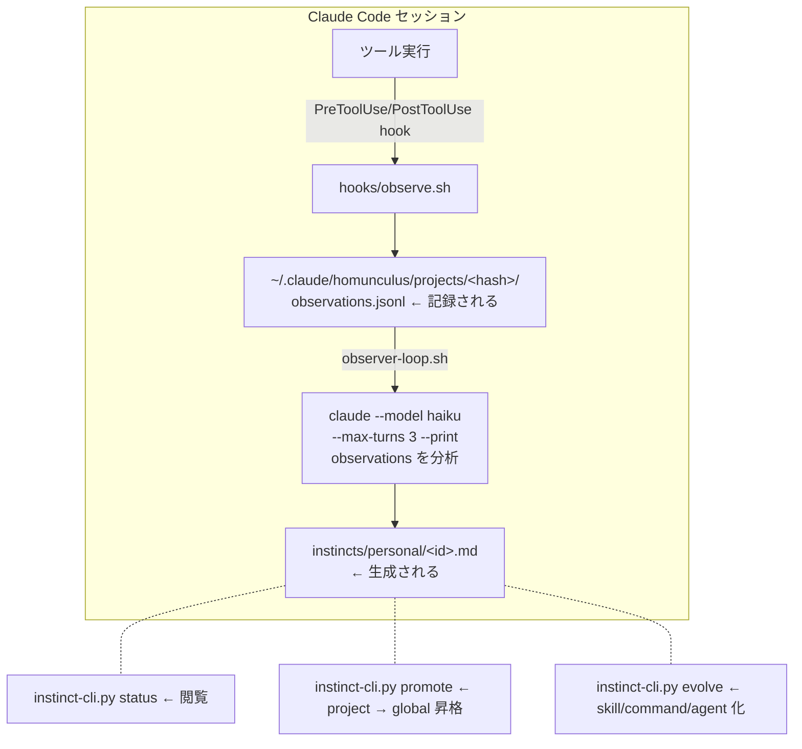

# Continuous Learning v2 調査レポート

**調査日:** 2026-03-20
**対象バージョン:** everything-claude-code 1.8.0
**対象スキル:** `skills/continuous-learning-v2/`

---

## 1. システム全体像

Continuous Learning v2 は、Claude Code セッション中のツール使用を観測し、パターンを検出して「instinct」として保存する学習システム。



### 2つの独立したフェーズ

| フェーズ | 担当 | 状態 |
|---------|------|------|
| **観測 (Observation)** | `hooks/observe.sh` | 動作中。hook として登録済み |
| **分析 (Analysis)** | `agents/observer-loop.sh` | デフォルト無効 (`enabled: false`) |

---

## 2. ディレクトリ構造

```
~/.claude/homunculus/
├── projects/
│   ├── <project-hash>/           # プロジェクトごとのデータ
│   │   ├── project.json          # メタ情報 (name, root, remote, dates)
│   │   ├── observations.jsonl    # ツール使用ログ (JSONL)
│   │   ├── instincts/
│   │   │   └── personal/         # 生成された instinct ファイル
│   │   ├── .observer.pid         # observer プロセス PID
│   │   ├── observer.log          # observer ログ
│   │   └── .observer-signal-counter
│   └── ...
├── instincts/
│   ├── personal/                 # グローバル instinct
│   └── inherited/                # 外部インポート instinct
├── evolved/                      # instinct から進化した skill/command/agent
└── observations.jsonl            # グローバル fallback
```

### project-hash の生成

`scripts/detect-project.sh` で git リモート URL またはディレクトリパスの SHA-1 ハッシュ先頭12文字から生成。

---

## 3. 観測データの詳細

### 3.1 observations.jsonl のフォーマット

```jsonl
{
  "timestamp": "2026-03-09T01:09:59Z",
  "event": "tool_start",          // or "tool_complete"
  "tool": "Bash",
  "session": "a6db1091-...",
  "project_id": "6e0ebef6d39f",
  "project_name": "novasell-magna",
  "input": "{\"command\": \"...\", \"description\": \"...\"}"  // tool_start のみ
  "output": "..."                                               // tool_complete のみ
}
```

- input/output は 5000 文字で切り詰め
- ファイルサイズが 10MB を超えると `observations.archive/` に自動アーカイブ

### 3.2 調査時点の観測データ統計

全41プロジェクトにデータが存在。主要なもの：

| 観測数 | プロジェクト名 | project-hash |
|-------:|--------------|-------------|
| 5,317 | tornado | a287ece49d02 |
| 3,696 | claude-code-enterprise-deployment | c134767a2ecc |
| 3,044 | claude-code-secret-solving | 8a45b3090855 |
| 1,643 | import-ziflow-comment | 999f45f4630e |
| 870 | novasell-magna | 6e0ebef6d39f |
| 818 | nebula-flow-dev-imprv | b155a07df308 |

全プロジェクト横断のツール使用頻度：

| 使用回数 | ツール |
|---------:|-------|
| 1,908 | Bash |
| 1,244 | Read |
| 377 | Edit |
| 301 | WebFetch |
| 266 | ToolSearch |
| 221 | Glob |
| 215 | WebSearch |
| 172 | Write |
| 168 | Grep |
| 135 | Agent |

### 3.3 novasell-magna の作業パターン（観測から抽出）

- **worktree ライフサイクル管理**: 作成 → 依存関係インストール → 作業 → 削除のサイクルが頻出
- **bun install sandbox 問題**: Claude Code のサンドボックス内で bun install が失敗する事象のデバッグ痕跡（2026-03-17）
- **macOS xattr による worktree 削除失敗**: `xattr -cr` で拡張属性除去後に `git worktree remove` するパターン（2026-03-18）
- **docker compose 起動**: nebula_flow_api 用の docker compose 起動試行

---

## 4. Observer の仕組み

### 4.1 起動フロー

```bash
# 手動起動
bash agents/start-observer.sh        # start (デフォルト)
bash agents/start-observer.sh stop   # 停止
bash agents/start-observer.sh status # 状態確認
```

### 4.2 分析ロジック (`observer-loop.sh`)

1. `OBSERVER_INTERVAL_SECONDS`（デフォルト300秒 = 5分）ごとにループ
2. observations.jsonl の行数が `MIN_OBSERVATIONS`（デフォルト20）以上なら分析開始
3. `claude --model haiku --max-turns 3 --print` を呼び出し
4. Haiku が observations を読み、3回以上出現するパターンを検出
5. `instincts/personal/<id>.md` に instinct ファイルを生成
6. 分析済み observations は `observations.archive/` に移動
7. SIGUSR1 シグナルで即座に分析をトリガー可能

### 4.3 Instinct ファイルフォーマット

```yaml
---
id: kebab-case-name
trigger: "when <specific condition>"
confidence: 0.5        # 0.3-0.85 (出現頻度に基づく)
domain: "workflow"      # code-style, testing, git, debugging, workflow, file-patterns
source: "session-observation"
scope: project          # or global
project_id: "6e0ebef6d39f"
project_name: "novasell-magna"
---

# Title

## Action
<何をすべきか>

## Evidence
- Observed N times in session <id>
- Pattern: <description>
- Last observed: <date>
```

### 4.4 Confidence スコアリング

| 観測回数 | 初期 confidence |
|---------:|---------------:|
| 1-2 | 0.3 (tentative) |
| 3-5 | 0.5 (moderate) |
| 6-10 | 0.7 (strong) |
| 11+ | 0.85 (very strong) |

時間経過による調整:
- 確認観測: +0.05
- 矛盾観測: -0.10
- 1週間未観測: -0.02 (decay)

### 4.5 Scope 判定ガイド

| パターン種別 | スコープ | 例 |
|-------------|---------|---|
| 言語/FW 規約 | project | "React hooks を使う" |
| ファイル構造 | project | "テストは `__tests__/` に" |
| セキュリティ | global | "ユーザー入力を検証" |
| ツールワークフロー | global | "Edit 前に Grep" |
| Git プラクティス | global | "conventional commits" |

---

## 5. Instinct の進化パス

```
observation → instinct → (promote) → global instinct
                       → (evolve)  → skill / command / agent
```

- **promote**: 2つ以上のプロジェクトで同じパターン + confidence >= 0.8 → グローバルに昇格
- **evolve**: 関連する instinct をクラスタリングして skill/command/agent に変換

CLI コマンド:
```bash
python3 instinct-cli.py promote   # project → global 昇格
python3 instinct-cli.py evolve    # instinct → skill/command/agent
python3 instinct-cli.py export    # エクスポート
python3 instinct-cli.py import    # インポート
python3 instinct-cli.py projects  # 全プロジェクト一覧
```

---

## 6. 既知の問題

### 6.1 config.json が plugin 更新で上書きされる

**問題:**
`config.json` は plugin キャッシュ内に配置されている：
```
~/.claude/plugins/cache/everything-claude-code/everything-claude-code/1.8.0/skills/continuous-learning-v2/config.json
```

plugin のバージョンが上がると（例: `1.8.0` → `1.9.0`）、新しい `config.json`（`enabled: false`）で上書きされ、observer が無効化される。

**原因:**
`start-observer.sh` で config パスがハードコード：
```bash
CONFIG_FILE="${SKILL_ROOT}/config.json"
```

**対策案:**

1. **homunculus ディレクトリに永続 config を配置**
   - `~/.claude/homunculus/config.json` を作成
   - `start-observer.sh` で homunculus 側を優先読み込み
   - ただしこの修正自体も plugin 更新で消える

2. **環境変数による上書き**
   - `.zshrc` に `export ECC_OBSERVER_ENABLED=true` を追加
   - `start-observer.sh` が env var を参照するよう修正
   - 同様に修正自体が消える問題あり

3. **上流への issue/PR** ← 推奨
   - config を `~/.claude/homunculus/config.json` から読むよう変更を提案

### 6.2 observer がデフォルト無効

instinct が0件だった根本原因。observations の収集（hook）は動作しているが、分析プロセス（observer）がデフォルト無効のため、observations が蓄積されるだけで instinct に変換されない。

### 6.3 `/learn-eval` は instinct ではなく skill を作成する

`/everything-claude-code:learn-eval` スキルは instinct システムとは独立しており、`~/.claude/skills/learned/` に skill ファイル（.md）を作成する。instinct を手動作成するコマンドは提供されていない。

| コマンド | 作成するもの | 保存先 |
|---------|-----------|-------|
| `/learn-eval` | skill | `~/.claude/skills/learned/` |
| observer (自動) | instinct | `~/.claude/homunculus/projects/<hash>/instincts/` |
| `instinct-cli.py import` | instinct | instincts ディレクトリ |

---

## 7. 対応履歴

| 日時 | アクション |
|------|---------|
| 2026-03-20 10:38 | `config.json` の `enabled` を `true` に変更 |
| 2026-03-20 10:38 | `start-observer.sh` で observer 起動 (PID: 94329) |
| | novasell-magna の 870 observations を対象に Haiku 分析が開始 |
