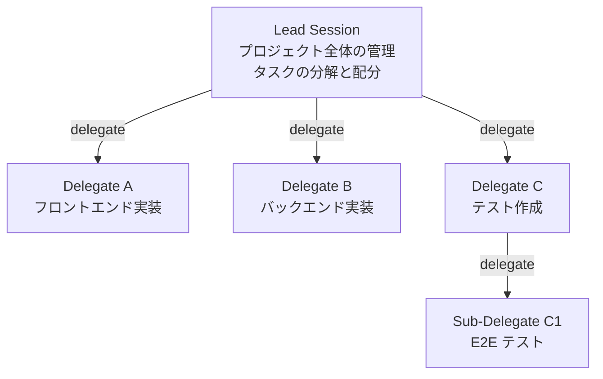
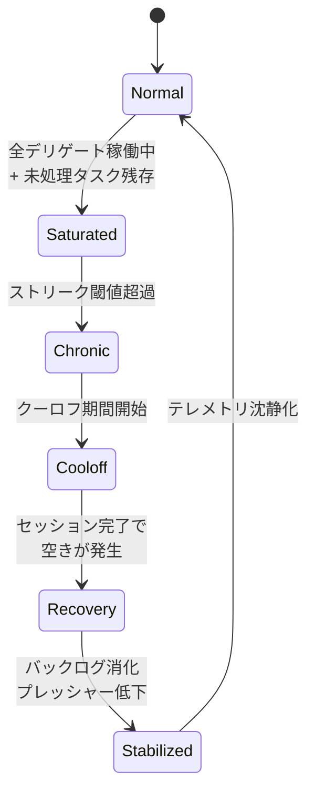

# ECC 2.0 セッションオーケストレーション: 詳細調査

**調査日:** 2026-04-11
**対象バージョン:** everything-claude-code v1.10.0 以降
**調査者:** Claude Opus 4.6
**関連ドキュメント:** [INVESTIGATION.md](./INVESTIGATION.md)

---

## 1. エグゼクティブサマリー

ECC 2.0 のセッションオーケストレーションは、リードセッションとデリゲートセッションのツリー構造を基盤とし、タスクの委譲、受信箱ルーティング、バックログリバランス、サチュレーション制御、自動ディスパッチの5つの機構で構成される。`session/manager.rs`（266,000 文字）がこの全体を実装しており、ECC 2.0 の中で最も複雑なモジュールである。

---

## 2. リード/デリゲートモデル

### 2.1 委譲の構造

ECC 2.0 のセッションは、フラットなリストではなくツリー構造を形成する。`ecc start` で作成されたセッションは**リードセッション**となり、`ecc delegate` でリードから派生するセッションが**デリゲートセッション**となる。



デリゲートセッションは `parent_session_id` でリードへの参照を持つ。リードは `selected_child_sessions` で直下のデリゲートのサマリー情報（`DelegatedChildSummary`: ID、状態、タスク、メトリクス）を保持する。

### 2.2 作成パターンの使い分け

セッションの作成には4つのパターンがある:

| コマンド | 用途 | 挙動 |
|---------|------|------|
| `ecc start --task "..."` | 独立タスクの開始 | 新規リードセッションを作成 |
| `ecc delegate <from> --task "..."` | 明示的な委譲 | 指定リードの子として作成 |
| `ecc assign <from> --task "..."` | スマートアサイン | 空きデリゲートがあれば再利用、なければ新規 |
| `ecc template <name>` | テンプレート実行 | 定義済みの複数ステップを順次作成 |

`assign` は `delegate` の上位互換であり、チーム内のキャパシティを考慮してルーティングする。空き（Completed または Idle）のデリゲートが見つかれば、新しいタスクをそのデリゲートに割り当てて再開する。見つからなければ新規デリゲートを作成する。

---

## 3. メッセージングと受信箱

### 3.1 メッセージ構造

セッション間のコミュニケーションは `comms/mod.rs` で定義されたメッセージプリミティブで行われる。

```rust
enum MessageType {
    TaskHandoff { task, context, priority },
    Query { question },
    Response { answer },
    Completed { summary, files_changed },
    Conflict { file, description },
}
```

**TaskHandoff** はリードからデリゲートへのタスク委譲メッセージで、タスク説明、コンテキスト、優先度（Low, Normal, High, Critical）を含む。**Query/Response** はセッション間の質問応答で、デリゲートがリードに確認を取る際に使われる。**Completed** はタスク完了の通知で、変更されたファイル一覧を含む。**Conflict** はファイルコンフリクトの通知。

### 3.2 受信箱の処理

各リードセッションは「受信箱」を持ち、自身宛ての未読メッセージが蓄積される。受信箱の処理は以下の3段階で行われる:

1. **手動ドレイン** (`ecc drain-inbox <session>`) — 指定リードの受信箱から最大 N 件の TaskHandoff を取り出し、assignment ポリシーに基づいてデリゲートにルーティング
2. **自動ディスパッチ** (`ecc auto-dispatch`) — 全リードの受信箱を一括スイープし、未読 TaskHandoff をルーティング
3. **Daemon 自動処理** — `daemon.rs` の巡回ループで `auto_dispatch_backlog()` が定期的に実行

---

## 4. バックログ管理

### 4.1 バックログプレッシャー

「バックログプレッシャー」は、チーム全体の未処理タスク量を定量化した指標である。以下の要素から算出される:

- **受信箱の未読数**: 各リードの未処理 TaskHandoff
- **Running デリゲート数**: 現在稼働中のデリゲート
- **Pending デリゲート数**: worktree 待ちで未開始のデリゲート

プレッシャーが「残余分類」（`classify_remaining_coordination_pressure()`）で healthy, needs_attention, saturated の3段階に分類される。

### 4.2 リバランス

バックログが偏った場合、`rebalance_delegate_backlog()` がデリゲートの再配分を行う。過負荷のデリゲート（多数の未読 TaskHandoff を抱えている）から、余裕のあるデリゲートへタスクを移動する。

リバランスは以下のアルゴリズムで行われる:

1. チーム内の全デリゲートの負荷（受信箱サイズ + 実行中タスク数）を算出
2. 平均負荷を計算
3. 平均を超えるデリゲートから、平均以下のデリゲートへ TaskHandoff を移動
4. 移動後の状態を報告

### 4.3 調整サイクル

`coordinate_backlog_cycle()` は、ディスパッチとリバランスの統合パスである。一度の調整で以下を順に実行する:

1. 未読 TaskHandoff のディスパッチ（`auto_dispatch_backlog`）
2. バックログプレッシャーの評価
3. 必要に応じてリバランス
4. 調整結果の報告

`--until-healthy` フラグ付きで実行すると、バックログが healthy 状態になるか最大パス数に達するまでサイクルを繰り返す。

---

## 5. サチュレーション制御

### 5.1 サチュレーションとは

サチュレーション（飽和）は、チームの処理能力がバックログに追いつかない状態を指す。具体的には、全デリゲートが Running 状態であり、かつ受信箱にタスクが残っている場合に検出される。

### 5.2 クロニックサチュレーション

一時的なサチュレーションは正常な運用の範囲だが、連続する巡回でサチュレーションが続く場合は「クロニックサチュレーション」として検出される。`track_chronic_saturation_streak()` がストリーク（連続回数）を追跡する。

### 5.3 段階的な対応

サチュレーション制御は以下の段階で対応する:



**Saturated**: `defer_handoffs_on_saturated_teams()` により、新規 TaskHandoff の配送が延期される。タスクは受信箱に留まり、空きが出るまで待機する。

**Chronic**: `prefer_rebalance_after_chronic_saturation()` により、ディスパッチよりもリバランスが優先される。過負荷のデリゲートからタスクを引き剥がし、チーム外への再配分を試みる。

**Cooloff**: `add_chronic_saturation_cooloff()` により、一定期間の冷却期間が設けられる。この間はアグレッシブなディスパッチを抑制し、完了待ちに時間を使う。

**Recovery**: セッション完了やリバランスにより空きが発生すると、`clear_cooloff_on_recovery()` でクールオフが解除され、`retry_deferred_dispatch_after_rebalance()` で延期されていた TaskHandoff が再ディスパッチされる。

**Stabilized**: `surface_stabilized_mode()` でチームが安定状態に入り、テレメトリの送信頻度が下がり（`quiet_stabilized_telemetry()`）、巡回間隔が緩和される（`relax_stabilized_cycles()`）。注目度も下がる（`calm_stabilized_attention()`）。

### 5.4 エスカレーション

クロニックサチュレーションが一定期間解消されない場合、`escalate_chronic_saturation()` がユーザーへの通知（デスクトップ通知 + ダッシュボードのアラート）をトリガーする。人間の介入（タスクの優先度変更、デリゲートの増設、タスクのキャンセル）が必要な状態として表示される。

---

## 6. オーケストレーションテンプレート

### 6.1 テンプレートの構造

`ecc2.toml` の `[orchestration_templates]` セクションで、複数ステップのワークフローを宣言的に定義できる:

```toml
[orchestration_templates.refactor_and_test]
description = "Refactor code and run tests"
steps = [
    { name = "analyze", task = "Analyze module structure", agent = "claude" },
    { name = "refactor", task = "Refactor based on analysis", profile = "default", worktree = true },
    { name = "test", task = "Run test suite and verify", agent = "claude", worktree = true },
]
```

各ステップは名前、タスク説明、エージェントタイプ/プロファイル、worktree 使用の有無を定義する。`ecc template refactor_and_test` で実行すると、ステップが順次デリゲートとして作成される。

### 6.2 変数のテンプレート化

`--var key=value` フラグでテンプレート変数を注入できる:

```bash
ecc template refactor_and_test --var module=auth --var target=src/auth/
```

タスク説明内の `{module}` や `{target}` が実際の値に置換される。

---

## 7. リモートディスパッチ

### 7.1 外部タスクの受け入れ

`ecc remote add --task "..."` で外部からタスクリクエストをキューに投入できる。リクエストには優先度、ターゲットセッション、エージェントタイプ、プロファイル、プロジェクトグルーピングを指定可能。

### 7.2 Computer Use ディスパッチ

`ecc remote computer-use --goal "..."` は、ブラウザ操作や GUI 操作を必要とするタスクの特殊なディスパッチ経路である。`target_url` と `context` を追加で指定でき、computer-use 対応のハーネスランナーにルーティングされる。

### 7.3 ディスパッチの処理

`ecc remote dispatch` または Daemon の自動処理により、キュー内のリクエストが順次処理される。処理状態は Pending → Dispatched → Failed の3状態で追跡される。指定されたセッションへのルーティング、新規セッションの作成、コンピュータユースハーネスへの転送のいずれかが選択される。

---

## 8. 定期タスクスケジューリング

### 8.1 Cron ベースのスケジュール

`ecc schedule add --cron "0 9 * * MON-FRI" --task "Daily code review"` で定期タスクを登録できる。cron 式は5, 6, 7フィールド形式に対応する。

`ScheduledTask` は cron 式、タスク説明、エージェントタイプ、プロファイル、worktree ポリシー、プロジェクトグルーピングを保持し、`run_due_schedules()` が次の実行時刻を評価してセッションを起動する。

### 8.2 Daemon との連携

Daemon の巡回ループ内で `maybe_run_due_schedules()` が呼ばれ、due（実行時刻に達した）スケジュールが自動的にディスパッチされる。これにより、ダッシュボードもCLI も起動していない状態でも定期タスクが実行される。

---

## 9. 設計上の制約と注意点

### 9.1 シングルプロセス制約

`session/manager.rs` は現在シングルスレッドで動作する。大量のセッション（100+）を同時に管理する場合、巡回ループの処理時間がヘルスチェックのインターバルを超える可能性がある。

### 9.2 ネットワーク分断耐性

Daemon がクラッシュした場合、実行中のランナープロセスは孤立する。PID ベースのヘルスチェックは Daemon の復帰後に検出するが、Daemon 不在中のタスク完了は記録されない。

### 9.3 テストの不足

`manager.rs` の 266,000 文字に対してユニットテストが限定的である。特にサチュレーション制御の状態遷移とリバランスアルゴリズムは、プロパティベーステストで検証すべき複雑さを持つ。
