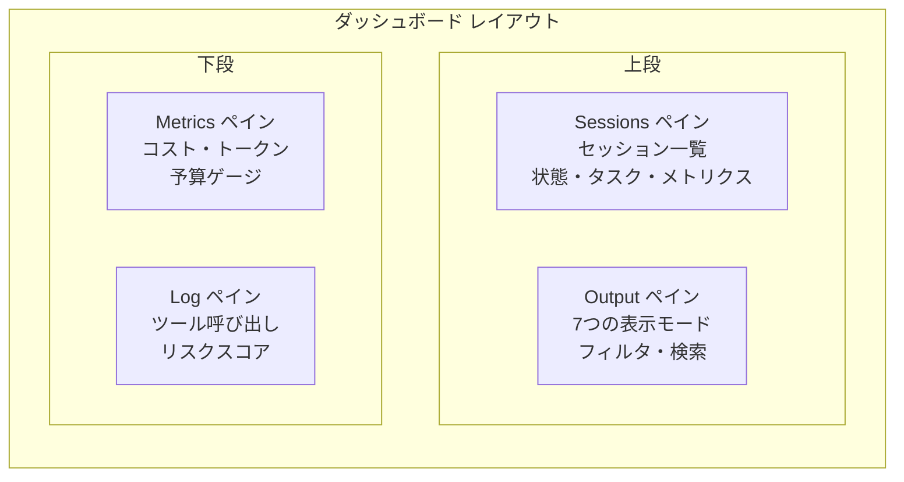

# ECC 2.0 TUI ダッシュボード: 詳細調査

**調査日:** 2026-04-11
**対象バージョン:** everything-claude-code v1.10.0 以降
**調査者:** Claude Opus 4.6
**関連ドキュメント:** [INVESTIGATION.md](./INVESTIGATION.md)

---

## 1. エグゼクティブサマリー

ECC 2.0 TUI ダッシュボードは、ratatui（Rust TUI フレームワーク）で構築されたマルチペインのインタラクティブダッシュボードである。`ecc dashboard` コマンドで起動し、セッション一覧、出力ストリーム、メトリクス、ツールログの4つの主要ペインを表示する。513,000 文字以上のコード（`dashboard.rs`）が示す通り、単なるステータス表示ではなく、セッションの作成・停止・再開・委譲、worktree のマージ・プルーニング、コンテキストグラフの閲覧、バックログの調整まで、ECC 2.0 の全操作をターミナルから行える。

---

## 2. ペイン構成

ダッシュボードは4つのペインで構成される。各ペインは独立してスクロール・フィルタ・折りたたみが可能。

### 2.1 Sessions ペイン

テーブル形式でアクティブセッションを表示する。列は ID（短縮表示）、状態（色分け）、タスク説明、コスト、トークン数、実行時間。`[` / `]` キーでセッション間を移動し、選択中のセッションが他のペインの表示内容を決定する。

ハーネス情報も表示され、Claude セッションか Codex セッションかが一目で分かる。

### 2.2 Output ペイン

7つの表示モードを持つ、ダッシュボードの最も複雑なペインである。

| モード | キー | 表示内容 |
|-------|------|---------|
| SessionOutput | デフォルト | セッションの raw 出力ストリーム |
| Timeline | `y` | 時系列イベントストリーム（時間フィルタ付き） |
| ContextGraph | `K` | エンティティ/関係の可視化（タイプフィルタ付き） |
| WorktreeDiff | `v` | staged/unstaged の diff パッチ |
| ConflictProtocol | 自動 | マージコンフリクト解決ガイド |
| GitStatus | `v` 2回 | ファイルステータステーブル |
| GitPatch | `v` 3回 | パッチハンクとナビゲーション |

#### 出力フィルタリング

Output ペインには4層のフィルタシステムがある:

- **コンテンツフィルタ**: Messages, Debug, Info, Warn, Error
- **時間フィルタ**: Last1h, Last6h, Today, All
- **エージェントフィルタ**: All agents / 特定エージェントのみ
- **検索**: 正規表現対応のインクリメンタルサーチ（`/` で開始、`n`/`N` で次/前の一致）

#### 検索スコープ

検索は2つのスコープで実行できる:

- **CurrentSession**: 選択中のセッションの出力のみ
- **AllSessions**: 全セッションの出力を横断検索

### 2.3 Metrics ペイン

`TokenMeter` カスタムウィジェットで予算消費率をゲージ表示する。`BudgetState` に基づくカラーリング:

| 状態 | 消費率 | 色 |
|------|--------|-----|
| Normal | 0-49% | 緑 |
| Alert50 | 50-74% | 黄 |
| Alert75 | 75-89% | オレンジ |
| Alert90 | 90-99% | 赤 |
| OverBudget | 100%+ | 点滅赤 |

トークン数と通貨（USD）の両方がフォーマットされて表示される。

### 2.4 Log ペイン

ツール呼び出しの履歴を時系列で表示する。各エントリにはツール名、入出力の要約、実行時間、リスクスコアが含まれる。リスクスコアはツールの種類（bash: 0.20, write: 0.15, edit: 0.10）とファイル感度、ブラストラジウス（Cargo.toml, package.json, .github などの影響範囲の広いファイル）、不可逆性（delete, replace パターン）から算出される。

---

## 3. キーバインド体系

ダッシュボードのキーバインドは3つのモードに分かれる。

### 3.1 ナビゲーションモード（デフォルト）

| キー | アクション |
|------|---------|
| `Tab` / `Shift+Tab` | ペイン間移動 |
| `[` / `]` | セッション選択の前後移動 |
| `j` / `k` / `↑` / `↓` | ペイン内スクロール |
| `?` | ヘルプ表示のトグル |
| `T` | テーマ切替（ライト/ダーク） |
| `l` | レイアウトサイクル |
| `q` | 終了 |

### 3.2 セッション操作モード

| キー | アクション |
|------|---------|
| `n` | 新規セッション作成 |
| `N` | 自然言語プロンプトによるセッション作成 |
| `a` | タスクの割り当て |
| `d` | セッション削除 |
| `s` | セッション停止 |
| `u` | セッション再開 |
| `m` | Worktree マージ |
| `M` | 全 Ready worktree のマージ |
| `x` | Worktree クリーンアップ |
| `X` | Worktree プルーニング |

### 3.3 オーケストレーションモード

| キー | アクション |
|------|---------|
| `g` | バックログディスパッチ |
| `G` | バックログ調整 |
| `b` | チームリバランス |
| `B` | 全チームリバランス |
| `i` | 受信箱ドレイン |
| `I` | 全受信箱ドレイン |

### 3.4 ビュー操作モード

| キー | アクション |
|------|---------|
| `/` | 検索開始 |
| `n` / `N` (検索中) | 次/前の一致 |
| `v` | 出力/diff ビュー切替 |
| `V` | diff ビューモード切替 |
| `y` | タイムラインモード切替 |
| `K` | コンテキストグラフモード切替 |
| `c` / `e` | Git ステージング/アンステージング |
| `f` | コンフリクトモード |
| `E` | フィルタ切替 |

### 3.5 ペインコマンドモード（Ctrl+W）

`Ctrl+W` に続けてキーを押すことで、ペインの直接フォーカスとサイズ調整を行う:

| キー | アクション |
|------|---------|
| `Ctrl+W` → `h`/`j`/`k`/`l` | ペインフォーカスの方向移動 |
| `Ctrl+W` → `+`/`-` | ペインサイズ増減 |
| `Ctrl+W` → `=` | ペインサイズ均等化 |

ペインサイズはレイアウトごとに永続化され（`persist_pane_sizes_by_layout()`）、ダッシュボードを再起動しても復元される。折りたたまれたペイン（`collapsed_panes`）も記憶される。

---

## 4. 承認キューサイドバー

ダッシュボードにはメインペインの横に**承認キューサイドバー**が表示される。これはエージェントが人間の承認を必要とするアクション（ファイル削除、外部 API 呼び出し、リスクの高いツール使用）を待機状態で表示する。

`approval_queue_preview` にキューされたメッセージが並び、`f2cfaee` コミットで実装された「ジャンプ」機能により、キュー内のアイテムをクリックすると対応するセッションに直接遷移する。

---

## 5. 完了ポップアップ

セッションが完了すると、非同期の完了サマリーがポップアップ表示される。サマリーには変更されたファイル一覧、消費トークン数、コスト、記録された設計判断が含まれる。複数の完了が同時に発生した場合はキューされ、順次表示・dismissal される。

---

## 6. デリゲートチームボード

リードセッションを選択した状態で `ecc team` に相当する表示に切り替えると、デリゲーションツリーが表示される。各デリゲートの状態（Running, Idle, Completed, Failed）、タスク、メトリクスが階層的に表示され、ブロッカーヒント（`delegate_blocker_hints`）とプログレスシグナル（`delegate_progress_signals`）が付記される。

リードボードからデリゲートへの直接ナビゲーション（`dc36a63`）が可能で、デリゲートの詳細を確認してからリードに戻る操作がスムーズに行える。

---

## 7. 自動分割とスポーン

`ecc start` でマルチエージェントをスポーンすると、ダッシュボードが自動的にペインを分割する（`669d9cc` auto-split after multi-agent spawn）。リードセッションの選択状態は維持されたまま（`92c9d1f`）、新しいデリゲートセッションがリストに追加される。

自然言語セッションスポーナー（`cc5fe12`）により、コマンドラインではなくダッシュボード内のプロンプトからタスクを記述してセッションを作成できる。

---

## 8. 制約と今後の課題

TUI ダッシュボードは機能的に充実しているが、以下の制約がある:

1. **ターミナルサイズ依存**: 小さなターミナルでは情報が省略される。`mcp__claude-in-chrome__resize_window` のような動的リサイズの仕組みはない。

2. **アクセシビリティ**: スクリーンリーダーとの互換性は考慮されていない。ratatui の制約による。

3. **ネットワーク越しの使用**: SSH 経由での使用は可能だが、遅延が大きい環境では描画が追いつかない可能性がある。

4. **テストの不在**: 513k 文字の `dashboard.rs` にユニットテストがない。UI テストの困難さはあるが、状態遷移ロジックの分離とテストは改善の余地がある。
