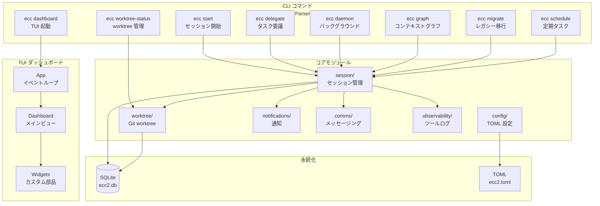
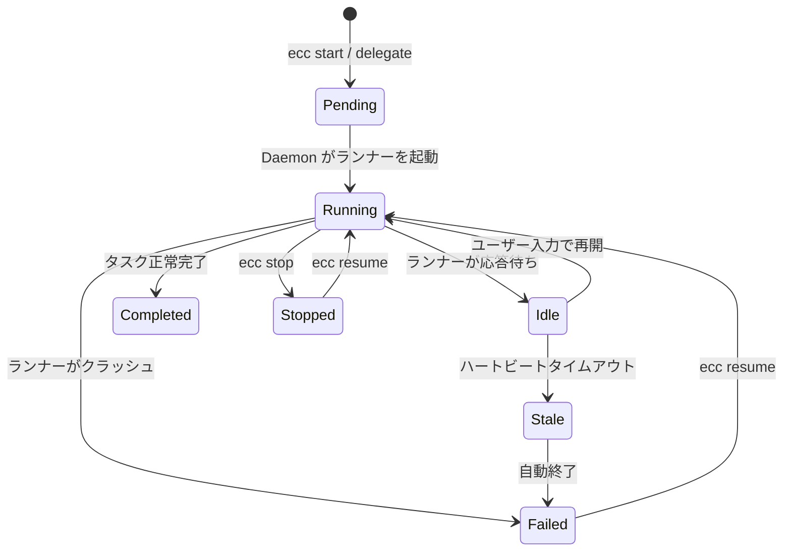

# ECC 2.0 制御プレーン Alpha 調査レポート

**調査日:** 2026-04-11
**対象バージョン:** everything-claude-code v1.10.0（v1.9.0..HEAD、627コミット）
**調査者:** Claude Opus 4.6
**対象領域:** ECC 2.0 Rust 制御プレーン — TUI ダッシュボード、セッション管理、エージェントオーケストレーション

---

## 1. ECC 2.0 とは何か

ECC（Everything Claude Code）は v1.8.0 で「AI エージェントハーネスのパフォーマンス最適化システム」と再定義され、v1.9.0 で選択的インストールと多言語対応を実現した。v1.10.0 の ECC 2.0 Alpha は、この延長線上にある質的転換である。JavaScript ベースのスクリプト群から**Rust で書かれたネイティブバイナリ**へと、制御プレーンの核を移行する試みだ。

この変更の動機は明確である。ECC v1.x の仕組みでは、複数のエージェントセッションを同時に管理し、それらの間でタスクを委譲し、worktree を割り当て、予算を追跡し、コンフリクトを検出するといった「オーケストレーション」が構造的に困難だった。各セッションは独立したプロセスであり、それらを統合する永続的な管理レイヤーが存在しなかったのである。

ECC 2.0 はこの問題に対して、SQLite 永続化層を持つ Rust バイナリ（`ecc-tui`）を中心とした制御プレーンを構築することで応える。`ecc2/` ディレクトリに約 50,000 行の Rust コードとして実装されている。

---

## 2. アーキテクチャ全体像



バイナリ全体は7つのモジュールで構成される。

| モジュール | ファイル | 行数 | 責務 |
|-----------|---------|------|------|
| `session/` | mod.rs, store.rs, manager.rs, daemon.rs, runtime.rs, output.rs | ~580k | セッションのライフサイクル全体 |
| `tui/` | app.rs, dashboard.rs, widgets.rs | ~530k | ターミナル UI の描画とイベント処理 |
| `config/` | mod.rs | ~58k | TOML 設定の読み込みとバリデーション |
| `worktree/` | mod.rs | ~84k | Git worktree の作成・マージ・コンフリクト |
| `notifications/` | notifications.rs | ~18k | デスクトップ通知、Webhook |
| `comms/` | mod.rs | ~5k | セッション間メッセージング |
| `observability/` | mod.rs | ~12k | ツール呼び出しのリスク評価 |

---

## 3. 技術スタックの選定

`ecc2/Cargo.toml` に定義された依存関係から、技術選定の意図が読み取れる。

**TUI**: `ratatui 0.30` + `crossterm 0.28` — Rust の TUI ライブラリとしてはデファクトスタンダードの組み合わせである。ratatui は宣言的な UI 記述を提供し、crossterm がターミナルの入出力を抽象化する。

**永続化**: `rusqlite 0.32`（bundled）— SQLite をプロセス内に埋め込む。bundled フィーチャーにより、システムに SQLite がインストールされていなくても動作する。セッション、worktree、コンテキストグラフ、メッセージ、予算追跡のすべてがこの単一データベースに格納される。

**Git 統合**: `git2 0.20` — libgit2 の Rust バインディングで、worktree の作成・マージ・ステータス確認をプログラマブルに行う。シェルコマンドの `git` を介さず、直接 Git オブジェクトを操作できる。

**設定**: `toml 0.8` + `serde 1` — `ecc2.toml` ファイルで宣言的にハーネスランナー、エージェントプロファイル、オーケストレーションテンプレート、メモリコネクタを定義する。

**CLI**: `clap 4`（derive マクロ） — サブコマンドの定義が型安全に行える。`ecc start`, `ecc delegate`, `ecc dashboard` などのコマンド体系は clap の enum で宣言されている。

**スケジューリング**: `cron 0.12` — 定期タスクディスパッチ用の cron 式パーサー。

**ビルド最適化**: release プロファイルで LTO（Link-Time Optimization）、codegen-units=1、strip を有効にしており、バイナリサイズと実行速度の最適化が図られている。

---

## 4. CLI コマンド体系

`ecc-tui` が提供するコマンドは、機能カテゴリ別に以下のように整理できる。

### 4.1 セッション操作

| コマンド | 目的 |
|---------|------|
| `ecc start --task "..." [--agent claude] [-w]` | 新規セッション開始。`-w` で worktree 自動作成 |
| `ecc delegate <from_session> --task "..."` | 既存セッションからの委譲 |
| `ecc assign <from_session> --task "..."` | 空きデリゲートがあれば再利用、なければ新規 |
| `ecc template <name> [--task "..."]` | 定義済みオーケストレーションテンプレートの実行 |
| `ecc stop <session_id>` | セッション停止 |
| `ecc resume <session_id>` | 停止/失敗セッションの再開 |
| `ecc sessions` | アクティブセッション一覧 |
| `ecc status [session_id]` | セッション詳細表示 |
| `ecc team [session_id]` | デリゲーションツリーの表示 |

### 4.2 オーケストレーション

| コマンド | 目的 |
|---------|------|
| `ecc drain-inbox <session_id>` | リードセッションの受信箱からタスクをルーティング |
| `ecc auto-dispatch` | 全リードの受信箱を一括スイープ |
| `ecc coordinate-backlog` | ディスパッチ + リバランスの統合パス |
| `ecc maintain-coordination` | プレッシャー検出時のみ coordination を実行 |
| `ecc rebalance-team <session_id>` | 単一チームのバックログ再配分 |
| `ecc rebalance-all` | 全チームのバックログ再配分 |
| `ecc coordination-status [--json] [--check]` | グローバルなオーケストレーション状態 |

### 4.3 Worktree 管理

| コマンド | 目的 |
|---------|------|
| `ecc worktree-status [session_id] [--all] [--patch]` | ステータスと diff プレビュー |
| `ecc worktree-resolution [session_id] [--all]` | コンフリクト解決プロトコル表示 |
| `ecc merge-worktree [session_id] [--all]` | ブランチをベースにマージ |
| `ecc merge-queue [--apply]` | マージ待ち行列の表示と処理 |
| `ecc prune-worktrees` | 不要 worktree の削除 |

### 4.4 コンテキストグラフ・メッセージング

| コマンド | 目的 |
|---------|------|
| `ecc graph add-entity / add-relation / add-observation` | グラフノード・辺の追加 |
| `ecc graph show / recall / compact` | グラフの表示・検索・圧縮 |
| `ecc graph sync-connectors` | 外部メモリコネクタの同期 |
| `ecc messages send --from A --to B` | セッション間メッセージ送信 |
| `ecc messages inbox <session_id>` | 受信メッセージ確認 |

### 4.5 運用・監視

| コマンド | 目的 |
|---------|------|
| `ecc dashboard` | TUI ダッシュボード起動 |
| `ecc daemon` | バックグラウンドデーモン起動 |
| `ecc log-decision` | 判断ログの記録 |
| `ecc decisions` | 判断ログの参照 |
| `ecc schedule add / list / remove / run-due` | 定期タスク管理 |
| `ecc remote add / computer-use / list / dispatch` | 外部タスクの受け入れ |
| `ecc export-otel` | OTLP 互換のテレメトリエクスポート |

---

## 5. セッションライフサイクル

ECC 2.0 のセッションは、作成から終了まで明確な状態遷移を持つ。



`Session` 構造体は以下の情報を保持する:

- **識別子**: UUID v4 セッション ID
- **タスク記述**: 自然言語のタスク説明
- **状態**: `SessionState` enum（上図の7状態）
- **ランナーPID**: 実行中プロセスの追跡
- **worktree 情報**: パス、ブランチ名、ベースブランチ
- **メトリクス**: コスト（USD）、トークン消費量、実行時間
- **ハーネス情報**: プライマリハーネス種別、検出されたハーネス一覧
- **グルーピング**: プロジェクト名、タスクグループ
- **親子関係**: `parent_session_id` によるデリゲーションチェーン

詳細なセッションオーケストレーションの仕組みは [DEEP-DIVE-SESSION-ORCHESTRATION.md](./DEEP-DIVE-SESSION-ORCHESTRATION.md) で解説する。

---

## 6. Daemon イベントループ

`ecc daemon` は、ユーザーがダッシュボードを開いていない間もシステムを維持するバックグラウンドプロセスである。設定された `heartbeat_interval`（デフォルト 10 秒）ごとに以下の処理を巡回する:

1. **ヘルスチェック** — 全 Running セッションのハートビートを確認し、応答のないセッションを Stale → Failed に遷移
2. **スケジュール実行** — cron 式にマッチする定期タスクをディスパッチ
3. **リモートディスパッチ** — 外部から投入されたタスクリクエストを処理
4. **バックログ調整** — `coordinate_backlog_cycle()` でディスパッチとリバランスの統合パスを実行
5. **Worktree 自動マージ** — ポリシーに基づき、Ready 状態の worktree を自動マージ
6. **Worktree 自動プルーニング** — 非アクティブ worktree の削除
7. **Pending セッションの活性化** — worktree の非同期セットアップ待ちセッションを起動

この巡回により、デリゲートされたタスクの自動ルーティング、飽和状態のリバランス、worktree のライフサイクル管理がユーザーの介入なしに進行する。

---

## 7. Worktree 統合

各セッションにはオプションで Git worktree を割り当てられる。worktree は `git worktree add -b <branch> <path> HEAD` で作成され、セッションごとに独立したファイルシステム空間を提供する。

### 7.1 ブランチ命名規則

```
{prefix}-{session_id}-{sha256[:8]}
```

`prefix` は `ecc2.toml` の `worktree_branch_prefix`（デフォルト: `ecc`）で設定される。SHA-256 ハッシュの先頭8文字がセッション ID の短縮形として使われ、人間が読める程度に一意性を保つ。

### 7.2 マージ判定

worktree のマージ準備状態は3段階で評価される:

1. **Fast-Forward 可能** — ベースブランチからの差分がクリーンに適用できる
2. **Rebase 必要** — ベースブランチが先に進んでいるが、コンフリクトなしでリベースできる
3. **コンフリクト** — 手動解決が必要

Daemon の自動マージポリシーが有効な場合、1と2の状態にある worktree は自動的にマージされる。3の場合は `ecc worktree-resolution` でコンフリクト解決プロトコルが提示される。

### 7.3 ファイル活動の重複検出

複数セッションが同時に同じファイルを変更する状況を検出する仕組みがある。`FileActivityOverlap` は、現在のセッションの操作と他セッションの操作を比較し、コンフリクトの可能性を事前に警告する。

---

## 8. テスト状況

ECC 2.0 Alpha は**テストが限定的**である。Rust の `#[test]` アノテーションによるユニットテストはモジュール内に存在するが、以下の点に注意が必要:

- 統合テスト（SQLite + worktree の結合テスト）は確認されていない
- TUI のレンダリングテストは存在しない（ratatui のテスト困難性による）
- CLI コマンドの E2E テストは未実装

CHANGELOG が明示的に述べているように、「alpha は実験用途であり GA として扱うべきではない」。テストカバレッジの不足はこの評価と整合する。

---

## 9. 調査所見のまとめ

### 実装状態の総括

| 機能領域 | 実装状態 | ファイル数 | 備考 |
|---------|---------|-----------|------|
| CLI コマンド体系 | 完成 | 1 | clap derive による型安全な定義 |
| セッション管理 | 完成 | 6 | SQLite 永続化、状態遷移、メトリクス |
| TUI ダッシュボード | 完成 | 3 | 複数ペイン、フィルタ、テーマ切替 |
| Worktree 管理 | 完成 | 1 | 作成、マージ、コンフリクト検出 |
| コンテキストグラフ | 完成 | 統合 | エンティティ、関係、観察、圧縮 |
| デリゲーション | 完成 | 統合 | リード/デリゲート、受信箱、リバランス |
| Daemon | 完成 | 1 | 7ステップの巡回ループ |
| テスト | 不十分 | - | 統合テスト・E2E テスト未実装 |

### 注目すべき設計判断

1. **SQLite 埋め込み**: 外部データベースサーバーを不要にし、ゼロ設定で動作する。ファイルロックにより複数プロセスからの安全なアクセスを保証する。
2. **ハーネスランナー抽象化**: Claude, Codex, Gemini, OpenCode を同じインターフェースで扱えるよう、コマンドライン引数のテンプレート化で対応。新しいハーネスの追加は `ecc2.toml` への設定追加のみで可能。
3. **Worktree ベースの分離**: セッションごとに独立したブランチを作成することで、複数エージェントの並行作業を安全に実現。
4. **Daemon による自律運用**: ユーザーが明示的に操作しなくても、バックログの調整、worktree のマージ、スケジュールタスクの実行が自動で進行する。

### 未完成の領域

CHANGELOG が正直に述べているとおり、ECC 2.0 Alpha は「ローカル実験用途に使える」段階であり、以下が未完成:

- プロダクション品質のエラーハンドリング（パニック時のリカバリ）
- 包括的なテストスイート
- パフォーマンスベンチマーク
- ドキュメント（ユーザーガイド、API リファレンス）
- プラグインとの統合テスト

関連ドキュメント:
- [DEEP-DIVE-TUI-DASHBOARD.md](./DEEP-DIVE-TUI-DASHBOARD.md) — TUI の操作体系とビューモード
- [DEEP-DIVE-SESSION-ORCHESTRATION.md](./DEEP-DIVE-SESSION-ORCHESTRATION.md) — デリゲーション、バックログ管理、サチュレーション制御
