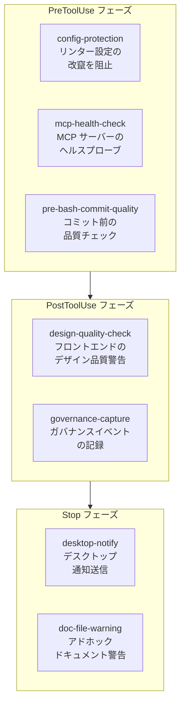

# インフラ基盤と信頼性向上 調査レポート

**調査日:** 2026-04-11
**対象バージョン:** everything-claude-code v1.10.0（v1.9.0..HEAD、627コミット）
**調査者:** Claude Opus 4.6
**対象領域:** Hook の進化、セッション管理強化、CI/CD 改善、Windows 互換性、エージェント圧縮

---

## 1. v1.10.0 で何が変わったのか

v1.10.0 のインフラ変更は、ECC を「設定集」から「オペレーティングシステム」へと進化させるための基盤強化である。新しい Hook が 7 つ追加され、セッション管理がデュアルディレクトリ対応に拡張され、CI パイプラインが GitHub Actions の最新版に更新された。これらの変更は、ユーザーが直接目にする機能ではないが、ECC の信頼性と可搬性を大幅に向上させている。

主要な変更を3つの軸で整理する:

1. **Hook 実行基盤の成熟**: 7 つの新 Hook と、in-process 実行による50-100ms の高速化
2. **セッション管理の強化**: デュアルディレクトリ、コスト追跡、ツール使用メトリクス
3. **プラットフォーム信頼性**: Windows 互換性の改善、CI Actions の更新、Unicode 安全チェック

---

## 2. Hook の進化

### 2.1 新規 Hook 一覧

v1.10.0 で追加された 7 つの Hook は、それぞれ異なるフェーズ（PreToolUse, PostToolUse, Stop）にバインドされ、異なる問題を解決する。

### 2.2 config-protection（設定保護 Hook）

**ファイル**: `scripts/hooks/config-protection.js`

エージェントがリンターのチェックを「通す」ために設定ファイル自体を変更してしまう問題に対処する Hook である。PreToolUse フェーズで Write/Edit ツールの対象パスを検査し、保護対象のファイル名パターンにマッチする場合はツール実行をブロック（exit code 2）する。

保護対象:
- ESLint: `.eslintrc.*`, `eslint.config.*`
- Prettier: `.prettierrc.*`, `prettier.config.*`
- Biome: `biome.json*`
- Ruff: `ruff.toml`
- ShellCheck: `.shellcheckrc`
- Stylelint: `.stylelintrc.*`
- Markdownlint: `.markdownlint*`

この Hook は `run-with-flags.js` ラッパーの in-process 実行に対応しており、別プロセスを spawn せずに ~50ms 以内で判定を完了する。

### 2.3 desktop-notify（デスクトップ通知 Hook）

**ファイル**: `scripts/hooks/desktop-notify.js`

Stop フェーズで発火し、Claude の応答完了をネイティブデスクトップ通知で知らせる。macOS では `osascript` を使い、WSL では PowerShell 7 または Windows PowerShell の BurntToast モジュールを使う。

PR #1019 で WSL 対応が追加された。WSL から Windows 側の PowerShell を呼び出すため、`powershell.exe` のパスをプラットフォーム検出で切り替える仕組みが実装されている。

### 2.4 mcp-health-check（MCP ヘルスチェック Hook）

**ファイル**: `scripts/hooks/mcp-health-check.js`

MCP ツール実行の前後でサーバーのヘルスを検査する Hook である。PreToolUse フェーズで HTTP プリフライトプローブを送信し、到達不能な場合はツール実行をスキップさせる。PostToolUseFailure では再接続を試みる。

状態は `~/.claude/mcp-health-cache.json` に永続化される。TTL（デフォルト 2 分）、タイムアウト（デフォルト 5 秒）、バックオフ（30 秒〜10 分の指数バックオフ）が設定可能。OAuth で保護された MCP サーバーの 401/403 応答は「到達可能」として扱い、認証の問題と接続の問題を区別する。

### 2.5 pre-bash-commit-quality（コミット前品質チェック Hook）

**ファイル**: `scripts/hooks/pre-bash-commit-quality.js`

Git コミット前に品質チェックを実行する Hook。ステージされたファイルを検出し、リンターの実行、`console.log` / `TODO` / `FIXME` の検出、ハードコードされたシークレットのスキャン、コミットメッセージフォーマット（Conventional Commits）の検証を行う。ブロック判定（exit code 2）によりコミットを阻止できる。

### 2.6 design-quality-check（デザイン品質チェック Hook）

**ファイル**: `scripts/hooks/design-quality-check.js`

フロントエンドファイルの編集後に発火し、ジェネリックな UI パターンを検出して警告する。検出対象には「Get Started」のような缶詰コピー、ストックグラデーション、デフォルトフォントが含まれる。チェックリスト形式でビジュアルヒエラルキー、意図的なスペーシング、深度/レイヤリング、ホバー/フォーカス状態、カラー/タイポグラフィの具体性を評価する。

### 2.7 governance-capture（ガバナンスキャプチャ Hook）

**ファイル**: `scripts/hooks/governance-capture.js`

`ECC_GOVERNANCE_CAPTURE=1` 環境変数で有効化される。シークレット検出（AWS キー、API キー、秘密鍵、JWT、GitHub トークン）、ポリシー違反、承認が必要なコマンド、権限昇格の使用をイベントとして記録する。出力は JSON-Line フォーマットで stderr に書き出され、`governance_events` テーブルに永続化される。

### 2.8 doc-file-warning（ドキュメントファイル警告 Hook）

**ファイル**: `scripts/hooks/doc-file-warning.js`

NOTES, TODO, SCRATCH などのアドホックなドキュメントファイル名を検出して警告する。ただし、`docs/`, `.claude/`, `.github/`, `commands/`, `skills/`, `benchmarks/`, `templates/`, `.history/`, `memory/` 内のファイルは除外される。マークダウンを多用するリポジトリでの誤検出を防ぐため、デニリスト（拒否リスト）アプローチを採用している。

### 2.9 Hook 実行フレームワークの改善

`run-with-flags.js` ラッパーに**in-process 実行**機能が追加された。従来は Hook ごとに `spawnSync` で別プロセスを起動していたが、Hook モジュールが `module.exports.run()` を公開している場合、ラッパーが直接関数を呼び出す。これにより Hook 実行のオーバーヘッドが 50-100ms 削減された。

シェルバリアント（`run-with-flags-shell.sh`）にも改善が入り、Hook ID から実行フェーズ（"pre:observe" → "pre"）を抽出するロジックが追加された。

---

## 3. セッション管理の強化

### 3.1 デュアルディレクトリ対応

ECC 独自のセッションサマリーファイル（日付付き `.tmp` 形式の Markdown）の保存先が `~/.claude/sessions/`（旧 ECC バージョン）から `~/.claude/session-data/`（新規）に移行した。これは Claude Code 本体のセッション機能とは無関係で、ECC の Hook が記録するセッション要約やメタデータの格納先の変更である。後方互換性のため、`getSessionSearchDirs()` が両ディレクトリを検索する。セッション ID の正規化とマッチングロジックが改善され、異なるディレクトリに同一セッションの重複がある場合も正しく処理される。

### 3.2 セッション活動トラッカー

**ファイル**: `scripts/hooks/session-activity-tracker.js`（612行）
**フェーズ**: PostToolUse

エージェントがツールを使うたびに、その活動を `~/.claude/metrics/tool-usage.jsonl` に1行の JSON として記録する Hook である。記録されたデータは ECC 2.0 のメトリクス同期パイプラインが消費し、TUI ダッシュボードの Log ペインやセッションメトリクスに反映される。

#### 記録される情報

各レコードには以下のフィールドが含まれる:

| フィールド | 内容 | 例 |
|-----------|------|-----|
| `id` | ユニーク ID（タイムスタンプ + ランダム hex） | `tool-1712345678-a1b2c3d4e5f6` |
| `timestamp` | ISO 8601 タイムスタンプ | `2026-04-11T10:30:00.000Z` |
| `session_id` | `ECC_SESSION_ID` または `CLAUDE_SESSION_ID` | `abc-123` |
| `tool_name` | 使用されたツール名 | `Edit`, `Bash`, `Write` |
| `input_summary` | 入力の要約（最大220文字） | `Edit src/auth/validate.ts` |
| `input_params_json` | サニタイズ済みの入力パラメータ JSON | `{"file_path":"src/auth/..."}` |
| `output_summary` | 出力の要約（最大220文字） | `File updated successfully` |
| `file_paths` | 操作対象のファイルパス一覧 | `["src/auth/validate.ts"]` |
| `file_events` | ファイル操作イベント（アクション + diff プレビュー） | 後述 |

#### シークレットのリダクション

入力・出力に含まれるシークレットは記録前に自動的に `<REDACTED>` に置換される。検出パターンは以下:

- **AWS アクセスキー**: `AKIA...`（16文字）、`ASIA...`（16文字）
- **GitHub トークン**: `ghp_...`, `gho_...`, `ghs_...`, `github_pat_...`
- **認証ヘッダー**: `Authorization: ...`
- **パスワード**: `password=...`
- **CLI トークン**: `--token=...`

#### ファイル活動イベント

ツール入力から `file_path`, `source_path`, `old_file_path` などのキーを再帰的に探索し、ファイル操作イベント（`file_events`）を構築する。各イベントには:

- **path**: 操作対象のファイルパス
- **action**: `read`, `create`, `modify`, `delete`, `move`, `touch` のいずれか（ツール名から推定）
- **diff_preview**: `old_string -> new_string` 形式の変更要約（Edit ツールの場合）
- **patch_preview**: unified diff 形式のパッチプレビュー（`@@` ヘッダー + `+`/`-` 行）

Write ツールの場合は、Git の作業ツリーから `git diff` を取得して実際の変更内容をパッチプレビューに反映する。既存ファイルへの Write は `create` ではなく `modify` に再分類される。

#### サニタイズの深度制限

入力パラメータの JSON は深度4、配列要素数8、オブジェクトキー数20に制限される。これにより、大きなファイル内容がツール入力に含まれていても、メトリクスファイルの膨張を防ぐ。閾値を超えた部分は `[Truncated]` に置換される。

#### 非ブロッキング設計

Hook 内のすべてのエラーは catch で握りつぶされ、ツール実行をブロックしない。`run()` 関数は `module.exports` で公開されており、`run-with-flags.js` の in-process 実行に対応する。

### 3.3 コストトラッカー

**ファイル**: `scripts/hooks/cost-tracker.js`

セッション使用量のメトリクスを `~/.claude/metrics/costs.jsonl` に記録する。タイムスタンプ、セッション ID、モデル名、入出力トークン数、推定コスト（USD）を含む。価格は Haiku, Sonnet, Opus のブレンデッドレートで概算される。

### 3.4 Observer セッション管理

**ファイル**: `scripts/lib/observer-sessions.js`

Observer 固有のセッション状態とプロジェクトコンテキストを管理する新モジュール。プロジェクトレジストリ（`~/.claude/homunculus/projects.json`）で cwd → プロジェクトルート → プロジェクト ID のマッピングを管理し、セッションリースファイル（`.observer-sessions/<sessionId>.json`）でセッションの開始と終了を追跡する。

### 3.5 Observer の堅牢化

複数のコミットで Observer の信頼性が改善された:

- Windows 環境での一時ファイル処理と Haiku プロンプト初期化の修正
- POSIX フォールバックによる lazy-start サポートの追加
- ライフサイクル終了時の Observer セッションクリーンアップ
- ターンバジェットの引き上げ（長時間インタラクション対応）
- cross-project contamination の防止（PR #1054: cwd/project フィルタリング）

---

## 4. CI/CD 改善

### 4.1 GitHub Actions バージョン更新

| Action | 旧バージョン | 新バージョン |
|--------|-------------|-------------|
| actions/checkout | v4 | v6.0.2 |
| actions/setup-node | v4 | v6.3.0 |
| actions/cache | v4 | v5.0.4 |
| actions/upload-artifact | v4 | v7.0.0 |
| actions/stale | v9 | v10.2.0 |
| actions/github-script | v7 | v8.0.0 |

すべての Action がコミット SHA にピン留めされるよう変更された（PR #1007）。これによりサプライチェーン攻撃のリスクが軽減される。

### 4.2 新規 CI チェック

**マニフェストバリデーション**（`scripts/ci/validate-install-manifests.js`）: 選択的インストールの JSON マニフェスト（modules, profiles, components）を JSON スキーマに対してバリデーションする。プロファイルが存在するモジュールを参照していること、コンポーネントのファミリープレフィックス（baseline:, lang:, framework:, capability:）が正しいことを検証する。

**Unicode 安全チェック**（`scripts/ci/check-unicode-safety.js`）: コードベース内の絵文字や安全でない Unicode 文字を検出する。書き込みモードではターゲット絵文字を置換できる（⚠ → WARNING:, ✓ → PASS: など）。`node_modules`, `.git`, `.next`, `coverage` は無視される。

**Yarn Berry 対応**: Corepack ベースの Yarn Berry（v4+）セットアップに移行し、非推奨の `--ignore-engines` フラグが削除された。

### 4.3 月次メトリクスワークフロー

Issue 更新ロジックの正規表現エスケープが修正され、既存の月次行を**更新**できるようになった（従来はスキップされていた）。テーブルヘッダーが欠落している場合のフォールバックも追加された。

---

## 5. エージェント圧縮とインスペクション

### 5.1 エージェント圧縮

**コミット**: `0b0b66c`

多数のエージェント定義をコンテキストに載せる際のトークン効率を改善する仕組みが追加された。完全なエージェント説明は最大 26,000 トークンに達することがあるが、圧縮により catalog モードでは 2,000-3,000 トークンに削減される。

3つのモードがある:
- **catalog**: 名前、1行説明、キーワードのみ。一覧表示用
- **summary**: catalog + 主要な能力の要約。選択判断用
- **full**: 完全な説明とシステムプロンプト。実際の実行用

これにより、38エージェントの一覧を表示する際のトークン消費が大幅に削減される。

### 5.2 インスペクションモジュール

スキル実行の失敗パターンを検出する仕組みが追加された。`skill_runs` テーブルから失敗イベントをスキル名 + 正規化された失敗理由でグルーピングし、閾値（デフォルト 3 回）を超えた場合に構造化レポートと改善提案を生成する。

---

## 6. Windows 互換性

v1.10.0 では Windows 環境の複数の問題が修正された:

| 修正内容 | コミット/PR | 影響 |
|---------|-----------|------|
| Observer の一時ファイル処理 | PR #972 | Windows の temp パスの正規化 |
| `os.homedir()` フォールバック | PR #977 | HOME 未設定環境への対応 |
| Bash メタデータパスの正規化 | `162236f` | バックスラッシュ → スラッシュ変換 |
| MINGW64 パス変換の二重適用 | PR #1015 | Git Bash 環境でのパス破損防止 |
| バリデータの shebang 処理 | `cbccb7f` | CRLF チェックアウト環境でのスクリプト実行 |
| Yarn Berry（v4+）対応 | PR #976 | `--ignore-engines` の削除 |
| スクリプト実行権限 | PR #947 | `.sh` ファイルの execute bit 設定 |

---

## 7. その他の注目すべき変更

### 7.1 OpenTelemetry エクスポート

ECC 2.0 の Rust バイナリに `ecc export-otel` コマンドが追加された。セッション、ツールスパン、メトリクスを OTLP 互換の JSON として出力する。セッションスパンをルートトレースとし、ツール呼び出しを子スパンとして構造化する。外部のトレーシングパイプライン（Jaeger, Grafana Tempo 等）への統合を可能にする。

### 7.2 バッチフォーマット/タイプチェック

`stop-format-typecheck.js` が PostToolUse の per-edit 実行から Stop フェーズでのバッチ実行に移行した（PR #746）。編集されたファイルをプロジェクトルートごとにグループ化し、フォーマッターは root あたり1回、`tsc --noEmit` は tsconfig ディレクトリあたり1回の呼び出しに削減される。バッチサイズに比例したタイムアウト（合計 270 秒バジェット）が設定されている。

### 7.3 セッション開始時の Instinct 注入

`session-start.js` がアクティブな instinct（学習済みパターン）をセッション開始コンテキストに自動注入するようになった。これにより、過去のセッションで獲得した知見が新しいセッションに自動的に引き継がれる。

---

## 8. 調査所見のまとめ

### 実装状態の総括

| 機能領域 | 追加/変更数 | 実装状態 | 備考 |
|---------|-----------|---------|------|
| 新規 Hook | 7 | 完成 | config-protection, desktop-notify, mcp-health-check, pre-commit-quality, design-quality, governance-capture, doc-file-warning |
| Hook フレームワーク | 改善 | 完成 | in-process 実行で 50-100ms 高速化 |
| セッション管理 | 4 新機能 | 完成 | デュアルディレクトリ、コスト追跡、活動追跡、Observer 管理 |
| CI/CD | Actions 更新 + 3 新チェック | 完成 | SHA ピン留め、マニフェスト検証、Unicode チェック |
| エージェント圧縮 | 新規 | 完成 | 26k → 3k トークンの削減 |
| Windows 互換性 | 7 修正 | 完成 | 一時ファイル、パス、権限、shebang |

### 注目すべき設計判断

1. **in-process Hook 実行**: `run-with-flags.js` ラッパーが Hook モジュールの `run()` 関数を直接呼び出す設計は、PreToolUse Hook の応答時間を 200ms 未満に抑えるために不可欠である。ツール実行のたびに呼ばれるため、1ms の差が体感に影響する。

2. **MCP ヘルスのステートフル管理**: `mcp-health-check.js` がファイルベースのヘルスキャッシュを使う設計は、会話コンテキストに依存しないため、セッションをまたいだ MCP サーバーの状態追跡が可能になる。指数バックオフにより、一時的な障害と永続的な障害を区別する。

3. **ガバナンスのオプトイン設計**: `governance-capture.js` が環境変数 `ECC_GOVERNANCE_CAPTURE=1` でのみ有効化される設計は、すべてのユーザーにガバナンスコストを強制しないための判断である。エンタープライズ環境で必要な場合にのみ有効化される。

4. **Actions の SHA ピン留め**: タグベースの参照からコミット SHA への移行は、GitHub Actions のサプライチェーン攻撃（タグの差し替えによる悪意のあるコード注入）に対する防御として有効である。
