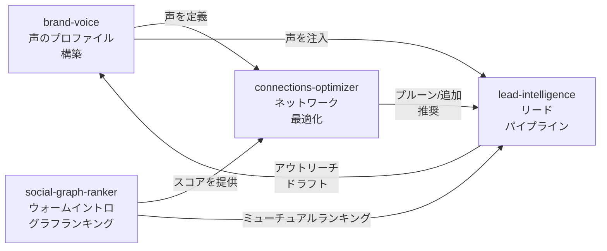

# Operator ワークフロー拡張 調査レポート

**調査日:** 2026-04-11
**対象バージョン:** everything-claude-code v1.10.0（v1.9.0..HEAD）
**調査者:** Claude Opus 4.6
**対象領域:** v1.10.0 で追加された Operator ワークフロースキルとメディア生成レーン

---

## 1. なぜ Operator ワークフローが必要だったのか

v1.9.0 までの ECC スキルは、開発者のコーディングワークフロー（TDD、コードレビュー、ビルドエラー修正）に集中していた。しかし、エージェントが扱える業務領域はコーディングだけではない。ネットワーキング、顧客対応、プロジェクト管理、コンテンツ制作、ワークスペース運用といった「オペレーター」の日常業務にも、構造化されたワークフローが適用できる。

v1.10.0 では、この認識のもとに**12の Operator ワークフロースキル**と**2つのメディア生成スキル**が追加された。これらは `skills/` ディレクトリに配置され、それぞれが明確なドメイン知識と手順を定義している。

追加されたスキルは大きく4つの系統に分類できる:

1. **ネットワーク・アウトリーチ系**: brand-voice, social-graph-ranker, connections-optimizer, lead-intelligence
2. **ビジネスオペレーション系**: customer-billing-ops, google-workspace-ops, project-flow-ops, workspace-surface-audit
3. **プロダクト・プランニング系**: product-capability
4. **メディア生成系**: manim-video, remotion-video-creation

---

## 2. ネットワーク・アウトリーチ系

この4つのスキルは、互いに密接に連携してリード獲得からアウトリーチまでのパイプラインを形成する。

### 2.1 brand-voice

**パス**: `skills/brand-voice/SKILL.md`

brand-voice は、実際の執筆素材（X の投稿、エッセイ、ドキュメント、メール）からライティングスタイルプロファイルを抽出し、以降のコンテンツ生成で一貫した声を維持するためのスキルである。

ソース素材には優先順位がある。X の投稿が最も「素の声」に近いとされ、次にエッセイ、メール、プロダクトドキュメントと続く。5-20 サンプルを収集し、公開向けの声と内部向けの声を分離する。抽出されるプロファイルには、リズム（文の長さの揺らぎ）、圧縮度（冗長さの排除傾向）、大文字の使い方、遷移パターンなどが含まれる。

重要なのは「ハードバン」の概念で、偽の好奇心表現（"Fascinating!"）、強制的な小文字化、ジェネリックなフィラー語句が明示的に禁止されている。

### 2.2 social-graph-ranker

**パス**: `skills/social-graph-ranker/SKILL.md`

X と LinkedIn のソーシャルグラフに対する重み付きランキングエンジンである。ウォームイントロの発見、ブリッジスコアリング、ネットワークギャップ分析に使われる。

中核となるのはブリッジスコアの数学的モデルで、ホップ数に対する減衰係数（λ=0.5）を適用する。2次展開ロジックにより、直接の相互フォロワーだけでなく、2ホップ先のコネクションもスコアに反映される。ターゲットとミューチュアルに対するスコアリングシグナルはそれぞれ異なる重みを持つ。

結果は3つのティアに分類される:

| ティア | 条件 | 推奨行動 |
|-------|------|---------|
| Tier 1 | ウォームイントロ可能 | ミューチュアル経由の紹介を依頼 |
| Tier 2 | 条件付きコネクション | コンテキストを添えた直接アプローチ |
| Tier 3 | ダイレクトアウトリーチ | コールドアプローチ |

### 2.3 connections-optimizer

**パス**: `skills/connections-optimizer/SKILL.md`

X と LinkedIn のネットワークを再編成するスキルで、プルーニング（不要コネクションの削除）、フォロー推奨、チャネル別のウォームアウトリーチを扱う。

3つのモードがある: `light-pass`（最小限の整理）、`default`（標準的な最適化）、`aggressive`（積極的な刈り込み）。スコアリングモデルは互恵性、活動度、ブリッジバリュー、エンゲージメント履歴を組み合わせる。プラットフォーム固有のルール（X のフォロー/アンフォロー vs LinkedIn のコネクション管理）も定義されている。

安全性のデフォルトとして、**レビューファーストの原則**が適用される。自動送信は一切行わず、すべてのアクションはドラフトとして提示される。アウトリーチのドラフティングには brand-voice が統合される。

### 2.4 lead-intelligence

**パス**: `skills/lead-intelligence/SKILL.md`

Apollo/Clay/ZoomInfo を置き換えるエージェント駆動のリードインテリジェンスパイプラインである。5つのステージで構成される:

1. **シグナルスコアリング** — ロール（30%）、業種（25%）、活動度（20%）、影響力（10%）、位置（10%）、エンゲージメント（5%）の重み付けでリードをスコアリング
2. **ミューチュアルランキング** — social-graph-ranker を使って相互コネクションを評価
3. **ウォームパス探索** — 4つのパスタイプ（直接ミューチュアル → ポートフォリオ → 同僚/卒業生 → イベント → コンテンツ）を温度順に探索
4. **エンリッチメント** — パブリックデータからプロフィール情報を収集
5. **アウトリーチドラフト** — brand-voice を適用したチャネル別のメッセージ生成

チャネル選択のヒューリスティクスとして、温かさの高い順にウォームイントロメール → ダイレクトメール → LinkedIn → X が選ばれる。

---

## 3. ビジネスオペレーション系

### 3.1 customer-billing-ops

**パス**: `skills/customer-billing-ops/SKILL.md`

顧客の課金ワークフロー（サブスクリプション管理、返金、チャーンのトリアージ、ポータル復旧）を操作するスキルである。

ワークフローはまず顧客識別（メール → Stripe ID → サブスクリプション追跡）から始まり、問題を分類する。分類カテゴリは重複購入、マルチシート、支払い失敗、管理機能の欠如、プロダクトの障害の5つ。安全なアクション優先順位（セルフサーブ復旧 → 重複修正 → 返金 → ログ → フォローアップ）が定義されており、シークレットの露出を禁止するガードレールがある。

注目すべきは「プロダクトギャップの識別」機能で、課金ポータルの欠如、利用状況の可視性不足、プラン説明の不明瞭さといった**プロダクト自体の改善点**を課金オペレーションの中から発見する仕組みがある。

### 3.2 google-workspace-ops

**パス**: `skills/google-workspace-ops/SKILL.md`

Google Drive、Docs、Sheets、Slides を単一のワークフロー面として操作するスキル。計画書、トラッカー、共有ドキュメントの作成・更新を扱う。

ワークフローは「見つける → 確認する → 精密に編集する → クリーンな状態を保つ」の4段階で進行する。ドキュメントタイプごとに操作の注意点が異なり、Docs ではインデックスを意識した編集、Sheets では明示的な範囲指定、Slides ではコンテンツ編集とビジュアル編集の区別が求められる。

### 3.3 project-flow-ops

**パス**: `skills/project-flow-ops/SKILL.md`

GitHub と Linear をまたいだ実行フローを操作するスキル。Issue と PR のトリアージ、アクティブな作業のリンキングを行う。

操作モデルの核心は「GitHub = 公開の真実、Linear = 内部の実行の真実」という二元論にある。PR は4つの状態（Merge, Port/Rebuild, Close, Park）に分類され、Linear へのアクションはアクティブ、委譲済み、スケジュール済み、横断的、重要のいずれかの基準で判断される。

レビュールールとして「タイトルだけでマージしない」「外部リビルドを尊重する」「CI が赤なら尊重する」が明示されている。

### 3.4 workspace-surface-audit

**パス**: `skills/workspace-surface-audit/SKILL.md`

リポジトリ、MCP サーバー、プラグイン、コネクタ、環境変数の表面をリードオンリーで監査し、最も価値の高い ECC ネイティブワークフローを推薦するスキルである。

監査は3フェーズ（インベントリ → ベンチマーク → ギャップ分析）で進行する。ギャップタイプはプリミティブにマッピングされる: オペレーターワークフロー → Skill、エンフォースメント → Hook、ロール → Agent、ブリッジ → MCP。推奨ルールとして「カテゴリごとに最大2つ」「明らかなビジネス価値のあるスキルを優先」が定められている。

---

## 4. プロダクト・プランニング系

### 4.1 product-capability

**パス**: `skills/product-capability/SKILL.md`

PRD のインテントとロードマップの要求を、実装可能なキャパビリティプランに翻訳するスキル。制約条件、不変量、インターフェース、未解決の判断を明示的に表面化させる。

ワークフローは4段階で進行する:

1. **キャパビリティの再定義** — PRD の要求を制約条件に分解
2. **制約条件の解決** — ビジネスルール、スコープ、不変量、信頼境界、データ所有権、ライフサイクル、ロールアウトの7カテゴリ
3. **契約の定義** — アクター、サーフェス、状態遷移、インターフェース、データへの影響
4. **実行への翻訳** — ハンドオフルーティング（project-flow-ops, workspace-surface-audit, api-connector-builder へ）

非交渉ルールとして「プロダクトの真実を捏造しない」「固定ポリシーと好みを分離する」が定められている。

---

## 5. メディア生成系

### 5.1 manim-video

**パス**: `skills/manim-video/SKILL.md`

技術コンセプト、グラフ、システムダイアグラム、プロダクトウォークスルーの Manim アニメーション制作スキルである。

ユースケースは技術的な解説動画、グラフの可視化、ワークフロー説明、メトリクス表示、システムダイアグラム、プロダクト/ローンチの解説に分類される。シーン計画のルールとして「1シーン1概念」「漸進的な表示」「動きが状態変化を説明する」が定められている。

ネットワークグラフのデフォルト設定（最適化前の現状を先に表示、ウォームパスノードをハイライト）が lead-intelligence との連携を示唆している。レンダリングの規約として 16:9 のランドスケープ、最初はローキ品質のスモークテストが推奨される。

### 5.2 remotion-video-creation

**パス**: `skills/remotion-video-creation/SKILL.md`

React ベースの Remotion を使った動画制作のドメイン知識スキルで、29のルールファイルが3D（Three.js）、アニメーション、アセット、音声、キャプション、チャート、コンポジション、フォント、GIF、画像、Lottie、計測、シーケンシング、Tailwind、テキストアニメーション、タイミング、トリミング、トランジション、動画埋め込みをカバーする。

---

## 6. 支援スキル

上記のプライマリスキルに加えて、以下の支援スキルもオペレーターワークフローの文脈で追加された:

| スキル | パス | 目的 |
|-------|------|------|
| automation-audit-ops | skills/automation-audit-ops/ | Hook、コネクタ、MCP のインベントリと重複監査 |
| enterprise-agent-ops | skills/enterprise-agent-ops/ | 長期稼働エージェントの運用管理 |
| terminal-ops | skills/terminal-ops/ | リポジトリでのコマンド実行と CI デバッグ |
| messages-ops | skills/messages-ops/ | iMessage/DM/ワンタイムコードの処理 |
| unified-notifications-ops | skills/unified-notifications-ops/ | GitHub/Linear/Hook/デスクトップ通知の統合 |

---

## 7. 調査所見のまとめ

### 実装状態の総括

| 機能領域 | スキル数 | 実装状態 | 備考 |
|---------|---------|---------|------|
| ネットワーク・アウトリーチ | 4 | 完成 | パイプラインとして連携可能 |
| ビジネスオペレーション | 4 | 完成 | 各ドメインに特化した手順 |
| プロダクト・プランニング | 1 | 完成 | 他スキルへのハンドオフルーティング |
| メディア生成 | 2 | 完成 | Manim + Remotion の2系統 |
| 支援スキル | 5 | 完成 | 監査、運用、通知 |

### 注目すべき設計判断

1. **パイプライン設計**: ネットワーク系スキルは独立して使えるが、brand-voice → social-graph-ranker → connections-optimizer → lead-intelligence の順で連携するパイプラインとしても機能する。この設計は、単一の巨大スキルを作るのではなく、小さなスキルを組み合わせるという ECC の哲学に沿っている。

2. **安全性のデフォルト**: connections-optimizer と lead-intelligence はいずれも「レビューファースト」であり、自動送信やアクションの自動実行は行わない。ドラフトを提示してユーザーの確認を求める。この設計は、エージェントに外部コミュニケーションを委譲する際の信頼性を確保する。

3. **エビデンスファースト**: 支援スキル（terminal-ops, automation-audit-ops）は「エビデンスファースト」のアプローチを採用し、実際のファイルパス、コマンド出力、ログエントリを証拠として要求する。推測による行動を防止する。

4. **ドメイン固有性**: 各スキルはジェネリックな手順ではなく、そのドメイン固有の知識を深く組み込んでいる。customer-billing-ops が Stripe の構造を理解し、google-workspace-ops が Docs/Sheets/Slides の操作の違いを知っている点が好例である。
