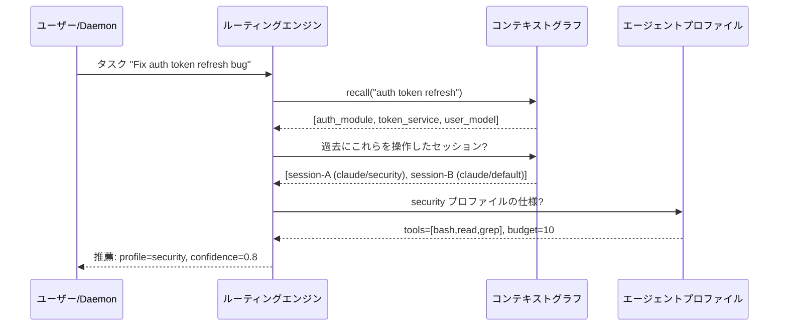

# ECC 2.0 共有コンテキストグラフ: 詳細調査

**調査日:** 2026-04-11
**対象バージョン:** everything-claude-code v1.10.0 以降
**調査者:** Claude Opus 4.6
**関連ドキュメント:** [INVESTIGATION.md](./INVESTIGATION.md)

---

## 1. エグゼクティブサマリー

共有コンテキストグラフは、ECC 2.0 のセッション間記憶システムである。エンティティ（ノード）、関係（エッジ）、観察（注釈）の3層構造で知識を蓄積し、メモリコネクタによる外部データの取り込み、リコールによる関連知識の検索、圧縮による肥大化の制御を提供する。セッション開始時にリコール結果をシステムプロンプトに注入することで、エージェントのコールドスタート問題を緩和する。

---

## 2. CLI リファレンス

`ecc graph` サブコマンドは以下の操作を提供する。

### 2.1 エンティティ操作

```bash
# エンティティの追加
ecc graph add-entity \
  --name "auth_module" \
  --entity-type "module" \
  --path "src/auth/" \
  --summary "Authentication and authorization logic" \
  --metadata "framework=express" \
  --metadata "language=typescript"

# エンティティの一覧（タイプフィルタ付き）
ecc graph show --entity-type "module"

# エンティティの一覧（セッションフィルタ付き）
ecc graph show --session-id "abc123"
```

`--metadata` は `key=value` 形式で複数回指定可能。メタデータはエンティティの属性情報をフリーフォームで格納する。

### 2.2 関係操作

```bash
# 関係の追加
ecc graph add-relation \
  --from "auth_module" \
  --to "user_model" \
  --relation-type "depends_on" \
  --summary "Auth module reads user records for authentication"
```

関係タイプの一覧:

| タイプ | 意味 | 例 |
|-------|------|-----|
| `imports` | 静的インポート | モジュール A がモジュール B をインポート |
| `depends_on` | 実行時依存 | サービス A がサービス B に依存 |
| `implements` | インターフェース実装 | クラス A がインターフェース B を実装 |
| `uses` | 使用関係 | 関数 A がユーティリティ B を呼び出す |
| `refactors` | リファクタリング | 新モジュール A が旧モジュール B を置き換え |
| `conflicts` | コンフリクト | ファイル A がファイル B と同時変更で衝突 |
| `resolves` | 解決 | 判断 A が課題 B を解決 |

### 2.3 観察操作

```bash
# 観察の追加
ecc graph add-observation \
  --entity "auth_module" \
  --observation-type "bug_fix" \
  --content "Fixed race condition in token refresh logic" \
  --priority "high" \
  --pinned

# 観察の追加（詳細メタデータ付き）
ecc graph add-observation \
  --entity "auth_module" \
  --observation-type "decision_note" \
  --content "Switched from JWT to opaque tokens for revocability" \
  --detail "reason=JWT revocation requires blacklist" \
  --detail "alternative=short-lived JWTs with 5min expiry"
```

観察タイプと優先度:

| タイプ | 用途 |
|-------|------|
| `feature_addition` | 新機能の追加記録 |
| `bug_fix` | バグ修正の記録 |
| `optimization` | パフォーマンス最適化の記録 |
| `research` | 調査・分析の結果 |
| `decision_note` | 設計判断の記録 |

| 優先度 | リコール時の重み |
|--------|---------------|
| Low | 0.5x |
| Normal | 1.0x |
| High | 1.5x |
| Critical | 2.0x |

`--pinned` フラグを付けた観察は圧縮時に削除されず、リコール時に常に上位にランクされる。

### 2.4 リコール

```bash
# キーワードベースのリコール
ecc graph recall --query "authentication token refresh"

# セッションスコープのリコール
ecc graph recall --query "database migration" --session-id "abc123"

# 最大結果数の制限
ecc graph recall --query "error handling" --limit 10
```

リコールのスコアリングは以下の要素の重み付き合算:

1. **テキスト関連度** — クエリのキーワードとエンティティの名前・サマリー・メタデータのマッチ度
2. **優先度ブースト** — 高優先度の観察を持つエンティティのスコアが増幅
3. **固定ブースト** — pinned 観察を持つエンティティが常に上位
4. **鮮度** — `updated_at` が新しいエンティティほど高スコア

### 2.5 圧縮

```bash
# グラフの圧縮（低優先度の古い観察を削除）
ecc graph compact

# 圧縮統計の表示
ecc graph compact --stats
```

圧縮アルゴリズム:
1. 全観察を `(priority, created_at)` でソート
2. pinned 観察を保護リストに追加
3. エンティティあたりの観察数上限を適用
4. 上限を超える低優先度・古い観察を削除
5. 削除数と保持数を報告

### 2.6 コネクタ同期

```bash
# 全コネクタの同期
ecc graph sync-connectors

# 同期状態の確認
ecc graph connector-status
```

---

## 3. グラフ認識ルーティング

### 3.1 仕組み

グラフ認識ルーティングは、新しいタスクが投入された際に、コンテキストグラフの内容を参照して最適なルーティング先を推薦する機能である。



### 3.2 プレビューと実行

`preview_graph_routing()` はドライランで推薦結果を表示する。`route_by_graph_context()` は実際にルーティングを実行し、推薦されたプロファイルでデリゲートを作成する。

---

## 4. メモリコネクタの詳細

### 4.1 JSONL コネクタ

JSONL ファイルの各行を以下の構造で解析する:

```json
{
  "entity_type": "function",
  "name": "validateToken",
  "path": "src/auth/validate.ts",
  "summary": "Validates JWT tokens and checks expiry",
  "metadata": {
    "language": "typescript",
    "test_coverage": "85%"
  },
  "relations": [
    {
      "to": "userModel",
      "relation_type": "uses",
      "summary": "Reads user record for token validation"
    }
  ]
}
```

`relations` フィールドはオプションで、エンティティ間の関係も一括でインポートできる。

### 4.2 Markdown コネクタ

Markdown ファイルのヘッダー階層をエンティティツリーに変換する:

```markdown
# Authentication Module          → エンティティ: name="Authentication Module", type="module"
## Token Validation              → エンティティ: name="Token Validation", type="module" (子)
JWT tokens are validated...      → サマリー: "JWT tokens are validated..."
## Session Management            → エンティティ: name="Session Management", type="module" (子)
Sessions are stored in Redis...  → サマリー: "Sessions are stored in Redis..."
```

H1 が親エンティティ、H2/H3 が子エンティティとなり、ヘッダー直後の本文がサマリーに使われる。

### 4.3 Dotenv コネクタ

`.env` ファイルの変数を config エンティティとして登録する:

```env
DATABASE_URL=postgres://localhost/mydb    → name="DATABASE_URL", summary="postgres://localhost/mydb"
API_KEY=sk-1234567890                     → 除外（SECRET_* パターンにマッチ）
REDIS_HOST=localhost                      → name="REDIS_HOST", summary="localhost"
```

`include_safe_values: true` の場合、値もサマリーに含まれる。`false` の場合は変数名のみが登録される。`include_keys` と `exclude_keys` でフィルタリングが可能で、ワイルドカード（`SECRET_*`）もサポートされる。

---

## 5. TUI でのグラフ表示

ダッシュボードの Output ペインを `K` キーで ContextGraph モードに切り替えると、グラフの内容がテーブル形式で表示される。

### 5.1 エンティティフィルタ

`GraphEntityFilter` で表示するエンティティのタイプを絞り込める:

| フィルタ | 表示対象 |
|---------|---------|
| All | 全エンティティ |
| Decisions | `entity_type = "decision"` のみ |
| Files | `entity_type = "file"` のみ |

### 5.2 グラフダッシュボードビュー

`4adb332` コミットで追加されたグラフダッシュボードビューは、エンティティ数、関係数、観察数のサマリーと、最近追加されたエンティティのリストを表示する。エンティティの関係先へのナビゲーションも可能。

---

## 6. 設計上の注意点

### 6.1 スケーラビリティ

コンテキストグラフは SQLite テーブルに格納されるため、数万エンティティまではパフォーマンスに問題ない。ただし、リコール時の全文スキャンはエンティティ数に比例するため、10万エンティティ以上では遅延が顕在化する可能性がある。将来的には FTS5（SQLite Full-Text Search）の導入が検討される。

### 6.2 セマンティック検索の不在

現在のリコールは文字列マッチベースであり、セマンティック検索（ベクトル類似度）は実装されていない。これは意図的な判断で、外部のベクトルデータベースへの依存を避けるためである。トレードオフとして、「authentication」で検索しても「auth」にマッチしない場合がある。部分一致やエイリアスの仕組みで緩和する余地がある。

### 6.3 コネクタのべき等性

メモリコネクタの同期はべき等であるべきだが、現在の実装ではエンティティ名の一致で重複を判定している。同名で内容が異なるエンティティが異なるコネクタから投入された場合の挙動は未定義である。
