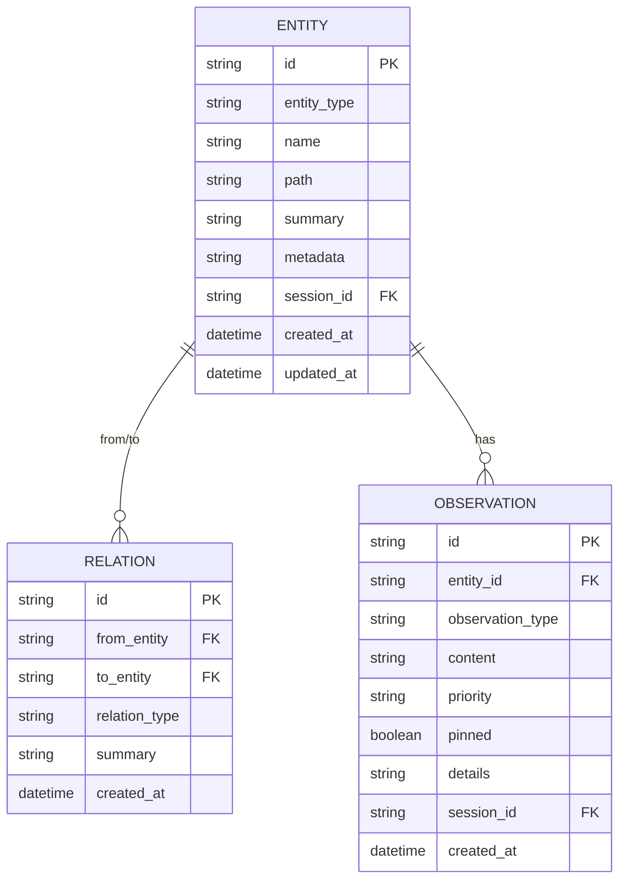
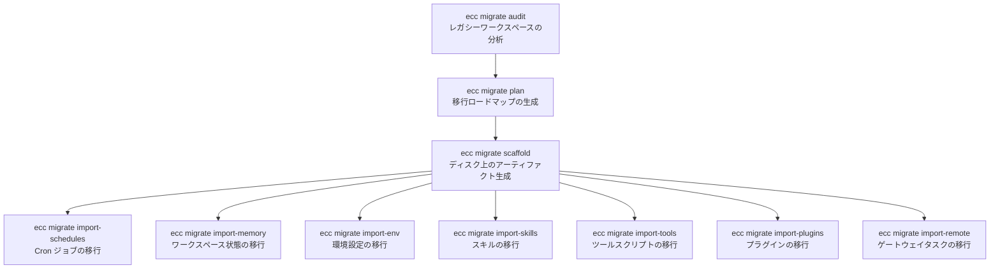

# ECC 2.0 メモリ・ハーネス・マイグレーション 調査レポート

**調査日:** 2026-04-11
**対象バージョン:** everything-claude-code v1.10.0 以降（post-alpha 拡張、約200コミット）
**調査者:** Claude Opus 4.6
**対象領域:** 共有コンテキストグラフ、メモリコネクタ、マルチハーネスランナー、レガシーマイグレーション

---

## 1. Alpha 以降に何が加わったのか

v1.10.0 で ECC 2.0 Alpha が「ビルド可能で、ダッシュボードとセッション管理が動く状態」として公開された後、さらに約200コミットが積まれた。これらの拡張は、Alpha が「ローカル実験用」にとどまっていた3つの領域を本格的に構築するものである:

1. **共有コンテキストグラフ** — セッション間で知識を共有し、ルーティング判断に活用する記憶システム
2. **マルチハーネスランナー** — Claude 以外の AI ハーネス（Codex, Gemini, OpenCode）をセッションとして管理する仕組み
3. **レガシーマイグレーション** — Hermes/OpenClaw ワークスペースから ECC 2.0 への移行ツール

これらは単なる機能追加ではなく、ECC 2.0 を「Claude 専用のセッションマネージャー」から「マルチモデル・マルチエージェントのオーケストレーション基盤」へと転換するための核心的な拡張である。

---

## 2. 共有コンテキストグラフ

### 2.1 なぜ記憶が必要なのか

マルチセッション環境では、各セッションが独立した作業を行う。セッション A がファイル構造を分析し、セッション B がテストを書き、セッション C がリファクタリングを行う。従来の ECC ではこれらのセッション間に情報共有の仕組みがなく、各セッションはゼロから環境を学習する必要があった。

共有コンテキストグラフはこの問題を解決する。セッションが獲得した知識（ファイル構造、設計判断、発見した問題）をグラフ構造に格納し、他のセッションがそれを参照できるようにする。

### 2.2 グラフの構造

コンテキストグラフは3種類のプリミティブで構成される。



**エンティティ** (`ContextGraphEntity`) はグラフのノードで、ファイル、関数、型、モジュール、設計判断、変数、設定を表現できる。各エンティティは名前（安定識別子）、パス、サマリー、メタデータ（キーバリュー）を持つ。`session_id` はオプションで、どのセッションがそのエンティティを作成したかの来歴を記録する。

**関係** (`ContextGraphRelation`) はエンティティ間の有向辺で、imports, depends_on, implements, uses, refactors, conflicts, resolves の7種類がある。双方向クエリ（あるエンティティの出力関係と入力関係の両方）が可能。

**観察** (`ContextGraphObservation`) はエンティティに付随する注釈で、feature_addition, bug_fix, optimization, research, decision_note の5タイプがある。優先度（Low, Normal, High, Critical）と固定フラグ（pinned）を持ち、リコール時のスコアリングに使われる。

### 2.3 自動ポピュレーション

`ecc graph auto-populate` コマンドと `auto_populate_context_graph()` 関数により、セッションの活動からグラフを自動的に構築できる。ソースは3つ:

1. **判断ログ** — `LogDecision` コマンドで記録された設計判断を decision エンティティとして登録
2. **ファイル活動** — 編集・作成されたファイルを file エンティティとして登録し、同一セッション内のファイル間に `uses` 関係を推定
3. **メッセージ** — セッション間メッセージの内容を observation として登録

### 2.4 リコールとランキング

`ecc graph recall` コマンドは、クエリ文字列に対して関連するエンティティと観察を返す。ランキングはスコアの重み付き合算で行われる:

- **テキスト関連度**: エンティティ名、サマリー、メタデータとの文字列マッチ
- **優先度ブースト**: High は 1.5 倍、Critical は 2.0 倍
- **固定ブースト**: pinned の観察は常に上位に浮上
- **鮮度**: 更新日時が新しいほどスコアが高い

このリコール結果は、エージェントのシステムプロンプトにコンテキストとして注入され、セッション開始時のコールドスタート問題を緩和する。

### 2.5 圧縮

グラフが肥大化した場合、`ecc graph compact` で圧縮できる。低優先度かつ古い観察から削除され、固定された観察は保持される。圧縮統計（削除数、保持数）が報告される。

### 2.6 グラフ認識ルーティング

`preview_graph_routing()` と `route_by_graph_context()` は、タスクの説明とコンテキストグラフの内容を照合し、最適なエージェントプロファイルを推薦する機能である。たとえば、データベースマイグレーションに関するタスクが投入された場合、グラフ内の database 関連エンティティを検索し、そのエンティティを過去に操作したエージェントプロファイルを候補として提示する。

---

## 3. メモリコネクタ

### 3.1 設計意図

コンテキストグラフの知識は、セッションの活動からの自動ポピュレーション以外に、**外部のデータソースからもインポート**できる必要がある。プロジェクトのドキュメント、環境変数、既存の記憶ストアなどをグラフに取り込むためのインターフェースが、メモリコネクタである。

### 3.2 コネクタ種別

`ecc2.toml` の `[memory_connectors]` セクションで定義される5種類のコネクタがある:

| 種別 | ソース | 変換ロジック |
|------|--------|-------------|
| `jsonl_file` | 単一の JSONL ファイル | 各行を `{"entity_type": "...", "name": "...", "summary": "..."}` として解析 |
| `jsonl_directory` | JSONL ファイルのディレクトリ | 再帰オプション付き。全ファイルを統合 |
| `markdown_file` | 単一の Markdown ファイル | ヘッダー階層をエンティティに変換（H1 → 親、H2/H3 → 子） |
| `markdown_directory` | Markdown ファイルのディレクトリ | ファイル名 → エンティティ名、コンテンツ → サマリー |
| `dotenv_file` | `.env` ファイル | 環境変数をコンフィグエンティティとして登録。include/exclude キーのフィルタ付き |

設定例:

```toml
[memory_connectors.project_docs]
kind = "markdown_directory"
path = "docs/"
recurse = true
default_entity_type = "documentation"
default_observation_type = "research"

[memory_connectors.env_config]
kind = "dotenv_file"
path = ".env.example"
include_keys = ["DATABASE_URL", "API_KEY"]
exclude_keys = ["SECRET_*"]
include_safe_values = true
```

### 3.3 同期とチェックポイント

`ecc graph sync-connectors` コマンドで全コネクタの同期を実行する。チェックポイントシステム（`ConnectorCheckpointSummary`）により、各コネクタの最終同期日時とソース数が追跡され、変更のないソースの再インポートがスキップされる。バルク同期（`sync_all_connectors()`）は全コネクタを順次処理する。

---

## 4. マルチハーネスランナー

### 4.1 なぜマルチハーネスが必要なのか

ECC 2.0 の目標は「Claude Code のセッションマネージャー」ではなく「AI エージェントのオーケストレーション基盤」である。実世界のプロジェクトでは、Claude だけでなく Codex、Gemini、OpenCode など複数のハーネスを使い分ける場面がある。ECC 2.0 はこれらを統一的なセッションとして管理し、同じダッシュボード、同じ worktree 管理、同じコンテキストグラフの中で扱えるようにする。

### 4.2 HarnessKind と自動検出

`HarnessKind` enum は現在10種類のハーネスを定義している:

| Kind | プロジェクトマーカー | CLI プログラム |
|------|-------------------|---------------|
| Claude | `.claude` | `claude` |
| Codex | `.codex`, `.codex-plugin` | `codex` |
| OpenCode | `.opencode` | `opencode` |
| Gemini | `.gemini` | `gemini-cli` |
| Cursor | `.cursor` | — |
| Kiro | `.kiro` | — |
| Trae | `.trae` | — |
| Zed | `.zed` | — |
| FactoryDroid | `.factory-droid`, `.factory_droid` | — |
| Windsurf | `.windsurf` | — |

プロジェクトマーカー（ディレクトリの存在）から自動検出が行われる。`resolve_requested_agent_type()` は、明示的に指定されたハーネス → マーカーから検出されたハーネス → デフォルト（Claude）の優先順位で解決する。

### 4.3 ランナー設定

`ecc2.toml` の `[harness_runners]` セクションで、各ハーネスの CLI 呼び出し方法をテンプレート化する:

```toml
[harness_runners.claude]
program = "claude"
base_args = ["--api-key=$CLAUDE_API_KEY"]
cwd_flag = "--cwd"
session_name_flag = "--session"
task_flag = "--task"
model_flag = "--model"
add_dir_flag = "--add-dir"
allowed_tools_flag = "--allowed-tools"
max_budget_usd_flag = "--max-budget"
append_system_prompt_flag = "--append-prompt"

[harness_runners.codex]
program = "codex"
base_args = []
task_flag = "--task"
model_flag = "--model"

[harness_runners.gemini]
program = "gemini-cli"
base_args = []
task_flag = "--task"
```

セッション開始時、`manager.rs` がプロファイルとランナー設定からコマンドラインを構築する:

```
{program} {base_args}
  {cwd_flag} {working_dir}
  {session_name_flag} {session_id}
  {task_flag} "{task_description}"
  [{model_flag} {model_name}]
  [{allowed_tools_flag} {tool1,tool2}]
  [{max_budget_usd_flag} {budget}]
  [{append_system_prompt_flag} "{context}"]
```

環境変数（`env` テーブル）はプロセス環境に注入される。

### 4.4 エージェントプロファイル

ハーネスランナーとは別に、エージェントプロファイルが実行時のパラメータ（ツール許可、予算、モデル）を定義する:

```toml
[agent_profiles.default]
agent = "claude"
model = "claude-opus-4"
allowed_tools = ["bash", "write", "read", "grep"]
disallowed_tools = ["rm", "git_force_push"]
max_budget_usd = 5.0
token_budget = 100000
append_system_prompt = "You are a senior engineer..."

[agent_profiles.researcher]
inherits = "default"
allowed_tools = ["web_search", "web_fetch"]
max_budget_usd = 10.0
```

`inherits` フィールドによりプロファイルの継承が可能で、ベースプロファイルの設定を上書きする差分定義ができる。

### 4.5 ハーネス互換性の正規化

`normalize_profiles_across_harnesses()` と `canonicalize_harness_aliases()` により、異なるハーネスのプロファイルとエイリアスが正規化される。たとえば、Codex の `--max-tokens` フラグと Claude の `--max-budget` フラグの違いを吸収し、プロファイル定義を共通化する。

---

## 5. レガシーマイグレーション

### 5.1 移行の背景

ECC 2.0 以前に Hermes や OpenClaw といった別のエージェントワークスペースツールを使用していたユーザーが、ECC 2.0 への移行を容易に行えるようにするためのツールセットである。

### 5.2 移行コマンド体系

`ecc migrate` サブコマンドは10段階の移行パイプラインを提供する:



### 5.3 各ステージの詳細

**Audit**: `.hermes` または `.claw` ディレクトリを探し、スキル、ツール、プラグイン、スケジュールのインベントリを JSON で出力する。

**Plan**: Audit 結果から移行ロードマップを生成する。依存関係を分析し、実行すべきインポート操作の順序を人間が読める形式で出力する。

**Scaffold**: `config.toml` のスケルトン、エージェントプロファイル、オーケストレーションテンプレートをディスク上に作成する。

**Import-Schedules**: レガシーの cron/jobs.json を解析し、ECC 2.0 の `ScheduledTask` エントリに変換する。ドライランプレビューオプション付き。

**Import-Memory**: `.hermes/memory` や `.claw/state` を解析し、JSONL 形式のメモリコネクタ設定に変換する。インポートレコード数の上限が設定可能。

**Import-Env**: `.env.example` やコンフィグファイルから安全な環境変数を抽出し、コンテキストグラフのエンティティに変換する。API_KEY, PASSWORD, TOKEN などのシークレットは自動的に除外される。

**Import-Skills**: レガシーのスキル Markdown を解析し、ECC 2.0 のオーケストレーションテンプレートステップに変換する。出力は TOML 形式。

**Import-Tools**: ツールスクリプト（`.md` や `.sh`）を解析し、`HarnessRunnerConfig` エントリに変換する。

**Import-Plugins**: プラグインメタデータを解析し、ブリッジ用のハーネス設定に変換する。

**Import-Remote**: リモートディスパッチキュー（`.hermes/remote/` や `.claw/dispatch/`）を `RemoteDispatchRequest` エントリに変換する。

---

## 6. 予算管理と通知

### 6.1 コスト追跡

各セッションの `SessionMetrics` がトークン消費量とコスト（USD）を追跡する。`ecc2.toml` で予算閾値（`budget_alert_thresholds`）を設定でき、消費が閾値の 50%, 75%, 90% に達した時点でアラートが発生する。100% を超えるとセッションが自動的に一時停止される（`auto_pause_on_budget_exceeded`）。

TUI ダッシュボードの Metrics ペインには `TokenMeter` ウィジェットが表示され、`BudgetState` enum（Normal → Alert50 → Alert75 → Alert90 → OverBudget）に基づいてカラーリングが変わる。

### 6.2 通知システム

**デスクトップ通知**: macOS の `osascript`、Linux の `notify-send`、Windows の PowerShell を使い分ける。セッション完了、予算アラート、エラーの3種類のイベントで発火する。

**Webhook 通知**: 設定された URL に POST リクエストを送信する。ペイロードにはイベントタイプ、セッション ID、メッセージ、タイムスタンプが含まれる。Slack や Discord への統合に使える。

---

## 7. 調査所見のまとめ

### 実装状態の総括

| 機能領域 | 実装状態 | コミット数 | 備考 |
|---------|---------|-----------|------|
| コンテキストグラフ | 完成 | ~30 | エンティティ、関係、観察、リコール、圧縮 |
| メモリコネクタ | 完成 | ~15 | 5種類のコネクタ、チェックポイント同期 |
| マルチハーネスランナー | 完成 | ~25 | 10 種類の HarnessKind、テンプレート化 |
| エージェントプロファイル | 完成 | ~10 | 継承、ツール許可、予算制限 |
| レガシーマイグレーション | 完成 | ~10 | 10段階のパイプライン |
| 予算管理 | 完成 | ~8 | 閾値アラート、自動一時停止 |
| 通知 | 完成 | ~5 | デスクトップ + Webhook |

### 注目すべき設計判断

1. **グラフの軽量性**: コンテキストグラフは全文検索エンジンやベクトルデータベースではなく、SQLite テーブル上のシンプルな文字列マッチで実装されている。これは意図的な判断で、外部依存を増やさずに動作させるためである。精度よりもゼロ設定で動く実用性を優先している。

2. **コネクタの宣言的定義**: メモリコネクタは TOML で宣言するだけで動作し、インポートロジックのコードを書く必要がない。これにより、ユーザーが自分のドキュメント構造をそのまま ECC 2.0 に接続できる。

3. **ハーネスの均一抽象化**: 10種類のハーネスを `HarnessRunnerConfig` のテンプレートパターンで統一した設計は、新しいハーネスの追加を TOML 数行の追加で完結させる。ただし、各ハーネスの CLI 引数フォーマットが異なるため、完全な互換性は保証されない。

4. **マイグレーションのドライラン対応**: すべてのインポートコマンドにドライランオプションがあり、実際のデータ変更前にプレビューできる。不可逆な操作を防ぐ安全設計。

詳細なグラフ操作のリファレンスは [DEEP-DIVE-CONTEXT-GRAPH.md](./DEEP-DIVE-CONTEXT-GRAPH.md) を参照。
