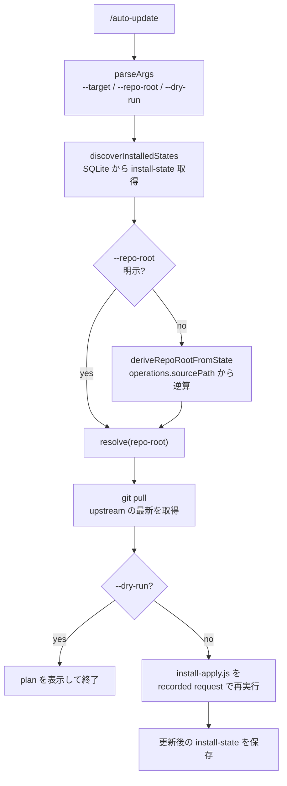

# auto-update コマンド導入 調査レポート

**調査日:** 2026-05-13
**対象バージョン:** everything-claude-code post-v1.10.0（`a7a56fa2`, `149fae70`, `84ac76fa`, `2006d2ee`）
**調査者:** Claude Opus 4.7
**対象領域:** `commands/auto-update.md`、`scripts/auto-update.js`、`tests/scripts/auto-update.test.js`、`package.json` の `files` フィールド

---

## 1. post-v1.10.0 で何が変わったのか

v1.10.0 リリース直後の問題のひとつは、ユーザーが ECC を「最新に追従する」手段を持っていなかったことである。`/install` で初期セットアップはできるが、その後 upstream に変更が入ったときに「同じターゲット（Claude plugin / Cursor / Codex / OpenCode 等）に対して、いま入っているものを最新に置き換える」手順が体系化されていなかった。`git pull` してから手で installer を再実行するか、もう一度 `/install` を走らせるしかなく、後者は「以前のオプション選択」を覚えていない問題があった。

`a7a56fa2` で追加された `/auto-update` コマンドは、この欠落を埋める。recorded install-state を再利用して、現在の context が管理しているターゲットだけを最新に同期する。

ここでの **install-state** は、過去の `/install` 実行時に SQLite に記録された install request（target、options、operations）を指す。Claude session の transcript や `~/.claude/sessions/` とは別物である。また、ここでの **target** は `SUPPORTED_INSTALL_TARGETS`（claude、cursor、codex、opencode 等）の論理的なインストール対象であり、harness そのものではなく「harness 向けの install 形式」を指す。

主要な変更は次の 3 つに分かれる。第一に、`commands/auto-update.md` 経由でユーザーが `/auto-update` を呼べるようになった。第二に、`scripts/auto-update.js`（361 行）が install-state の発見、repo root の解決、`install-apply.js` の再実行を担う。第三に、後日 `2006d2ee` で `package.json` の `files` に runtime script が追加され、npm 配布時に確実に同梱されるようになった。

---

## 2. なぜ「再 install」を選んだのか

`/auto-update` の core 設計判断は、**差分更新（patch）ではなく再 install（reinstall）** にしたことである。コマンド markdown の Notes セクションがその理由を明示している。

> Reinstall is intentional: it handles upstream renames and deletions that `repair.js` cannot safely reconstruct from stale operations alone.

ECC の install は target 固有のファイルツリーをユーザー側にコピー・適応する操作で、upstream で「ファイルが rename された」「skill が消えた」「rules が再編された」といった変化は、古い operations だけを見て増分的に解決するのが難しい。例えば、`skills/old-name/SKILL.md` が `skills/new-name/SKILL.md` に rename された場合、stale operation は old path への削除しか知らない。再 install であれば「新しい upstream 状態を元に install 計画を組み直す」ため、rename や deletion が自然に反映される。

選ばれなかった代替案として、`repair.js` を改造して rename detection を入れる方向もあった。だが、upstream リポジトリでの構造変更パターンは多様で、一般化するとほぼ「再 install と同じこと」をやることになる。今回は再 install で割り切り、`repair.js` は orthogonal な役割（破損した install の修復）に集中させている。

---

## 3. コマンドラインインターフェース

`scripts/auto-update.js` がサポートする引数は次の 4 種類。

| フラグ | 役割 |
|--------|------|
| `--target <name>` | 特定の target のみ更新。複数指定可能 |
| `--repo-root <path>` | upstream repo の path を明示的に指定 |
| `--dry-run` | 計画を出力するが mutation は行わない |
| `--json` | 出力を JSON で受け取る（CI や下流ツール向け） |

`--target` を省略した場合、install-state に記録されている全 target が対象になる。`--repo-root` を省略した場合、install-state の `sourcePath` から逆算して repo root を推定する。

---

## 4. 内部フロー



`deriveRepoRootFromState()` は、install-state の `operations` 配列を走査して、`sourcePath` と `sourceRelativePath` から repo root を割り出す関数である。これにより、初回 install 時の `--repo-root` 指定を再入力させずに済む。

正常ライフサイクルは、install → auto-update（複数回）→ uninstall という流れになる。auto-update が成功するたびに install-state は「最新の operations 集合」で上書きされ、次回 auto-update の起点になる。クリーンアップは行われない（install-state は累積するが、target ごとに 1 レコードという設計のため肥大化しない）。auto-update が失敗した場合、install-state は変更されず、ユーザーは前回成功時点の install を保持する。

---

## 5. Windows 対応

`149fae70` は同日中に入った fix で、`tests/scripts/auto-update.test.js` の repo root 期待値を Windows でも通るようにする調整である。

```diff
-      expect(deriveRepoRootFromState(state)).toBe('/abs/repo');
+      const expected = process.platform === 'win32' ? path.resolve('/abs/repo') : '/abs/repo';
+      expect(deriveRepoRootFromState(state)).toBe(expected);
```

`path.resolve()` は Windows では drive letter を補完するため（`C:\abs\repo` のような形）、unix の `/abs/repo` という絶対パス前提では失敗する。テスト側で platform を見て期待値を切り替える、minimal な修正である。

これは小さな差分だが、ECC が Windows 含む multi-platform 配布を真剣に運用していることの傍証でもある。

---

## 6. npm publish との結合

`2006d2ee`（2026-04-29）は 1 行の修正だが、重要度は高い。

```diff
   "files": [
     "scripts",
     ...
+    "scripts/auto-update.js",
     ...
   ]
```

実は `scripts/` ディレクトリ全体は既に `files` に含まれていたが、glob のマッチング上 `auto-update.js` だけが取りこぼされているケースがあった。RC1 への準備の中で、ECC 自体が npm package として配布される際にこの script が確実に同梱されるよう、明示的に追加された。これがないと、npm 経由で ECC を入れたユーザーが `/auto-update` を呼ぶときに「script が見つからない」エラーになる。

ECC2 RC1 release surface（[`2026-04-28_ecc2-rc1-release-surface/`](../2026-04-28_ecc2-rc1-release-surface/INVESTIGATION.md)）で release 周りが整理された際の副作用として発見・修正されたものである。

---

## 7. テスト状況

`tests/scripts/auto-update.test.js` は 392 行ある。カバーされているのは次の領域である。

- 引数のパース（unknown arg のエラー、--target 複数指定、--help 等）
- install-state からの target 抽出と filter
- `deriveRepoRootFromState()` の正常系（複数 operation を持つ state）と例外系（sourcePath が欠落、relative path が空など）
- `--dry-run` のときに `install-apply.js` が呼ばれない
- `--json` 出力形式

E2E として「実際に git pull → install-apply 再実行」を回すテストは含まれていない（仮想的な repo を用意する必要があるため）。ただし、install-apply 側に既に十分なテストがあり、auto-update.js は orchestration layer なのでこれで実用上の品質は担保されている。

実践的な使い方は [RUNBOOK.md](./RUNBOOK.md) を参照。

---

## 8. 調査所見のまとめ

### 実装状態の総括

| 機能領域 | 実装状態 | コミット数 | 備考 |
|---------|---------|-----------|------|
| `/auto-update` コマンド | 完成 | 1 (a7a56fa2) | command markdown + 361 行 script + 392 行 test |
| Windows test 互換性 | 完成 | 1 (149fae70) | platform 判定で期待値を分岐 |
| npm publish 同梱 | 完成 | 1 (2006d2ee) | `files` に明示追加 |
| ドキュメント同期 | 完成 | 1 (84ac76fa) | session storage paths を翻訳側に反映 |

### 注目すべき設計判断

1. **差分更新ではなく再 install:** rename と deletion を正しく処理するため、毎回 install 計画を作り直す。`repair.js` との役割分離が明確
2. **install-state を信頼の源にする:** ユーザーに毎回 `--target` や `--repo-root` を入力させず、過去の install 記録から再構成する。前提の自動継承
3. **`--dry-run` を最初から提供:** mutation 前にプランを見られる安全機構を、後付けではなく初回実装に含めた
4. **`/auto-update` を slash command にした:** Claude Code 側から自然に呼べる surface とし、CLI 単体での使用も妨げない（`disable-model-invocation: true` で AI による自動起動は禁止）

### 関連ドキュメント

- [RUNBOOK.md](./RUNBOOK.md) — 実運用での `/auto-update` 使用手順
- [`2026-04-28_ecc2-rc1-release-surface/INVESTIGATION.md`](../2026-04-28_ecc2-rc1-release-surface/INVESTIGATION.md) — 2006d2ee が含まれる RC1 release 整理の流れ
