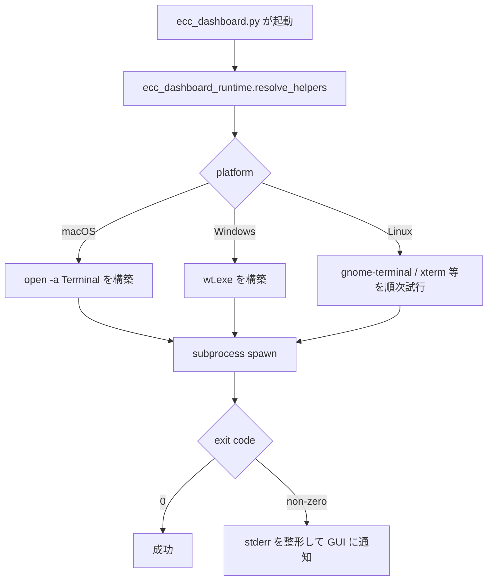

# Release Publishing と Urgent Install 修正 調査レポート

**調査日:** 2026-05-13
**対象バージョン:** everything-claude-code post-v1.10.0（2026-04-13〜2026-04-14 の急増修正群）
**調査者:** Claude Opus 4.7
**対象領域:** npm 配布パイプライン、`scripts/harness-audit.js`、`scripts/hooks/gateguard-*.js`、`ecc_dashboard.py`、urgent install fix branch

---

## 1. post-v1.10.0 で何が変わったのか

v1.10.0 は 2026-04-05 にリリースされた「OSS surface を実状態に合わせる」ためのリリースだったが、公開直後から複数の運用問題が顕在化した。本レポートが扱う 2026-04-13〜04-14 の修正群は、それらをまとめて押さえに行った急増フィックスである。問題は大きく 3 領域に分かれる。

第一に、npm publish パイプラインが本番では未配線だった。`release.yml` workflow は存在するが `NPM_TOKEN` を読まず、`install identifiers`（パッケージ名と install 時の identifier の対応）も曖昧で、ユーザーがどう install すれば動くのか README から分かりにくかった。

第二に、Claude Code marketplace 経由でインストールされた ECC は、`harness-audit.js` から見つけられないという回帰が発生していた。Marketplace は `~/.claude/plugins/marketplaces/{ecc,everything-claude-code}/...` という 1 階層深い構造で配置するが、audit script は `~/.claude/plugins/` を直接見る前提だった。同じ branch で gateguard session state の永続性問題と plugin-installed hook の bootstrap も並行して修正されている。

第三に、Python ベースの ECC dashboard が terminal launch helper から起動されるとき、subprocess の environment や cwd 解決が脆く、エラー時に GUI が無音で落ちる挙動があった。Dashboard 関連の CI も branch baseline が崩れていた。

ここでの **install identifier** は、npm の `package.json#name`、Claude plugin manifest 内のパッケージ名、README で案内する install コマンドの 3 者を整合させる文字列を指す。これらが食い違うと、コピペした install コマンドが見つからないパッケージを叩くことになる。また、ここでの **urgent install fix branch** は `fix/urgent-install-and-name`（PR #1439 経由）を指し、複数の修正が短期間に集約されたブランチである。

---

## 2. npm publish 導線の本番化

### 2.1 NPM_TOKEN の配線

`b5c4d2be` は `.github/workflows/reusable-release.yml` に `NPM_TOKEN` を渡す配線を追加した。それまで release workflow は `setup-node` を呼ぶだけで、`actions/setup-node` の `registry-url` 指定もなく、`npm publish` が認証エラーで失敗していた可能性が高い。

```yaml
- uses: actions/setup-node@v4
  with:
    node-version: 20
    registry-url: 'https://registry.npmjs.org'
- run: npm publish --provenance --access public
  env:
    NODE_AUTH_TOKEN: ${{ secrets.NPM_TOKEN }}
```

`--provenance` フラグは Sigstore-backed の build provenance を npm registry に登録し、後続の supply-chain 検査で利用される。これがあるおかげで、ユーザー側で `npm audit signatures` が走るようになる。

### 2.2 manual dispatch とリリースの分離

`8b5c0c1b` で release workflow に `workflow_dispatch` トリガーが追加された。これにより、tag push をしなくても release engineering 担当者が手動で release を再実行できる。npm publish が一時的に失敗したり、認証 secret の追加が後追いになったような状況で、release process を最初からやり直す必要がない。

### 2.3 install identifier の明確化

`34380326` の本体は、npm publish 自体を動くようにすることに加え、ユーザーが「ECC をどう install するか」を README から正しく読めるようにする整備だった。

- `package.json` の `name` を npm registry 上のパッケージ名と整合
- README に `npm install -g ecc-universal`、`npx ecc-agentshield` のような具体的なコマンドを記載
- 翻訳ドキュメント（中国語、ポルトガル語、日本語、その他）の install 例も同時に更新
- `tests/docs/install-identifiers.test.js`（51 行）で、ドキュメントと package.json の整合性を CI 上で検証

このテスト追加が地味に効いていて、以後「README に書かれているコマンドが実在しない」という事故を CI レベルで防げる。

---

## 3. Urgent install regressions の修正

### 3.1 Marketplace 配置への対応

`aa96279e` は単純だが影響範囲の大きい修正である。

```diff
 const candidateRoots = [
   path.join(rootDir, '.claude', 'plugins'),
   path.join(os.homedir(), '.claude', 'plugins'),
+  path.join(rootDir, '.claude', 'plugins', 'marketplaces'),
+  path.join(os.homedir(), '.claude', 'plugins', 'marketplaces'),
 ];
```

`harness-audit.js` の `findPluginInstall()` は 2 つの候補 root を見ていたが、Claude Code marketplace 経由の install は 1 階層深い `marketplaces/{ecc,everything-claude-code}/...` という構造を取る。コミットメッセージが書く通り、これにより `consumer-plugin-install=false` という誤った診断が出て、Tool Coverage の point が 4 落ちていた。

修正は purely additive。既存パスは変えず、新しい候補を追加するだけ。同 branch で `tests/scripts/harness-audit.test.js` に marketplace layout のテストケースが 74 行ぶん追加されている。

### 3.2 gateguard session state の永続性

`6c675667` および `8776c4f8` 内の `gateguard-fact-force.js` 修正は、gateguard hook が session 開始時に出力する fact-force message の state を、session 内で「一度出したら同じセッションでは再表示しない」ようにする仕組みの保護である。それまでは、state ファイルへの atomic write が rename 衝突で消えるケースがあり、毎回 fact-force が再表示される回帰があった。

修正は `tmp file → rename` パターンを `tmp file → write fsync → rename` に強化し、tests の `2e44beab` で gateguard state dir cleanup の isolation も整えている。

### 3.3 Plugin-installed hook の bootstrap

`1b7c5789` は、Claude Code が plugin として ECC を install した直後、`PluginInstalled` event 経由で呼ばれる hook command が `$CLAUDE_PLUGIN_ROOT` を未解決のまま参照していた問題を直す。`bootstrap` 段階では env var がまだ空のケースがあるため、`node -e "..."` で安全に fallback path を解決する形に変更されている。

これは小さな修正だが、初回 install ユーザーの「最初の起動が落ちる」という最悪の体験を防ぐ意味で重要である。

### 3.4 Recovery guidance

`9227d3cc` は `docs/ecc-recovery.md`（新規）を追加した。「`.claude/` を一度消してから再 install する」「`/install-status` で壊れた state を診断する」など、wiped setup からの復旧手順を体系化している。これは前述の install regressions に伴うサポートコストを下げるためのドキュメント整備。

---

## 4. Dashboard terminal launch の硬化

### 4.1 Python dashboard runtime の分離

`e46deb93` は、`ecc_dashboard.py` から `scripts/lib/ecc_dashboard_runtime.py`（61 行）を切り出した。元々の `ecc_dashboard.py` は subprocess を spawn する際の env、cwd、shell 解決を inline で持っていたが、エラーパスのテストが書きづらく、Terminal.app や Windows Terminal といった launch helper 経由の起動で潜在的な失敗が捕捉されにくかった。

runtime モジュールには次の責務が集約されている。

- launch helper の検出（`open -a Terminal`、`wt.exe`、`gnome-terminal` 等）
- ECC repo root の解決と検証
- subprocess の env 構築（PATH、`CLAUDE_PLUGIN_ROOT` 等）
- stderr のキャプチャと GUI への通知



選ばれなかった代替案として、`subprocess.Popen` の `shell=True` を使う方向もあった。これは launch helper の検出を捨てて OS の default shell に委ねる方法だが、PATH の解決やエラー時の挙動が OS ごとに違いすぎて、テストが書けなくなる。今回は runtime モジュールに集約して platform 判定を 1 箇所に閉じ込めた。

### 4.2 CI baseline の復旧

`c924290b` と `2691cfc0` はほぼ同内容で、dashboard branch の CI が一時的に崩れていたのを復旧している。差分の本体は、テストの timing-sensitive 部分を deterministic な fixture に差し替えるもの。

### 4.3 Test fallback の整備

`c54b44ed` は `tests/scripts/harness-audit.test.js` の env fallback を、`HOME` が空のときに OS default を使うように整えた。Windows CI で `HOME` が `USERPROFILE` 由来になるケースをカバーしている。

---

## 5. 補助的な docs / state 修正

短い fix だが効果のあるものを集約する。

| コミット | 内容 |
|---------|------|
| `e5225db0` | urgent fix branch 上で catalog counts（agent/skill/command 数）を README の表記と一致させる |
| `7f7e2c2c` | agent manifest の `tools` frontmatter key が重複していたのを除去 |
| `68ee51f1` | community skill ecosystem の docs ノートを追加 |
| `deb3b1dc` | dashboard GUI build surface を opt-in にして、bundle されたバイナリが意図せず実行されないようにする |

これらは個別には小さいが、release の整合性を支える地味な作業である。

---

## 6. テスト状況

このフォルダがカバーする修正群では、テスト追加が比較的多い。

| 修正 | 追加テスト |
|------|---------|
| install identifier 整合 | `tests/docs/install-identifiers.test.js`（51 行） |
| npm publish workflow | `tests/scripts/release-publish.test.js`（59 行） |
| marketplace 配置 | `tests/scripts/harness-audit.test.js`（+74 行） |
| dashboard runtime | `tests/scripts/ecc-dashboard.test.js`（128 行） |
| gateguard state | `tests/hooks/gateguard-fact-force.test.js`（+70 行） |
| state dir isolation | `tests/integration/gateguard.test.js`（+2e44beab） |

これは「urgent fix だが quality は妥協しない」スタンスの傍証である。RC1 までに同じ regression を繰り返さないための投資としても機能している。

---

## 7. 調査所見のまとめ

### 実装状態の総括

| 機能領域 | 実装状態 | 影響 | 備考 |
|---------|---------|------|------|
| npm publish パイプライン | 完成 | 高 | NPM_TOKEN 配線 + provenance + manual dispatch |
| install identifier | 完成 | 中 | README/translations と package.json の整合性を CI で守る |
| harness-audit marketplace 対応 | 完成 | 高 | consumer-plugin-install 誤検出を解消 |
| gateguard state 永続性 | 完成 | 中 | atomic write の硬化 |
| plugin-installed hook bootstrap | 完成 | 高 | 初回起動失敗を防ぐ |
| dashboard runtime 切り出し | 完成 | 中 | platform 判定を 1 箇所に集約 |
| Recovery docs | 完成 | 中 | サポートコスト削減 |

### 注目すべき設計判断

1. **`--provenance` の有効化:** 単に publish させるだけでなく、Sigstore-backed の build provenance を取得することで、後の supply-chain 監査と npm audit signatures に備えた
2. **install identifier のテスト化:** README に書いた install コマンドが正しいかを CI で検証する。手動 review に頼らない仕組み
3. **`marketplaces/` パスの additive 追加:** 既存パスは変えずに新しい候補だけ追加することで、レガシー install を壊さない
4. **dashboard runtime の独立モジュール化:** Python 側のプラットフォーム判定を 1 箇所に閉じ込め、subprocess 失敗をテスト可能にする
5. **Urgent fix branch でも test 追加を妥協しない:** 同じ regression の再発を防ぐためのコスト投資が、後の RC1 安定化に効いている

### 関連調査

- [`2026-04-13_auto-update-command/`](../2026-04-13_auto-update-command/INVESTIGATION.md) — 同時期の `/auto-update` コマンド導入
- [`2026-04-15_hook-dispatcher-claude-schema/`](../2026-04-15_hook-dispatcher-claude-schema/INVESTIGATION.md) — 直後の hook dispatcher 統合と schema 互換性
