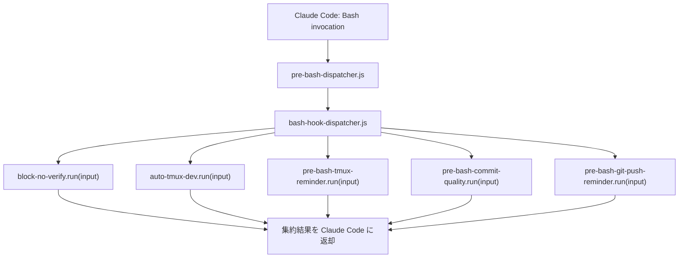

# Bash Hook Dispatcher 統合と Claude Code Schema 互換性 調査レポート

**調査日:** 2026-05-13
**対象バージョン:** everything-claude-code post-v1.10.0（`1fabf4d2`, `ccecb0b9`, `eb900ddd`, `6b7bd715`, `1a50145d`）
**調査者:** Claude Opus 4.7
**対象領域:** `hooks/hooks.json`、`scripts/hooks/bash-hook-dispatcher.js`、Claude Code hook schema、CI build check

---

## 1. post-v1.10.0 で何が変わったのか

v1.10.0 までの ECC では、Bash tool に対する hook（block-no-verify、auto-tmux-dev、tmux-reminder、commit-quality、git-push-reminder、build-complete、command-log、pr-created など）はそれぞれが独立した hook entry として `hooks/hooks.json` に登録されていた。Claude Code は matcher が一致する hook を順に実行するが、各 hook entry が **自前で `node` を spawn する** 構造だったため、Bash tool が 1 回呼ばれるごとに 5〜8 個の node プロセスが立ち上がっていた。これが **fork storm**（短時間に多数の fork が走る現象）の正体である。

`1fabf4d2` はこの問題を、`bash-hook-dispatcher.js`（177 行）という 1 つの共通ディスパッチャに集約することで解決した。`hooks/hooks.json` のサイズは 172 行ぶん削減され、Bash 1 回あたりの node プロセス数は最大 8 から 2（pre-bash と post-bash の dispatcher 各 1）に収まる。

直後の `ccecb0b9` と `eb900ddd`（共に 2026-04-15）は、dispatcher 統合の過程で hook command を array 形式（`["node", "-e", "..."]`）にした副作用として、Claude Code の hook schema 仕様（string 形式の command）と食い違ったため、後方互換を取り戻す修正である。さらに `6b7bd715` で pnpm strict build check を緩和し、`1a50145d` で legacy ECC install 参照を整理している。

ここでの **fork storm** は、Bash や他の tool invocation 1 回ごとに `Number.of.hook.entries` 個の独立 node プロセスが起動する状況を指す。OS の fork/exec コストは small だが、ECC のように hook を多用する環境では数ミリ秒の遅延が積み上がり、対話レイテンシに体感的な影響が出ていた。また、ここでの **dispatcher** は ECC の hook routing 機構を指し、Claude Code 本体の slash command dispatcher とは別物である。

---

## 2. Fork storm の正体

### 2.1 統合前の hooks.json 構造

v1.10.0 時点の `hooks/hooks.json` は、概念的には次の形だった。

```json
{
  "PreToolUse": [
    {
      "matcher": "Bash",
      "hooks": [{
        "type": "command",
        "command": ["node", "-e", "...bootstrap...", "node",
                    "scripts/hooks/run-with-flags.js",
                    "pre:bash:block-no-verify",
                    "scripts/hooks/block-no-verify.js",
                    "minimal,standard,strict"]
      }],
      "id": "pre:bash:block-no-verify"
    },
    {
      "matcher": "Bash",
      "hooks": [{
        "type": "command",
        "command": ["node", "-e", "...同じbootstrap...", "node",
                    "scripts/hooks/auto-tmux-dev.js"]
      }],
      "id": "pre:bash:auto-tmux-dev"
    },
    // ... 5 つ以上の Bash hook が並ぶ
  ]
}
```

注目すべきは、各 hook entry が独立した `node -e "...bootstrap..."` を持ち、その中で `CLAUDE_PLUGIN_ROOT` の resolution を毎回行っていた点である。bootstrap 自体は決定的なロジックで、結果は同じ。それなのに、Bash tool が 1 回 invoke されるたびに、ECC は次の処理を **直列で N 回繰り返していた**。

1. Claude Code が hook entry を起動
2. node プロセスが立ち上がる
3. `process.env.CLAUDE_PLUGIN_ROOT` を resolve（5 つのフォールバックを探索）
4. `plugin-hook-bootstrap.js` を require
5. 本来の hook script（`block-no-verify.js`、`auto-tmux-dev.js` など）を実行
6. プロセス終了

これが 5〜8 回続く。Bash 1 回あたりの実時間で 200ms 以上の overhead になっていた。

### 2.2 統合後の構造

`1fabf4d2` 以降は、`hooks.json` の Bash matcher は基本的に 2 つに絞られた。

```json
{
  "PreToolUse": [
    {
      "matcher": "Bash",
      "hooks": [{
        "type": "command",
        "command": ["node", "scripts/hooks/pre-bash-dispatcher.js"]
      }],
      "id": "pre:bash:dispatcher"
    }
  ],
  "PostToolUse": [
    {
      "matcher": "Bash",
      "hooks": [{
        "type": "command",
        "command": ["node", "scripts/hooks/post-bash-dispatcher.js"]
      }],
      "id": "post:bash:dispatcher"
    }
  ]
}
```

`pre-bash-dispatcher.js` と `post-bash-dispatcher.js` は薄い entry で、本体である `bash-hook-dispatcher.js` を呼ぶ。dispatcher は内部で「どの hook を実行するか」のリストを持ち、それらを **同一プロセス内で順次 require して呼び出す**。



これにより、N 個の hook が並んでも、起動するのは「pre 用の 1 プロセス」と「post 用の 1 プロセス」だけになる。CLAUDE_PLUGIN_ROOT の resolution も 1 回だけ。

### 2.3 各 hook script の interface

dispatcher が各 hook を呼ぶ前提として、hook script 側の interface も整えられた。

```js
// scripts/hooks/auto-tmux-dev.js（修正後）
module.exports.run = async function(rawInput, options = {}) {
  // rawInput は dispatcher が parse 済みの hook payload
  // options.profile などのフラグもここで受け取る
  // 返り値で「block する / 通すか」「stderr に出す内容」等を制御
};
```

統合前は各 hook が `process.stdin` から JSON を読み、`process.exit` で結果を返していた。これでは「同一プロセスで複数 hook を回す」ことができないため、`run(rawInput, options)` という同期可能な関数 export 形式に統一された。`scripts/hooks/run-with-flags.js` の wrapper は引き続き残されており、stdin から呼ばれる旧 invocation でも動くようになっている。

### 2.4 選ばれなかった代替案

**代替案 A: 各 hook を最大限軽量化する**

bootstrap のロジックを短くする、`require` の数を減らす、といった微修正を積む案。これは延命策にしかならず、hook の数が増えるたびに同じ問題が再発する。

**代替案 B: Claude Code 側に「hook を bundle して 1 プロセスにする」機構を作ってもらう**

筋は良いが、harness 側の機能依頼で時間がかかる。さらに、ECC は Claude Code 以外の harness（Codex、Cursor）でも hook を動かす必要があるため、harness 非依存の解決が望ましい。dispatcher は ECC 側で完結し、どの harness でも同じ恩恵を受けられる。

**代替案 C: hook を全部削る**

Bash の hook を整理して数を減らす案。実際 v1.9 系以降ずっと精査されており、現状の 5〜8 個はどれも有用性が確認されている。削減で済む段階を過ぎていた。

dispatcher 集約は、構造として正しい解だった。

---

## 3. Claude Code schema との互換性

### 3.1 array 形式と string 形式

`1fabf4d2` が hook command を array 形式（`["node", "scripts/hooks/pre-bash-dispatcher.js"]`）に書いたのは、引数の構造を明示的に分けるためだった。しかし、Claude Code の hook 仕様は string 形式（`"node scripts/hooks/pre-bash-dispatcher.js"`）を期待する。array 形式は Claude Code の version によっては parse され方が違い、特に Windows 環境で空白を含む path を扱うときに edge case が起きる。

`ccecb0b9` は `hooks/hooks.json` を array → string 形式に戻し、200 行ぶんの差分で大半は formatting の縮小である。

```diff
       "type": "command",
-      "command": [
-        "node",
-        "scripts/hooks/pre-bash-dispatcher.js"
-      ]
+      "command": "node scripts/hooks/pre-bash-dispatcher.js"
```

string 形式に戻したことで、Claude Code が schema validation で hook を loading する経路が安定した。

### 3.2 install-apply test の整合

`eb900ddd` は `tests/scripts/install-apply.test.js` の 12 行を修正し、hook command の expected value を string 形式に揃えた。`install-apply.js` は ECC を Claude plugin にインストールする際に `hooks/hooks.json` を `~/.claude/settings.json` にマージする処理を担う。expected value が array のままだと、install の出力と一致せず CI が落ちる。

これは小さな機械的修正だが、`1fabf4d2` と `ccecb0b9` の整合性を最後まで取りに行く意思を示している。

---

## 4. 補助修正

### 4.1 pnpm strict build check の緩和

`6b7bd715` は CI 上で pnpm install の strict build mode を緩和した。当時 pnpm v9 で導入された "strict build dependency" check が、ECC が直接管理していない transitive dependency の build script で失敗するケースがあり、CI が断続的に落ちていた。

```diff
-pnpm install --frozen-lockfile --strict-build
+pnpm install --frozen-lockfile
```

セキュリティ上は strict-build を維持したほうが望ましいが、CI 安定性を優先する判断。長期的な解決として、上流ライブラリの strict-build 対応待ち、または `pnpm.onlyBuiltDependencies` でホワイトリスト化する方向もあるが、この時点では緩和に留めた。

### 4.2 Legacy ECC install ref の削除

`1a50145d` は PR #1462（`fix/remove-legacy-ecc-install-refs`）のマージ。古いインストール導線（ECC v1.x の単独 install スクリプト）への参照が docs に残っており、新規ユーザーが古い導線を踏むと壊れた状態に着地する。これらの参照を README、translations、quickstart docs から一掃した。

---

## 5. テスト状況

dispatcher 統合に伴い、テストも整備されている。

| ファイル | 行数（追加） | 内容 |
|----------|-----------|------|
| `tests/hooks/bash-hook-dispatcher.test.js` | 114 行（新規） | dispatcher 単体の振る舞い、複数 hook の集約、エラー時の継続 |
| `tests/hooks/hooks.test.js` | 27 行（追加） | 集約後の hook 数と matcher の整合性 |
| `tests/integration/hooks.test.js` | 32 行（変更） | E2E で Bash invocation 時の hook 実行を確認 |
| `tests/scripts/install-apply.test.js` | 18 行（変更）→ 6 行（再修正） | string 形式での hook install 確認 |

特に `bash-hook-dispatcher.test.js` の 114 行は、dispatcher が「ある hook がエラーになっても次の hook を続行する」「return value を集約して Claude Code に返す」といった責務を契約として固定する役割を担っている。

---

## 6. 調査所見のまとめ

### 実装状態の総括

| 領域 | 状態 | 影響 |
|------|------|------|
| Bash hook dispatcher | 集約完成 | 高（Bash 1 回あたりの fork が N → 2） |
| hook script の `run()` interface | 統一済み | 中（拡張時の追加コストを下げる） |
| Claude Code schema 互換 | string 形式に統一 | 中（Windows 含む環境差吸収） |
| pnpm CI strict-build | 緩和 | 低（CI 安定化） |
| Legacy install ref | 削除 | 低（新規ユーザー導線を清潔に） |

### 注目すべき設計判断

1. **harness 非依存で fork storm を解く:** Claude Code に機能要請するのではなく、ECC 側の dispatcher で集約することで、Codex や Cursor でも同じ恩恵を受けられる
2. **hook script の interface を `run(rawInput, options)` に統一:** stdin 駆動から関数 export 駆動に変えたことで、同一プロセスでの逐次実行が成立する
3. **schema は string 形式を採用:** より明示的な array 形式を一度試してから、互換性を理由に string 形式へ戻した。設計の純粋さより実環境互換性を優先
4. **pnpm strict-build は妥協で緩和:** セキュリティ上は望ましくないが、CI 不安定性を取り除く優先度を選択。代替策（whitelist 化）が未成熟だったため、暫定的に解除

### 関連調査

- [`2026-04-14_release-publishing-urgent-installs/`](../2026-04-14_release-publishing-urgent-installs/INVESTIGATION.md) — 前日の install 系修正と並走している
- [`2026-04-22_hook-runtime-windows-reliability/`](../2026-04-22_hook-runtime-windows-reliability/INVESTIGATION.md) — 一週間後の hook runtime 修正群（dispatcher 統合の上に build される Windows 対応）
