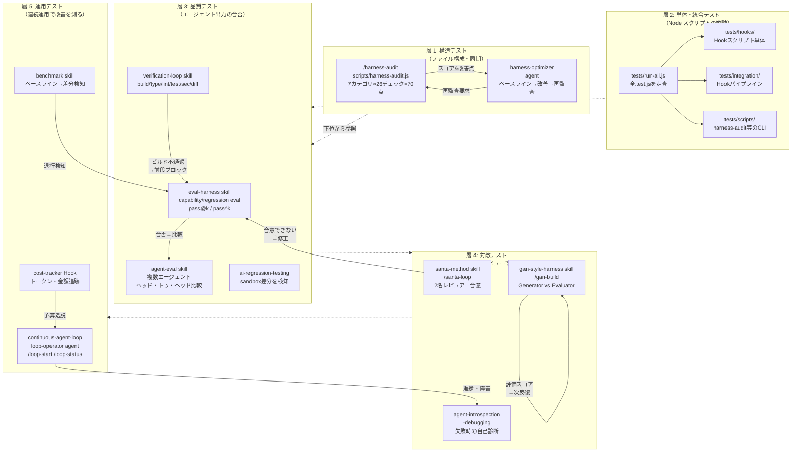
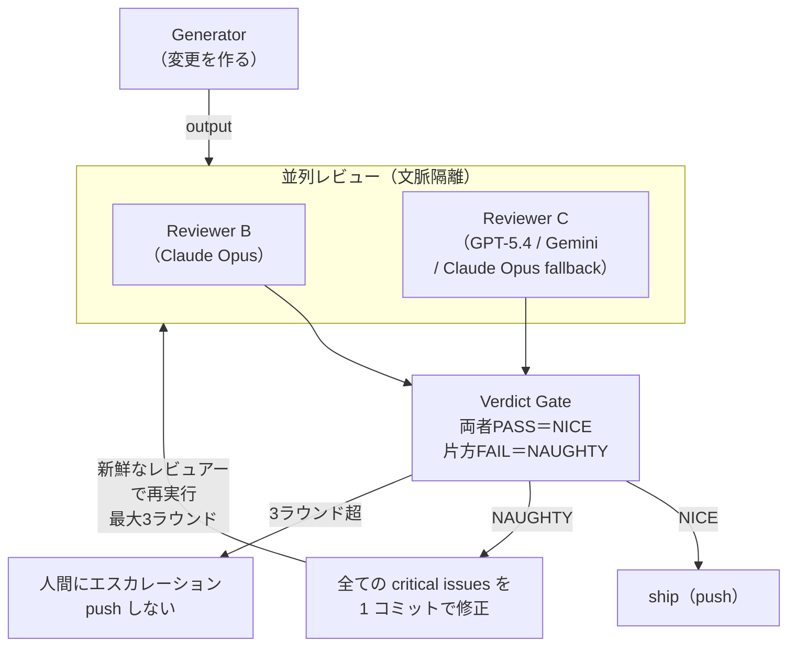
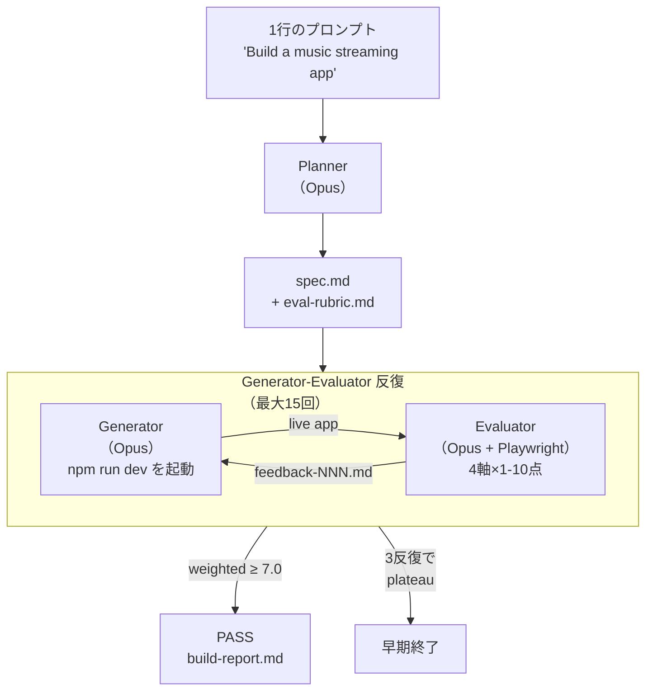

# エージェントハーネスをテストする方法 — 調査レポート

**調査日:** 2026-04-16
**対象リポジトリ:** everything-claude-code（ECC、v1.9 系）
**調査者:** Claude Opus 4.6
**対象領域:** ECC の skill・command・agent・script を用いた「エージェントハーネスのテスト」手法の総覧

---

## 0. このレポートの位置づけ

ECC にはハーネスを**作る・運用する**ための資料（[DEEP-DIVE-HARNESS-ARCHITECTURE.md](../2026-03-20_agent-harness-performance-system/DEEP-DIVE-HARNESS-ARCHITECTURE.md)、[HARNESS-ENGINEERING-GUIDE.md](../2026-03-20_agent-harness-performance-system/HARNESS-ENGINEERING-GUIDE.md)）が既に存在する。本レポートはそれらとは視点を変え、**完成したハーネスを「テストする」方法**に焦点を当てる。すなわち、ハーネス自体の品質・一貫性・退行防止をどう担保するかを、ECC 内部の道具立てを用いて具体的に示す。

「ハーネスをテストする」という言葉は曖昧に聞こえるが、ECC が提供する道具群に照らすと次の五つの問いに分解できる。ハーネスの構造（hook・agent・skill・command の顔ぶれ）は正しいか。ハーネスの部品（個々の Node スクリプト・Hook）は仕様通りに動くか。ハーネスを通したエージェント出力の**品質**は基準を満たすか。ハーネスを通した自律ループは**安全に**止まるか。そして、ハーネスの改善によって完了率やコストが実際に**改善しているか**。ECC はこれら五つの問いに対して、それぞれ専用の skill・command・agent を用意している。

本レポートのゴールは、この対応関係を整理し、実際のワークフローに落とし込むことである。

---

## 1. 「ハーネスをテストする」を五層に分解する

ハーネスは単一のコンポーネントではない。Hook・agent・skill・command・MCP サーバー・ルールといった多層の構成物が、1 つのエージェントセッションの中で協調して動く。このため「テストする」という行為も単一ではなく、複数の層に分けて設計する必要がある。

次の表は、本レポートが扱う五つのテスト層と、ECC が提供する主要な道具の対応関係である。各層が答えるべき問いを明確にしたうえで、後続の節で具体的なワークフローを示す。

| 層 | 答えるべき問い | 代表的な道具（ECC） | 性質 |
|----|--------------|-------------------|-----|
| 1. 構造テスト | ハーネスに必要な部品は揃っているか | `/harness-audit` + `harness-optimizer` エージェント | 決定的（ヒューリスティクス排除） |
| 2. 単体・統合テスト | 個々のスクリプトと Hook パイプラインは動くか | `tests/` ツリー（`tests/run-all.js`） | 決定的（Node の assert） |
| 3. 品質テスト | エージェント出力は品質基準を満たすか | `eval-harness` skill、`agent-eval` skill、`verification-loop` skill | 半決定的（code grader 中心、model grader 併用） |
| 4. 対敵テスト | 出力の盲点を別視点で検出できるか | `santa-method` skill、`/santa-loop`、`gan-style-harness` skill | 非決定的（独立レビュアーによる合意） |
| 5. 運用テスト | 連続運用で完了率・コストは改善しているか | `continuous-agent-loop` + `loop-operator`、`benchmark` skill、`/loop-status` | 長期観測型 |

この分解は恣意的ではなく、ECC の skill・command がほぼそのままこの軸に沿って整理されている。特に層 1 と層 2 は CI で自動化しやすく、層 3〜5 は実稼働のエージェントセッションと組み合わせて運用することで初めて意味を持つという性質の違いがある。

---

## 2. 全体像 — どの道具を、どの層に使うか

次の図は、ECC 内に存在するテスト関連のスキル・コマンド・エージェントを五層の上にマッピングしたものである。ECC を「ハーネスを作る道具箱」としてだけでなく「ハーネスをテストする道具箱」として俯瞰できる。



図の縦方向は「より粗い・構造的なテスト」から「より運用的・エージェント品質に踏み込むテスト」への流れである。層 1 と層 2 はコミット単位で高速に回せるのに対し、層 3 以降は実セッションやエージェント実行を伴うため、実行コストが段階的に高くなる。このため、下位の層で検出できる問題は上位まで持ち込まない、というテストピラミッドと同型の設計指針が有効である。

---

## 3. ワークフロー A — 構造テスト（`/harness-audit`）

### 3.1 目的と思想

ハーネスの品質を議論する前に、そもそも**ハーネスが揃っているか**を確認する必要がある。Hook 設定ファイルが失われている、セッション永続 Hook が消えている、あるいは Cursor 用と Claude Code 用のコマンド定義が乖離している、といった構造のほころびは、上位層のテストでは検出しづらい。

`/harness-audit` はこの構造ドリフトを、LLM の主観に頼らず、**ファイル存在と閾値チェックだけで**検出する。スクリプト本体は `scripts/harness-audit.js`（513 行）であり、同一コミットに対して常に同一のスコア（JSON 出力）を返す決定性を保っている。ルブリックバージョンは `2026-03-30` であり、このバージョンが変わらない限り過去の監査結果と直接比較できる。

### 3.2 実行方法と出力

監査はリポジトリ内からでも、ECC プラグインを利用する「consumer プロジェクト」からでも実行できる。スクリプトは cwd を起点にモード（`repo` か `consumer`）を自動判定する。

```bash
# このリポジトリ自身を監査
node scripts/harness-audit.js repo --format text

# JSON 出力（CI パイプライン向け）
node scripts/harness-audit.js repo --format json

# スコープ限定（hooks / skills / commands / agents のいずれか）
node scripts/harness-audit.js hooks --format json

# 別リポジトリを監査
node scripts/harness-audit.js repo --root /path/to/consumer --format json
```

スコアは 7 カテゴリ（Tool Coverage、Context Efficiency、Quality Gates、Memory Persistence、Eval Coverage、Security Guardrails、Cost Efficiency）× 各 10 点、合計 70 点で算出される。カテゴリの内訳と各 26 チェックの詳細は、既存ドキュメント [HARNESS-ENGINEERING-GUIDE.md §3 Step 1](../2026-03-20_agent-harness-performance-system/HARNESS-ENGINEERING-GUIDE.md) に記載されている。

テスト観点で特に重要なのは次の 4 点である。

1. **Quality Gates カテゴリ**は `tests/run-all.js` の存在、`package.json` の `test` スクリプトが `validate-commands.js` と `tests/run-all.js` の双方を含むこと、`tests/hooks/hooks.test.js` の存在、`scripts/doctor.js` の存在を確認する。つまり**層 2 の整備状況**が直接スコアに表れる。
2. **Eval Coverage カテゴリ**は `skills/eval-harness/SKILL.md`、`commands/eval.md`、`commands/verify.md`、`commands/checkpoint.md`、および `tests/` 以下の `.test.js` ファイル数（10 件以上）を確認する。**層 3 の整備状況**を測る。
3. **Security Guardrails カテゴリ**は `skills/security-review/SKILL.md`、`agents/security-reviewer.md`、`hooks/hooks.json` に `PreToolUse` または `beforeSubmitPrompt` があること、`commands/security-scan.md` の存在を確認する。
4. **Tool Coverage カテゴリ**の `tool-command-parity` チェックは、`commands/harness-audit.md` と `.opencode/commands/harness-audit.md` の**完全一致**を要求する。クロスハーネスの同期ドリフトを検出する唯一のチェックである。

### 3.3 既存のテスト（自己テスト）

監査スクリプト自身も `tests/scripts/harness-audit.test.js` でテストされている。テスト項目は以下であり、これらは CI の `tests/run-all.js` 経由で毎回実行される。

| テスト項目 | 検証内容 |
|-----------|---------|
| JSON 出力の決定性 | 同一リポジトリで 2 回実行した結果が完全一致すること |
| スコアの有界性 | 各カテゴリ 0〜10 点、合計 0〜70 点に収まること |
| スコープ絞り込み | `hooks` スコープ指定時に、チェックリストが hooks 関連のみに絞られ、max_score が減少すること |
| テキスト出力の構造 | サマリーヘッダーと Top 3 Actions セクションが含まれること |
| consumer モード検出 | `~/.claude/plugins/` や `.claude/plugins/marketplaces/` にプラグインが存在する場合、consumer プロジェクト監査モードに切り替わること |

つまり `/harness-audit` は「ハーネスの構造テスト」であると同時に、その監査スクリプト自身も「層 2 の単体テスト」でカバーされているという二重構造を持つ。

### 3.4 harness-optimizer エージェントとの接続

監査はスコアを返すだけで、スコアを上げる責務は `harness-optimizer` エージェント（`agents/harness-optimizer.md`、Sonnet モデル）に委譲される。このエージェントのワークフローは、ベースラインスコア取得 → 上位 3 レバレッジ領域の特定（Hook・eval・ルーティング・コンテキスト・セキュリティのいずれか）→ 最小限で可逆な設定変更の提案 → 適用 → 再監査によるビフォー/アフター差分の報告、という閉ループを形成する。

ここが「ハーネスをテストする」ための最も原始的なループである。スコアという**客観指標**が存在するからこそ、エージェントによる改善が検証可能になる。Mitchell Hashimoto の「エージェントが間違えるたびに環境を改善する」という原則を、ECC は `/harness-audit` のスコアとして数値化している。

---

## 4. ワークフロー B — 単体・統合テスト（`tests/` ツリー）

### 4.1 テストランナーの構造

ECC のテストは Node.js 標準の `assert` モジュールをベースに、軽量な `test(name, fn)` ヘルパーで書かれている。フレームワーク依存を避けているため、`node tests/**/*.test.js` だけで個別実行できる。ランナーは `tests/run-all.js` の 118 行のスクリプトであり、`tests/` 配下を再帰的に走査して `**/*.test.js` に合致するファイルを抽出し、順次 `spawnSync` で実行して passed/failed を集計する。

ディレクトリ構造は、テスト対象を層別に分けている。

| ディレクトリ | テスト対象 |
|------------|-----------|
| `tests/hooks/` | 各 Hook スクリプト単体（stdin/stdout の JSON シリアライゼーション、環境変数制御、matcher 照合など） |
| `tests/integration/` | Hook スクリプトを `spawn` で実際に起動し、パイプライン全体の挙動を検証 |
| `tests/scripts/` | `harness-audit.js`、`doctor.js`、`claw.js` など CLI スクリプト |
| `tests/lib/` | `scripts/lib/` 配下の共通ライブラリ（hook-flags、state-store、session-manager など） |
| `tests/ci/` | CI 固有の検証（agent YAML の妥当性、ワークフローのセキュリティなど） |

このディレクトリ割りは、そのまま「どの層の何をテストしているか」を示している。

### 4.2 Hook テストの具体パターン

Hook はエージェントハーネスの中で最も「動的に呼ばれる」部分である。stdin で受け取った JSON を解析し、副作用（stderr への警告出力、`hookSpecificOutput` による context 注入、非ゼロ exit による遮断）を通じてエージェントに影響する。このためテストは次の 3 軸で構成される。

**環境変数制御のテスト（`tests/hooks/hook-flags.test.js`）**

`scripts/lib/hook-flags.js` は、`ECC_HOOK_PROFILE` と `ECC_DISABLED_HOOKS` の判定ロジックを提供する。テストは `withEnv({})` ヘルパーで環境変数を一時的に差し替え、各組み合わせで `isHookEnabled()` が期待通りの真偽値を返すことを確認する。プロファイルが `standard` のときに `strict` 限定 Hook がスキップされる、`ECC_DISABLED_HOOKS=post:edit:format` が指定されていれば同 Hook がプロファイルに関係なく無効化される、といった矩形の行列が検証対象である。

**Hook スクリプト単体のテスト（`tests/hooks/*.test.js`）**

例えば `quality-gate.test.js` は、stdin にファイルパス付きの JSON を流し込み、`scripts/hooks/quality-gate.js` が期待通りのエラーメッセージを stdout に出すかを検証する。Hook は stateless に設計されているため、モック不要で実行可能である。

**パイプライン統合テスト（`tests/integration/hooks.test.js`）**

ここでは `spawn` で Hook スクリプトを子プロセスとして起動し、stdin に JSON を書き込み、stdout・stderr・exit code をまとめて検査する。特にタイムアウト付きの非同期 Hook（`post:quality-gate` の `async: true` + 30 秒タイムアウト）の挙動を再現できる唯一のテスト方式である。

### 4.3 テストを書くときの既知の制約

Node.js 標準の assert のみを使うため、フレームワークに依存した「describe/it のネスト」「モック自動生成」「snapshot テスト」は利用できない。これは意図的な制約であり、ECC が「Claude Code プラグイン」として最小依存で動くことを重視した設計判断である。

代わりに次の規約が守られている。テストファイルは対応するソースファイルと同じ階層構造に置く（例: `scripts/lib/hook-flags.js` → `tests/hooks/hook-flags.test.js`）。環境変数は必ず `withEnv` パターンで救出して restore する。ファイルシステムを使うテストは `fs.mkdtempSync` で一時ディレクトリを作成し、`fs.rmSync({ recursive: true, force: true })` で必ず後片付けする。`.claude/rules/node.md` の「新規 Hook には必ず integration テストを追加する」という規約が、この層の網羅性を担保している。

---

## 5. ワークフロー C — 品質テスト（`eval-harness` と関連 skill）

### 5.1 Eval-Driven Development（EDD）という発想

層 1・2 がハーネスの**静的な整合性**を確認するのに対し、層 3 の品質テストはエージェントの**出力**を評価する。コードが仕様通りであることを保証するにはユニットテストだけでは不十分であり、「仕様に含まれるべき要件を網羅しているか」「既存機能を壊していないか」を LLM 出力そのものに対して問う必要がある。

ECC の `eval-harness` skill は、これを「AI 開発におけるユニットテスト」として位置付け、次の原則を掲げている。実装前に期待される振る舞いを定義する。開発中に継続的に eval を回す。各変更で退行を追跡する。信頼性は `pass@k` 指標で測る。

**重要な前提:** `eval-harness` は自動実行ランナーを持たない **Markdown ベースのプロトコル**である。`/eval` コマンド（`commands/eval.md`）は skill への legacy shim にすぎず、背後に `npm test` のような独立した実行基盤は存在しない。SKILL.md 内で説明されている code grader（`npm test`、`grep -q` など）は、利用者が自分で bash スクリプトや Jest/pytest に組み込んで初めて決定的に実行できる。以降の説明はこの前提を踏まえて読む必要がある。

### 5.2 Eval 定義と実行の流れ

Eval は Markdown ファイルとして `.claude/evals/<feature>.md` に保存される。2 種類の eval が組み合わされる。

**Capability eval** は、新機能が要件を満たすかを確認する。ユーザーが新規登録できる、有効なメールアドレスでログインできる、といった能力単位で定義する。

**Regression eval** は、既存機能が壊れていないかを確認する。変更前のコミット SHA をベースラインとして固定し、同じテスト群を変更後に再実行して合否を比較する。

判定は次の 4 種のグレーダーで行われる。

| グレーダー | 適用場面 | 信頼度 |
|-----------|---------|-------|
| Code grader | `npm test`、`grep -q`、ビルド成否など決定的チェック | 高 |
| Rule grader | 正規表現、JSON Schema による構造検証 | 中〜高 |
| Model grader（LLM-as-judge） | 文章品質、設計判断など主観的評価 | 中（ノイズあり） |
| Human grader | セキュリティに関わる最終判断 | 最高（ただしスケールしない） |

この 4 段階は冗長ではなく、**下位グレーダーで判定できないケースだけ上位グレーダーに委ねる**という委譲関係にある。

### 5.3 pass@k と pass^k の使い分け

`pass@k` は「k 回試行して少なくとも 1 回成功する」確率で、現実的なリトライ許容下での信頼性を測る。`pass^k` は「k 回連続で成功する」確率で、リリースクリティカルな経路の安定性を測る。`eval-harness` skill は capability eval については `pass@3 ≥ 0.90`、regression eval については `pass^3 = 1.00`（3 回連続成功）を推奨している。

この閾値を CI ゲートとして使うには、code grader 部分を bash/Jest/pytest に自分で落とし込む必要がある。eval-harness 自身は閾値を自動判定しない。ただし、code grader を実装して pass rate を追跡する基盤を一度作れば、pass rate の低下がハーネスの問題を示す合図になり、層 1 の `/harness-audit` や層 4 の対敵レビューで原因を掘り下げる、という接続が自然に生まれる。

### 5.4 `agent-eval` — エージェント同士のヘッド・トゥ・ヘッド比較

`eval-harness` が同一エージェントの品質を時系列で追うのに対し、`agent-eval` skill は**別のエージェント同士を同じタスクで競わせる**ことに特化している。Claude Code、Aider、Codex といった選択肢のどれを採用すべきか、あるいはモデルを Sonnet から Opus に切り替えるべきか、といった判断を「雰囲気」ではなく「データ」で下すための仕組みである。

タスクは YAML で宣言的に定義され、git worktree で各エージェントを隔離して実行する。収集される指標は pass rate、API コスト、所要時間、再現性（複数試行の一貫性）の 4 つである。ハーネス改善の効果を測るときに、このツールで「同じタスクが Opus と Sonnet でどう違うか」を定量化できる。

### 5.5 `verification-loop` — コミット前の 6 フェーズ検証

`verification-loop` skill は品質テストの中でも「決定的な合否判定」を担う。build、type、lint、test、security scan、diff review の 6 フェーズを順に走らせ、どのフェーズで失敗したかを報告する。`/verify` コマンドはこの skill の legacy shim であり、内部は skill 本体に委譲される。

重要なのは順序である。build が通らなければ type は意味を持たず、test が通らなければ security scan は優先度が下がる。この直列依存を明示している点が、単に `npm test && npm run build` を並べた CI スクリプトとの違いである。

### 5.6 `ai-regression-testing` — AI 固有の退行パターン

AI が書いたコードを AI が自己レビューすると、**同じ思い込み**が生成・レビューの両段階で働いて退行を見逃す、という構造的な盲点がある。`ai-regression-testing` skill はこの盲点を突く 4 パターン（sandbox/本番の応答形状不一致、SELECT 節の欠損、エラー状態のリーク、楽観更新のロールバック欠如）を具体的なテストコードで例示している。これらは従来型のテスト設計からは想起しづらいが、実際のセッションで繰り返し観察される退行なので、層 2 のテスト資産に「既知の AI 特有退行」として加える価値がある。

---

## 6. ワークフロー D — 対敵テスト（`santa-method` と `gan-style-harness`）

### 6.1 なぜ対敵が必要か

層 3 の eval は「基準を明文化して機械的に判定する」アプローチだが、基準自体を一人のエージェントが作ると、その基準に生成物が寄ってしまう。すなわち、生成と評価を同じモデル・同じ文脈で行うと、同じバイアスが両段階に波及する。これを防ぐのが**対敵テスト**である。ECC には思想の異なる 2 つの skill がある。

### 6.2 `santa-method` — 2 名レビュアーによる収束ループ

`santa-method` skill は「リストを作り、二度確認する」という単純な原則を、コード変更の合否判定に適用する。Generator が出力を作ったあと、Reviewer B と Reviewer C という**文脈が完全に隔離された**独立レビュアーが並列に動作し、同一ルブリックで評価する。両方が PASS（NICE）を返した場合のみ出力を採用する。いずれかが FAIL（NAUGHTY）を返した場合、両者の critical issues をマージしてから修正し、**新鮮なレビュアー**で再評価する。最大 3 ラウンドで収束しなければ人間にエスカレーションする。

重要なのは「同じレビュアーを再利用しない」ことである。前ラウンドの findings を持ち越すと anchoring bias が生じ、一度合意したことをひっくり返せなくなる。毎ラウンド新規のサブエージェントを spawn することで、独立性を強制する。



### 6.3 `/santa-loop` コマンドによる実装

この skill は `/santa-loop` コマンド（`commands/santa-loop.md`）で即座に起動できる。コマンドは次の 7 ステップを Claude に指示する。

1. レビュー対象を特定（引数 or `git diff --name-only HEAD`）
2. ファイル種別に応じたルブリックを構築（最低 6 項目: 正当性、セキュリティ、エラー処理、完全性、内部整合性、退行なし）
3. 並列 2 レビュアーの起動（A: `code-reviewer` agent、B: `codex` CLI → `gemini` CLI → Claude agent fallback の優先順で外部モデルを優先）
4. Verdict Gate（両者 PASS なら NICE）
5. NAUGHTY なら Fix Cycle（指摘全件を修正してコミット、フレッシュレビュアーで再実行、最大 3 ラウンド）
6. NICE なら `git push -u origin HEAD`
7. 最終レポート出力

特筆すべき設計は、Reviewer B が可能な限り**別モデル**（GPT-5.4 または Gemini 2.5 Pro）になるよう CLI の存在を順に検出する点にある。モデルの多様性は「異なる訓練データと異なる盲点」を担保するため、同じ Claude 系で context だけ分離するよりも強力な独立性が得られる。

### 6.4 `gan-style-harness` — Generator/Evaluator の 5〜15 反復

`santa-method` が「二者の合意で合否を決める」のに対し、`gan-style-harness` skill は「Generator と Evaluator の**反復**」で品質を引き上げる。Anthropic の 2026 年 3 月のハーネス設計論文に基づき、次の 3 エージェントを組み合わせる。

- **Planner（`gan-planner` agent）**: 1 行のプロンプトを 12〜16 機能の完全な仕様に展開する。野心的に書くよう指示されている（保守的な仕様は退屈な結果を招く）。
- **Generator（`gan-generator` agent）**: spec.md を読んで実装する。Evaluator からのフィードバックを `feedback-NNN.md` として毎反復読み込み、critical issues を優先順に修正する。
- **Evaluator（`gan-evaluator` agent）**: Playwright MCP で live app をインタラクティブに操作し、Design Quality / Originality / Craft / Functionality の 4 軸を 1〜10 で採点する。重み付き合計が閾値（デフォルト 7.0）に達するまで、Generator が次反復を回す。



実行は `scripts/gan-harness.sh` か `/gan-build` コマンドで行う。前者は bash スクリプトによる直接制御、後者は Claude が Task ツールで 3 agent を順に呼び出すプロトコルである。実績としては Anthropic の原論文通り、1 回ごとに $125〜$200・4〜6 時間をかけて、単独 agent では到達できない水準の UI を得られる。

### 6.5 `agent-introspection-debugging` — 失敗時の自己診断

対敵テストが「出力の良し悪し」を問うのに対し、`agent-introspection-debugging` skill は「失敗したエージェントがなぜ失敗したか」を問う。Maximum tool calls に到達した、同じコマンドを繰り返している、context が膨張して推論が劣化している、といった**失敗パターン**ごとに診断チェックを示し、Failure Capture → Root-Cause Diagnosis → Contained Recovery → Introspection Report の 4 フェーズで整理された報告書を生成する。

この skill はテストそのものではないが、「ハーネスが完成している」ことを検証する上で欠かせない。連続ループが失敗したときに人間が介入するのではなく、エージェント自身がフェーズ 4 の構造化レポートを残せるかどうかは、ハーネスの成熟度を測るベンチマークでもある。

---

## 7. ワークフロー E — 運用テスト（`continuous-agent-loop` と `benchmark`）

### 7.1 単発テストと運用テストの違い

層 1〜4 は基本的に「1 回のコミット・1 回のタスクの合否」を問う。しかしハーネスの価値は**連続稼働**でこそ顕在化する。1 日 30 PR を回しても完了率が落ちないか、累積コストが計画通りに収まるか、同じスタックトレースの障害が再発していないかといった問いは、単発テストでは測れない。これを扱うのが層 5 の運用テストである。

### 7.2 `continuous-agent-loop` と `loop-operator` の組み合わせ

`continuous-agent-loop` skill は自律ループの 4 パターン（sequential、continuous-pr、rfc-dag、infinite）を整理する。運用テストの観点では、各パターンに**どの停止条件と観測指標を組み込むか**が設計の主眼となる。

`loop-operator` agent（`agents/loop-operator.md`、Sonnet）はこの観測を担う。運用前チェックとして、品質ゲートが active か、eval ベースラインが存在するか、ロールバック経路があるか、worktree 隔離が設定されているか、を確認する。運用中は次の 4 条件でエスカレーションする。

| エスカレーション条件 | 意味するもの |
|--------------------|------------|
| 2 連続チェックポイントで進捗なし | ループが空転している |
| 同一スタックトレースの繰り返し失敗 | 根本原因が未解決のまま同じ失敗を再生産している |
| コスト偏差が予算を逸脱 | トークン消費がコントロール外になっている |
| マージコンフリクトによるキュー停滞 | rfc-dag での eviction が連鎖している |

この 4 条件は、ハーネスのテストでもある。例えば「進捗なし」が起きた場合、それはループロジックのバグなのか、あるいは層 2 の Hook が遅延を生んでいるのか、という原因特定が必要になる。`loop-operator` はエスカレーションシグナルを出すだけで、層 1 の `/harness-audit` と層 3 の eval を組み合わせて、人間または harness-optimizer が原因を切り分ける。

### 7.3 `/loop-start` と `/loop-status` によるランブック化

`/loop-start [pattern] [--mode safe|fast]` は、ループ開始前の 5 ステップ（リポジトリ状態確認 → パターン選択 → Hook プロファイル確認 → ランブック作成 → 開始・監視コマンド提示）を Claude に指示するプロンプトテンプレートである。ランブックは `.claude/plans/` に保存され、停止条件・リカバリ手順・コスト上限が明文化される。

`/loop-status [--watch]` は稼働中ループのフェーズ・最終チェックポイント・コスト逸脱・推奨介入を報告する。運用テストでは、この出力自体を**テストアーティファクト**として保存することで、後日の振り返りや退行分析に使える。

### 7.4 `benchmark` skill — ベースラインと退行検知

`benchmark` skill は、PR 前後のパフォーマンス差分を測るためのツールである。モード 1 は Web ページ性能（Core Web Vitals、バンドルサイズ）、モード 2 は API 性能（p50/p95/p99 レイテンシ）、モード 3 はビルド性能（cold build、HMR、テスト時間）、モード 4 はベースライン/比較モード（`.ecc/benchmarks/` に JSON を保存）である。

ハーネステストとしての使い方は「層 1 のスコアを上げる改善が、層 5 の実測値として退行を起こしていないか」を検証することである。例えば Hook を増やしてセキュリティスコアが上がったが、PostToolUse の実行時間が膨らんで HMR が遅くなった、というような事態を `benchmark compare` で検知できる。

### 7.5 `cost-tracker` Hook

`scripts/hooks/cost-tracker.js` は Stop Hook として `minimal`/`standard`/`strict` の全プロファイルで動作する。セッション終了時にトークン消費とコストのメトリクスを非同期で記録する。長期の連続運用では、このログが「ハーネス改善前後でコスト効率がどう変わったか」を検証する唯一の一次データとなる。

---

## 8. テスト導入のロードマップ

ここまで五層のテストを紹介したが、すべてを同時に立ち上げる必要はない。次の段階的ロードマップは、既存の [HARNESS-ENGINEERING-GUIDE.md](../2026-03-20_agent-harness-performance-system/HARNESS-ENGINEERING-GUIDE.md) のハーネス構築ロードマップと並走する形で、テスト側の整備を段階的に行う構成である。

| 期間 | やること | 使う ECC 機能 | ゴール |
|------|---------|--------------|-------|
| Week 1 | 構造テストの導入 | `/harness-audit` を CI に組み込み、ベースラインスコアを main ブランチに固定 | スコア退行を PR レベルで検知できる |
| Week 2-3 | 層 2 の整備 | `tests/run-all.js` を全ての変更でローカル・CI の両方で実行。Hook 追加時は `tests/hooks/` と `tests/integration/` の双方を追加 | 既存テスト 900 件以上を維持、新規 Hook の退行率 0% |
| Week 4-6 | 層 3 の eval 基盤 | `eval-harness` プロトコルを採用し、クリティカルな 3〜5 機能の eval 定義を `.claude/evals/` に作成。code grader 部分を bash/Jest/pytest で実装して CI に組み込む。`verification-loop` を PR 前に必ず通す | code grader の pass rate を追跡開始 |
| Month 2 | 層 4 の対敵テスト | `/santa-loop` を高リスク変更（認証・課金・マイグレーション）で必須化。AI slop リスクのある UI 生成には `/gan-build` を採用 | 対敵合意なしでの本番投入をゼロに |
| Month 3+ | 層 5 の運用テスト | `continuous-agent-loop` の sequential → continuous-pr の順で自律ループを立ち上げ、`loop-operator` のエスカレーションを監視。`benchmark` でベースラインを PR 単位で比較 | コスト/タスク・完了率・CI pass rate を月次で追跡 |

この順序は恣意的ではなく、**下位層が整っていないと上位層が機能しない**という依存関係を反映している。例えば層 2 のテストが貧弱なままでは、層 3 の eval で「コードが壊れているのか、eval 定義が間違っているのか」が切り分けられない。層 3 のベースラインがないと、層 5 の連続ループは退行を検知できずに暴走する。

---

## 9. アンチパターン

ECC を使ってテストを設計するときに、陥りがちな失敗を整理する。これらは各 skill の「Anti-Patterns」セクションを横断的に抜き出し、ハーネステストの文脈で再編成したものである。

**層 1 のアンチパターン: 監査スコアの絶対視**
`/harness-audit` のスコアはファイル存在のチェックにすぎない。スコア 70/70 でもハーネスが正しく動くとは限らない。スコアは「最低限ここまでは揃っている」という意味であって、「ここから先は大丈夫」という意味ではない。層 2〜5 のテストが実際のエージェント動作を検証する。

**層 2 のアンチパターン: 同期的 Hook を 200ms 以上にしてしまう**
`.claude/rules/node.md` の規約通り、Blocking Hook（PreToolUse、Stop）は 200ms 以下に保つ。これを破ると、エージェントの応答全体が遅延する。ネットワーク呼び出しはすべて `async: true` の Hook にし、タイムアウトを 30 秒以下に設定する。これは層 5 のベンチマークで確認すべき。

**層 3 のアンチパターン: 主観的な eval 基準**
`eval-harness` は明示的に「subjective drift」を警告している。ルブリックは pass/fail が客観的に判定できるものだけで構成する。「見た目がきれい」「可読性が高い」といった主観基準は必ず具体化する（例: 「関数あたり 50 行以下」「コメント率 20% 以上」）。

**層 4 のアンチパターン: レビュアーの非独立性**
`santa-method` の「Reviewer Agreement Bias」として警告される失敗。両レビュアーを同じ Claude Opus の同じ context で動かすと、**二人ともが同じ盲点を見逃す**。最低でもサブエージェントによる context 隔離を、できれば外部モデル（GPT-5.4、Gemini 2.5 Pro）を Reviewer B に当てる。

**層 5 のアンチパターン: 停止条件のない自律ループ**
`continuous-agent-loop` は「Infinite loops without exit conditions」を最大のリスクとする。`--max-runs`、`--max-cost`、`--max-duration`、completion signal の少なくとも一つを必ず設定する。これらが欠けたループは `loop-operator` のエスカレーション機構が機能しても原理的に止まらない。

**横断アンチパターン: テストを実装のあとに書く**
全層共通の失敗。`eval-harness` は「Define evals BEFORE coding」を第一原則とする。ハーネス変更と同時に、その変更が壊しうる層のテストを追加する。特に層 1（harness-audit の新チェック項目）と層 3（新機能の eval）は、コードと同じ PR に含めることでスコアの退行を即時に検知できる。

---

## 10. まとめ — ハーネステストは道具箱がすでに揃っている

本レポートで示したように、「エージェントハーネスをテストする」という問いは、ECC の道具立てに照らすと五層の具体的なワークフローに分解できる。層 1 の `/harness-audit` は構造の整合性を決定的にスコア化し、層 2 の `tests/` ツリーは Hook とスクリプトを単体・統合の両レベルで検証する。層 3 の `eval-harness`、`agent-eval`、`verification-loop`、`ai-regression-testing` は出力品質を pass@k で測り、層 4 の `santa-method`、`gan-style-harness`、`agent-introspection-debugging` は独立レビュアーと反復ループによって盲点を補う。層 5 の `continuous-agent-loop`、`loop-operator`、`benchmark`、`cost-tracker` Hook は連続運用の挙動を観測する。

それぞれの層は独立して運用できるが、真価は**連結して使うとき**に現れる。層 5 の運用テストで退行が検知されたら層 3 の eval で原因を切り分ける。層 3 の eval が失敗し始めたら層 1 の `/harness-audit` で構造ドリフトを疑う。層 1 のスコアが下がったら層 2 の新規テストで根本原因を特定する。層 2 のテストが通っても層 4 の対敵レビューで合意が得られなければ、より深い設計的な問題を検討する。こうした階層的なデバッグ経路を ECC はすでに道具として用意している。

ハーネスエンジニアリングがモデル交換よりも一桁大きいインパクトを持つように、ハーネステストもまた、個別のプロンプト調整よりもはるかに大きい退行防止効果を持つ。本レポートで整理した五層のテスト戦略と導入ロードマップが、各リポジトリにおける段階的なテスト基盤構築の出発点となれば幸いである。

---

## 付録: 本レポートで参照した主要ファイル

### Skill

| ファイル | 役割 |
|---------|------|
| `skills/eval-harness/SKILL.md` | EDD 原則、capability/regression eval、pass@k |
| `skills/agent-eval/SKILL.md` | エージェント同士のヘッド・トゥ・ヘッド比較 |
| `skills/verification-loop/SKILL.md` | build/type/lint/test/security/diff の 6 フェーズ検証 |
| `skills/ai-regression-testing/SKILL.md` | AI 固有の退行パターン 4 種と対応テスト |
| `skills/santa-method/SKILL.md` | 2 名独立レビュアーによる収束ループ |
| `skills/gan-style-harness/SKILL.md` | Planner/Generator/Evaluator の反復 |
| `skills/agent-introspection-debugging/SKILL.md` | 失敗時の 4 フェーズ自己診断 |
| `skills/continuous-agent-loop/SKILL.md` | 自律ループの 4 パターンと安全機構 |
| `skills/agent-harness-construction/SKILL.md` | ハーネス設計の 4 原則と KPI |
| `skills/benchmark/SKILL.md` | 性能ベースラインと退行検知 |
| `skills/healthcare-eval-harness/SKILL.md` | CRITICAL/HIGH 閾値による安全ゲートの実例 |

### Command

| ファイル | 役割 |
|---------|------|
| `commands/harness-audit.md` | 構造テストの起動点 |
| `commands/santa-loop.md` | 対敵レビューの起動点 |
| `commands/gan-build.md`、`commands/gan-design.md` | GAN 反復の起動点 |
| `commands/eval.md`、`commands/verify.md`、`commands/checkpoint.md` | eval 関連コマンド（現在は skill への shim） |
| `commands/loop-start.md`、`commands/loop-status.md` | 自律ループのランブック化と観測 |
| `commands/quality-gate.md` | 品質パイプラインの手動起動 |
| `commands/model-route.md` | モデル選択の推薦 |

### Agent

| ファイル | 役割 |
|---------|------|
| `agents/harness-optimizer.md` | `/harness-audit` スコアから設定改善を自動化 |
| `agents/loop-operator.md` | 自律ループの安全運用 |
| `agents/gan-planner.md`、`agents/gan-generator.md`、`agents/gan-evaluator.md` | GAN スタイル反復の 3 役 |
| `agents/code-reviewer.md`、`agents/security-reviewer.md` | `/santa-loop` の Reviewer A に使われる既存レビューエージェント |

### Script

| ファイル | 役割 |
|---------|------|
| `scripts/harness-audit.js` | 構造テストの決定的エンジン（513 行、26 チェック） |
| `scripts/gan-harness.sh` | GAN 反復の bash 制御スクリプト |
| `scripts/hooks/run-with-flags.js` | Hook の実行ゲートキーパー |
| `scripts/lib/hook-flags.js` | `ECC_HOOK_PROFILE` と `ECC_DISABLED_HOOKS` の判定ロジック |
| `scripts/hooks/cost-tracker.js` | セッションコストの非同期記録 |

### Test

| ファイル | 役割 |
|---------|------|
| `tests/run-all.js` | 全 `.test.js` のランナー |
| `tests/scripts/harness-audit.test.js` | 監査スクリプトの決定性・有界性・スコープ検証 |
| `tests/hooks/hook-flags.test.js` | プロファイル・無効化判定の矩形テスト |
| `tests/hooks/hooks.test.js`、`tests/integration/hooks.test.js` | Hook の単体と統合 |

---

**関連ドキュメント:**

- [2026-03-20 Agent Harness Performance System 調査](../2026-03-20_agent-harness-performance-system/INVESTIGATION.md) — ハーネスそのものの構成要素
- [2026-03-20 Harness Engineering Guide](../2026-03-20_agent-harness-performance-system/HARNESS-ENGINEERING-GUIDE.md) — ハーネスを構築するための 6 ステップロードマップ
- [2026-03-20 Deep Dive Harness Architecture](../2026-03-20_agent-harness-performance-system/DEEP-DIVE-HARNESS-ARCHITECTURE.md) — `/harness-audit` の 26 チェック詳細
- [SKILL-LIFECYCLE-WORKFLOWS.md](./SKILL-LIFECYCLE-WORKFLOWS.md) — スキルの実装・テスト・強化の具体ワークフロー
