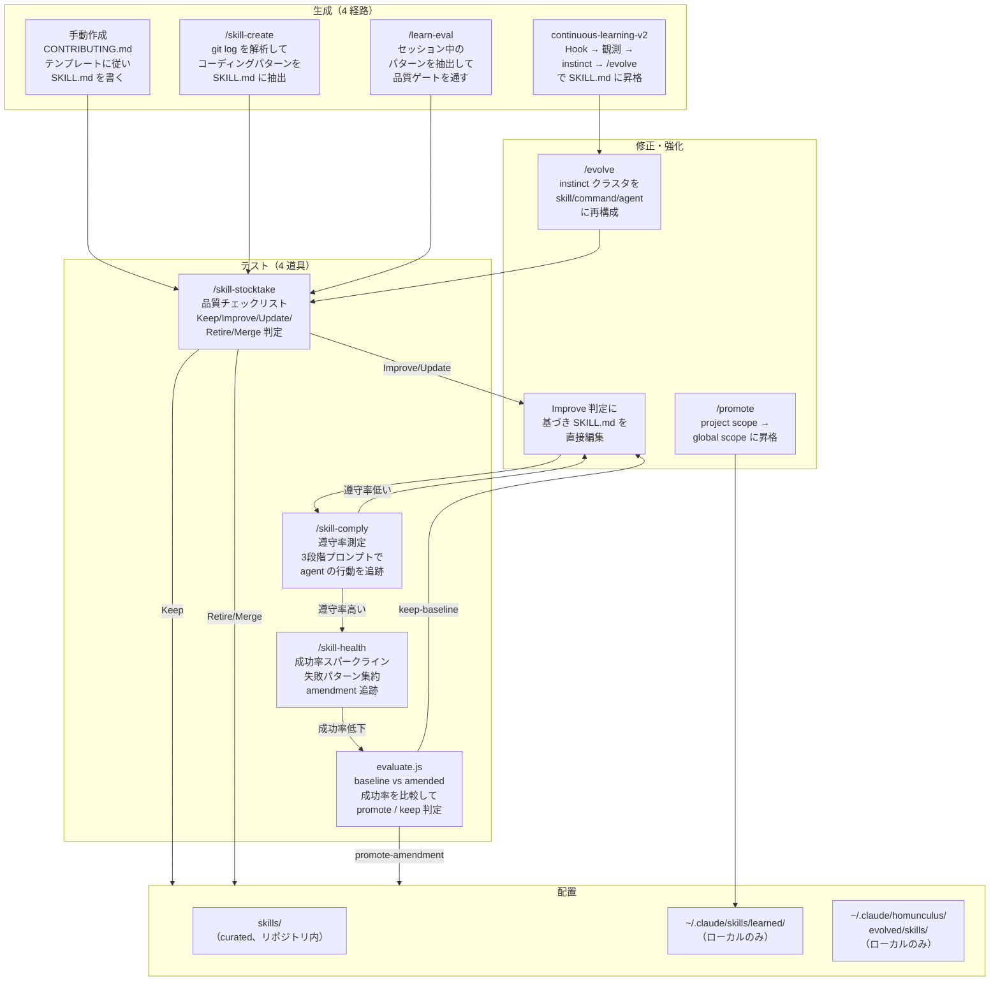
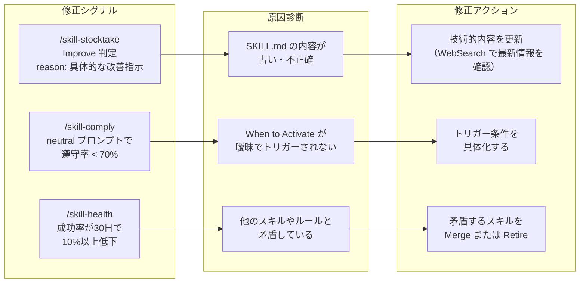
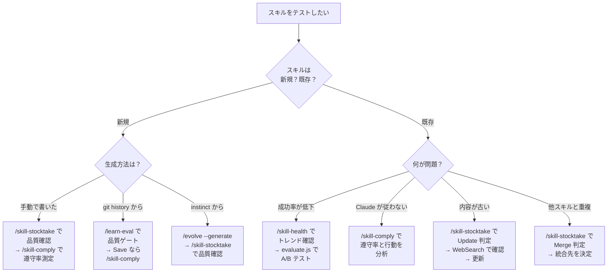

# スキルの実装・テスト・強化 — 具体ワークフローとユースケース

**作成日:** 2026-04-16
**対象リポジトリ:** everything-claude-code（ECC、v1.9 系）
**関連ドキュメント:** [INVESTIGATION.md](./INVESTIGATION.md)（五層テスト理論）

---

## 0. このドキュメントの目的

[INVESTIGATION.md](./INVESTIGATION.md) ではハーネス全体を「構造・単体・品質・対敵・運用」の五層でテストする理論を示した。本ドキュメントはそこから一歩踏み込み、ハーネスの最小単位である**スキル**に焦点を当てる。スキルを新しく作り、テストし、改善するまでの一連のライフサイクルを、ECC が提供する道具で具体的にどう回すかを示す。

「スキルをテストする」とは、SKILL.md ファイルの品質を形式的にチェックするだけではない。そのスキルが Claude に読まれたとき、**実際に Claude の振る舞いが変わるか**、変わった結果が**改善なのか退行なのか**を測ることまでを含む。ECC にはこの問いに答えるための道具が複数存在するが、それぞれの実装状態（自動実行スクリプトとして動くのか、Claude が読むプロトコルなのか）には差がある。本ドキュメントではこの区別を正確に示す。

---

## 1. スキルのライフサイクル全体像

スキルは 4 つの異なる経路で生まれ、テストと改善のループを経て、最終的に curated skill として ECC リポジトリに取り込まれるか、learned/evolved skill としてユーザーのローカル環境に残る。



図の左から右へ、スキルは「生成 → テスト → 修正 → 配置」を流れる。各ノードが ECC の具体的なコマンド・スクリプトに対応している。以降の節では、このフローの中で頻出する 4 つのワークフローを、操作手順・実行コマンド・判断基準まで含めて解説する。

---

## 2. 道具の実装状態 — 何が「動く」のか

ワークフローに入る前に、各道具の実装状態を正確に示す。[INVESTIGATION.md §5](./INVESTIGATION.md) で指摘した通り、ECC の道具には「Node/Python スクリプトとして自動実行できるもの」と「Claude が Markdown を読んで手順に従うプロトコル」の 2 種類がある。この区別を曖昧にすると、「テストを自動化した」と思ったのに実は Claude 依存だった、という事態が起きる。

| 道具 | 種別 | 実行方法 | 決定性 |
|------|------|---------|-------|
| `/skill-stocktake` | **プロトコル + bash スクリプト補助** | Claude がスキャン結果を読んで AI 判定する。`scripts/quick-diff.sh` と `scripts/scan.sh` がインベントリ収集を自動化 | 低（AI 判定） |
| `/skill-comply` | **Python CLI** | `uv run python -m scripts.run <path>` で自動実行。`claude -p` を内部で呼んで遵守率を測定 | 中（Claude の振る舞いに依存するが、ハーネスが決定的に計測） |
| `/skill-health` | **Node CLI** | `node scripts/skills-health.js --dashboard` で自動実行。成功率・失敗パターン・amendment を JSON/テキストで出力 | 高（ログベースの集計） |
| `evaluate.js` | **Node ライブラリ** | `scripts/lib/skill-improvement/evaluate.js` を `require()` して呼び出す。baseline vs amended の成功率を比較 | 高（数値比較） |
| `/skill-create` | **プロトコル** | Claude が git log を読んでパターン検出・SKILL.md 生成。自動スクリプトなし | 低（Claude 依存） |
| `/learn-eval` | **プロトコル** | Claude がセッションを振り返り、品質ゲート（4 項目チェックリスト + holistic verdict）を通す | 低（Claude 依存） |
| `/evolve` | **Python CLI** | `python3 instinct-cli.py evolve` で instinct のクラスタリングと候補提示を自動化 | 中（クラスタリングは決定的、生成は Claude 依存） |
| `/promote` | **Python CLI** | `python3 instinct-cli.py promote` で project → global のスコープ移動を自動化 | 高（ファイル操作のみ） |

この表から分かるように、スキルの**テスト**に関しては `/skill-comply`（Python CLI）、`/skill-health`（Node CLI）、`evaluate.js`（Node ライブラリ）の 3 つが自動実行可能な実装を持つ。一方、スキルの**生成と品質判定**（`/skill-create`、`/learn-eval`、`/skill-stocktake` の Phase 2）は Claude のセッション内で動くプロトコルである。

---

## 3. ワークフロー A — 手動でスキルを作り、品質を確認する

### 3.1 いつ使うか

新しいドメイン知識やワークフローを、最初から構造化された SKILL.md として作りたい場合。git history からの自動抽出では拾えない設計判断や、外部の知見を取り込む場合に適している。

### 3.2 手順

**Step 1: SKILL.md を書く**

`skills/<skill-name>/SKILL.md` を `docs/SKILL-DEVELOPMENT-GUIDE.md` のテンプレートに従って作成する。最低限必要なのは YAML frontmatter（`name`、`description`、`origin`）と、`## When to Activate` セクションである。

```markdown
---
name: kotlin-coroutines-patterns
description: Kotlin Coroutines と Flow の構造化された並行処理パターン
origin: ECC
---

# Kotlin Coroutines Patterns

## When to Activate
- Kotlin プロジェクトで非同期処理を実装するとき
- Flow の collect/transform チェーンを設計するとき
...
```

配置先は `docs/SKILL-PLACEMENT-POLICY.md` に従う。ECC リポジトリに取り込む curated skill は `skills/` に、個人用は `~/.claude/skills/learned/` に置く。

**Step 2: `/skill-stocktake` で品質を確認する**

```
/skill-stocktake
```

Phase 1 で `scan.sh` がインベントリを収集し、Phase 2 で Claude がチェックリスト（content overlap、MEMORY.md overlap、freshness、usage frequency）に照らして各スキルを判定する。新規スキルは Keep / Improve のいずれかが返るはずで、Improve の場合は `reason` フィールドに具体的な改善指示が示される。

判定は AI によるホリスティックな評価であり、数値スコアではない。ECC は意図的に数値ルブリックを排除している。`learn-eval` コマンドの設計理由書にも「Modern frontier models (Opus 4.6+) have strong contextual judgment — forcing rich qualitative signals into numeric scores loses nuance」と明記されている。

**Step 3: `/skill-comply` で遵守率を測る**

スキルを書いただけでは、Claude が実際にそれに従うかは分からない。`/skill-comply` はこの問いに答える唯一の自動実行可能なツールである。

```bash
# dry-run で spec と scenarios を確認
uv run python -m scripts.run --dry-run skills/kotlin-coroutines-patterns/SKILL.md

# 実行（claude -p を内部で 3 回呼ぶ）
uv run python -m scripts.run skills/kotlin-coroutines-patterns/SKILL.md
```

内部では以下が起きる。

1. SKILL.md から「期待される行動列」（spec）を自動生成する
2. 3 段階のプロンプト（supportive → neutral → competing）でシナリオを生成する
3. 各シナリオで `claude -p` を実行し、ツール呼び出し列を `stream-json` でキャプチャする
4. ツール呼び出しを spec のステップと LLM で照合し、遵守率を算出する
5. レポートを生成する（spec、プロンプト、遵守スコア、ツール呼び出しタイムライン）

**Prompt Independence** という概念が核にある。supportive プロンプト（「このスキルに従ってください」と明示）では遵守率が高いのは当然で、真に重要なのは neutral プロンプト（スキルに言及しない通常の依頼）での遵守率である。neutral で遵守率が低いなら、そのスキルは Claude の行動を十分に変えていない。competing プロンプト（スキルに反する指示）は最も厳しいテストで、スキルがどこまでの圧力に耐えるかを測る。

**Step 4: `/skill-health` で継続監視する**

```bash
node scripts/skills-health.js --dashboard
```

成功率のスパークライン（30 日推移）、失敗パターンのクラスタリング、pending amendments、バージョン履歴の 4 パネルが出力される。新しいスキルは初期データが少ないためスパークラインは不完全だが、利用が蓄積されるにつれて傾向が可視化される。成功率が低下し始めたら `/skill-stocktake` に戻って再評価する。

---

## 4. ワークフロー B — git history からスキルを自動生成する

### 4.1 いつ使うか

既存リポジトリのコーディング慣習を、新しいチームメンバーやエージェントに伝えたい場合。手動で SKILL.md を書くよりも、200 コミット分のパターンを機械的に抽出するほうが網羅的になることがある。

### 4.2 手順

**Step 1: `/skill-create` を実行する**

```
/skill-create --commits 200 --output ./skills
```

Claude が以下を順に実行する。

1. `git log --oneline -n 200 --name-only` でコミットとファイル変更を収集
2. コミット規約（conventional commits の比率）、ファイル共変（常に一緒に変更されるファイル群）、ワークフロー列（繰り返すファイル変更パターン）、テスト規約（テストファイルの配置・命名）を検出
3. 検出結果を SKILL.md 形式に整形して出力

ここで重要なのは、`/skill-create` は**自動実行スクリプトではない**ことである。git コマンドは Claude が Bash ツールで実行するが、パターン検出と SKILL.md 生成は Claude の判断に依存する。同じリポジトリで 2 回実行しても、完全に同一の結果が返る保証はない。

**Step 2: `/skill-stocktake` で品質を確認する**

自動生成されたスキルは品質にばらつきがある。`/skill-stocktake` を実行して Keep / Improve / Retire / Merge のいずれかの判定を得る。

```
/skill-stocktake
```

Claude が Phase 1（`scan.sh` によるインベントリ収集）→ Phase 2（チェックリストに基づくホリスティック判定）を実行し、各スキルに verdict を付与する。

| Verdict | 意味 | 次のアクション |
|---------|------|--------------|
| **Keep** | 一意で有用、内容が最新 | ワークフロー A の Step 3 へ |
| **Improve** | 価値はあるが修正が必要 | reason の指示に従い修正 → 再判定 |
| **Update** | 技術的参照が古い | WebSearch で確認のうえ更新 |
| **Retire** | 低品質・陳腐化・コスト非効率 | 削除を検討 |
| **Merge into [X]** | 他スキルと内容が重複 | 統合先に追記して本体を削除 |

なお `/learn-eval` は「現在のセッションからパターンを抽出して品質ゲートを通す」用途のコマンドであり、既に存在するファイルの品質判定には `/skill-stocktake` のほうが適切である。

**Step 3: 保存後に `/skill-stocktake` と `/skill-comply` で確認する**

Keep 判定を得たスキルに対して、ワークフロー A の Step 3〜4（`/skill-comply` で遵守率測定 → `/skill-health` で継続監視）を適用する。特に `/skill-comply` の neutral プロンプトでの遵守率が低い場合、スキルの「When to Activate」セクションの記述が弱い可能性があるので、トリガー条件をより具体的に書き直す。

---

## 5. ワークフロー C — セッションの学習から instinct → skill へ進化させる

### 5.1 いつ使うか

日常の Claude Code セッションで繰り返し現れるパターン（ユーザーによる修正、エラー解決の定石、特定のワークフロー）を、明示的に SKILL.md を書くことなく自動的に蓄積し、閾値を超えたら skill に昇格させたい場合。これは ECC の中で最も「自動化された」スキル生成経路である。

### 5.2 仕組み

`continuous-learning-v2` skill は次の 3 段階で動作する。

**段階 1: 観測（Hook による自動記録）**

`settings.json` に PreToolUse/PostToolUse Hook を登録すると、すべてのツール呼び出しが `~/.claude/homunculus/projects/<hash>/observations.jsonl` に記録される。この段階は完全に自動かつ決定的であり、Claude の判断は介在しない。

**段階 2: instinct の生成（バックグラウンドの Haiku エージェント）**

20 件以上の観測が蓄積すると、バックグラウンドの observer エージェント（Haiku モデル）が観測を分析し、繰り返しパターンを atomic な instinct として保存する。各 instinct は `id`、`trigger`、`confidence`（0.3〜0.9）、`domain`、`scope`（project / global）を持つ。confidence はパターンの観測頻度とユーザーによる修正の有無で増減する。

**段階 3: skill への昇格（`/evolve` コマンド）**

```bash
# 分析のみ（ファイル生成なし）
/evolve

# ファイルも生成する
/evolve --generate
```

`instinct-cli.py evolve` が instinct をドメイン・トリガーの類似度でクラスタリングし、2 件以上のクラスタを skill/command/agent 候補として提示する。`--generate` フラグ付きなら `~/.claude/homunculus/projects/<hash>/evolved/skills/` に SKILL.md を自動生成する。

### 5.3 テストと品質確認

生成された evolved skill に対して `/skill-stocktake` を実行する。evolved skill は provenance を instinct から引き継ぐため `.provenance.json` は不要だが、品質チェックリスト自体は curated skill と同一である。

さらに `scripts/lib/skill-improvement/evaluate.js` を使えば、**skill 変更前後の成功率を数値で比較**できる。このスクリプトは ECC 内部で実際に動く Node.js ライブラリであり、以下の API を持つ。

```javascript
const { buildSkillEvaluationScaffold } = require('./scripts/lib/skill-improvement/evaluate.js');

const result = buildSkillEvaluationScaffold('kotlin-coroutines-patterns', records, {
  minimumRunsPerVariant: 2,
  amendmentId: 'add-flow-examples'
});

// result.recommendation: 'promote-amendment' | 'keep-baseline' | 'insufficient-data'
// result.delta.successRate: +0.15 (= amended が 15% 改善)
```

`records` は `scripts/skills-health.js` が `~/.claude/homunculus/` 配下に蓄積するセッション実行ログ（各レコードは `{ skill: { id }, outcome: { success }, run: { variant } }` 構造を持つ JSON）から読み込む。baseline（変更前のスキル、`variant` 未指定）と amended（変更後のスキル、`variant: 'amended'`）の成功率を比較し、`minimumRunsPerVariant` 回以上のデータがあれば `promote-amendment`（改善を採用）か `keep-baseline`（元に戻す）を推薦する。

この仕組みは完全に決定的であり、Claude の判断に依存しない。スキル改善の A/B テストとして機能する唯一のツールである。

### 5.4 project → global への昇格

同一の instinct が 2 つ以上のプロジェクトで平均 confidence 0.8 以上で観測された場合、global scope への昇格候補となる。

```bash
# dry-run で候補を確認
python3 instinct-cli.py promote --dry-run

# 実行
python3 instinct-cli.py promote prefer-explicit-errors
```

昇格後のスキルは `~/.claude/homunculus/instincts/personal/` に移動し、全プロジェクトで参照される。

---

## 6. ワークフロー D — 既存スキルを修正・強化する

### 6.1 いつ使うか

`/skill-health` のダッシュボードで成功率が低下している、`/skill-stocktake` で Improve / Update 判定が出た、`/skill-comply` の neutral プロンプトで遵守率が低い、といった状況で既存スキルを改善する場合。

### 6.2 修正のトリガーと判断基準

3 つの異なるシグナルが修正を示唆する。それぞれ別の道具が検出する。



### 6.3 修正手順

**Step 1: 原因を特定する**

`/skill-stocktake` の `reason` フィールドが最も具体的な手がかりを与える。例えば reason が「276 lines; Section 'Framework Comparison' (L80-140) duplicates ai-era-architecture-principles; delete it to reach ~150 lines.」であれば、削除すべきセクションと行範囲まで示されている。

`/skill-comply` のレポートでは、spec の各ステップに対する遵守/非遵守がツール呼び出しタイムラインとともに可視化される。「Step 3: Run tests before committing」が neutral プロンプトで常にスキップされているなら、そのステップのトリガー条件がスキル内で十分に強調されていない可能性がある。

**Step 2: SKILL.md を編集する**

修正は SKILL.md の直接編集で行う。`skill-stocktake` の reason に従ったものなら明確だが、`/skill-comply` の遵守率改善を目指す場合は以下のパターンが有効である。

- `## When to Activate` の条件をより具体的にする（「Python プロジェクトで」→「`pyproject.toml` または `requirements.txt` が存在するプロジェクトで」）
- ステップを減らして認知負荷を下げる（10 ステップ → 5 ステップに集約）
- 禁止事項よりも推奨事項で書く（「〜するな」→「〜する」）

**Step 3: 変更後に再テストする**

修正後は `/skill-comply` を再実行して遵守率が改善したか確認する。`evaluate.js` を使えば、修正前（baseline）と修正後（amended）の成功率を定量的に比較できる。

```bash
# /skill-comply で遵守率を測定
uv run python -m scripts.run skills/kotlin-coroutines-patterns/SKILL.md

# evaluate.js で成功率比較（十分なセッションログが蓄積した後）
node -e "
  const { buildSkillEvaluationScaffold } = require('./scripts/lib/skill-improvement/evaluate.js');
  const records = require('./path/to/session-records.json');
  console.log(JSON.stringify(
    buildSkillEvaluationScaffold('kotlin-coroutines-patterns', records),
    null, 2
  ));
"
```

`recommendation` が `promote-amendment` なら修正を採用、`keep-baseline` なら修正を巻き戻す。`insufficient-data` なら追加セッションの蓄積を待つ。

---

## 7. 具体ユースケース

### ユースケース A: Kotlin の coding standards skill を新規追加する

**背景:** チームが Kotlin プロジェクトを開始した。Claude Code にチームの Kotlin 慣習を教えたい。

**経路:** ワークフロー A（手動作成）+ ワークフロー B（git history 補助）

1. **git history から初期案を生成する**
   ```
   /skill-create --commits 100 --output ./skills
   ```
   Claude が 100 コミットを解析し、命名規則・テストパターン・パッケージ構造を抽出して `skills/kotlin-coding-standards/SKILL.md` を生成する。

2. **品質ゲートを通す**
   ```
   /learn-eval
   ```
   生成されたスキルに対してチェックリストを実行。既存の `skills/kotlin-patterns/SKILL.md` と overlap があれば Absorb 判定が出る可能性がある。Save なら Step 3 へ。

3. **遵守率を測る**
   ```bash
   uv run python -m scripts.run skills/kotlin-coding-standards/SKILL.md
   ```
   neutral プロンプトで遵守率 60% だった場合、`When to Activate` が「Kotlin プロジェクトで」と曖昧すぎる可能性がある。「`build.gradle.kts` が存在し、`.kt` ファイルを編集するとき」に書き換えて再測定する。

4. **ECC リポジトリに PR を出す**

   遵守率が neutral で 80% 以上に達したら、`CONTRIBUTING.md` に従って PR を作成する。curated skill として `skills/kotlin-coding-standards/` に配置する。

### ユースケース B: tdd-workflow skill の遵守率が低い → 原因調査 → 強化（想定例）

**背景（想定）:** `/skill-health` のダッシュボードで tdd-workflow の成功率が過去 30 日で 85% → 65% に低下したとする。以下の数値はすべて架空の想定例であり、実績データではない。

**経路:** ワークフロー D（既存スキルの修正）

1. **`/skill-stocktake` で判定を取る**
   ```
   /skill-stocktake
   ```
   tdd-workflow に対して Improve 判定: reason = 「Step 2 'Run test - it should FAIL' is skipped in 40% of sessions. The 6-step sequence is too granular for quick bug fixes -- consider a 3-step short form.」

2. **`/skill-comply` で行動分析する**
   ```bash
   uv run python -m scripts.run skills/tdd-workflow/SKILL.md
   ```
   レポートのツール呼び出しタイムラインから、Claude が「テストを書く → 即座に実装を書く → テストを実行」と RED ステップ（テスト失敗を確認する）を飛ばしていることが判明。

3. **SKILL.md を修正する**

   「バグ修正の場合は 3-step short form（テスト追加 → 実装修正 → テスト通過確認）を使ってよい」という分岐を追加。6-step フルフォームは新機能開発に限定する。

4. **再測定する**
   ```bash
   uv run python -m scripts.run skills/tdd-workflow/SKILL.md
   ```
   neutral プロンプトの遵守率が 65% → 82% に改善。数週間のセッションログが蓄積した後、`evaluate.js` で `promote-amendment` 判定を確認。

### ユースケース C: セッションの繰り返しパターンが instinct → skill に進化する

**背景:** 毎回のセッションで「grep してから edit する」「Read してから Write する」というパターンを Claude に修正されている。

**経路:** ワークフロー C（continuous-learning-v2 の自動フロー）

1. **Hook が自動記録する**

   PreToolUse/PostToolUse Hook が全ツール呼び出しを `observations.jsonl` に記録。「ユーザーが Edit の前に Grep を促した」というパターンが 5 回以上観測される。

2. **instinct が生成される**

   observer agent が以下の instinct を生成:
   ```yaml
   id: grep-before-edit
   trigger: "when editing a file"
   confidence: 0.7
   domain: workflow
   scope: project
   ```

3. **confidence が上がる**

   同じパターンがさらに 3 回観測され、ユーザーによる修正がないため confidence が 0.85 に上昇。

4. **`/evolve` で skill 候補を確認する**
   ```
   /evolve
   ```
   `grep-before-edit`、`read-before-write`、`glob-before-grep` の 3 instinct がクラスタリングされ、`lookup-before-modify` skill の候補として提示される。

5. **`/evolve --generate` で SKILL.md を生成する**
   ```
   /evolve --generate
   ```
   `~/.claude/homunculus/projects/<hash>/evolved/skills/lookup-before-modify/SKILL.md` が生成される。

6. **別プロジェクトでも同じ instinct が現れたら promote する**
   ```
   /promote grep-before-edit
   ```
   2 プロジェクト以上で confidence 0.8 以上なら global scope に昇格。以後、全プロジェクトで参照される。

---

## 8. テスト道具の選択ガイド

最後に、状況に応じてどの道具を使うべきかを判断するためのフローを示す。



---

## 9. まとめ

スキルのライフサイクルは「生成 → テスト → 修正 → 配置」の繰り返しである。ECC はこの各段階に専用の道具を用意しているが、その実装状態は均一ではない。自動実行可能な CLI（`/skill-comply`、`/skill-health`、`evaluate.js`、`/evolve`、`/promote`）と、Claude がプロトコルとして読むもの（`/skill-create`、`/learn-eval`、`/skill-stocktake` の AI 判定部分）が混在している。

この区別を正確に把握したうえで道具を組み合わせることが、スキルの品質を持続的に担保するための前提条件である。特に `evaluate.js` による baseline vs amended の成功率比較は、スキル改善の効果を**数値で**判定できる唯一の仕組みであり、テストの信頼性を最も高い水準で保証する。一方で `/skill-comply` の遵守率測定は、スキルが Claude の振る舞いに**実際に影響しているか**を問うという点で、他のどの道具にもない固有の価値を持つ。

4 つのワークフローと 3 つのユースケースは、これらの道具をどの順序で、どの状況で組み合わせるかの実例として参照してほしい。

---

**関連ドキュメント:**

- [INVESTIGATION.md](./INVESTIGATION.md) — ハーネステストの五層理論
- [HARNESS-ENGINEERING-GUIDE.md](../2026-03-20_agent-harness-performance-system/HARNESS-ENGINEERING-GUIDE.md) — ハーネス構築の 6 ステップ
- `docs/SKILL-DEVELOPMENT-GUIDE.md` — スキル作成テンプレートと best practices
- `docs/SKILL-PLACEMENT-POLICY.md` — curated / learned / evolved / imported の配置ルール
