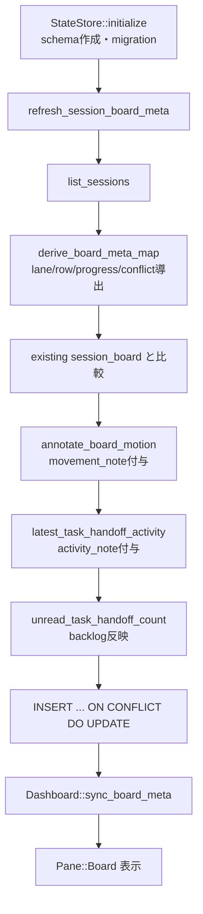

# ECC2 Board Observability Prototype 調査レポート

**調査日:** 2026-04-28
**対象バージョン:** everything-claude-code post-v1.10.0（`7992f8fc`）
**調査者:** Codex
**対象領域:** `ecc2/` の session store、SQLite schema、TUI dashboard board pane

---

## 1. post-v1.10.0 で何が変わったのか

v1.10.0 の ECC 2.0 Alpha は、ローカルでビルドできる control plane として `dashboard`、`start`、`sessions` などの初期 CLI/TUI surface を公開した段階だった。今回の `7992f8fc` は、その TUI を「セッション一覧を見る画面」から「複数セッションの作業状態を board として読む画面」へ拡張する prototype である。

ここでの **board** は、セッションを Kanban 的な lane、row、stack に配置するための観測メタデータを指す。GitHub Projects や外部タスクボードではなく、ECC2 の SQLite state store から導出される TUI 内部の board 表現である。また、ここでの **session** は ECC2 が管理する agent 実行単位を指し、Claude transcript file そのものとは異なる。

主要な変更は三つに分かれる。第一に、`SessionBoardMeta` と `session_board` table が追加され、セッションごとの lane、row、progress、handoff backlog、conflict signal を永続化できるようになった。第二に、session store の各更新経路から board metadata を再計算するようになり、状態遷移や message read/unread が board に反映されるようになった。第三に、TUI dashboard に `Pane::Board` が加わり、metrics pane と同じ表示領域を使って board snapshot を描画できるようになった。

---

## 2. 永続モデル: `session_board` table

ユーザーから見ると、この変更の目的は「どの agent が、どの作業 lane にいて、何が詰まっているか」を一覧できるようにすることにある。従来の session list では state、agent type、branch は見えるが、複数の作業が同じ issue や branch に重なっているか、handoff が未読のまま滞留しているかまでは一目で分からなかった。

実装では `ecc2/src/session/mod.rs` に `SessionBoardMeta` が追加された。主なフィールドは以下である。

| フィールド | 役割 |
|-----------|------|
| `lane` | `Inbox`、`In Progress`、`Review`、`Blocked`、`Done`、`Stopped` の表示 lane |
| `project` / `feature` / `issue` | task text から抽出した scope |
| `row_label` | board row の表示名。issue、feature、project、branch、`General` の順で決まる |
| `column_index` / `row_index` / `stack_index` | TUI 上の配置座標 |
| `progress_percent` | state と activity から導出される進捗表示 |
| `movement_note` | lane または row が変わったときの遷移メモ |
| `activity_kind` / `activity_note` | 最新 task handoff の方向と説明 |
| `handoff_backlog` | 未読 `task_handoff` message 数 |
| `conflict_signal` | branch/task overlap などの衝突兆候 |

SQLite 側では `session_board` table が作られ、`session_id` が primary key かつ `sessions(id)` への foreign key になっている。`ON DELETE CASCADE` により、親 session が消えると board metadata も消える設計である。さらに `lane` と `(column_index, row_index, stack_index)` に index が作られており、将来 board query を直接行う余地も残している。

選ばれなかった代替案として、board metadata を TUI 側で毎回完全にオンメモリ計算する方法がある。この方法は schema migration を避けられるが、handoff や movement のような「前回値との差分」が扱いにくい。今回の実装は `session_board` を永続化し、既存 meta と新規導出 meta を比較することで `Moved ...` や `Retargeted ...` を表現している。

---

## 3. Board metadata のライフサイクル

board は状態を持つ仕組みなので、正常ライフサイクル、クリーンアップ、失敗時の挙動を分けて見る必要がある。



正常系では、`StateStore::initialize()` が `session_board` table を作成し、既存 database に不足列があれば `ensure_session_board_columns()` で追加する。その後 `refresh_session_board_meta()` が呼ばれ、全 session の board metadata を再計算する。

再計算は一度だけではない。`save_session()`、state update、heartbeat、message send/read、session deletion など、board に影響する store operation の後に `refresh_session_board_meta()` が呼ばれる。これにより、例えば子 session から親 session に `task_handoff` が送られると、親の `handoff_backlog` と `activity_note` が次の dashboard refresh で変わる。

クリーンアップは `refresh_session_board_meta()` の冒頭で行われる。

```sql
DELETE FROM session_board
WHERE session_id NOT IN (SELECT id FROM sessions)
```

これに加えて foreign key の `ON DELETE CASCADE` もあるため、通常の `delete_session()` 経由では session 本体と board row が同時に消える。もしクリーンアップが失敗した場合、孤立した `session_board` row が残り、TUI 側の `list_session_board_meta()` には現れるが、`Dashboard` は `self.sessions` を起点に描画するため画面上には出にくい。ただし database 上のゴミは残るため、次回 `refresh_session_board_meta()` が成功するまで統計や将来 query のノイズになる。

---

## 4. Lane、row、progress の導出

board の lane は `SessionState` から決まる。

| `SessionState` | Board lane |
|----------------|------------|
| `Pending` | `Inbox` |
| `Running` | `In Progress` |
| `Idle` | `Review` |
| `Stale` / `Failed` | `Blocked` |
| `Completed` | `Done` |
| `Stopped` | `Stopped` |

row は task text から `project`、`roadmap`、`epic`、`feature`、`workflow`、`flow`、issue reference を抽出し、issue、feature、project、worktree branch、`General` の順に選ばれる。これは「同じ issue や feature に複数 session が集まっている」状態を board 上で見つけるための設計である。

progress は厳密なタスク完了率ではなく、operator が状態を読むための heuristic である。例えば `Running` でも file change があれば 60%、worktree や tool call があれば 45%、起動直後に近ければ 25% とされる。`Completed` は 100%、`Stopped` は 0% である。

この設計判断には割り切りがある。代替案として、agent に明示的な progress event を送らせる方法もあるが、Alpha 段階では全 harness にその contract を強制できない。そこで既存の state、metrics、worktree を材料に、多少粗くても全 session に適用できる導出値を選んでいる。

---

## 5. TUI Board pane

TUI 側では `Pane::Board` が追加され、`Pane::Metrics` と同じ矩形領域を共有する。grid layout で metrics pane が見えている場合に board pane も利用でき、pane selection と scroll 操作は metrics と同系統で扱われる。

`board_text()` は以下の順序で表示文字列を組み立てる。

1. session 数と focus session の要約
2. focus session の progress、status、handoff inbox、route、座標、scope
3. 全体の overlap risk
4. lane ごとの session list
5. row ごとの conflict/backlog summary

表示例としては、focus session に対して `Progress 60% [######....]`、lane ごとに `In Progress (3)`、row ごとに `Row 1 | feature-name | 2 handoff(s)` のような行が生成される。

`board_overlap_risks()` は、明示的な `conflict_signal` があればそれを優先し、なければ running/pending/idle/stale session の duplicate branch と duplicate task を検出する。これは完全な競合検出ではないが、worktree や task text の重複という早期兆候を operator に出すには十分である。

---

## 6. テスト状況

この commit は `ecc2/src/session/store.rs` と `ecc2/src/tui/dashboard.rs` に大きな実装を追加しているが、差分上は board 専用の独立 test 名は限定的である。一方で、dashboard rendering helper、pane layout test、session store の既存 test 構造に組み込まれており、`Pane::Board` の追加に伴う selected pane visibility や rendering path の破綻はある程度検出できる。

今回の調査では追加テストは実行していない。コード差分から確認できたテスト上の注目点は、TUI test が `HOME` を tempdir に差し替えるよう修正され、pane command の設定保存がユーザー環境に副作用を出さないようになった点である。

---

## 7. 調査所見のまとめ

### 実装状態の総括

| 機能領域 | 実装状態 | ファイル数 | 備考 |
|---------|---------|-----------|------|
| Board metadata model | 実装済み | 2 | `SessionBoardMeta` と `session_board` table |
| Metadata refresh | 実装済み | 1 | store operation 後に再計算 |
| TUI board pane | prototype 実装済み | 1 | metrics area と pane 操作を共有 |
| Conflict / overlap signal | heuristic 実装 | 1 | duplicate branch/task と `conflict_signal` |
| 専用テスト | 限定的 | 1 | 既存 dashboard/store tests に吸収 |

### 注目すべき設計判断

1. **永続 table による board 化:** TUI だけで計算せず `session_board` に保存することで、movement note と handoff backlog を状態として扱える。
2. **state から lane を導出:** explicit board command を待たず、既存 session lifecycle だけで board が成立する。
3. **progress は heuristic:** Alpha 段階では全 harness 共通の progress event を要求せず、metrics と state から粗く導出する。
4. **operator 向け observability:** board は自動スケジューラではなく、複数 session の重なりや滞留を人間が読むための観測面として作られている。

