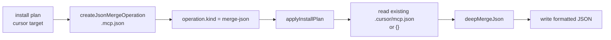

# Plugin Install Surface Hardening 調査レポート

**調査日:** 2026-04-28
**対象バージョン:** everything-claude-code post-v1.10.0（`c19fde22`, `92e0c7e9`, `8c422a76`）
**調査者:** Codex
**対象領域:** Claude plugin manifest、Cursor install target、MCP config merge、public install docs

---

## 1. post-v1.10.0 で何が変わったのか

この変更群は、ECC の公開 install surface を実際の harness validator と運用導線に合わせて硬くするものだった。v1.10.0 では「repo surface を現行状態へ同期する」ことが主目的だったが、その後の運用で、Claude Code plugin manifest、Cursor 向け install、plugin install 後の manual full install という三つの境界で誤解や実害が見つかった。

ここでの **plugin manifest** は `.claude-plugin/plugin.json` を指す。`agent.yaml` や marketplace metadata ではない。また、ここでの **install surface** はユーザーが ECC を取り込む入口全体を指し、`/plugin install`、manual installer、Cursor target、MCP config を含む。

主な変更は、`agents` field の削除、Cursor への native hook と MCP config install、plugin install と full manual install の導線分離である。いずれも「repo 内の想定」よりも「実際の consumer environment で壊れないこと」を優先した修正になっている。

---

## 2. Claude plugin manifest から `agents` field を削除

ユーザー視点では、これは plugin install が validator で落ちる問題を避けるための変更である。以前の `.claude-plugin/plugin.json` には多数の agent `.md` file が `agents` array として明示されていた。しかし Claude Code の実際の plugin validator は `agents` field 自体を schema 外として拒否する。

`c19fde22` では以下が変更された。

| ファイル | 変更内容 |
|---------|----------|
| `.claude-plugin/plugin.json` | `agents` array を完全削除 |
| `schemas/plugin.schema.json` | repo 側 schema からも `agents` property を削除 |
| `.claude-plugin/PLUGIN_SCHEMA_NOTES.md` | `agents` は追加禁止、agent files は convention で自動発見されると明記 |
| `tests/plugin-manifest.test.js` | manifest に `agents` が無いことを前提に更新 |

選ばれなかった代替案は、`agents` を directory path や explicit file list として修正し続けることだった。しかし実際の validator は field 名そのものを受け付けないため、path の形を調整しても解決しない。今回の判断は、agent discovery を manifest ではなく plugin convention に委ねるというものだ。

この変更は repo-local schema と platform validator のズレを認めた修正でもある。`.claude-plugin/PLUGIN_SCHEMA_NOTES.md` は「`hooks` と `agents` はどちらも明示しない」と書き換えられ、今後の contributor が同じ field を戻さないための guardrail になっている。

---

## 3. Cursor target: native hook と MCP config の install

Cursor 向け install では、単に files を `.cursor/` にコピーするだけでは不十分になっていた。Cursor project に hook config と MCP config を配置し、既存の user/project config を壊さずに ECC の bundled server を足す必要がある。

`92e0c7e9` では `.cursor/hooks.json` が install 対象になり、`.mcp.json` 由来の MCP servers を `.cursor/mcp.json` に merge する経路が追加された。ここで重要なのは copy ではなく **merge** である。既存 `.cursor/mcp.json` に user-defined server がある場合、ECC がそれを上書きすると consumer project の設定を壊してしまう。

実装では `merge-json` operation が追加された。

`scripts/lib/install/apply.js` には `deepMergeJson()` が追加され、plain object 同士は再帰 merge、それ以外は patch 側で置換する。MCP config については `ECC_DISABLED_MCPS` による filter も `merge-json` path に統合された。以前のように「copy 後に disabled server 用の別 write plan を作る」のではなく、operation 適用時に payload を filter してから merge/copy する形である。

テストでは、Cursor install が `.cursor/hooks.json` と `.cursor/mcp.json` を作ること、既存 `custom` MCP server を保持したまま `github` や `playwright` を merge することが追加された。

---

## 4. MCP health check の timeout 判定

同じ commit で `scripts/hooks/mcp-health-check.js` も修正されている。stdio server が高速に crash した場合、timer callback が走る時点では process がすでに exit していることがある。従来は timeout path で誤って healthy に分類する余地があった。

修正後は `timer` を `finish()` で clear し、timeout callback 内でも `child.exitCode` と `child.signalCode` を確認する。すでに exit していれば `ok: false` として、stderr または exit reason を返す。これは install surface というより health check の分類精度向上だが、MCP config を Cursor に配る変更と同じ運用面の hardening として扱える。

---

## 5. Plugin install と full manual install の導線分離

`8c422a76` は README 系の install 説明を修正した。目的は、`/plugin install` 後に `./install.sh --profile full` や `npx ecc-install --profile full` を続けて実行してしまう誤操作を防ぐことである。

plugin install は skills、commands、hooks を plugin 経由で読み込む。一方、full manual installer は同じ surface を user directory にコピーする。両方を連続して実行すると、重複 skill、重複 hook、重複 runtime behavior が起きうる。そこで README は「plugin install path では rules だけを manual copy する」「full installer は plugin path の代わりに使う」と明確に分けられた。

この判断で選ばれなかった代替案は、plugin install 後にも full installer を許容し、installer 側で重複を完全に検出・抑止する方法である。しかし plugin と manual install は platform 側の loader と local filesystem の両方にまたがるため、installer だけで確実に重複実行を防ぐのは難しい。公開 docs で導線を分け、`tests/docs/install-identifiers.test.js` に warning 文言を検査させる方が、現時点では低リスクである。

---

## 6. テスト状況

差分上、以下の test coverage が追加または更新されている。

| テスト | 検証内容 |
|--------|----------|
| `tests/plugin-manifest.test.js` | `.claude-plugin/plugin.json` が platform validator に合う shape であること |
| `tests/scripts/install-apply.test.js` | Cursor target が hooks と MCP config を配置し、既存 MCP server を保持して merge すること |
| `tests/lib/install-targets.test.js` | Cursor install target の planning shape |
| `tests/lib/install-manifests.test.js` | install manifest 側の target coverage |
| `tests/docs/install-identifiers.test.js` | plugin install 後に full installer を走らせない warning が README にあること |

今回の調査ではテストは未実行である。変更自体は docs、schema、installer の境界にまたがるため、最小確認としては `node tests/plugin-manifest.test.js`、`node tests/scripts/install-apply.test.js`、`node tests/docs/install-identifiers.test.js` が該当する。

---

## 7. 調査所見のまとめ

### 実装状態の総括

| 機能領域 | 実装状態 | ファイル数 | 備考 |
|---------|---------|-----------|------|
| Claude plugin manifest | 修正済み | 4 | `agents` field を削除 |
| Cursor hooks install | 実装済み | 4 | `.cursor/hooks.json` を install |
| Cursor MCP merge | 実装済み | 5 | `merge-json` operation と deep merge |
| Install docs | 修正済み | 4 | plugin path と manual path を分離 |
| Regression tests | 追加済み | 4 | manifest、install、docs を検査 |

### 注目すべき設計判断

1. **platform validator を正とする:** repo schema に合わせるのではなく、Claude Code plugin validator が受け入れる manifest shape に寄せた。
2. **MCP config は merge:** Cursor project の既存 server を保持し、ECC bundled servers だけを追加する。
3. **導線で重複を防ぐ:** plugin install と full manual install を連続手順にせず、README と docs test で誤操作を抑止する。
4. **install operation の抽象化:** `merge-json` を operation として扱うことで、copy-file の特殊 case を増やさずに JSON config の合成を表現した。

