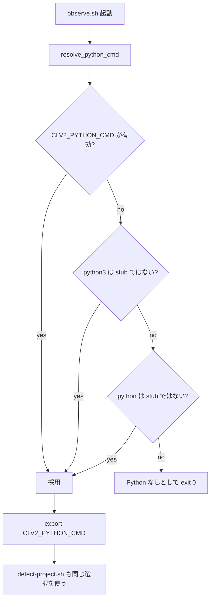

# Continuous Learning v2 Entrypoint Fixes 調査レポート

**調査日:** 2026-04-28
**対象バージョン:** everything-claude-code post-v1.10.0（`81bde5c3`, `e63241c6`, `4e66b288`）
**調査者:** Codex
**対象領域:** `skills/continuous-learning-v2/hooks/observe.sh`、CLv2 install docs、translated docs、docs tests

---

## 1. post-v1.10.0 で何が変わったのか

continuous-learning-v2 は、Claude Code の hook payload を観測し、project ごとの学習素材として蓄積する仕組みである。今回の変更は新機能というより、実際の entrypoint と Windows Python 解決に合わせて観測 hook を落ちにくくし、plugin install users に不要な manual hook 設定を案内しないようにする修正だった。

ここでの **entrypoint** は `CLAUDE_CODE_ENTRYPOINT` に入る実行元の分類を指す。CLI、TypeScript SDK、Claude Desktop などで値が変わる。ここでの **observe hook** は `skills/continuous-learning-v2/hooks/observe.sh` を指し、ECC2 の observer や別 skill の continuous-learning v1 とは異なる。

変更点は三つである。第一に、`claude-desktop` が有効な entrypoint として許可された。第二に、Windows App Installer の Python redirector stub を Python と誤認しないようになった。第三に、plugin install 時は `hooks/hooks.json` が自動読込されるため、`~/.claude/settings.json` に `${CLAUDE_PLUGIN_ROOT}` 付き hook block をコピーしないよう docs が修正された。

---

## 2. `claude-desktop` entrypoint の許可

`observe.sh` には、不要な非対話 automation を避けるための entrypoint filter がある。従来は `cli` と `sdk-ts` のみを許可していたが、Claude Desktop からの正規の操作では `CLAUDE_CODE_ENTRYPOINT=claude-desktop` になるため、観測が早期 exit していた。

`81bde5c3` は case pattern を `cli|sdk-ts|claude-desktop` に広げた。これは小さな一行変更だが、Desktop から Claude Code を使うユーザーにとっては CLv2 が「設定しているのに何も記録しない」状態を解消する。

選ばれなかった代替案は、entrypoint filter を完全に外すことだった。しかし filter を外すと、非対話 SDK automation や内部 subprocess まで観測対象に入りやすくなる。今回の修正は、既存の layer 2-5 の guard を維持したまま、正規 entrypoint を一つ追加する保守的な対応である。

---

## 3. Windows AppInstallerPythonRedirector.exe の回避

Windows 10/11 では `%LOCALAPPDATA%\Microsoft\WindowsApps\python.exe` や `python3.exe` が App Execution Alias stub になっていることがある。実体は `AppInstallerPythonRedirector.exe` で、Microsoft Store の Python が未導入の場合、`python -c` を期待通り実行しない。CLv2 の observe hook は JSON parsing や project detection に Python を使うため、この stub を Python として採用すると観測が silent failure になりうる。

`e63241c6` は `_is_windows_app_installer_stub()` を追加し、`command -v` と `readlink` で candidate の実体や symlink target を調べ、`AppInstallerPythonRedirector.exe` に一致したら skip するようにした。`resolve_python_cmd()` は `CLV2_PYTHON_CMD` を優先し、その後 `python3`、`python` を見るが、stub は候補から外す。

さらに、選ばれた Python command は `CLV2_PYTHON_CMD` として export される。これは後続で source される `detect-project.sh` が別途 Python を再解決して、同じ stub に戻ってしまうことを防ぐためである。

この lifecycle のクリーンアップは明示的な file cleanup ではなく、hook process の env var scope に閉じている。失敗時は Python なしとして `exit 0` するため、Claude Code の本体操作は止めない。ただし観測記録は残らない。これは「学習が欠落する」より「ユーザーの tool use を hook で妨げる」方が問題だという設計判断である。

---

## 4. Plugin quick start docs の修正

`4e66b288` は English と複数翻訳版の CLv2 docs を修正した。以前の plugin quick start は、`${CLAUDE_PLUGIN_ROOT}/skills/continuous-learning-v2/hooks/observe.sh` を `~/.claude/settings.json` に追加する JSON block を案内していた。しかし plugin install では Claude Code v2.1+ が plugin の `hooks/hooks.json` を自動読込するため、この manual block は不要である。

不要なだけでなく、害もある。plugin-managed hook と manual settings hook の両方が存在すると、PreToolUse / PostToolUse が二重実行される。また `${CLAUDE_PLUGIN_ROOT}` は plugin-managed `hooks/hooks.json` の中で解決される変数であり、user の `settings.json` にコピーしても解決されない。

修正後の docs は、plugin install では追加 hook block が不要であること、過去にコピーした場合は重複 block を削除すること、manual install では `~/.claude/skills/continuous-learning-v2/hooks/observe.sh` を settings に登録することを分けて説明する。

---

## 5. Docs regression test

この docs 修正には `tests/docs/continuous-learning-v2-docs.test.js` が追加された。テストは対象 docs を列挙し、plugin users に `${CLAUDE_PLUGIN_ROOT}/skills/continuous-learning-v2/hooks/observe.sh` を `settings.json` へコピーする案内が残っていないことを検査する。

さらに English docs については、plugin が `hooks/hooks.json` を auto-load すること、重複した `PreToolUse` / `PostToolUse` block を削除するよう案内していることも確認している。これは docs の文言を単なる説明ではなく regression guard として扱う変更である。

---

## 6. テスト状況

差分上のテスト追加は docs test である。`observe.sh` の shell behavior そのものに対する unit test はこの変更群では追加されていない。Windows App Installer stub の検出は実環境依存が大きく、shell unit test 化には fake `command -v` / fake `readlink` の設計が必要になる。

今回の調査ではテストは未実行である。最小確認としては `node tests/docs/continuous-learning-v2-docs.test.js` が該当する。Windows stub 回避まで含めるなら、Windows 環境または PATH に fake `AppInstallerPythonRedirector.exe` を置いた shell harness が必要である。

---

## 7. 調査所見のまとめ

### 実装状態の総括

| 機能領域 | 実装状態 | ファイル数 | 備考 |
|---------|---------|-----------|------|
| `claude-desktop` entrypoint | 実装済み | 1 | `observe.sh` の allowlist に追加 |
| Windows Python stub 回避 | 実装済み | 1 | `AppInstallerPythonRedirector.exe` を skip |
| Python selection propagation | 実装済み | 1 | `CLV2_PYTHON_CMD` を export |
| Plugin quick start docs | 修正済み | 6 | manual hook block を削除 |
| Docs regression test | 追加済み | 1 | `${CLAUDE_PLUGIN_ROOT}` 誤案内を検出 |

### 注目すべき設計判断

1. **entrypoint filter は維持:** 全許可ではなく `claude-desktop` だけを追加し、非対話 automation の抑制を残した。
2. **stub は Python と見なさない:** Windows App Execution Alias を検出し、hook の JSON parsing を silent failure にしない。
3. **hook 失敗で user flow を止めない:** Python が見つからない場合は `exit 0` とし、観測欠落を許容する。
4. **docs を test 対象にする:** install quick start の誤案内を regression test で防ぐ。

