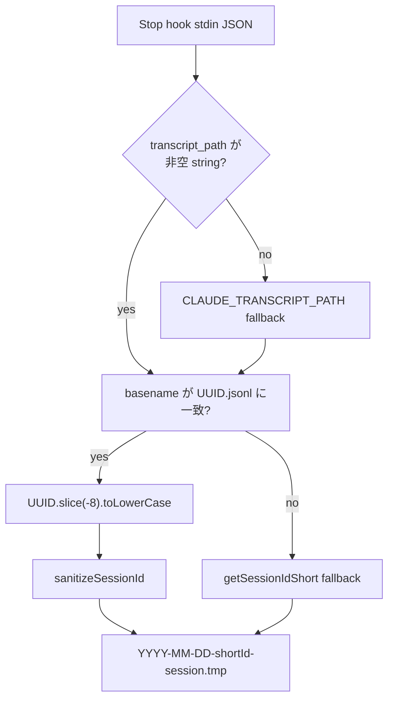

# Hook Runtime / Windows Reliability 調査レポート

**調査日:** 2026-04-28
**対象バージョン:** everything-claude-code post-v1.10.0（2026-04-19〜2026-04-22 の hook/runtime 修正群）
**調査者:** Codex
**対象領域:** `scripts/hooks/session-end.js`、`scripts/hooks/session-start.js`、Windows hook fix docs、PowerShell helper、`scripts/claw.js`

---

## 1. post-v1.10.0 で何が変わったのか

この期間の hook runtime 修正は、ECC の session summary と Windows 実行環境の二つに集中している。session summary 側では、Stop hook の subprocess が親 session の summary file を上書きする問題と、SessionStart hook が過去 session の slash invocation を live instruction として再実行させる問題が修正された。Windows 側では、Claude Code v2.1.116 の argv duplication bug、PowerShell 5.1 の JSON array collapse、`.cmd` resolution、path separator と locale の問題に対処する fix docs と helper script が追加された。

ここでの **session summary** は `scripts/hooks/session-end.js` が `~/.claude/sessions/` 相当へ書く `.tmp` summary を指す。ECC2 の `sessions` table とは異なる。また、ここでの **hook** は Claude Code / ECC の PreToolUse、PostToolUse、SessionStart、Stop などの runtime callback を指し、Git hook ではない。

---

## 2. Stop hook: transcript UUID による filename isolation

ユーザーから見ると、問題は「resume したときに親 session の summary が消えている、または別の subprocess の summary に置き換わっている」ことである。原因は、Stop hook から `claude -p ...` のような subprocess が起動されたとき、親 session と子 process が同じ project-name fallback filename を共有し、後から走った summary が前の summary を上書きすることだった。

`a35b2d12` から `0c3fc707` までの一連の review commit で、`session-end.js` は stdin の `transcript_path` から transcript UUID を取り出し、その UUID の末尾 8 文字を shortId として使うようになった。さらに `sanitizeSessionId()` を通し、`CLAUDE_SESSION_ID` と同じ UUID の場合は既存 filename convention と一致するように調整されている。



fallback も強化された。stdin JSON が malformed、`transcript_path` が欠落、空文字、非 string の場合は `CLAUDE_TRANSCRIPT_PATH` env var を見る。これにより、hook payload の shape が変わった場合でも transcript path が環境変数にあれば isolation が効く。

状態を持つ仕組みとしての正常ライフサイクルは、Stop hook が transcript path を受け取る、summary file 名を決める、既存 summary header と merge する、`.tmp` file に書く、次回 SessionStart が matching session を読む、という流れである。クリーンアップは sessions directory の既存 cleanup policy に依存し、この変更自体は削除処理を増やしていない。もし filename isolation が失敗すると、以前と同じく project-name fallback に戻るため、親子 subprocess が同じ fallback を共有する環境では上書きリスクが残る。

---

## 3. SessionStart: stale-replay guard

SessionStart hook は、前回 session summary を additional context として注入する。これは便利だが、過去 summary 内に `/fw-task-new` のような slash skill invocation や `ARGUMENTS=` payload が残っていると、compaction/resume 後の model がそれを現在の指示として再実行する危険があった。

`b2755189` は summary をそのまま `Previous session summary:` として渡すのではなく、historical-only marker で囲むように変更した。重要なのは、単なるラベル変更ではなく「prior conversation の frozen summary であり、current user request がない限り再実行してはいけない」という contract を context 内に明示した点である。

選ばれなかった代替案は、summary から slash command や `ARGUMENTS=` を文字列削除する方法である。しかし削除すると、後から「何をやっていたか」を調査する情報まで失われる。今回の実装は情報を保持したまま、実行権限を現在 session から切り離す設計を選んでいる。

---

## 4. Claude Code v2.1.116 argv duplication と Windows helper

Windows 環境では、Claude Code v2.1.116 付近で hook command の argv が重複・誤解釈される問題が報告された。さらに `.sh` を直接 command にすると Node `spawn` が Windows で `EFTYPE` になるケースがある。docs/fixes にはこの調査と復旧手順が追加されている。

修正方針は、hook command の第一 token を PATH 解決される `bash` にし、wrapper script path を quoted argument として渡し、`pre` / `post` を明示的な positional argument にすることだった。

```json
{
  "type": "command",
  "command": "bash \"C:/Users/.../.claude/skills/continuous-learning/hooks/observe-wrapper.sh\" pre"
}
```

`install_hook_wrapper.ps1` と `patch_settings_cl_v2_simple.ps1` は、settings file を backup し、hook buckets を `PreToolUse` と `PostToolUse` に分け、wrapper path を forward slash に正規化し、LF / UTF-8 no BOM で書き戻す。PowerShell 5.1 では `ConvertFrom-Json -AsHashtable` が使えず、`ConvertTo-Json` が single-element arrays を object に潰す問題があるため、`PSCustomObject` を Hashtable / `System.Collections.ArrayList` に再帰変換する helper も追加された。

この領域の RUNBOOK は [RUNBOOK.md](./RUNBOOK.md) に分けている。

---

## 5. `.cmd` resolution、path、locale の補正

`scripts/claw.js` では Windows 上の `claude.cmd` を解決するため、`spawnSync('claude', ...)` に `shell: process.platform === 'win32'` が追加された。`claude` は hardcoded literal で user input ではないため、shell mode による injection risk は限定的と判断されている。

`skills/continuous-learning-v2/scripts/detect-project.sh` では、Windows backslash path と locale-dependent hash の問題が修正された。`CLAUDE_PROJECT_DIR` が `C:\Users\...\project` のような形で渡されると POSIX `basename` が期待通りに動かないため、backslash を slash に変換してから basename を取る。また project ID の SHA256 input は shell pipe ではなく env var 経由で Python に渡し、Python 側で UTF-8 encode する。これにより CP932 や CP1252 の active code page による hash drift を避けている。

---

## 6. テスト状況

差分上、hook regression は `tests/hooks/hooks.test.js` に追加されている。

| テスト | 検証内容 |
|--------|----------|
| transcript UUID shortId | `transcript_path` の UUID から filename shortId を導出する |
| uppercase UUID normalization | 大文字 UUID を lowercase shortId に正規化する |
| backward compatibility | `CLAUDE_SESSION_ID` と transcript UUID が同じとき既存 convention と一致する |
| stale-replay guard | SessionStart additional context に historical-only marker と begin/end delimiter が入る |
| ANSI stripping | summary text は guard 後も ANSI escape を含まない |

PowerShell helper は docs 上で Windows 11 + Windows PowerShell 5.1 で検証した旨が記録されているが、repo の Node test としては直接実行されていない。今回の調査でもテストは未実行である。

---

## 7. 調査所見のまとめ

### 実装状態の総括

| 機能領域 | 実装状態 | ファイル数 | 備考 |
|---------|---------|-----------|------|
| Stop hook filename isolation | 実装済み | 2 | transcript UUID 由来 shortId |
| SessionStart stale guard | 実装済み | 2 | historical-only marker |
| Windows hook repair docs | 追加済み | 5 | argv duplication workaround |
| PowerShell 5.1 compatibility | 実装済み | 2 | Hashtable / ArrayList conversion |
| `.cmd` resolution | 実装済み | 1 | Windows のみ `shell: true` |
| path / locale normalization | 実装済み | 1 | CLv2 project detection |

### 注目すべき設計判断

1. **transcript UUID を session identity に使う:** fallback project name より衝突しにくく、親子 subprocess の summary overwrite を避けられる。
2. **summary は削除せず guard する:** 過去情報を保持しながら、live instruction として再実行しない contract を注入する。
3. **Windows hook command は `bash` first token:** `.sh` 直接実行や quoted executable 依存を避け、Claude Code argv bug の影響を減らす。
4. **PowerShell 5.1 を明示対応:** JSON shape の崩れを ArrayList 正規化で防ぎ、Windows 標準環境だけでも復旧できるようにした。

