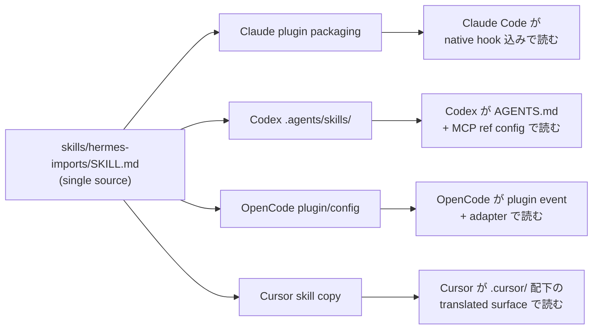

# Cross-Harness Portability Model: 詳細調査

**調査日:** 2026-05-13
**対象バージョン:** everything-claude-code v2.0.0-rc.1
**調査者:** Claude Opus 4.7
**関連ドキュメント:** [INVESTIGATION.md](./INVESTIGATION.md)、`docs/architecture/cross-harness.md`、`docs/architecture/harness-adapter-compliance.md`

---

## 目次

1. [エグゼクティブサマリー](#1-エグゼクティブサマリー)
2. [Surface ごとの portability](#2-surface-ごとの-portability)
3. [`SKILL.md` が travel する理由](#3-skillmd-が-travel-する理由)
4. [Adapter が引き受ける差分](#4-adapter-が引き受ける差分)
5. [Hermes との境界線](#5-hermes-との境界線)
6. [Worked Example: hermes-imports skill](#6-worked-example-hermes-imports-skill)
7. [Today vs Later](#7-today-vs-later)
8. [New work 時のルール](#8-new-work-時のルール)

---

## 1. エグゼクティブサマリー

`docs/architecture/cross-harness.md` は v2.0.0-rc.1 で初めて公開された、ECC の position を最も簡潔に述べる文書である。要旨は次の 1 文に集約される。

> ECC is the reusable workflow layer. Harnesses are execution surfaces.

これは技術的な構造設計であるだけでなく、ECC が選ぶ open source 戦略でもある。harness が次々と現れ、それぞれが囲い込みを試みる時代に、ECC は「どの harness に乗っても消えない workflow 層」として残ることを選んだ。

この詳細調査では、portability model の意味と運用上の意義を、surface 単位で分解する。

ここでの **portable** は「同じ source asset が、複数 harness で内容を変えずに動くこと」を指す。完全な互換ではなく、loading とイベント形状の adapter だけが harness 別になる、というレベル感である。

---

## 2. Surface ごとの portability

`cross-harness.md` の Portability Model 表は、ECC を 6 つの surface に分解する。各 surface に対して、shared source と harness adapter と現状の status が定義されている。

| Surface | Shared Source | Harness Adapter | 現状 |
|---------|---------------|-----------------|------|
| Skills | `skills/*/SKILL.md` | Claude plugin、Codex plugin、`.agents/skills`、Cursor skill copies、OpenCode plugin/config | harness 別 packaging で支持 |
| Rules / instructions | `rules/`、`AGENTS.md`、translated docs | Claude rules install、Codex `AGENTS.md`、Cursor rules、OpenCode instructions | 支持済みだが harness 間で完全一致ではない |
| Hooks | `hooks/hooks.json`、`scripts/hooks/` | Claude native hooks、OpenCode plugin events、Cursor hook adapter | Claude/OpenCode/Cursor は hook-backed、Codex は instruction-backed |
| MCPs | `.mcp.json`、`mcp-configs/` | 各 harness の native MCP config import | harness が MCP を露出している環境では支持 |
| Commands | `commands/`、CLI scripts | Claude slash commands、compatibility shims、CLI entrypoints | 支持済み、command 意味は harness 間でばらつき |
| Sessions | `ecc2/`、session adapters、orchestration scripts | TUI/daemon、tmux/worktree orchestration、harness 別 runner | Alpha |

ポイントは、6 つの surface のうち 5 つで shared source が支持されており、harness adapter は薄い layer に留まっていること。`ecc2/` だけが alpha 段階で、これは記事 01 / 03 で見た control plane の roadmap に呼応している。

---

## 3. `SKILL.md` が travel する理由

cross-harness 文書が最も portable な単位として指定するのが `SKILL.md` である。`SKILL.md` は frontmatter（`name`、`description`、`origin`）と Markdown 本文で構成されるシンプルな file format で、harness 固有の構文や hook を直接呼ばない。

具体的に、良い ECC skill が満たすべき条件は次の 5 点。

- YAML frontmatter で `name`、`description`、`origin` を持つ
- 「When to Use」を明示する
- 必要な tool や connector を、secret を含めずに記述する
- 例は repo-relative または generic にする
- harness 専用の command 前提を、section にラベル付けせずに混ぜない

この制約を守る限り、同じ `SKILL.md` source は Claude plugin の skill directory にも、Codex plugin の `.agents/skills/` にも、Cursor の skill copy にも、OpenCode の plugin/config 内にも install できる。

選ばれなかった代替案として、harness 別に skill を書き分ける方向もあった。これは「Claude では bash tool で実装、Codex では別 path」のような最適化を許す一方、ECC が累積している 156 skill を 4-5 倍に複製するコストが見合わない。共通 source + adapter という選択は、ECC が「workflow が増えやすい設計」を維持するための前提である。

---

## 4. Adapter が引き受ける差分

harness adapter は薄い layer に留めるのが原則だが、各 harness の挙動の違いを完全に消すことはできない。ECC が現実的に harness adapter に許している差分は次の通り。

### 4.1 Claude Code

Claude Code は plugin asset を native に loading し、hook も native に実行する。最も自然に動く harness で、ECC の reference 実装としても扱われる。

### 4.2 Codex

Codex は `AGENTS.md`、plugin metadata、skills、MCP config を読む。Hook は instruction-driven で、native hook surface はない。これは、ECC の hook（block-no-verify、auto-tmux-dev など）が Codex 上では「prompt instruction」として表現されることを意味する。「PreToolUse で必ずこれをチェックする」ような行動原則は、Codex では agent への instruction に翻訳される。

### 4.3 OpenCode

OpenCode は plugin/event system を持つため、ECC hook logic を adapter layer 経由で reuse できる。`.opencode/plugins/ecc-hooks.ts` がその adapter で、ECC が定義した hook 群を OpenCode の event handler に bind する。

### 4.4 Cursor

Cursor は独自の rule と hook layout を持つため、ECC は `.cursor/` 配下に translated surface を維持する。skill copy や rule mapping が harness 別に存在する。

### 4.5 Gemini

Gemini は install / instruction oriented で、hook parity はない。Compatibility surface として扱われ、full hook parity を提供する planning はない。

---

## 5. Hermes との境界線

cross-harness 文書は Hermes との境界線も明示する。

> Hermes is not the public ECC runtime.

これは v2.0.0-rc.1 の最も重要な positioning statement である。Hermes は operator shell として ECC asset を消費する側に位置付けられ、public な ECC runtime ではない。

Hermes が ECC から取り込むものは次の通り。

- 一部の ECC skill を Hermes skills directory に import する
- tool access に ECC MCP convention を使う
- chat、CLI、cron、handoff workflow を ECC pattern 経由でルーティングする
- ローカル operator の繰り返し作業を、ECC skill として sanitized 化する

逆に、Hermes 側の state は ECC に流れない。

**Ship する**: sanitized setup docs、repo-relative demo prompts、general operator skills、private credential に依存しない examples。

**Ship しない**: OAuth tokens、API keys、raw `~/.hermes` exports、personal workspace memory、private datasets、未 review の local-only automation pack。

これにより、ECC を組織共有層として運用しても、誰かの private state が流出するリスクが構造的に抑えられる。

---

## 6. Worked Example: hermes-imports skill

cross-harness 文書は具体例として `skills/hermes-imports/SKILL.md` を挙げる。同じ skill source を全 harness で使う流れは次のようになる。

workflow は次の 4 step である。

1. `skills/hermes-imports/SKILL.md` に durable behavior を 1 度書く
2. secret、local path、raw operator memory を skill に含めない
3. 各 harness の loading は adapter に任せる
4. source skill と harness-facing metadata を separate にテストする

ある変更が「3 つの harness copy を編集する必要がある」状態になったら、それは shared source が wrong place にある兆候である。共通 behavior を `skills/` に戻し、harness adapter は loading、event 形状、command routing の adapt だけに留める。

---

## 7. Today vs Later

cross-harness 文書は意図的に「今日できること」と「これからやること」を区別している。

**今日支持されているもの**:

- shared skill source in `skills/`
- Claude Code plugin packaging
- Codex plugin metadata と MCP reference config
- OpenCode package/plugin surface
- Cursor-adapted rules、hooks、skills
- `ecc2/` as an alpha Rust control plane

**これから成熟する領域**:

- 全 harness 間の exact hook parity
- Hermes への automated skill sync
- `ecc2/` の release packaging
- cross-harness session resume semantics
- deeper memory と operator planning layer

この明示は、release notes と整合させた上で「RC1 は GA 主張ではない」というスタンスを文書 level で支える。`ecc2/` を alpha と書き、Hermes sync を「automated にする計画」と書くことで、ユーザーに正確な期待を渡す。

---

## 8. New work 時のルール

文書末尾の "Rule For New Work" は、今後 ECC に新しい workflow を追加するとき、どう書くべきかを 4 点に集約している。

> When adding a workflow, put the durable behavior in ECC first.

具体的には、harness-specific file を使うのは次の場合のみに限定される。

- shared asset を loading するため
- event 形状を adapt するため
- command 名を mapping するため
- platform limit を handling するため

「ある workflow が 1 つの harness でしか動かない」場合、その境界を文書中で明示する。隠れた harness 依存があると、後で別 harness で動かないことが発覚し、その都度書き直しが発生する。

この rule は、ECC が「harness の数が増えるほど価値が増す」性質を維持するための、最後の防衛線でもある。
