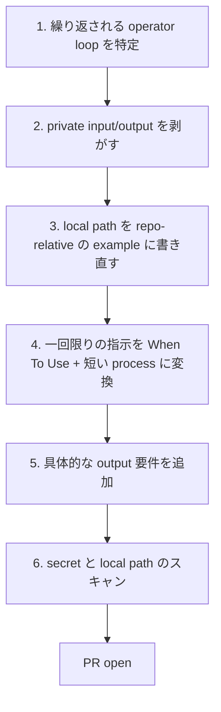
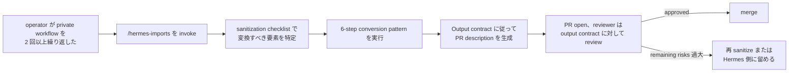

# hermes-imports Skill: 詳細調査

**調査日:** 2026-05-13
**対象バージョン:** everything-claude-code v2.0.0-rc.1
**調査者:** Claude Opus 4.7
**関連ドキュメント:** [INVESTIGATION.md](./INVESTIGATION.md)、`skills/hermes-imports/SKILL.md`、`docs/architecture/cross-harness.md`

---

## 目次

1. [エグゼクティブサマリー](#1-エグゼクティブサマリー)
2. [Skill の構造](#2-skill-の構造)
3. [Import rules の解釈](#3-import-rules-の解釈)
4. [Sanitization checklist の使い方](#4-sanitization-checklist-の使い方)
5. [Conversion pattern: 6 step](#5-conversion-pattern-6-step)
6. [二つの worked example](#6-二つの-worked-example)
7. [Output contract](#7-output-contract)
8. [運用上の position](#8-運用上の-position)

---

## 1. エグゼクティブサマリー

`skills/hermes-imports/SKILL.md`（88 行）は、ECC が v2.0.0-rc.1 で公開した「他者の private workflow を、公開可能な ECC skill に変換する」ための規約 skill である。Hermes という名前を冠しているが、本質的には Hermes 以外の private workflow（個人の prompts、社内 only の automation、未 sanitized な scripts）にも適用できる。

このアセットの意義は、技術的 skill としての価値より、**review-able な workflow** としての価値が大きい。何を ship してよく、何を ship してはいけないかが checklist 化されており、コミットレビュー時に「これは hermes-imports rule で OK か」を問えるようになる。

ここでの **import** は、private workflow を ECC 公開リポジトリに迎え入れる行為を指す。逆方向（ECC skill を Hermes に取り込む）は別の話。本 skill は前者のみを扱う。

---

## 2. Skill の構造

`SKILL.md` は次の section から成る。

| Section | 役割 |
|---------|------|
| Frontmatter (`name`, `description`, `origin`) | Skill 識別と registration |
| Header と短い positioning | Hermes と ECC の関係を一文で確認 |
| When To Use | 4 つの起動条件 |
| Import Rules | 6 つの変換規則 |
| Sanitization Checklist | commit 前にスキャンする 7 種類 |
| Conversion Pattern | 6 step の手順 |
| Example: Launch Handoff | sanitization の before/after |
| Example: Quiet-Hours Operator Job | 別カテゴリの sanitization 例 |
| Output Contract | 必ず返す 6 項目 |

frontmatter で `origin: ECC` と書かれているのは、この skill が ECC 由来であり、他の origin（個人 Hermes、社内）と区別されるためである。

---

## 3. Import rules の解釈

skill の Import Rules は 6 つの規則を定める。各規則の意図を整理する。

| 規則 | 意図 |
|------|------|
| Local path → repo-relative or placeholder | 個人 file system の構造を流出させない |
| Live account name → role label (`operator`, `default profile`, `workspace owner`) | 取引先・同僚名を流出させない |
| Credential → provider name only | 何を required にすればよいか伝わるが、key 値は含まない |
| Examples narrow と operational | 抽象的すぎず、コピペで動く具体性を保つ |
| Raw workspace export 等を ship しない | dump file 経由の意図せざる流出を防ぐ |
| Private state が前提なら local に留める | 「sanitize すれば動く」と「sanitize しても無意味」の見極め |

最後の規則が重要で、すべての workflow が ECC に取り込めるわけではない。private データソースに本質的に依存する workflow（例: 個人の Gmail を読んで何かする）は、sanitize しても意味を失う。その場合は import せず、Hermes 側に留めるのが正しい。

---

## 4. Sanitization checklist の使い方

7 つのカテゴリは、commit 前に必ずスキャンする項目である。

- absolute path（`/Users/...`、`/home/...`、`C:\Users\...` 等）
- `~/.hermes` paths（local setup を説明するセクション以外）
- API key、token、cookie、OAuth file、bearer string
- 電話番号、private email、personal contact graph
- 未公開の client、family、account 名
- revenue、health、CRM detail
- private system の raw log（tool output 等）

これらは regex で部分的に自動検出できるが、完全な自動化は難しい（client 名や revenue は文脈依存）。実用上の運用は、`grep -E '/Users/|~/.hermes|api[_-]?key' skills/foo/SKILL.md` のような coarse な検出 + 人間の最終 review、という二段構えになる。

repo の pre-commit hook で coarse スキャンを走らせる方向性が、将来の改善として roadmap にあるが、現状は人間 review に依存している。

---

## 5. Conversion pattern: 6 step

private workflow を ECC skill に変換する具体手順は次の 6 step である。



step 1 が最も判断を要する。Hermes での private prompt が「2 回以上繰り返している」ことが、skill 化に値する目安である。1 回限りの ad hoc な指示は、無理に skill 化すると workflow の汚染になる。

step 4 で「一回限りの指示」を When To Use + 短い process に変換する作業は、prompt engineering の核心でもある。「特定の状況で何をやるか」を抽象化することは、AI agent に再利用される形を取らせる作業に等しい。

step 5 の output 要件を明示することで、skill が「曖昧な結果を返す」状況を防ぐ。たとえば「summary を返す」ではなく、「X thread の draft、LinkedIn post の draft、recording checklist、missing assets list の 4 項目を返す」と具体化する。

step 6 で secret スキャンを行うのは、step 1-5 で消したつもりでも、引用や例にうっかり残ることがあるため。最後に必ず走らせる safety net である。

---

## 6. 二つの worked example

skill には 2 つの sanitization example がある。両方とも before/after で書かれている。

### 6.1 Launch Handoff の例

**Before (local Hermes prompt)**:

```text
Read my local workspace files and finalize launch copy.
```

これは local file system に依存し、何を返すべきかも曖昧。

**After (ECC-safe version)**:

```text
Use the public release pack under docs/releases/<version>/.
Return one X thread, one LinkedIn post, one recording checklist, and the missing assets list.
```

source が repo-relative になり、output が具体的に列挙されている。誰が使っても再現可能になった。

### 6.2 Quiet-Hours Operator Job の例

**Before (local Hermes job)**:

```text
Run my private inbox, finance, and content checks overnight.
```

private データソース（inbox、finance）に直接依存している。

**After (ECC-safe version)**:

```text
Describe the scheduler policy, the quiet-hours window, the escalation rules,
and the categories of checks. Do not include private data sources or credentials.
```

これは興味深い変換である。元の workflow が private data に強く依存しているので、ECC 側では「policy 自体を documentation する」という level に下げた。実装ではなく規約として shipping する。これは「全 workflow を ECC に強引に取り込まない」運用哲学の現れでもある。

---

## 7. Output contract

skill の最後にある Output Contract は、変換結果として必ず返すべき 6 項目を定める。

| 項目 | 内容 |
|------|------|
| candidate ECC skill name | ファイル名と SKILL.md 内 frontmatter の `name` |
| sanitized workflow summary | 1-2 段落の概要 |
| required public inputs | 動作のために必要な入力（repo-relative path、env var 等） |
| private inputs removed | 変換で取り除いた private 要素のリスト |
| remaining risks | sanitize しきれない可能性のあるリスク |
| files that should be created or updated | 実際に commit に含める file 一覧 |

「private inputs removed」と「remaining risks」を明示する設計が秀逸である。前者は「何を取り除いたか」の audit trail として、後者は「完全には sanitize しきれない部分」を残し、PR reviewer の判断材料にする。「これで安全」と言い切らない、honest な output 仕様になっている。

---

## 8. 運用上の position

hermes-imports skill は単独で動くというより、PR workflow の review tool として使われる。典型的な運用 flow は次のようになる。



ECC が長期的に組織共有層として機能するかは、この hermes-imports flow が安定して回せるかにかかっている。skill 化の判断、sanitization の品質、review の厳格さがすべて積み上がって「公開 repository としての ECC の安全性」になる。

選ばれなかった代替案として、「全 workflow を ECC に取り込めるようにする」「全 workflow を ECC に取り込まないことにする」の 2 極端があった。前者は安全性を犠牲にし、後者は organisational learning の累積を諦める。hermes-imports は「取り込む基準を明示して、basis を明確にして取り込む」という中間解で、reviewable な surface としての ECC を維持するための手綱になっている。
