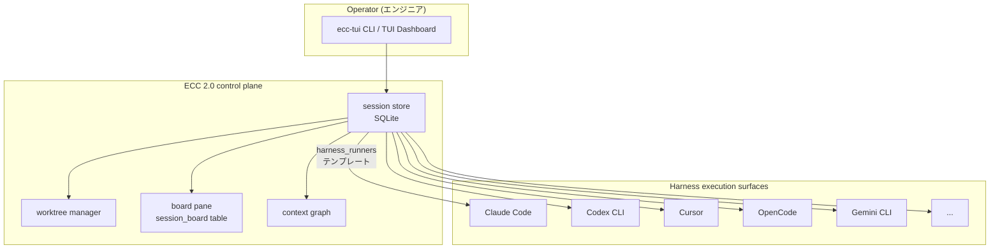

# 記事 01: マルチハーネス control plane — Claude も Codex も Cursor も「1 つの session store」で束ねる

**作成日:** 2026-05-13
**対象バージョン:** everything-claude-code v2.0.0-rc.1
**発表想定:** 社内エンジニア向け 20 分（Problem 5 分 / Architecture 8 分 / Demo 5 分 / Q&A 2 分）

---

## このトピックの位置づけ

ECC 2.0 を生産性向上の観点で評価するなら、最初に語るべきは「複数 harness を 1 つの substrate で束ねた」点である。AI エージェント環境はここ 1 年で急速に分裂し、ひとりのエンジニアが日常的に Claude Code、Codex CLI、Cursor、OpenCode、Gemini の 2〜3 個を併用するのが普通になった。それぞれの harness は得意分野が違い、どれかに統一する正解はない。にもかかわらず、harness を切り替えるたびに session 履歴、worktree、context graph がすべてリセットされるのは大きな摩擦である。

ECC 2.0 はこの摩擦を `ecc-tui` という単一バイナリで解消する。harness は実行面（execution surface）に過ぎず、durable な workflow と session 状態は ECC 側に持つ、という分離が core insight である。

ここでの **harness** は AI エージェントが動く実行環境を指す。AI モデル本体（Claude Opus、GPT-5 など）ではなく、その上で agent runtime を提供するツール側を指す語として使う。

---

## 1. Problem — 単一 harness では作業が分断される

### 1.1 ハーネスごとの得意分野

実際に複数 harness を併用しているエンジニアの典型的な使い分けは次のようになっている。一つの harness で全部済ませようとすると、どこかの仕事で性能を落とすことになる。

| ハーネス | よく使われる場面 | 弱い場面 |
|---------|----------------|---------|
| Claude Code | コードベース全体の編集、long-context refactor、Plan モード | 即時実行の bash 試行錯誤 |
| Codex CLI | 細かい修正の連続、shell コマンド連動、Backend 系 | 大規模設計の議論、長文ドキュメント生成 |
| Cursor | エディタ内補完、対話しながらの UI 開発 | バックグラウンドジョブ、CLI からの起動 |
| OpenCode | OSS 寄りの自由なツール統合、自前 MCP | 安定運用、CI 連携 |
| Gemini | 超長文 PR の review、大量ログ要約 | 高速な対話ループ |

「Backend は Codex で書き、UI は Cursor で詰め、PR review は Gemini に長文で要約させる」というワークフロー自体は自然なのに、現状はそれを横串で観測する手段がない。

### 1.2 切り替えで失うもの

harness を切り替えると、次のものが分断される。

- **session 履歴**: 各 harness が独自に transcript を持ち、互いに参照できない
- **worktree 状態**: Codex で作った feature branch が Claude Code 側のセッションからは「他人の branch」に見える
- **context**: タスクの背景、前回の判断、未解決の TODO を毎回再投入する必要がある
- **コスト追跡**: harness ごとに別の課金とトークン消費。合計いくらかけているかが見えにくい
- **board としての全体像**: 今この瞬間、自分が起動した 5 つのセッションがそれぞれどこにいるか分からない

これは個々の harness の責務ではない。harness は execution surface としては正しく動いている。問題は **その上の層がない** ことにある。

### 1.3 具体シナリオ: 「3 つの harness を並走させる火曜の午前」

たとえば次のような朝を想像してほしい。

- 9:00 — Claude Code で大規模な migration plan を立てる（Plan モードで 30 分）
- 9:30 — その計画から 3 つの並列タスクが出る。Codex に Backend、Cursor で UI、もう一度 Claude で test scaffolding
- 10:30 — 3 つの作業の進捗を確認したい

10:30 の時点で、ターミナル window が 3 枚開いていて、それぞれ別の transcript を持ち、worktree が 3 つ並んでいて、どの branch がどれだったか覚えていない。ECC 2.0 が解こうとしているのは、まさにこの状態である。

---

## 2. Architecture — substrate を 1 つの SQLite に集約する

### 2.1 全体像

ECC 2.0 は、harness ごとに別バイナリを作るのではなく、`ecc-tui` という 1 つの Rust バイナリと SQLite データベース (`ecc2.db`) で全 harness を扱う。harness 別の知識は最小化し、共通の session schema、共通の board、共通の worktree 管理を提供する。



ポイントは、図の上半分（control plane）が harness 非依存で書かれていることである。`Session` 構造体には `harness` という enum 値が入るだけで、session state、metrics、worktree 紐付け、board 配置のロジックはすべて harness を横断する。

### 2.2 `HarnessKind` enum — 何を「ハーネス」と認めるか

`ecc2/src/session/mod.rs` には次の enum が定義されている。

```rust
pub enum HarnessKind {
    Unknown,
    Claude,
    Codex,
    OpenCode,
    Gemini,
    Cursor,
    Kiro,
    Trae,
    Zed,
    FactoryDroid,
    Windsurf,
}
```

10 種類の harness を最初から enum で持っていることが、設計の意思表示になっている。あとから harness を 1 つ追加するのは patch ひとつで済む構造で、enum variant、`from_agent_type()` の match arm、`harness_runners` の TOML エントリの 3 箇所だけ触ればよい。

### 2.3 `harness_runners` テンプレート — CLI 引数の差を TOML で吸収する

harness ごとに CLI 引数の形は違う。Claude は `--cwd` で working dir を渡し、Codex は別形式、Gemini はそもそも `--cwd` を持たない、といった違いをコードに埋め込むと、harness の数だけ if/else が増える。

ECC 2.0 はこれを `ecc2.toml` の `[harness_runners]` セクションで宣言的に解決する。

```toml
[harness_runners.claude]
program = "claude"
cwd_flag = "--cwd"
session_name_flag = "--session"
task_flag = "--task"
model_flag = "--model"
allowed_tools_flag = "--allowed-tools"
max_budget_usd_flag = "--max-budget"

[harness_runners.codex]
program = "codex"
task_flag = "--task"
model_flag = "--model"

[harness_runners.gemini]
program = "gemini-cli"
task_flag = "--task"
```

`manager.rs` は session 起動時にこのテンプレートとセッションのプロファイルを読み、コマンドラインを次の形で組み立てる。

```
{program} {base_args}
  {cwd_flag} {working_dir}
  {session_name_flag} {session_id}
  {task_flag} "{task_description}"
  [{model_flag} {model_name}]
  [{allowed_tools_flag} {tool1,tool2}]
```

ある harness が持たない flag は、TOML に書かなければスキップされる。これにより、harness を 1 つ足すコストは「TOML を追加する」だけになる。コードを書く必要は基本的にない。

### 2.4 自動検出 — プロジェクトマーカーから harness を推定する

ユーザーが `ecc start --task "..."` と打ったとき、どの harness を使うべきか。ECC 2.0 はカレントディレクトリのマーカーから推定する。

| マーカーディレクトリ | 推定 harness |
|--------------------|-------------|
| `.claude/` | Claude |
| `.codex/`, `.codex-plugin/` | Codex |
| `.opencode/` | OpenCode |
| `.gemini/` | Gemini |
| `.cursor/` | Cursor |
| `.kiro/`, `.trae/`, `.zed/`, `.factory-droid/`, `.windsurf/` | 各対応 |

優先順位は「明示的 `--agent` 指定 → マーカー検出 → デフォルト (Claude)」である。複数マーカーがあるプロジェクト（例: Claude Code と Codex を併用しているリポジトリ）では、`--agent` で明示するのが安全。

### 2.5 選ばれなかった代替案

設計選択を理解するため、選ばれなかった道も整理する。

**代替案 A: harness ごとに別バイナリ**

`ecc-claude-tui`、`ecc-codex-tui` のように harness 別ツールを並べる構成も検討された。これは harness ごとの最適化を深くできる一方、session を横串で見たいという最大要求を満たせない。session store も別、worktree 管理も別になり、ECC 2.0 が解こうとした problem そのものが残る。却下。

**代替案 B: 各 harness の native session 機構を尊重して連携層だけ作る**

Claude Code の transcript、Codex の history、Cursor の session を読み取って「読み取り専用 dashboard」を作る案。これは記述コストが小さいが、ECC 側で停止・再開・削除といった操作をできず、worktree や budget もコントロールできない。observability にはなっても control plane にはならないため、却下。

**代替案 C: 自前で agent runtime を書き、harness を全部置き換える**

ECC 2.0 が独自に LLM API を叩く方向。これは harness 開発者と直接競合する道で、ECC が累積してきた価値（rules、skills、hooks）と矛盾しない harness が市場にすでに複数存在することを考えると非効率。却下。

採用された案は、harness を尊重しつつ「その上の operator 層」を作ることで、harness の数が増えるほど価値が増す substrate を狙っている。

---

## 3. Demo — 実際に手で動かす

### 3.1 セッションを harness 横断で開始する

```bash
# Claude Code で migration plan を開始
ecc start --agent claude --task "audit Schema and propose migration plan" --worktree

# 別 harness で並走させる: Backend 実装は Codex
ecc start --agent codex --task "implement migration step 1" --worktree

# 長文 PR review を Gemini に
ecc start --agent gemini --task "review PR #1742 and summarize risks"
```

`--worktree` を付けると ECC 2.0 が自動で `git worktree add -b ecc-{session_id_short}` してくれるので、3 つのセッションが互いの作業を上書きしない。

### 3.2 横串で一覧する

```bash
ecc sessions
```

これで harness が混在した状態でも、同じテーブルに 3 つのセッションが並ぶ。各行には session id、harness、状態、task の冒頭、worktree、コストが表示される。

```
ID        Harness  State     Task                              Worktree              Cost
a1b2c3d4  claude   Running   audit Schema and propose...       wt/a1b2c3d4-backend   $0.42
e5f6g7h8  codex    Running   implement migration step 1        wt/e5f6g7h8-codex     $0.18
i9j0k1l2  gemini   Idle      review PR #1742                   -                     $0.05
```

### 3.3 TUI dashboard で board 視点に切り替える

```bash
ecc dashboard
```

TUI が開き、`Tab` で pane を切り替えると Board pane に行ける。Board pane は SessionState から自動で lane (`Inbox` / `In Progress` / `Review` / `Blocked` / `Done` / `Stopped`) を決め、task text から `feature` や `issue` を抽出して row を作る。

```
[In Progress (2)]
  Row 1 | feature/auth-migration | 2 sessions
    a1b2c3d4 claude  Progress 60% [######....]
    e5f6g7h8 codex   Progress 45% [####......]
[Review (1)]
  Row 2 | pr-review                | 1 session
    i9j0k1l2 gemini  Progress 25% [##........]
```

複数セッションが同じ feature に集まっているとき、Board pane の `Row` がそれを束ねて見せてくれる。Board pane の実装詳細は [`2026-04-18_ecc2-board-observability/INVESTIGATION.md`](../2026-04-18_ecc2-board-observability/INVESTIGATION.md) を参照。

### 3.4 子セッションへのデリゲーション

「Claude のセッションから Codex を呼ぶ」のような流れも、ECC 2.0 を介すと delegation tree として記録できる。

```bash
ecc delegate a1b2c3d4 --task "run cargo test against migration branch" --agent codex
ecc team a1b2c3d4
```

`ecc team` は親子関係を木構造で表示するので、後から「この PR を仕上げるためにどの harness をどう使ったか」が遡れる。

---

## 4. 20 分発表用チートシート

**スライド構成（推奨）**:

| # | スライド | 時間 | キーメッセージ |
|---|---------|------|--------------|
| 1 | Title | 30秒 | 「複数 harness を 1 つの substrate で束ねる」 |
| 2-3 | Problem: 3 つの harness を並走させる火曜日の朝 | 4 分 | 切り替えで失うもの (session/worktree/context/cost) |
| 4 | Architecture 全体像 (Mermaid 図) | 2 分 | substrate と execution surface の分離 |
| 5 | HarnessKind enum と harness_runners テンプレート | 3 分 | 10 種類の harness を TOML で扱う |
| 6 | 自動検出とプロジェクトマーカー | 1 分 | `--agent` を毎回打たなくてよい |
| 7 | 選ばれなかった代替案 | 2 分 | なぜ「別バイナリ」「読み取り専用」「自前 runtime」が選ばれなかったか |
| 8-9 | Demo: 3 harness 並走 + Board pane | 5 分 | ライブで `ecc start`、`ecc sessions`、`ecc dashboard` |
| 10 | まとめ + 質疑 | 2 分 | harness が増えるほど substrate の価値が増える |

**よくある質問への備え**:

- 「harness ごとの細かい挙動の違いは?」 → `harness_runners` テンプレートで吸収できない部分は agent profile 側で扱う。完全な互換性ではなく「同じ session schema で扱える」レベル
- 「ECC 自体が独自 agent runtime を作る予定は?」 → なし。harness は execution surface としてあるべきものとして残し、ECC は operator 層に集中する
- 「Claude Code のプラグインで十分なのでは?」 → Claude 単一なら正しい。複数 harness を併用しない人には今すぐの価値は薄い。記事 03 で「Claude Code を併用しても価値が出る側面」を扱う
