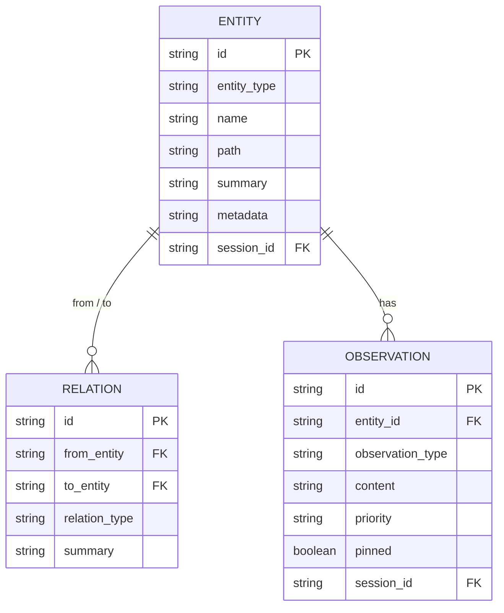

# 記事 02: Memory・Context Graph — session 間で「前回どこまでやったか」を持ち回る

**作成日:** 2026-05-13
**対象バージョン:** everything-claude-code v2.0.0-rc.1
**発表想定:** 社内エンジニア向け 20 分（Problem 5 分 / Architecture 8 分 / Demo 5 分 / Q&A 2 分）

---

## このトピックの位置づけ

ECC 2.0 を harness 統合だけの話で語ると半分しか伝わらない。複数 harness を束ねた substrate が真の価値を出すのは、session 間で context を持ち回れるようになったときである。`/clear` のたびに毎回背景説明を入れ直す手間、長期プロジェクトで「先週この判断をしたはず」を探し回るコスト、子セッションに親の発見を引き継げない不便さ。これらはすべて「session ごとに記憶がリセットされる」という前提から来ている。

ECC 2.0 はその前提を Context Graph という SQLite 上の小さなグラフ記憶層で覆す。本記事ではその設計と運用を扱う。

ここでの **Context Graph** は ECC 2.0 が内部で持つグラフ構造の記憶を指し、外部のベクトルデータベースや知識グラフ製品とは別物である。Knowledge Graph という一般語と紛らわしいので、本記事では一貫して Context Graph と呼ぶ。

---

## 1. Problem — 記憶のない session は再起動コストが高い

### 1.1 ありがちな「context 再投入」シーン

エンジニアが Claude Code や Codex で長めのタスクを進めていると、必ず次のような瞬間がくる。

- `/clear` した直後に「ところで先週、この migration を後回しにすると決めたのは何故でしたか」と聞かれる
- 並列に走らせた子セッションが、親が読んだ設計ドキュメントを再度読み直している
- 朝に Codex で書いた helper の存在を、夕方の Claude セッションが知らずに再実装する
- 「`API_KEY` は環境変数で渡しています」を毎回言わないと安全な提案が来ない

これらは個別には数分の損失だが、1 日の中で繰り返すと馬鹿にならず、何より「同じ説明を何度もする」という体験そのものがエンジニアの意欲を削る。

### 1.2 失われているもの

そもそも、何を覚えていてほしいのか。実際に session 間で持ち回りたい情報は、おおよそ次の 4 種類に分類できる。

| 種類 | 例 | なぜ重要か |
|------|------|----------|
| ファイル・型・関数の存在 | `auth_middleware.rs` には `verify_token()` がある | 再実装の防止、影響範囲の特定 |
| 設計判断 | 「session token は DB に保存しない」 | 矛盾する提案を防ぐ |
| 進行中の TODO | 「migration step 2 は来週」 | 親子セッションの引き継ぎ |
| 環境前提 | 「ECC は `~/.ecc/config.toml` を読む」 | 安全でない仮定を防ぐ |

これらをすべて自然言語の `system_prompt` に書き続けるのはスケールしない。session 数が増えるほど、prompt 側の管理が脆くなる。

### 1.3 具体シナリオ: 「3 日越しの migration を 5 つの session で進める」

たとえば、Schema migration を 3 日かけて 5 つの session に分けて進めるとする。

- Day 1 session A: Schema 全体を audit、3 つの破壊的変更を発見
- Day 1 session B: そのうち最も影響範囲が広い `users` table の変更を計画
- Day 2 session C: `users` table の migration を実装
- Day 2 session D: 並行して、別の `orders` table の準備
- Day 3 session E: 全体を統合して PR を出す

session E が PR を書く段階で「session A が発見した 3 つの破壊的変更のうち、まだ未着手のものは何か」を知るには、現状は session A、B、C、D の transcript を全部読むか、人間がメモを取って渡すしかない。

Context Graph は、A〜D が獲得した知識をグラフ構造として残し、E が `ecc graph recall "migration"` で引き出せるようにする。

---

## 2. Architecture — 3 プリミティブと SQLite で軽量に実装する

### 2.1 グラフの 3 プリミティブ

Context Graph は次の 3 種類のレコードで構成される。



**Entity** はグラフのノード。ファイル、関数、型、モジュール、設計判断、変数、設定など。

**Relation** はエンティティ間の有向辺。`imports`、`depends_on`、`implements`、`uses`、`refactors`、`conflicts`、`resolves` の 7 種類が定義されている。

**Observation** はエンティティに付随する注釈。`feature_addition`、`bug_fix`、`optimization`、`research`、`decision_note` の 5 タイプで、優先度（Low / Normal / High / Critical）と `pinned` フラグを持つ。

ポイントは、3 つとも SQLite の単純なテーブルで実装されていることである。Neo4j も Qdrant も使わない。`entity_type` のような種別はテーブルレベルでは区別せず、文字列カラムとして扱う。

### 2.2 自動ポピュレーション — エンジニアが手で書かない

エンティティを手で `ecc graph add-entity` するのは現実的ではない。`auto_populate_context_graph()` 関数が、session の活動から自動でグラフを埋める。

ソースは 3 つある。

1. **判断ログ**: `LogDecision` コマンドや `ecc log-decision` で記録された設計判断を `decision` エンティティに昇格
2. **ファイル活動**: session が編集・作成したファイルを `file` エンティティとして登録し、同一 session 内で触れたファイル間に `uses` 関係を推定
3. **メッセージ**: session 間メッセージの内容を `observation` として登録

これにより、エンジニアは普通に作業しているだけでグラフが育つ。`ecc graph add-entity` を明示的に叩く頻度は、設計判断の宣言や、外部から取り込みたいエンティティを明示する場面に限られる。

### 2.3 リコールとランキング — recall がエージェントの初期 context になる

`ecc graph recall "migration users"` のように検索すると、関連エンティティと observation がスコア順で返ってくる。スコアは次の重み付け合算で決まる。

| 要素 | 重み | 意味 |
|------|------|------|
| テキスト関連度 | 基準 | entity name / summary / metadata との文字列マッチ |
| 優先度ブースト | High×1.5, Critical×2.0 | 重要マークされた observation は浮上 |
| 固定ブースト | pinned は最上位 | 「絶対に忘れてはいけない」フラグ |
| 鮮度 | 新しいほど高 | 古い判断は埋もれる |

この recall 結果は、session 起動時にエージェントの `append_system_prompt` に注入される。これにより、session 開始直後から「過去の session が獲得した知識」が context に入った状態で会話が始まる。

### 2.4 Memory Connectors — 外部ソースをグラフに流し込む

session 内の活動だけでは、プロジェクトドキュメントや既存の知識ストアは取り込めない。Memory connector はそのための宣言的なインポート機構で、5 種類のソースをサポートする。

| 種別 | ソース | 解釈 |
|------|--------|------|
| `jsonl_file` | 単一 JSONL | 各行を `{entity_type, name, summary}` として解析 |
| `jsonl_directory` | JSONL のディレクトリ | 再帰オプション付き |
| `markdown_file` | 単一 Markdown | ヘッダー階層を親子エンティティに変換 |
| `markdown_directory` | Markdown のディレクトリ | ファイル名 → entity name |
| `dotenv_file` | `.env` ファイル | 環境変数を `configuration` エンティティに。include/exclude キーフィルタあり |

設定は `ecc2.toml` に書く。

```toml
[memory_connectors.project_docs]
kind = "markdown_directory"
path = "docs/"
recurse = true
default_entity_type = "documentation"

[memory_connectors.env_config]
kind = "dotenv_file"
path = ".env.example"
include_keys = ["DATABASE_URL", "FEATURE_FLAGS"]
exclude_keys = ["SECRET_*", "API_KEY_*"]
```

`ecc graph sync-connectors` で全コネクタが同期される。チェックポイントシステム (`ConnectorCheckpointSummary`) が最終同期日時とソース hash を覚えているので、変更のないファイルは再インポートをスキップする。

### 2.5 圧縮 — グラフが肥大化したら捨てる

session を 100 個も走らせると、グラフのレコード数は容易に万単位になる。`ecc graph compact` で次のルールに従い圧縮する。

- 優先度 Low かつ 30 日以上前の observation を削除
- `pinned` は常に保持
- entity 本体は基本的に保持し、observation 側を切り詰める
- 圧縮後、削除数と保持数のレポートを返す

これは GC のような仕組みだが、自動実行ではなく明示コマンド方式である。「いつ context を捨てるか」を operator が決められる方が、思わぬ忘却を防げるという判断である。

### 2.6 グラフ認識ルーティング — 「誰にこの仕事を渡すか」を推薦する

`preview_graph_routing()` と `route_by_graph_context()` は、新しいタスクの記述文と現在のグラフを照合し、最適なエージェントプロファイルを推薦する。

例えば「Schema migration の続きを実装」というタスクが投入されると、Context Graph 内の `migration`、`schema`、`database` 関連エンティティを検索し、それらを過去に操作した agent profile（例: `default-backend`）を候補として返す。「適切な harness はどれか」を判断する材料が増える。

これは「自動でルーティングする」のではなく「人間に推薦する」設計になっている。最終決定は operator に委ねる。

### 2.7 選ばれなかった代替案

**代替案 A: 全文検索エンジン（Elasticsearch、Tantivy）を使う**

検索精度は明らかに上がるが、外部プロセスを必要とし、`cargo run` で立ち上がらない。ECC 2.0 の「ゼロ設定で動く」原則と相性が悪い。却下。

**代替案 B: ベクトル DB（Qdrant、Chroma）を使う**

意味的検索が可能になる利点はある一方、埋め込みモデルへの依存、メモリ消費、ローカル運用の複雑さが増す。Alpha 段階では「精度より動くこと」を優先し、文字列マッチに絞った。将来の拡張余地として残されている。

**代替案 C: session transcript の生テキストを全部突っ込んで recall する**

transcript を直接埋め込む案。grep ベースの recall ならすぐ実装できるが、容量が爆発し、関係性（A が B を imports する、など）を表現できない。Entity / Relation / Observation という構造化を採用したのは、後で「グラフとして」操作したかったからである。

---

## 3. Demo — グラフを育てて使う

### 3.1 設計判断を記録する

```bash
ecc log-decision \
  --title "session token は DB に保存しない" \
  --rationale "compliance review でハッシュ化必須と判定されたため" \
  --tags compliance,auth
```

これで `decision` エンティティが追加され、関連 session が将来この判断にアクセスできる。

### 3.2 グラフを覗く

```bash
# 検索
ecc graph recall "session token compliance"

# entity の詳細を表示
ecc graph show <entity_id>

# 全体の概要
ecc graph entities --limit 20
```

`recall` の出力例:

```
1. [decision] session token は DB に保存しない (priority=High, pinned)
   compliance review でハッシュ化必須と判定されたため
2. [file] src/auth/session.rs
   uses → [crypto/hash.rs, db/session_store.rs]
3. [observation on session.rs] hash on insert を実装 (2026-05-11)
```

### 3.3 ドキュメントを流し込む

```toml
# ecc2.toml に追加
[memory_connectors.project_docs]
kind = "markdown_directory"
path = "docs/"
recurse = true
```

```bash
ecc graph sync-connectors
```

これで `docs/` 配下の Markdown が entity として登録される。次回 session 起動時、`ecc graph recall` の結果に docs ファイル群が出現する。

### 3.4 session 起動時の自動注入

```bash
ecc start --task "session token のテスト追加" --agent claude
```

ECC は task description を使って自動的に Context Graph を検索し、上位 N 件を `append_system_prompt` として渡す。session が始まる前から「session token は DB に保存しない」という判断が context に入っているので、矛盾する提案が出にくくなる。

### 3.5 定期メンテナンス

```bash
# 月次で圧縮
ecc graph compact --older-than 30d --keep-pinned

# 結果
Deleted 1,237 low-priority observations older than 30 days.
Kept 89 pinned observations.
Kept 4,521 entities and relations unchanged.
```

---

## 4. 20 分発表用チートシート

**スライド構成（推奨）**:

| # | スライド | 時間 | キーメッセージ |
|---|---------|------|--------------|
| 1 | Title | 30秒 | 「session 間で context を持ち回る」 |
| 2-3 | Problem: 3 日越し migration を 5 session で進めるシナリオ | 4 分 | session ごとに context を再投入するコスト |
| 4 | 失われている 4 種の知識 | 1 分 | ファイル / 設計判断 / TODO / 環境前提 |
| 5 | Entity / Relation / Observation の ER 図 | 2 分 | 3 プリミティブで十分 |
| 6 | 自動ポピュレーション 3 ソース | 2 分 | 手書きを最小化 |
| 7 | リコールのスコア重み付け | 2 分 | 全文検索ではなく構造化スコア |
| 8 | Memory connectors | 1 分 | 外部ドキュメントを TOML だけで取り込む |
| 9 | 選ばれなかった代替案 | 2 分 | ベクトル DB / 全文検索を選ばなかった理由 |
| 10-11 | Demo: log-decision / recall / sync-connectors | 4 分 | ライブで設計判断を入れて recall する |
| 12 | まとめ + 質疑 | 2 分 | session 数が増えるほど価値が増える |

**よくある質問への備え**:

- 「ベクトル DB と比べて検索精度はどうですか?」 → 現状は文字列マッチで、意味的な近さは扱えない。将来の選択肢として残してあるが、Alpha 段階では「動くこと」優先
- 「session が増えるとグラフが汚れませんか?」 → 圧縮コマンドがある。優先度と pinned で「捨ててよいか」を operator が制御
- 「外部の Notion / Linear と連携できますか?」 → 現状は file ベースの connector のみ。Notion API 連携は roadmap にあるが未実装
- 「セキュリティ的に問題は?」 → `.env` の値はデフォルトでマスクされる。`include_safe_values = true` で明示的に許可する設計
