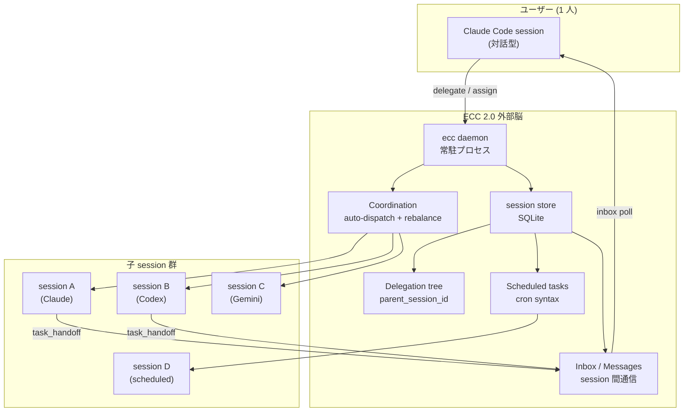

# 記事 03: Claude Code を拡張する外部脳 — 並列・長期・スケジュール実行を後ろから足す

**作成日:** 2026-05-13
**対象バージョン:** everything-claude-code v2.0.0-rc.1
**発表想定:** 社内エンジニア向け 20 分（Problem 5 分 / Architecture 8 分 / Demo 5 分 / Q&A 2 分）

---

## このトピックの位置づけ

「Claude Code はもう十分使えるのに、ECC 2.0 はなぜ必要なのか」という素朴な疑問に答える記事である。Claude Code 単体で完結する作業は確かに多い。しかし「夜間に長期タスクを走らせたい」「並列で 5 つの session を回したい」「毎週月曜の朝に依存関係を audit したい」といった用途では、1 セッション 1 ターミナル前提の Claude Code は不十分になる。

ECC 2.0 は Claude Code を置き換えるツールではない。Claude Code を **背後から支える外部脳** として、daemon、delegation、scheduled task、coordination という Claude Code 単体では持たないレイヤーを提供する。

ここでの **daemon** は ECC 2.0 がバックグラウンドで常駐させる `ecc daemon` プロセスを指す。systemd の daemon や macOS の launchd 管理プロセスとは別概念である。

---

## 1. Problem — Claude Code は 1 セッション 1 ターミナル前提で設計されている

### 1.1 Claude Code の射程

Claude Code は対話型 CLI として優秀である。ローカルのコードを読み、編集し、bash を走らせ、PR を作る。Plan モードがあり、context を維持しながら長めの作業もできる。

その上で、Claude Code には次のような構造的制約がある。

- **1 セッション 1 ターミナル**: 1 つの terminal window で 1 つの session を回す前提
- **対話駆動**: ユーザーが入力するまで何もしない
- **session の独立性**: 別 terminal の別 session とは context を共有しない
- **スケジュール不可**: 「毎週月曜の 9 時に走らせる」は Claude Code 単体ではできない
- **バックグラウンド進行が薄い**: 人間が見ていない時間に何かを進めるという発想がない

これらは Claude Code の設計判断であって、欠陥ではない。対話型ツールとして適切な制約である。問題は、それを「並列・長期・自動化」の用途で押し付けるとフィットしないことにある。

### 1.2 具体的に困るシーン

実務で出くわす具体例を挙げる。

| やりたいこと | Claude Code 単体での障壁 |
|------------|----------------------|
| 5 つの microservice それぞれに同じ型変更を入れる | 5 個の terminal を開き、毎回 task を投入する手間 |
| 夜間に大規模な dependency audit を走らせる | 朝までずっと terminal が起動している必要がある |
| 毎週月曜に CI failure トレンドを要約する | 自分で session を立ち上げるのを忘れる |
| 親 session が子に作業を委譲し、結果を集約する | 全部の transcript を自分で読んで統合する必要がある |
| ある PR が複数の AI session の貢献で出来ているとき、それを後から遡る | transcript を横並びで読むしかない |

これらに対し、各々別ツール（cron、scripts、tmux、人力メモ）で凌ぐことはできる。ただし、それらは Claude Code の context graph、worktree、cost tracking と独立に動くため、ECC 2.0 の他の利点（記事 01 のマルチハーネス、記事 02 の Context Graph）と統合できない。

### 1.3 「外部脳」というメタファ

人間の脳には「対話している今この瞬間」を担当する部分（前頭前野）と、「過去の経験から推論する」「並列にバックグラウンドで考え続ける」部分がある。Claude Code は前者に相当する。ECC 2.0 が提供しているのは、その背後で並列に動く後者である。

外部脳が提供すべきものは大きく 3 つに整理できる。

1. **時間を超える機能** — scheduled task、long-running daemon、人間が見ていない間に進む処理
2. **空間を超える機能** — 並列セッション、delegation、子から親への報告
3. **記憶を超える機能** — session 間で知識を持ち回る (これは記事 02 が扱う)

本記事では 1 と 2 を扱う。

---

## 2. Architecture — Daemon + Delegation + Schedule の 3 層

### 2.1 全体像



3 層に分けて見るとよい。

- **常駐層 (Daemon)**: ユーザーが何もしていなくても回り続ける 10 秒周期のイベントループ
- **構造層 (Delegation tree / Scheduled tasks)**: 「誰が誰に何をいつ頼んだか」を SQLite に持つ
- **通信層 (Inbox / Coordination)**: session 間でメッセージを送り、滞留を検出し、再配分する

### 2.2 Daemon — 10 秒に 1 度の巡回

`ecc daemon` は ECC 2.0 の心臓部である。`heartbeat_interval`（デフォルト 10 秒）ごとに次の 7 ステップを巡回する。

| # | ステップ | やること |
|---|---------|---------|
| 1 | ヘルスチェック | Running session のハートビートを確認、応答なしを Stale → Failed へ |
| 2 | スケジュール実行 | cron 式にマッチする ScheduledTask をディスパッチ |
| 3 | リモートディスパッチ | 外部から投入されたタスクリクエストを処理 |
| 4 | バックログ調整 | `coordinate_backlog_cycle()` で dispatch と rebalance を統合 |
| 5 | Worktree 自動マージ | Ready 状態の worktree をポリシーに従いマージ |
| 6 | Worktree 自動プルーニング | 非アクティブな worktree を削除 |
| 7 | Pending 活性化 | worktree の非同期セットアップ待ちセッションを起動 |

この巡回があるおかげで、ユーザーがダッシュボードを閉じていても、scheduled task が走り、子セッションへの dispatch が進み、終わった worktree がマージされる。

選ばれなかった代替案として、「session 起動時にだけチェックする pull モデル」がある。これは daemon を不要にして実装をシンプルにできるが、scheduled task が「最後に session が起動された時刻」に依存するため、寝ている間は何も動かない。ECC 2.0 が狙う「外部脳」の用途では daemon を採用するのが妥当だった。

### 2.3 Delegation — 親子セッションの構造化

Claude Code から呼ぶときの典型的な使い方は次のような形になる。

```bash
# Claude Code 内、または別 terminal から
ecc delegate <parent_session_id> \
  --task "run cargo test against migration branch" \
  --agent codex \
  --worktree
```

これにより、ECC 2.0 は次のレコードを SQLite に作る。

- 子 session の `Session` レコード (`parent_session_id` を親に設定)
- worktree が必要なら git worktree を非同期で準備
- 子 session のランナー (Codex CLI) をプロセスとして起動

親子関係は `Session.parent_session_id` で表現されるので、`ecc team <session_id>` で木構造として可視化できる。

```
session a1b2c3d4 (claude) — Plan migration
├── session e5f6g7h8 (codex) — Implement step 1
├── session i9j0k1l2 (codex) — Implement step 2
└── session m3n4o5p6 (gemini) — Review consolidated PR
```

`assign` コマンドもある。これは「空きのある delegate を再利用する、なければ新規」というセマンティクスで、同種の小さなタスクを連続投入する場合に session の起動コストを節約する。

### 2.4 Scheduled tasks — cron 式で「いつ走らせるか」を宣言する

`ecc schedule add` で定期タスクを登録できる。

```bash
ecc schedule add \
  --name "weekly-dep-audit" \
  --cron "0 9 * * MON" \
  --task "audit dependencies and summarize CVE risks" \
  --agent claude
```

daemon の巡回ステップ 2 が cron 式を評価し、マッチする時刻に該当タスクをディスパッチする。これは ECC 2.0 内部で完結するため、systemd や crontab を触る必要がない。チームで共有したい定期ジョブを `ecc2.toml` にコミットしておけば、ローカル環境ごとに cron を整備する必要もない。

### 2.5 Coordination — 飽和と滞留を検出して再配分する

`coordinate_backlog_cycle()` は daemon が呼ぶ統合パスで、次の判断を回す。

1. **Dispatch**: 各リードセッションの inbox（未処理 task）から、空き delegate に振れるものを抽出
2. **Rebalance**: 同種のタスクが特定の delegate に集中していたら、空きのある他の delegate に再割り当て
3. **Pressure 検出**: 全体的にバックログが滞留しているとき、`maintain_coordination()` が警告を出す

これは複雑に見えるが、実際の operator から見ると「`ecc auto-dispatch` を 1 回叩くか、daemon が自動でやってくれるか」の違いに過ぎない。透過的に動いていてほしい類の処理である。

### 2.6 Inbox による session 間通信

session 間でメッセージを送ることもできる。

```bash
ecc messages send --from <child> --to <parent> --kind task_handoff --body "step 1 完了"
ecc messages inbox <parent>
```

これにより、子が「終わったので確認してください」を親に通知し、親はその通知を見て次のステップに進める。重要なのは、メッセージは SQLite に永続化されるため、親 session が一度終了してから後で `ecc resume` しても、未読メッセージが残っている点である。

board pane（記事 04 で扱う）はこの inbox の未読数を `handoff_backlog` として表示する。

### 2.7 選ばれなかった代替案

**代替案 A: tmux + shell script で並列実行**

これは現実に多くのエンジニアがやっている方法で、軽量で柔軟だが、worktree、cost、context graph と統合できない。session 個別の状態は持てても、横串での観測ができない。

**代替案 B: Claude Code の subagent 機能だけで済ませる**

Claude Code 自体にも subagent (Agent tool) があり、並列タスクの一部はそこでこなせる。これは記事の対象ではなく、補完関係にある。subagent は同一 session 内の並列タスク、ECC delegation は session 間の独立タスクという棲み分け。

**代替案 C: GitHub Actions / Linear automation で代用**

定期ジョブは GitHub Actions で書けるし、Linear 等の SaaS にも automation がある。これらは ECC と排他ではないが、ECC のメリットは「ローカルで実行され、結果が SQLite に残り、Context Graph に統合される」点。SaaS だと local context との繋がりが薄れる。

---

## 3. Demo — 並列・スケジュール・委譲を実演する

### 3.1 daemon を立ち上げる

```bash
ecc daemon &
```

これだけで巡回ループが始まる。`ecc daemon-status` で動作状況を確認できる。

### 3.2 親セッションから子に委譲する

ユーザーは Claude Code で migration plan を立てていたとする。3 つの子タスクが必要になったら次のように委譲する。

```bash
ecc delegate <claude_session_id> --task "migrate users table" --agent codex --worktree
ecc delegate <claude_session_id> --task "migrate orders table" --agent codex --worktree
ecc delegate <claude_session_id> --task "write integration tests" --agent claude --worktree
```

3 つの子 session が並列で動き始める。

### 3.3 一覧と進捗

```bash
ecc sessions
```

```
ID        Parent    Harness  State     Task                          Progress
a1b2c3d4  -         claude   Idle      Plan migration                100%
e5f6g7h8  a1b2c3d4  codex    Running   migrate users table           60%
i9j0k1l2  a1b2c3d4  codex    Running   migrate orders table          45%
m3n4o5p6  a1b2c3d4  claude   Running   write integration tests       30%
```

### 3.4 子の完了通知が親に届く

子セッションが完了すると、daemon がそれを検出して親の inbox にメッセージを送る（タスクテンプレート側で `notify_parent` を有効にしておく場合）。

```bash
ecc messages inbox a1b2c3d4
```

```
From e5f6g7h8 (codex) — task_handoff
  "migrate users table 完了。tests 全て pass。PR draft 作成済み。"
From i9j0k1l2 (codex) — task_handoff
  "migrate orders table 完了。1 件の deadlock 検出、解決済み。"
```

### 3.5 定期タスクを登録する

```bash
ecc schedule add \
  --name "monday-cve-audit" \
  --cron "0 9 * * MON" \
  --task "audit dependencies; flag any new high-severity CVEs and propose upgrade plan" \
  --agent claude

ecc schedule list
```

毎週月曜 9 時に Claude session が自動起動し、依存パッケージの CVE をチェックし、結果が inbox に届く。土日に何もしなくても、月曜の朝には audit 結果が読める。

### 3.6 滞留を検出する

```bash
ecc coordination-status --check
```

`--check` を付けるとサチュレーション（あるリードに inbox が積みすぎ、空きデリゲートがないなど）を検出して exit code を変える。CI や monitoring から呼べる形式。

---

## 4. 20 分発表用チートシート

**スライド構成（推奨）**:

| # | スライド | 時間 | キーメッセージ |
|---|---------|------|--------------|
| 1 | Title | 30秒 | 「Claude Code の背後で動く外部脳」 |
| 2 | Claude Code の射程と制約 | 2 分 | 1 セッション 1 ターミナル前提 |
| 3 | 困る 5 シーン | 2 分 | 並列 / 夜間 / 定期 / 委譲 / 集約 |
| 4 | 外部脳メタファ | 1 分 | 時間・空間・記憶を超える |
| 5 | Architecture 全体像 (Mermaid) | 2 分 | 常駐 / 構造 / 通信の 3 層 |
| 6 | daemon の 7 ステップ巡回 | 2 分 | 巡回しているからこそ寝ている間も進む |
| 7 | Delegation tree と inbox | 2 分 | 親子関係を SQLite に持つ |
| 8 | Scheduled tasks と cron | 1 分 | systemd 不要 |
| 9 | Coordination 飽和検出 | 1 分 | 自動 dispatch と rebalance |
| 10 | 選ばれなかった代替案 | 1 分 | tmux / subagent / GitHub Actions との棲み分け |
| 11-12 | Demo: delegate / messages / schedule | 4 分 | ライブで 3 子セッションを立てる |
| 13 | まとめ + 質疑 | 2 分 | Claude Code を「強化する」関係 |

**よくある質問への備え**:

- 「Claude Code の Agent tool（subagent）と何が違う?」 → subagent は同一 session 内の並列タスク。ECC delegation は session を跨ぐ独立タスクで、終了後も結果が残り、parent から resume できる
- 「daemon が落ちたらどうなる?」 → SQLite に状態は残っているので、再起動すれば続きから巡回する。crash recovery はある
- 「複数 PC で同じ daemon を共有できる?」 → 現状は同一 host 内のみ。リモート分散は roadmap
- 「Claude Code 単体で十分という layer はあるか?」 → 単一 session で完結する小さなタスクには ECC は不要。daemon を立てる価値は session が 3 つを超えてから
