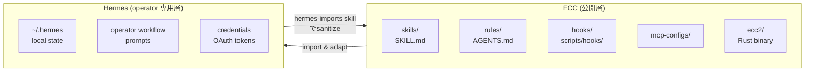
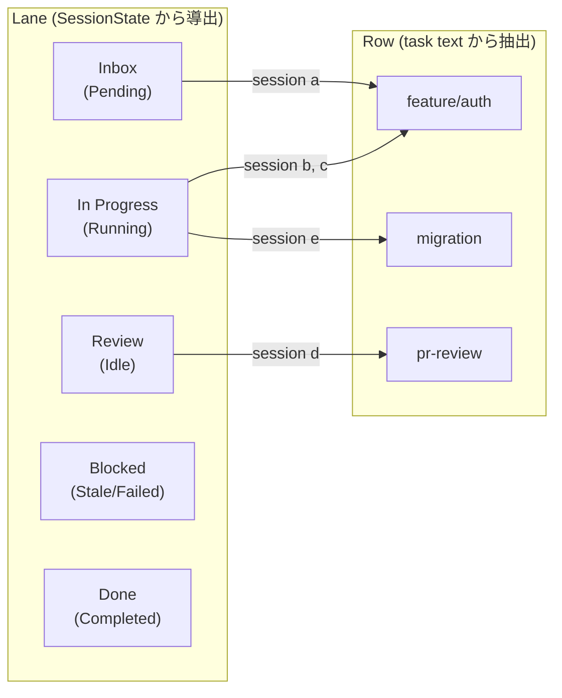

# 記事 04: Hermes operator 連携 — 個人の operator workflow を公開可能な skill に変換する境界線

**作成日:** 2026-05-13
**対象バージョン:** everything-claude-code v2.0.0-rc.1
**発表想定:** 社内エンジニア向け 20 分（Problem 5 分 / Architecture 8 分 / Demo 5 分 / Q&A 2 分）

---

## このトピックの位置づけ

ECC 2.0 を「複数 harness を束ねる substrate」「session 間の記憶層」「Claude Code の外部脳」と語ってきた 3 本の記事は、すべて AI 側の話だった。本記事はそこから一歩離れ、ECC 2.0 を **人間オペレーターの workflow を skill 化するための境界線設計** として捉え直す。

v2.0.0-rc.1 で公開された `skills/hermes-imports/SKILL.md` と `docs/architecture/cross-harness.md` は、エンジニアが個人的に作り溜めた prompt や script を、private state を漏らさず公開可能な ECC skill に変換するための明確な規約を初めて文書化した。これは技術というより「open source の哲学とプライバシーの境界」を扱う設計判断であり、社内で AI workflow を共有しようとする組織には必ず関係する話である。

ここでの **Hermes** は ECC とは別の operator 専用 shell を指す。本記事では Hermes そのものの実装には踏み込まず、ECC が Hermes との **境界線をどう引いたか** に集中する。

---

## 1. Problem — 個人の workflow が他人と共有できない 3 つの理由

### 1.1 「再利用したいのに共有しづらい」現象

エンジニアが個人的に積み上げてきた workflow には、再利用したい価値が確実にある。たとえば次のようなもの。

- **launch handoff**: 新機能をリリースする際の X 投稿、LinkedIn 用、社内告知の書き分け
- **brand voice**: 自分のブログや会社の OSS 紹介で一貫した文体を維持する手順
- **research workflow**: 新しいライブラリを評価するときの調査チェックリスト
- **operator job**: 月次の依存関係 audit、CVE チェック、コスト報告

これらを「他人が再利用できる形」で公開しようとすると、必ず次のような壁にぶつかる。

| 壁 | 具体例 |
|----|------|
| Private path | `/Users/to.watanabe/notes/launch-template.md` を直接参照している |
| 個人の credential | OAuth token、API key、cookie が prompt に直書きされている |
| 個人の context | 特定の取引先名、家族の名前、自分の収入が文中に出てくる |
| 私的データセット | local の CRM data、health log、finance を読み込んでいる |
| Account 固有の挙動 | `~/.hermes/private/` の特定ファイルを前提にしている |

これらを混ぜたまま GitHub に push するわけにはいかない。かといって、すべて削除して clean な形に書き直すコストは高く、結局「個人 use 専用」のまま埋もれる。

### 1.2 既存解の限界

これに対するこれまでの素直な解はだいたい次の 3 つだった。

- **どうせ漏れるから公開しない**: 一番安全だが、組織として workflow が累積しない
- **Notion / Linear の private space に置く**: 共有はできるが、AI agent から扱いにくく、harness を横断できない
- **エンジニアが手で sanitize する**: 毎回チェックが必要で、見落としが発生する

これらはどれも「private と public を明示的に分ける規約」がないことが原因である。ECC 2.0 は、その規約を `skills/hermes-imports/SKILL.md` という skill 自身として最初に定義し、これに従えば安全に変換できる構造を提供する。

### 1.3 もう 1 つの problem: 複数 session が動いているとき「誰が何で詰まっているか」が見えない

operator 視点で語るなら、もう一つの痛みがある。記事 03 で見たように ECC 2.0 では 5〜10 個の session を並列で走らせるのが普通になる。だが、各 session の状態を眺めても全体像は分からない。

- どの session が `Review` 待ちで止まっているか
- どの feature に 2 つ以上の session が集まっていて conflict 兆候があるか
- どの session の inbox に未読の handoff が溜まっているか

これらは「個別 session の状態」ではなく「session 群を operator 視点で俯瞰する観測面」が必要であり、それが Board observability の役割になる。

---

## 2. Architecture — 境界線、変換規約、観測面

### 2.1 ECC と Hermes の境界線

`docs/architecture/cross-harness.md` で初めて明文化された境界線が、ECC 2.0 の設計の中心にある。



公開層は誰でも見て使える ECC リポジトリ。Hermes は各 operator のローカルにある private shell で、credential、私的データ、未公開 workflow を保持する。`hermes-imports` skill は「Hermes 側で発見した有用な workflow を sanitize して ECC に逆輸入する」ための変換規約として動く。

`cross-harness.md` の規約を要約すると次の通り。

**ECC 側に置くもの**:

- sanitized setup docs
- repo-relative demo prompts
- general operator skills
- private credential に依存しない examples

**ECC 側に置かないもの**:

- OAuth tokens / API keys
- raw `~/.hermes` exports
- personal workspace memory
- private datasets
- レビュー前のローカル限定自動化パック

この分離は、ECC を組織共有の workflow 層として運用するときに崩しにくい。これがなければ、誰かが API キーを混ぜたまま PR を出した瞬間にリポジトリが汚染される。

### 2.2 hermes-imports skill — 変換の規約

`skills/hermes-imports/SKILL.md` は次の構造を持つ skill である。

**Import Rules**:

- ローカルパス → repo-relative path or placeholder
- アカウント名 → role label (`operator`、`default profile`、`workspace owner`)
- credential → provider name のみで記述
- 例は narrow かつ operational に保つ
- raw workspace export、token、health data、CRM data、finance data は ship しない

**Sanitization Checklist**: commit 前に必ずスキャンするもの。

- `/Users/...` のような absolute path
- `~/.hermes` への参照（ローカルセットアップ説明以外）
- API key、token、cookie、OAuth file、bearer string
- 電話番号、私的 email、personal contact graph
- 公開されていない client name、family name、account name
- 売上、健康、CRM 詳細
- private system の生 tool output ログ

**Conversion Pattern**: 6 ステップ。

1. 繰り返される operator ループを特定
2. private input/output を剥がす
3. local path を repo-relative の example に書き直す
4. 一回限りの指示を `When To Use` セクションと短い process に変換
5. 具体的な output 要件を追加
6. PR を開く前に secret と local path のスキャン

このように skill 自身が「他の skill をどう作るか」を定義しているのが、よくできた点である。

### 2.3 Operator workflow expansion — v1.10.0 で追加された具体的な skill 群

`hermes-imports` の規約に従って、v1.10.0 リリース時に実際に複数の operator workflow が ECC に取り込まれた。これらは「個人が使っていた private workflow」を sanitized 版として再構成したもの。

| Skill | 目的 |
|-------|------|
| `brand-voice` | canonical source-derived writing-style system。文体一貫性 |
| `social-graph-ranker` | weighted warm-intro graph ranking。ネットワーク内の優先順位 |
| `connections-optimizer` | network pruning/addition workflow。graph ranker の上に立つ運用 |
| `customer-billing-ops` | customer billing の operator 業務 |
| `google-workspace-ops` | Google Workspace の operator 業務 |
| `project-flow-ops` | project tracking 業務 |
| `workspace-surface-audit` | workspace 全体の状態確認 |

このうち `brand-voice` を例に取ると、もともと「自分のブログの過去記事を読ませて似た文体で書かせる」prompt があった。これを sanitization checklist に通すと、「個人のブログ URL」「個人の文体特徴の暴露」「特定の本人のみが知る前提」が削除され、「canonical source（公開済みの本人記述）を与えると、その文体に揃えて出力する」という汎用 skill になる。誰が使っても再現可能。

### 2.4 Board observability — 複数 session を operator 視点で読む

operator 連携のもう一つの柱が、`2026-04-18` で実装された TUI の Board pane である。これは記事 01 でも触れたが、ここではより深く operator 視点で見る。

Board は session を Kanban 風に lane × row で配置する。



`SessionBoardMeta` は次のフィールドを持つ（`ecc2/src/session/mod.rs`）。

| フィールド | 役割 |
|-----------|------|
| `lane` | `Inbox` / `In Progress` / `Review` / `Blocked` / `Done` / `Stopped` |
| `project` / `feature` / `issue` | task text から抽出した scope |
| `row_label` | board row 名 (issue → feature → project → branch → `General` の優先順) |
| `progress_percent` | state + activity から導出する heuristic な進捗 |
| `movement_note` | lane や row が変わったときの遷移メモ |
| `handoff_backlog` | 未読 task_handoff message 数 |
| `conflict_signal` | branch / task overlap などの衝突兆候 |

`board_overlap_risks()` は同じ branch を複数 session が触っている、同じ task text を複数 session が抱えている、といった早期兆候を operator に出す。

設計判断として重要なのは、progress を「task 完了率」のような厳密な値ではなく heuristic として扱った点である。完璧な進捗計算より「全 harness に適用できる粗い数字」を優先した結果、`Running` 中でも file change があれば 60%、起動直後なら 25% のような割り切った値を出している。

### 2.5 選ばれなかった代替案

**代替案 A: Hermes 側を ECC に統合する**

operator workflow を ECC 内部の機能として作り、Hermes 自体を廃止する案。これは ECC を「個人ツール」へ寄せることになり、組織共有用の workflow 層という positioning を崩す。境界線を引いて両方を残す方が、ECC の re-usability を保てる。

**代替案 B: 全 skill を private にして組織内でのみ共有**

GitHub の private repo に置いて公開しない案。安全だが、外部 contributor からの skill 提案を受けられず、OSS communityコントリビューションの恩恵を捨てることになる。

**代替案 C: skill 化はしないで Notion / Confluence に書く**

文書として残すだけで AI から使わない案。再利用性は落ちるが、sanitize の手間も減る。これは「人間が読むだけ」用途には合理的だが、AI workflow としての価値は出ない。

ECC が採用した道は、公開と非公開の境界を明示的に書き、その境界を skill 自身で運用するという、規約ベースの解決である。

---

## 3. Demo — 個人 workflow を skill 化する

### 3.1 hermes-imports skill を invoke する

たとえば、個人的に作っていた「dependency audit prompt」があるとする。これを ECC skill に変換したい。

```bash
# Claude Code 内で
/hermes-imports
```

skill が起動し、以下を尋ねてくる（実際には対話的に進む）。

- 元の prompt を貼る
- 含まれる private 情報の種類を特定
- 公開可能な形に書き直すための変更点を提案

### 3.2 元の prompt（変換前）

```text
~/.hermes/audit-workflow.md を読んで、my-company-private リポジトリの依存関係を audit して。
結果は ~/Documents/audit-reports/YYYY-MM-DD-audit.md に出力。
過去の audit を参考にするなら ~/.hermes/audit-history/ を見て。
```

ここには local path、private repo 名、ローカルファイル参照が混ざっている。

### 3.3 sanitization 後（変換後）

```markdown
---
name: dependency-audit
description: Audit a repository's dependencies for known CVE, outdated packages, and licensing risks. Produce a Markdown report under docs/audits/<date>-audit.md.
origin: ECC
---

# Dependency Audit

## When To Use
- Repository has a `package.json` / `Cargo.toml` / `requirements.txt`
- Operator wants a monthly snapshot of dependency health
- A PR is about to upgrade many packages

## Process
1. List all direct and transitive dependencies.
2. Check each against known CVE databases.
3. Flag deprecated / unmaintained packages.
4. Output `docs/audits/YYYY-MM-DD-audit.md` with severity-grouped findings.
```

private path、private repo 名、ローカル history への依存が消え、誰でも再利用できる skill になっている。

### 3.4 Board pane で operator 視点を取る

`ecc dashboard` で TUI を開き、`Tab` キーで Board pane に切り替える。

```
[In Progress (3)]
  Row 1 | feature/auth-migration  | 2 sessions, ⚠ 1 conflict
    a1b2c3d4 claude  Progress 60% — uses Schema.rs
    e5f6g7h8 codex   Progress 45% — uses Schema.rs ← branch overlap
  Row 2 | pr-review               | 1 session, 2 unread handoff
    i9j0k1l2 gemini  Progress 25% — reviewing PR #1742
[Review (1)]
  Row 3 | weekly-cve-audit        | 1 session
    m3n4o5p6 claude  Progress 100% — awaiting operator review
[Blocked (1)]
  Row 4 | release-prep            | 1 session, 1 conflict_signal
    n7o8p9q0 codex   Progress 30% — npm publish failed
```

これにより、operator は次のことを 1 画面で読める。

- feature/auth-migration に 2 session が集まり、Schema.rs で branch overlap が起きている
- pr-review に未読 handoff が 2 件溜まっている
- weekly-cve-audit が完了し review 待ち
- release-prep が npm publish 失敗で blocked

各 session に飛んで個別に読まなくても、滞留と衝突が見える。これが Board observability の効用。

### 3.5 operator workflow expansion を実際に使う

```bash
# brand voice を使って launch 用テキストを書く
/brand-voice --task "draft a Twitter thread announcing ECC 2.0 rc1"

# social-graph-ranker で誰に warm intro を頼むかランキング
/social-graph-ranker --task "find best path to introduce ECC to potential hire X"
```

これらの skill は ECC 内部に sanitized 版として置かれているので、別 harness（Codex、Cursor）からも同じ skill source を読める。harness 横断性も担保される。

---

## 4. 20 分発表用チートシート

**スライド構成（推奨）**:

| # | スライド | 時間 | キーメッセージ |
|---|---------|------|--------------|
| 1 | Title | 30秒 | 「individual workflow を組織共有の skill に変える境界線」 |
| 2 | 個人 workflow が共有しづらい 5 つの壁 | 2 分 | private path / credential / context / dataset / account 固有 |
| 3 | 既存解の限界 | 1 分 | 公開しない / Notion / 手 sanitize の問題 |
| 4 | もう 1 つの problem: 複数 session 観測 | 2 分 | 個別 session 状態だけでは operator 視点が取れない |
| 5 | ECC と Hermes の境界線 (Mermaid 図) | 2 分 | 公開層と private 層を明示的に分ける |
| 6 | hermes-imports skill の規約 | 2 分 | rules / checklist / 6-step conversion pattern |
| 7 | v1.10.0 で取り込まれた operator skill 群 | 1 分 | brand-voice、social-graph-ranker、connections-optimizer |
| 8 | Board observability の構造 | 2 分 | lane × row、SessionBoardMeta、conflict_signal |
| 9 | progress を heuristic にした判断 | 1 分 | 完璧な計算より全 harness 適用可能性 |
| 10 | 選ばれなかった代替案 | 1 分 | Hermes 統合 / private 化 / Notion 化を選ばなかった理由 |
| 11-12 | Demo: prompt 変換と Board pane | 4 分 | sanitization の前後比較とライブで Board を見る |
| 13 | まとめ + 質疑 | 2 分 | 境界線を明示すれば共有が進む |

**よくある質問への備え**:

- 「sanitize の自動化はないのか?」 → ある程度 lint 化できる（path scan、key pattern scan）が、最終判断は人間。Pre-commit hook で簡易チェックは可能
- 「Hermes 自体は社外公開していないのか?」 → していない。ECC の cross-harness 規約上、Hermes は operator 専用 shell として private に留める設計
- 「Notion など外部ツールとの統合は?」 → 現状は file ベースの memory connector のみ。Notion API 連携は roadmap
- 「Board pane の conflict_signal は信頼できるか?」 → branch overlap、task text overlap などの heuristic ベース。早期警告には十分だが、完全な競合検出ではない
- 「個人 prompts を全部 skill 化すべきか?」 → 「2 回以上繰り返した」が目安。1 回限りなら個人用のままでよい
